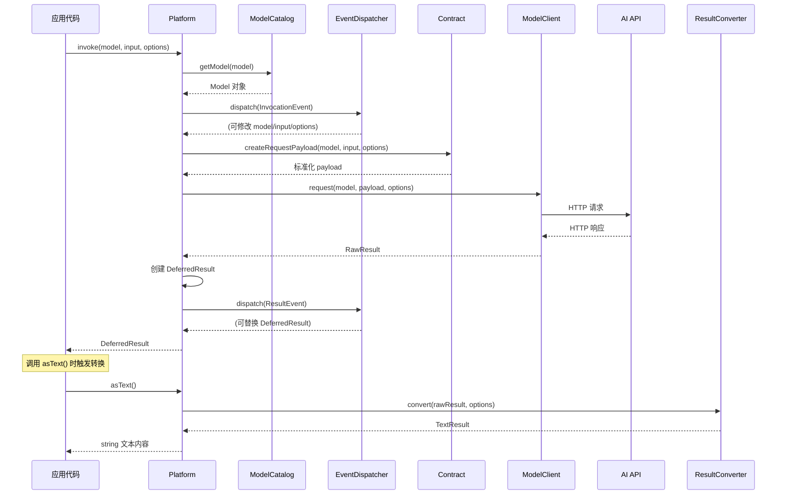

# 2 Platform 

## 

 Platform 33+ AI 

---

## 1. 

 [ 1 ](01-quick-start.md) Platform 

- `PlatformFactory::create()` 
- `invoke()` + `asText()` 
- `stream => true` 
- `response_format` AI PHP 
- `ImageUrl` / `Image` 

 Platform 

---

## 2. 

### 2.1 PlatformInterface —— 

`PlatformInterface` Symfony AI AI 

```php
namespace Symfony\AI\Platform;

interface PlatformInterface
{
    /**
     * @param non-empty-string           $model   模型名称（如 'gpt-4o'）
     * @param array<mixed>|string|object $input   输入数据
     * @param array<string, mixed>       $options 调用选项
     */
    public function invoke(
        string $model,
        array|string|object $input,
        array $options = [],
    ): DeferredResult;

    public function getModelCatalog(): ModelCatalogInterface;
}
```

****

| | | |
|------|------|------|
| `$model` | `string` | `'gpt-4o'``'claude-3-5-sonnet-20241022'``'llama3.2'` |
| `$input` | `array\|string\|object` | `MessageBag` |
| `$options` | `array` | `temperature``max_tokens``stream``tools``response_format` |

** `DeferredResult`** —— 

```php
$deferred = $platform->invoke('gpt-4o', $messageBag);

// 便捷取值方法
$deferred->asText();        // string —— 文本内容
$deferred->asObject();      // object —— 结构化输出对象
$deferred->asBinary();      // string —— 二进制数据（图片/音频）
$deferred->asFile($path);   // void   —— 保存到文件
$deferred->asDataUri();     // string —— data:mime/type;base64,...
$deferred->asVectors();     // Vector[] —— 嵌入向量数组
$deferred->asStream();      // Generator —— 流式输出
$deferred->asToolCalls();   // ToolCall[] —— 工具调用列表
$deferred->asReranking();   // RerankingEntry[] —— 重排序结果
$deferred->getMetadata();   // Metadata —— 元数据（Token 使用等）
```

> ****`invoke()` HTTP `ResultEvent` 

### 2.2 Bridge ModelClientInterface ResultConverterInterface

Platform **Bridge **—— AI Bridge

```php
namespace Symfony\AI\Platform;

// 负责向 AI API 发送 HTTP 请求
interface ModelClientInterface
{
    public function supports(Model $model): bool;

    public function request(
        Model $model,
        array|string $payload,
        array $options = [],
    ): RawResultInterface;
}

// 负责将原始 HTTP 响应转换为结构化结果
interface ResultConverterInterface
{
    public function supports(Model $model): bool;

    public function convert(
        RawResultInterface $result,
        array $options = [],
    ): ResultInterface;
}
```

 Bridge 

```
Bridge/OpenAi/
├── PlatformFactory.php     # 工厂类，一行创建平台实例
├── ModelCatalog.php        # 该平台的模型目录（含能力定义）
├── ModelClient.php         # HTTP 请求实现
├── ResultConverter.php     # 响应解析实现
├── Contract/               # 平台特定的消息格式化
│   └── Normalizer/
└── Tests/
```

> Bridge `supports()` + `request()` / `convert()`Platform Bridge

### 2.3 

 `$platform->invoke('gpt-4o', $messageBag, $options)` 

```
应用代码
    │
    ▼
PlatformInterface::invoke(model, input, options)
    │
    ├─ 1. ModelCatalog::getModel(model) → Model 对象（含能力信息）
    │
    ├─ 2. 分发 InvocationEvent（可修改 model/input/options）
    │
    ├─ 3. Contract::createRequestPayload(model, input, options)
    │      ├─ MessageBagNormalizer 标准化消息
    │      │     ├─ SystemMessageNormalizer
    │      │     ├─ UserMessageNormalizer（含 Text/Image/Audio 标准化）
    │      │     ├─ AssistantMessageNormalizer
    │      │     └─ ToolCallMessageNormalizer
    │      └─ ToolNormalizer 标准化工具定义
    │
    ├─ 4. ModelClientInterface::request(model, payload, options)
    │      └─ 发起 HTTP 请求到 AI API
    │
    ├─ 5. 创建 DeferredResult（延迟转换）
    │
    ├─ 6. 分发 ResultEvent（可替换结果）
    │
    └─ 7. 返回 DeferredResult
              │
              ▼ （首次调用 asText() / asObject() 等时）
       ResultConverterInterface::convert(rawResult, options)
           ├─ 解析 JSON/二进制响应
           ├─ 创建对应 Result 类型
           ├─ 提取 TokenUsage
           └─ 合并元数据
```

 Mermaid 



### 2.4 Platform 

`Platform` `PlatformInterface` 

```php
final class Platform implements PlatformInterface
{
    public function __construct(
        iterable $modelClients,              // ModelClientInterface 集合
        iterable $resultConverters,          // ResultConverterInterface 集合
        ModelCatalogInterface $modelCatalog, // 模型目录
        ?Contract $contract = null,          // 序列化合约
        ?EventDispatcherInterface $eventDispatcher = null,
    ) {}
}
```

 Bridge Platform `ModelClientInterface` `supports($model)` `true` 

---

## 3. 

 Platform AI 

### 3.1 Role 

```php
namespace Symfony\AI\Platform\Message;

enum Role: string
{
    case System    = 'system';     // 系统提示——设定 AI 行为
    case User      = 'user';       // 用户输入
    case Assistant = 'assistant';  // AI 助手回复
    case ToolCall  = 'tool';       // 工具调用结果
}
```

AI 

### 3.2 

#### SystemMessage —— 

```php
namespace Symfony\AI\Platform\Message;

final class SystemMessage implements MessageInterface
{
    public function __construct(string|Template $content) {}
    public function getRole(): Role   // Role::System
    public function getContent(): string|Template
}
```

 AI API 

```php
use Symfony\AI\Platform\Message\SystemMessage;

$system = new SystemMessage('你是一位 PHP 安全专家，只讨论安全相关话题。');
```

#### UserMessage —— 

```php
final class UserMessage implements MessageInterface
{
    public function __construct(ContentInterface ...$content) {}
    public function getRole(): Role       // Role::User
    public function getContent(): array   // ContentInterface[]
    public function hasAudioContent(): bool
    public function hasImageContent(): bool
    public function asText(): ?string     // 纯文本消息时返回文本
}
```


```php
use Symfony\AI\Platform\Message\UserMessage;
use Symfony\AI\Platform\Message\Content\Text;
use Symfony\AI\Platform\Message\Content\ImageUrl;

// 纯文本
$msg = new UserMessage(new Text('什么是依赖注入？'));

// 文本 + 图片（多模态）
$msg = new UserMessage(
    new Text('请描述这张图片的内容：'),
    new ImageUrl('https://example.com/photo.jpg'),
);
```

#### AssistantMessage —— 

```php
final class AssistantMessage implements MessageInterface
{
    public function __construct(
        ?string $content = null,
        ?array $toolCalls = null,    // ToolCall[]
        ?array $thinking = null,     // ThinkingContent[]
    ) {}
    public function getRole(): Role       // Role::Assistant
    public function getContent(): ?string
    public function getToolCalls(): ?array
    public function hasToolCalls(): bool
}
```

AI 

```php
use Symfony\AI\Platform\Message\AssistantMessage;

// 普通回复
$msg = new AssistantMessage('Symfony 是一个 PHP Web 框架。');

// 包含工具调用请求
$msg = new AssistantMessage(
    content: null,
    toolCalls: [$toolCall1, $toolCall2],
);
```

#### ToolCallMessage —— 

```php
final class ToolCallMessage implements MessageInterface
{
    public function __construct(ToolCall $toolCall, string $content) {}
    public function getRole(): Role      // Role::ToolCall
    public function getToolCall(): ToolCall
    public function getContent(): string
}
```

 AI

```php
use Symfony\AI\Platform\Message\ToolCallMessage;
use Symfony\AI\Platform\Result\ToolCall;

$toolCall = new ToolCall('call_abc123', 'get_weather', ['city' => 'Beijing']);
$msg = new ToolCallMessage($toolCall, '{"temperature": 25, "condition": "Sunny"}');
```

### 3.3 Message 

`Message` 

```php
namespace Symfony\AI\Platform\Message;

final class Message
{
    // 创建系统消息
    public static function forSystem(\Stringable|string|Template $content): SystemMessage;

    // 创建用户消息（支持多模态）
    public static function ofUser(\Stringable|string|ContentInterface ...$content): UserMessage;

    // 创建助手消息
    public static function ofAssistant(
        ?string $content = null,
        ?array $toolCalls = null,
    ): AssistantMessage;

    // 创建工具调用结果消息
    public static function ofToolCall(ToolCall $toolCall, string $content): ToolCallMessage;
}
```

****

```php
use Symfony\AI\Platform\Message\Message;
use Symfony\AI\Platform\Message\Content\Text;
use Symfony\AI\Platform\Message\Content\ImageUrl;

// 系统消息
$system = Message::forSystem('你是一位 Symfony 框架专家。');

// 纯文本用户消息——字符串自动转为 Text 内容
$user = Message::ofUser('请解释什么是服务容器？');

// 多模态用户消息
$user = Message::ofUser(
    new Text('这张架构图说明了什么？'),
    new ImageUrl('https://example.com/architecture.png'),
);

// 助手回复
$assistant = Message::ofAssistant('服务容器是一种管理对象依赖关系的设计模式。');

// 工具调用结果
$toolResult = Message::ofToolCall($toolCall, '{"result": 42}');
```

### 3.4 MessageBag

`MessageBag` `invoke()` `$input` 

```php
namespace Symfony\AI\Platform\Message;

final class MessageBag
{
    public function __construct(MessageInterface ...$messages) {}

    public function getId(): AbstractUid&TimeBasedUidInterface     // 获取唯一 ID（UUID v7）
    public function add(MessageInterface $message): void          // 追加消息
    public function with(MessageInterface $message): self         // 不可变追加（返回新实例）
    public function merge(self $messageBag): self                 // 合并另一个消息包（返回新实例）
    public function getMessages(): array                          // 获取所有消息
    public function getSystemMessage(): ?SystemMessage            // 获取系统消息
    public function getUserMessage(): ?UserMessage                // 获取第一条用户消息
    public function count(): int                                  // 消息总数
    public function withSystemMessage(SystemMessage $msg): self   // 替换系统消息
    public function withoutSystemMessage(): self                  // 移除系统消息
    public function containsImage(): bool                         // 是否包含图片
    public function containsAudio(): bool                         // 是否包含音频
    public function getIterator(): \ArrayIterator                 // 迭代器支持
}
```

****

```php
use Symfony\AI\Platform\Message\Message;
use Symfony\AI\Platform\Message\MessageBag;

$messages = new MessageBag(
    Message::forSystem('你是一位数学老师，善于用简单的语言解释概念。'),
);

// 第一轮
$messages->add(Message::ofUser('什么是导数？'));
$response1 = $platform->invoke('gpt-4o', $messages)->asText();
$messages->add(Message::ofAssistant($response1));

// 第二轮（AI 会记住上下文）
$messages->add(Message::ofUser('能举一个实际例子吗？'));
$response2 = $platform->invoke('gpt-4o', $messages)->asText();
$messages->add(Message::ofAssistant($response2));

// 第三轮
$messages->add(Message::ofUser('和积分有什么关系？'));
$response3 = $platform->invoke('gpt-4o', $messages)->asText();

echo $response3; // AI 会基于完整的对话上下文回答
```

> ****Token 

### 3.5 Content 

`UserMessage` `ContentInterface`

| | | |
|----|------|----------|
| `Text` | | `new Text('')` |
| `Image` | | `Image::fromFile('/path/to/img.jpg')` |
| `ImageUrl` | URL | `new ImageUrl('https://...')` |
| `Audio` | | `Audio::fromFile('/path/to/audio.mp3')` |
| `Document` | PDF | `Document::fromFile('/path/to/doc.pdf')` |
| `DocumentUrl` | URL | `new DocumentUrl('https://...')` |
| `Video` | | `Video::fromFile('/path/to/video.mp4')` |
| `File` | | `new File($data, 'mime/type')` |
| `Collection` | | `new Collection($text, $image, ...)` |

****`Image``Audio``Document``Video` `File`——

```php
use Symfony\AI\Platform\Message\Content\Image;
use Symfony\AI\Platform\Message\Content\Audio;
use Symfony\AI\Platform\Message\Content\Document;
use Symfony\AI\Platform\Message\Content\Video;

// 从文件加载（懒加载）
$image = Image::fromFile('/var/uploads/photo.jpg');
$audio = Audio::fromFile('/var/recordings/meeting.mp3');
$doc   = Document::fromFile('/var/docs/report.pdf');
$video = Video::fromFile('/var/videos/demo.mp4');

// 从 Data URL 加载
$image = Image::fromDataUrl('data:image/jpeg;base64,/9j/4AAQ...');

// 获取不同格式
$image->asBase64();    // base64 字符串
$image->asBinary();    // 原始二进制
$image->asDataUrl();   // data:image/jpeg;base64,...
$image->getFormat();   // 'image/jpeg'
```

****

```php
use Symfony\AI\Platform\Message\Message;
use Symfony\AI\Platform\Message\MessageBag;
use Symfony\AI\Platform\Message\Content\Text;
use Symfony\AI\Platform\Message\Content\Image;
use Symfony\AI\Platform\Message\Content\Document;
use Symfony\AI\Platform\Message\Content\Collection;

// 图片对比分析
$messages = new MessageBag(
    Message::ofUser(
        new Text('请比较这两张产品图片的外观差异：'),
        Image::fromFile('/var/products/v1.jpg'),
        Image::fromFile('/var/products/v2.jpg'),
    ),
);

// PDF 文档分析
$messages = new MessageBag(
    Message::forSystem('你是专业的论文摘要生成器。'),
    Message::ofUser(
        new Text('请为这篇论文生成 200 字摘要：'),
        Document::fromFile('/var/papers/paper.pdf'),
    ),
);

// 使用 Collection 批量传入
$images = new Collection(
    new Text('以下是本月的销售报表截图：'),
    Image::fromFile('/var/reports/jan.png'),
    Image::fromFile('/var/reports/feb.png'),
    Image::fromFile('/var/reports/mar.png'),
);
$messages = new MessageBag(
    Message::ofUser($images),
);
```

---

## 4. 

### 4.1 Model 

`Model` AI 

```php
namespace Symfony\AI\Platform;

final class Model
{
    public function __construct(
        string $name,                     // 模型名称（非空字符串）
        Capability[] $capabilities = [],  // 能力列表
        array $options = [],              // 默认选项
    ) {}

    public function getName(): string
    public function getCapabilities(): array
    public function supports(Capability $capability): bool
    public function getOptions(): array
}
```

### 4.2 ModelCatalog 

`ModelCatalogInterface` Bridge `ModelCatalog`

```php
interface ModelCatalogInterface
{
    public function getModel(string $modelName): Model;
    public function getModels(): array;
}
```

`AbstractModelCatalog` 

```php
// 通过平台获取模型目录
$catalog = $platform->getModelCatalog();
$model = $catalog->getModel('gpt-4o');

// 检查模型能力
if ($model->supports(Capability::TOOL_CALLING)) {
    echo '支持工具调用';
}

// 带参数解析
$model = $catalog->getModel('gpt-4o?temperature=0.7');

// Ollama 大小变体
$model = $catalog->getModel('llama3.2:3b');
```

### 4.3 Capability 

`Capability` 

```php
namespace Symfony\AI\Platform;

enum Capability: string
{
    // 输入能力
    case INPUT_AUDIO      = 'input-audio';       // 音频输入
    case INPUT_IMAGE      = 'input-image';       // 图像输入
    case INPUT_MESSAGES   = 'input-messages';    // 消息列表（对话）
    case INPUT_MULTIPLE   = 'input-multiple';    // 多路输入
    case INPUT_PDF        = 'input-pdf';         // PDF 文档输入
    case INPUT_TEXT       = 'input-text';        // 纯文本输入
    case INPUT_VIDEO      = 'input-video';       // 视频输入
    case INPUT_MULTIMODAL = 'input-multimodal';  // 多模态输入

    // 输出能力
    case OUTPUT_AUDIO      = 'output-audio';      // 输出音频
    case OUTPUT_IMAGE      = 'output-image';      // 输出图片
    case OUTPUT_STREAMING  = 'output-streaming';  // 流式输出
    case OUTPUT_STRUCTURED = 'output-structured'; // 结构化输出（JSON Schema）
    case OUTPUT_TEXT       = 'output-text';       // 输出文本

    // 功能
    case TOOL_CALLING     = 'tool-calling';      // 工具/函数调用

    // 语音
    case TEXT_TO_SPEECH   = 'text-to-speech';    // 文字转语音
    case SPEECH_TO_TEXT   = 'speech-to-text';    // 语音转文字

    // 图像生成
    case TEXT_TO_IMAGE    = 'text-to-image';     // 文字生成图像
    case IMAGE_TO_IMAGE   = 'image-to-image';    // 图像变换

    // 视频生成
    case TEXT_TO_VIDEO    = 'text-to-video';     // 文字生成视频
    case IMAGE_TO_VIDEO   = 'image-to-video';    // 图像生成视频
    case VIDEO_TO_VIDEO   = 'video-to-video';    // 视频变换

    // 嵌入与检索
    case EMBEDDINGS       = 'embeddings';        // 向量嵌入
    case RERANKING        = 'reranking';         // 结果重排序

    // 推理
    case THINKING         = 'thinking';          // 扩展思考链（Chain-of-Thought）
}
```

### 4.4 

| | | | | | | | | |
|------|:---:|:---:|:---:|:---:|:---:|:---:|:---:|:---:|
| **GPT-4o** | ✅ | ✅ | ✅ | ✅ | ✅ | — | — | — |
| **GPT-4o-mini** | ✅ | ✅ | ✅ | ✅ | ✅ | — | — | — |
| **o1 / o3** | ✅ | ✅ | ✅ | ✅ | ✅ | — | — | — |
| **DALL-E 3** | — | — | — | — | — | — | — | — |
| **text-embedding-3-\*** | — | — | — | — | — | ✅ | — | — |
| **Claude 3.5 Sonnet** | ✅ | ✅ | ✅ | ✅ | — | — | — | — |
| **Claude 3.7 Sonnet** | ✅ | ✅ | ✅ | ✅ | — | — | — | ✅ |
| **Gemini 2.5 Flash/Pro** | ✅ | ✅ | ✅ | ✅ | ✅ | — | — | ✅ |
| **Gemini text-embedding-004** | — | — | — | — | — | ✅ | — | — |
| **Mistral Large** | ✅ | — | ✅ | ✅ | ✅ | — | — | — |
| **DeepSeek Chat** | ✅ | — | ✅ | ✅ | — | — | — | — |
| **DeepSeek Reasoner** | ✅ | — | ✅ | — | — | — | — | ✅ |
| **Llama 3.2Ollama** | ✅ | | | | ✅ | | — | |
| **ElevenLabs** | — | — | — | — | — | — | ✅ TTS | — |
| **Cartesia** | — | — | — | — | — | — | ✅ TTS | — |

> DALL-E 3 `TEXT_TO_IMAGE`"" `INPUT_MESSAGES` + `OUTPUT_TEXT`

****

```php
$model = $platform->getModelCatalog()->getModel('gpt-4o');

if ($model->supports(Capability::TOOL_CALLING)) {
    // 安全地使用工具调用
    $result = $platform->invoke('gpt-4o', $messages, ['tools' => $tools]);
}

if (!$model->supports(Capability::INPUT_VIDEO)) {
    throw new \LogicException('当前模型不支持视频输入，请使用 Gemini。');
}
```

---

## 5. 

### 5.1 

 `BaseResult` `ResultInterface`

| | | | |
|---------|---------|---------|---------|
| `TextResult` | `string` | `asText()` | |
| `ObjectResult` | `object` | `asObject()` | |
| `BinaryResult` | `string` | `asBinary()` / `asFile()` | |
| `VectorResult` | `Vector[]` | `asVectors()` | |
| `ToolCallResult` | `ToolCall[]` | `asToolCalls()` | |
| `StreamResult` | `Generator` | `asStream()` | |
| `ChoiceResult` | `ResultInterface[]` | `getResult()` | |
| `RerankingResult` | `RerankingEntry[]` | `asReranking()` | |

### 5.2 TextResult —— 

```php
$text = $platform->invoke('gpt-4o', new MessageBag(
    Message::ofUser('用一句话解释什么是 PHP')
))->asText();

echo $text; // "PHP 是一种广泛用于 Web 开发的服务端脚本语言。"
```

### 5.3 BinaryResult —— 

DALL-EElevenLabs / Cartesia

```php
// 图片生成
$result = $platform->invoke('dall-e-3', new MessageBag(
    Message::ofUser('一只穿着宇航服的猫咪在月球上散步')
), ['size' => '1792x1024', 'quality' => 'hd']);

$result->asFile('/tmp/space-cat.png');              // 保存到文件
$dataUri = $result->asDataUri('image/png');          // data:image/png;base64,...

// 语音合成
$result = $platform->invoke('eleven_multilingual_v2', new MessageBag(
    Message::ofUser('欢迎使用 Symfony AI！')
), ['voice_id' => 'ErXwobaYiN019PkySvjV']);

$result->asFile('/tmp/welcome.mp3');
```

### 5.4 VectorResult —— 

```php
$vectors = $platform->invoke(
    'text-embedding-3-small',
    'Symfony 是一个高性能的 PHP Web 框架',
)->asVectors();

$embedding = $vectors[0]->getData(); // float[]，长度 1536
echo '向量维度：' . count($embedding);
```

****

| | | |
|------|------|--------|
| `text-embedding-3-small` | 1536 | OpenAI |
| `text-embedding-3-large` | 3072 256 | OpenAI |
| `text-embedding-004` | 768 | Google Gemini |
| `voyage-3-large` | 1024 / 2048 | Voyage AI |
| `nomic-embed-text`Ollama | 768 | |

### 5.5 ToolCallResult —— 


```php
$deferred = $platform->invoke('gpt-4o', $messages, ['tools' => $tools]);
$result = $deferred->getResult();

if ($result instanceof \Symfony\AI\Platform\Result\ToolCallResult) {
    foreach ($result->getContent() as $toolCall) {
        echo $toolCall->getId();        // 'call_abc123'
        echo $toolCall->getName();      // 'get_weather'
        print_r($toolCall->getArguments()); // ['city' => 'Beijing']
    }
}
```

### 5.6 StreamResult —— 

 PHP `Generator` 

```php
$stream = $platform->invoke('gpt-4o', $messages, ['stream' => true])->asStream();

foreach ($stream as $chunk) {
    if (is_string($chunk)) {
        echo $chunk; // 文本片段
    } elseif ($chunk instanceof \Symfony\AI\Platform\Result\ToolCall) {
        // 流式工具调用
    } elseif ($chunk instanceof \Symfony\AI\Platform\Result\ThinkingContent) {
        echo "【思考】{$chunk->thinking}\n";
    }
}
```

### 5.7 Token 

Token 

```php
$deferred = $platform->invoke('gpt-4o', $messages);
$result = $deferred->getResult();

$metadata = $result->getMetadata();
$tokenUsage = $metadata->get('token_usage');

if (null !== $tokenUsage) {
    printf(
        "输入: %d tokens | 输出: %d tokens | 总计: %d tokens\n",
        $tokenUsage->getPromptTokens(),
        $tokenUsage->getCompletionTokens(),
        $tokenUsage->getTotalTokens(),
    );
}
```

> ** Token **Token 

---

## 6. 

 Platform —— AI PHP 

### 6.1 #[With] 

`#[With]` PHP Attribute JSON Schema 

```php
use Symfony\AI\Platform\Contract\JsonSchema\Attribute\With;

class WeatherReport
{
    #[With(description: '城市名称', example: '北京')]
    public string $city;

    #[With(description: '当前温度（摄氏度）', minimum: -50, maximum: 60)]
    public float $temperature;

    #[With(description: '天气状况', enum: ['晴', '多云', '阴', '雨', '雪'])]
    public string $condition;

    #[With(description: '湿度百分比', minimum: 0, maximum: 100)]
    public int $humidity;
}
```

`#[With]` 

| | | |
|------|------|------|
| `description` | `string` | AI |
| `example` | `string` | |
| `enum` | `array` | |
| `minimum` | `int\|float` | |
| `maximum` | `int\|float` | |
| `minLength` | `int` | |
| `maxLength` | `int` | |
| `pattern` | `string` | |
| `minItems` | `int` | |
| `maxItems` | `int` | |

### 6.2 

```php
use Symfony\AI\Platform\Message\Message;
use Symfony\AI\Platform\Message\MessageBag;

$messages = new MessageBag(
    Message::forSystem('从用户描述中提取天气信息。'),
    Message::ofUser('今天北京 25 度，晴天，湿度 60%'),
);

/** @var WeatherReport $report */
$report = $platform->invoke('gpt-4o', $messages, [
    'response_format' => WeatherReport::class,
])->asObject();

echo $report->city;        // 北京
echo $report->temperature; // 25.0
echo $report->condition;   // 晴
echo $report->humidity;    // 60
```

### 6.3 DTO 


```php
use Symfony\AI\Platform\Contract\JsonSchema\Attribute\With;

class InvoiceItem
{
    public function __construct(
        #[With(description: '商品名称')]
        public readonly string $name,

        #[With(description: '数量', minimum: 1)]
        public readonly int $quantity,

        #[With(description: '单价（元）', minimum: 0)]
        public readonly float $unitPrice,
    ) {}
}

class InvoiceData
{
    public function __construct(
        #[With(description: '发票号码', pattern: '^[A-Z]{2}\d{10}$')]
        public readonly string $invoiceNumber,

        #[With(description: '开票日期，格式 YYYY-MM-DD')]
        public readonly string $issueDate,

        #[With(description: '供应商名称')]
        public readonly string $vendorName,

        #[With(description: '含税总金额（人民币元）', minimum: 0)]
        public readonly float $totalAmount,

        #[With(description: '税率百分比', enum: [6, 9, 13])]
        public readonly int $taxRate,

        /** @var InvoiceItem[] */
        #[With(description: '商品明细列表', minItems: 1)]
        public readonly array $items,
    ) {}
}
```

```php
use Symfony\AI\Platform\Message\Content\Image;
use Symfony\AI\Platform\Message\Content\Text;

$messages = new MessageBag(
    Message::forSystem('你是专业发票信息提取器。'),
    Message::ofUser(
        new Text('请从这张发票图片中提取结构化信息：'),
        Image::fromFile('/var/uploads/invoice.jpg'),
    ),
);

/** @var InvoiceData $invoice */
$invoice = $platform->invoke('gpt-4o', $messages, [
    'temperature' => 0,
    'response_format' => InvoiceData::class,
])->asObject();

echo "发票号：{$invoice->invoiceNumber}\n";
echo "总金额：¥{$invoice->totalAmount}\n";
foreach ($invoice->items as $item) {
    printf("  - %s × %d = ¥%.2f\n", $item->name, $item->quantity, $item->unitPrice * $item->quantity);
}
```

### 6.4 

PHP 

```php
enum Priority: string
{
    case Low    = 'low';
    case Medium = 'medium';
    case High   = 'high';
}

enum Category: string
{
    case Bug     = 'bug';
    case Feature = 'feature';
    case Support = 'support';
}

class TicketClassification
{
    public function __construct(
        #[With(description: '工单标题摘要')]
        public readonly string $title,

        #[With(description: '工单优先级')]
        public readonly Priority $priority,

        #[With(description: '工单分类')]
        public readonly Category $category,

        #[With(description: '关键词列表')]
        public readonly array $keywords,
    ) {}
}
```

```php
$messages = new MessageBag(
    Message::forSystem('对客户工单进行智能分类。'),
    Message::ofUser('用户反馈：系统登录页面在 Safari 浏览器上白屏，无法正常使用，影响所有用户。'),
);

/** @var TicketClassification $ticket */
$ticket = $platform->invoke('gpt-4o', $messages, [
    'response_format' => TicketClassification::class,
])->asObject();

echo $ticket->priority->value; // 'high'
echo $ticket->category->value; // 'bug'
```

### 6.5 DTO

```php
use Symfony\AI\Platform\Contract\JsonSchema\Attribute\With;

enum Severity: string
{
    case Critical = 'critical';
    case Warning  = 'warning';
    case Info     = 'info';
}

class ReviewIssue
{
    public function __construct(
        #[With(description: '问题所在的文件路径')]
        public readonly string $file,

        #[With(description: '问题所在行号', minimum: 1)]
        public readonly int $line,

        #[With(description: '问题严重程度')]
        public readonly Severity $severity,

        #[With(description: '问题描述')]
        public readonly string $description,

        #[With(description: '修复建议')]
        public readonly string $suggestion,
    ) {}
}

class CodeReviewResult
{
    public function __construct(
        /** @var ReviewIssue[] */
        #[With(description: '发现的问题列表')]
        public readonly array $issues,

        #[With(description: '总体评分 1-10', minimum: 1, maximum: 10)]
        public readonly int $score,

        #[With(description: '综合评价')]
        public readonly string $summary,
    ) {}
}

// 使用
$diff = file_get_contents('/path/to/pr.diff');
$messages = new MessageBag(
    Message::forSystem('你是资深 PHP 代码审查专家。'),
    Message::ofUser("请审查以下代码变更：\n\n```diff\n{$diff}\n```"),
);

/** @var CodeReviewResult $review */
$review = $platform->invoke('gpt-4o', $messages, [
    'temperature' => 0,
    'response_format' => CodeReviewResult::class,
])->asObject();

foreach ($review->issues as $issue) {
    printf("[%s] %s:%d - %s\n", $issue->severity->value, $issue->file, $issue->line, $issue->description);
}
echo "评分: {$review->score}/10\n";
```

### 6.6 JSON Schema 

`Factory` PHP JSON Schema

```php
use Symfony\AI\Platform\Contract\JsonSchema\Factory;

$factory = new Factory();

// 从类属性生成 Schema
$schema = $factory->buildProperties(WeatherReport::class);

// 生成的 Schema 示例：
// {
//   "type": "object",
//   "properties": {
//     "city": {"type": "string", "description": "城市名称", "example": "北京"},
//     "temperature": {"type": "number", "description": "当前温度（摄氏度）", "minimum": -50, "maximum": 60},
//     ...
//   },
//   "required": ["city", "temperature", "condition", "humidity"],
//   "additionalProperties": false
// }
```

> `stream => true` `response_format` `InvalidArgumentException`

---

## 7. 

### 7.1 

 Token 

```php
$stream = $platform->invoke('gpt-4o', new MessageBag(
    Message::forSystem('你是写作助手。'),
    Message::ofUser('写一篇关于 PHP 8.4 新特性的技术博客'),
), ['stream' => true])->asStream();

foreach ($stream as $chunk) {
    echo $chunk;
    flush(); // 立即输出到浏览器
}
```

### 7.2 Symfony Controller SSE 

```php
use Symfony\Component\HttpFoundation\StreamedResponse;

class ChatController extends AbstractController
{
    public function stream(PlatformInterface $platform, Request $request): StreamedResponse
    {
        $userMessage = $request->get('message', '');

        return new StreamedResponse(function () use ($platform, $userMessage) {
            $messages = new MessageBag(
                Message::forSystem('你是一位友好的助手。'),
                Message::ofUser($userMessage),
            );

            $stream = $platform->invoke('gpt-4o', $messages, [
                'stream' => true,
            ])->asStream();

            foreach ($stream as $chunk) {
                if (is_string($chunk)) {
                    echo 'data: ' . json_encode(['text' => $chunk]) . "\n\n";
                    ob_flush();
                    flush();
                } elseif ($chunk instanceof \Symfony\AI\Platform\Result\ThinkingContent) {
                    echo 'data: ' . json_encode(['thinking' => $chunk->thinking]) . "\n\n";
                    ob_flush();
                    flush();
                }
            }

            echo "data: [DONE]\n\n";
            ob_flush();
            flush();
        }, 200, [
            'Content-Type' => 'text/event-stream',
            'Cache-Control' => 'no-cache',
            'X-Accel-Buffering' => 'no',
        ]);
    }
}
```

### 7.3 


```php
$stream = $platform->invoke('gpt-4o', $messages, [
    'stream' => true,
    'tools'  => [$weatherTool],
])->asStream();

$textBuffer = '';
$toolCalls = [];

foreach ($stream as $chunk) {
    if (is_string($chunk)) {
        $textBuffer .= $chunk;
        echo $chunk;
    } elseif ($chunk instanceof \Symfony\AI\Platform\Result\ToolCall) {
        $toolCalls[] = $chunk;
    }
}

// 流结束后处理工具调用
if ([] !== $toolCalls) {
    $messages->add(Message::ofAssistant(toolCalls: $toolCalls));

    foreach ($toolCalls as $toolCall) {
        $result = executeToolCall($toolCall);
        $messages->add(Message::ofToolCall($toolCall, json_encode($result)));
    }

    // 再次调用获取最终回答
    $finalStream = $platform->invoke('gpt-4o', $messages, [
        'stream' => true,
        'tools'  => [$weatherTool],
    ])->asStream();

    foreach ($finalStream as $chunk) {
        if (is_string($chunk)) {
            echo $chunk;
        }
    }
}
```

### 7.4 Token 

Token 

```php
$deferred = $platform->invoke('gpt-4o', $messages, ['stream' => true]);
$streamResult = $deferred->getResult(); // StreamResult

// 必须先消费完整个流
foreach ($streamResult->getContent() as $chunk) {
    echo $chunk;
}

// 流结束后获取 token 用量
$metadata = $streamResult->getMetadata();
$tokenUsage = $metadata->get('token_usage');
if (null !== $tokenUsage) {
    echo "总消耗: {$tokenUsage->getTotalTokens()} tokens\n";
}
```

---

## 8. 

Platform AI 

### 8.1 InvocationEvent —— 

 AI 

```php
namespace Symfony\AI\Platform\Event;

final class InvocationEvent extends Event
{
    public function getModel(): Model
    public function setModel(Model $model): void

    public function getInput(): array|string|object
    public function setInput(array|string|object $input): void

    public function getOptions(): array
    public function setOptions(array $options): void
}
```

****

```php
use Symfony\AI\Platform\Event\InvocationEvent;
use Symfony\Component\EventDispatcher\EventSubscriberInterface;
use Psr\Log\LoggerInterface;

class AuditSubscriber implements EventSubscriberInterface
{
    public function __construct(
        private readonly LoggerInterface $logger,
    ) {}

    public static function getSubscribedEvents(): array
    {
        return [InvocationEvent::class => 'onInvocation'];
    }

    public function onInvocation(InvocationEvent $event): void
    {
        $this->logger->info('AI 调用开始', [
            'model' => $event->getModel()->getName(),
            'options' => $event->getOptions(),
        ]);
    }
}
```

****

```php
use Symfony\Component\EventDispatcher\Attribute\AsEventListener;
use Symfony\AI\Platform\Event\InvocationEvent;

#[AsEventListener(InvocationEvent::class)]
class AddUserContextListener
{
    public function __invoke(InvocationEvent $event): void
    {
        $options = $event->getOptions();
        $options['metadata'] = ['user_id' => $this->security->getUser()?->getId()];
        $event->setOptions($options);
    }
}
```

### 8.2 ResultEvent —— 

 AI 

```php
namespace Symfony\AI\Platform\Event;

final class ResultEvent extends Event
{
    public function getModel(): Model
    public function setModel(Model $model): void

    public function getDeferredResult(): DeferredResult
    public function setDeferredResult(DeferredResult $deferredResult): void

    public function getOptions(): array
    public function getInput(): array|string|object
}
```

****

```php
use Symfony\AI\Platform\Event\ResultEvent;

class CostTrackingSubscriber implements EventSubscriberInterface
{
    public static function getSubscribedEvents(): array
    {
        return [ResultEvent::class => 'onResult'];
    }

    public function onResult(ResultEvent $event): void
    {
        $result = $event->getDeferredResult()->getResult();
        $tokenUsage = $result->getMetadata()->get('token_usage');

        if (null !== $tokenUsage) {
            $this->costTracker->record(
                model: $event->getModel()->getName(),
                inputTokens: $tokenUsage->getPromptTokens(),
                outputTokens: $tokenUsage->getCompletionTokens(),
            );
        }
    }
}
```

****

```php
class RateLimitSubscriber implements EventSubscriberInterface
{
    public static function getSubscribedEvents(): array
    {
        return [InvocationEvent::class => 'onInvocation'];
    }

    public function onInvocation(InvocationEvent $event): void
    {
        $key = 'ai_rate_' . $event->getModel()->getName();
        $current = $this->cache->getItem($key)->get() ?? 0;

        if ($current >= 100) { // 每分钟最多 100 次
            throw new \OverflowException('AI 调用频率超限，请稍后再试。');
        }

        $item = $this->cache->getItem($key);
        $item->set($current + 1);
        $item->expiresAfter(60);
        $this->cache->save($item);
    }
}
```

> **StructuredOutput **——`StructuredOutput\PlatformSubscriber` `ResultEvent` `TextResult` `ObjectResult`

---

## 9. 

Platform 33+ AI 

### 9.1 

| | Composer | |
|--------|------------|---------|
| `OpenAi` | `symfony/ai-open-ai-platform` | GPTDALL-EWhisperEmbeddings |
| `Anthropic` | `symfony/ai-anthropic-platform` | Claude |
| `Gemini` | `symfony/ai-gemini-platform` | AI2M |
| `Azure` | `symfony/ai-azure-platform` | OpenAI |
| `Bedrock` | `symfony/ai-bedrock-platform` | AWS AI |
| `VertexAi` | `symfony/ai-vertex-ai-platform` | Google AI |
| `Mistral` | `symfony/ai-mistral-platform` | |
| `Perplexity` | `symfony/ai-perplexity-platform` | AI |

### 9.2 / 

| | Composer | |
|--------|------------|---------|
| `Ollama` | `symfony/ai-ollama-platform` | |
| `LmStudio` | `symfony/ai-lm-studio-platform` | LLM GUI |
| `HuggingFace` | `symfony/ai-hugging-face-platform` | API |
| `Replicate` | `symfony/ai-replicate-platform` | |
| `TransformersPhp` | `symfony/ai-transformers-php-platform` | PHP ML |
| `DockerModelRunner` | `symfony/ai-docker-model-runner-platform` | Docker |

### 9.3 

| | Composer | |
|--------|------------|---------|
| `ElevenLabs` | `symfony/ai-eleven-labs-platform` | |
| `Cartesia` | `symfony/ai-cartesia-platform` | AI |
| `Voyage` | `symfony/ai-voyage-platform` | |
| `Cerebras` | `symfony/ai-cerebras-platform` | |
| `DeepSeek` | `symfony/ai-deep-seek-platform` | |
| `Meta` | `symfony/ai-meta-platform` | Llama API |

### 9.4 / 

| | Composer | |
|--------|------------|---------|
| `OpenRouter` | `symfony/ai-open-router-platform` | |
| `Scaleway` | `symfony/ai-scaleway-platform` | AI |
| `Ovh` | `symfony/ai-ovh-platform` | AI |
| `AiMlApi` | `symfony/ai-ai-ml-api-platform` | AI API |
| `Albert` | `symfony/ai-albert-platform` | AI |
| `AmazeeAi` | `symfony/ai-amazee-ai-platform` | AI |
| `Decart` | `symfony/ai-decart-platform` | AI |
| `ModelsDev` | `symfony/ai-models-dev-platform` | Models.dev |

### 9.5 

| | Composer | |
|--------|------------|------|
| `Cache` | `symfony/ai-cache-platform` | |
| `Failover` | `symfony/ai-failover-platform` | |
| `Generic` | `symfony/ai-generic-platform` | OpenAI |
| `ClaudeCode` | `symfony/ai-claude-code-platform` | Claude Code CLI |
| `OpenResponses` | `symfony/ai-open-responses-platform` | Open Responses API |

### 9.6 PlatformFactory 

 Bridge `PlatformFactory` 

```php
use Symfony\Component\HttpClient\HttpClient;

// OpenAI
use Symfony\AI\Platform\Bridge\OpenAi\PlatformFactory as OpenAiFactory;
$openai = OpenAiFactory::create(
    apiKey: $_ENV['OPENAI_API_KEY'],
    httpClient: HttpClient::create(),
);

// Anthropic
use Symfony\AI\Platform\Bridge\Anthropic\PlatformFactory as AnthropicFactory;
$anthropic = AnthropicFactory::create(
    apiKey: $_ENV['ANTHROPIC_API_KEY'],
    httpClient: HttpClient::create(),
);

// Google Gemini
use Symfony\AI\Platform\Bridge\Gemini\PlatformFactory as GeminiFactory;
$gemini = GeminiFactory::create(
    apiKey: $_ENV['GEMINI_API_KEY'],
    httpClient: HttpClient::create(),
);

// Ollama（本地模型，无需 API Key）
use Symfony\AI\Platform\Bridge\Ollama\PlatformFactory as OllamaFactory;
$ollama = OllamaFactory::create(
    endpoint: 'http://localhost:11434',
    httpClient: HttpClient::create(),
);

// Mistral
use Symfony\AI\Platform\Bridge\Mistral\PlatformFactory as MistralFactory;
$mistral = MistralFactory::create(
    apiKey: $_ENV['MISTRAL_API_KEY'],
    httpClient: HttpClient::create(),
);
```

> **** `PlatformInterface`——

---

## 10. 

### 10.1 CachePlatform —— 

`CachePlatform` AI API 

```php
use Symfony\AI\Platform\Bridge\Cache\CachePlatform;
use Symfony\Component\Cache\Adapter\TagAwareAdapter;
use Symfony\Component\Cache\Adapter\FilesystemAdapter;

$cache = new TagAwareAdapter(new FilesystemAdapter('ai_cache'));

$cachedPlatform = new CachePlatform(
    platform: $actualPlatform,  // 被包装的真实平台
    cache: $cache,              // TagAwareAdapterInterface & CacheInterface
);

// 第一次：发起 HTTP 请求（需传入 prompt_cache_key 选项启用缓存）
$result1 = $cachedPlatform->invoke('gpt-4o', $messages, [
    'prompt_cache_key' => 'my_cache',
])->asText();

// 第二次：直接从缓存返回，不消耗 API 配额
$result2 = $cachedPlatform->invoke('gpt-4o', $messages, [
    'prompt_cache_key' => 'my_cache',
])->asText();
```

> `prompt_cache_key` `prompt_cache_key` `stream => true` 

### 10.2 FailoverPlatform —— 

`FailoverPlatform` 

```php
use Symfony\AI\Platform\Bridge\Failover\FailoverPlatform;
use Symfony\Component\RateLimiter\RateLimiterFactory;
use Symfony\Component\RateLimiter\Storage\InMemoryStorage;

$rateLimiterFactory = new RateLimiterFactory(
    ['id' => 'failover', 'policy' => 'sliding_window', 'limit' => 10, 'interval' => '1 minute'],
    new InMemoryStorage(),
);

$failoverPlatform = new FailoverPlatform(
    platforms: [
        $openAiPlatform,      // 首选：OpenAI
        $anthropicPlatform,   // 备选 1：Anthropic
        $ollamaPlatform,      // 备选 2：本地 Ollama
    ],
    rateLimiterFactory: $rateLimiterFactory,
);

// 如果 OpenAI 服务不可用，自动尝试 Anthropic
// 如果 Anthropic 也不可用，自动尝试本地 Ollama
$result = $failoverPlatform->invoke('gpt-4o', $messages)->asText();
```

****

```php
// 商业 API + 本地模型兜底
$failoverPlatform = new FailoverPlatform(
    platforms: [
        $openAiPlatform,    // 高质量商业 API
        $azurePlatform,     // Azure 独立部署（不受 OpenAI 限额影响）
        $ollamaPlatform,    // 本地模型（100% 可用性兜底）
    ],
    rateLimiterFactory: $rateLimiterFactory,
);
```

### 10.3 Template 

Platform `TemplateRendererInterface` 

```php
use Symfony\AI\Platform\Message\Template;
use Symfony\AI\Platform\Message\Message;
use Symfony\AI\Platform\Message\MessageBag;

// 定义模板化的系统消息
$template = Template::string(
    '你是一名精通 {{ language }} 的编程顾问，请用 {{ tone }} 的语气回答。',
);

$messages = new MessageBag(
    Message::forSystem($template),
    Message::ofUser('如何使用闭包？'),
);

$result = $platform->invoke('gpt-4o', $messages, [
    'template_vars' => [
        'language' => 'PHP',
        'tone' => '友好专业',
    ],
])->asText();
```


---

## 11. 

| | | | |
|------|------|------|-------------|
| `temperature` | `float` (0.0–2.0) | | |
| `max_tokens` | `int` | Token | |
| `stream` | `bool` | | |
| `tools` | `Tool[]` | | TOOL_CALLING |
| `response_format` | `string` () | DTO | OUTPUT_STRUCTURED |
| `top_p` | `float` | nucleus sampling | |
| `top_k` | `int` | top-K | Anthropic / Gemini |
| `n` | `int` | | OpenAI |
| `seed` | `int` | | OpenAI |
| `thinking` | `array` | | Anthropic Claude 3.7 |

**temperature **

```php
// temperature = 0：确定性输出（代码生成、数据提取）
$platform->invoke('gpt-4o', $messages, ['temperature' => 0]);

// temperature = 0.3：低随机性（客服、技术文档）
$platform->invoke('gpt-4o', $messages, ['temperature' => 0.3]);

// temperature = 0.7：默认平衡（通用对话）
$platform->invoke('gpt-4o', $messages, ['temperature' => 0.7]);

// temperature = 1.0+：高创造性（创意写作）
$platform->invoke('gpt-4o', $messages, ['temperature' => 1.0]);
```

---

## 12. 

 Platform 

- ****`PlatformInterface`Bridge 
- ****RoleMessage MessageBag
- ****Model Capability 
- ****Token 
- ****`#[With]` DTOJSON Schema 
- ****Generator SSE 
- ****`InvocationEvent``ResultEvent`//
- ****33+ PlatformFactory Cache/Failover

Platform Symfony AI [ 3 Agent ](03-agent.md) Platform Agent—— AI """"
