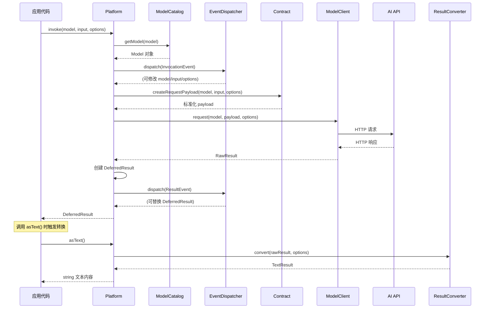

# 第 2 章：Platform 组件深入剖析

## 🎯 本章学习目标

深入理解 Platform 组件的核心架构、消息系统、结果体系、结构化输出、流式响应与事件系统，掌握 33+ 桥接器的使用方式，为构建生产级 AI 应用打下坚实基础。

---

## 1. 回顾

在 [第 1 章：快速入门](01-quick-start.md) 中，我们动手体验了 Platform 的五项核心能力：

- 使用 `PlatformFactory::create()` 创建平台实例
- 通过 `invoke()` + `asText()` 完成基础文本对话
- 用 `stream => true` 实现流式响应
- 用 `response_format` 选项将 AI 输出映射为 PHP 对象
- 用 `ImageUrl` / `Image` 实现多模态图片输入

本章将从架构层面，系统性地拆解 Platform 组件的每一个子系统。

---

## 2. 核心架构

### 2.1 PlatformInterface —— 一切的起点

`PlatformInterface` 是整个 Symfony AI 的核心抽象，定义了与 AI 模型交互的统一入口：

```php
namespace Symfony\AI\Platform;

interface PlatformInterface
{
    /**
     * @param non-empty-string           $model   模型名称（如 'gpt-4o'）
     * @param array<mixed>|string|object $input   输入数据
     * @param array<string, mixed>       $options 调用选项
     */
    public function invoke(
        string $model,
        array|string|object $input,
        array $options = [],
    ): DeferredResult;

    public function getModelCatalog(): ModelCatalogInterface;
}
```

**三个参数的含义**：

| 参数 | 类型 | 说明 |
|------|------|------|
| `$model` | `string` | 模型名称，如 `'gpt-4o'`、`'claude-3-5-sonnet-20241022'`、`'llama3.2'` |
| `$input` | `array\|string\|object` | 最常用 `MessageBag`（对话历史），也可以是原始字符串或数组 |
| `$options` | `array` | 调用选项：`temperature`、`max_tokens`、`stream`、`tools`、`response_format` 等 |

**返回值 `DeferredResult`** —— 延迟求值包装器，调用取值方法时才真正执行响应转换：

```php
$deferred = $platform->invoke('gpt-4o', $messageBag);

// 便捷取值方法
$deferred->asText();        // string —— 文本内容
$deferred->asObject();      // object —— 结构化输出对象
$deferred->asBinary();      // string —— 二进制数据（图片/音频）
$deferred->asFile($path);   // void   —— 保存到文件
$deferred->asDataUri();     // string —— data:mime/type;base64,...
$deferred->asVectors();     // Vector[] —— 嵌入向量数组
$deferred->asStream();      // Generator —— 流式输出
$deferred->asToolCalls();   // ToolCall[] —— 工具调用列表
$deferred->asReranking();   // RerankingEntry[] —— 重排序结果
$deferred->getMetadata();   // Metadata —— 元数据（Token 使用等）
```

> 💡 **延迟求值的好处**：`invoke()` 返回后并不立即解析 HTTP 响应，这样可以在 `ResultEvent` 中对结果进行拦截和替换（例如结构化输出的订阅器就是在此事件中工作的）。

### 2.2 Bridge 模式：ModelClientInterface 与 ResultConverterInterface

Platform 的核心扩展机制是 **Bridge 模式**——每个 AI 平台对应一个 Bridge，包含两个关键接口的实现：

```php
namespace Symfony\AI\Platform;

// 负责向 AI API 发送 HTTP 请求
interface ModelClientInterface
{
    public function supports(Model $model): bool;

    public function request(
        Model $model,
        array|string $payload,
        array $options = [],
    ): RawResultInterface;
}

// 负责将原始 HTTP 响应转换为结构化结果
interface ResultConverterInterface
{
    public function supports(Model $model): bool;

    public function convert(
        RawResultInterface $result,
        array $options = [],
    ): ResultInterface;
}
```

一个典型的 Bridge 目录结构：

```text
Bridge/OpenAi/
├── PlatformFactory.php     # 工厂类，一行创建平台实例
├── ModelCatalog.php        # 该平台的模型目录（含能力定义）
├── ModelClient.php         # HTTP 请求实现
├── ResultConverter.php     # 响应解析实现
├── Contract/               # 平台特定的消息格式化
│   └── Normalizer/
└── Tests/
```

> 📌 每个 Bridge 只需实现 `supports()` + `request()` / `convert()`，Platform 会自动根据模型名称路由到正确的 Bridge。

### 2.3 请求完整流程

当你调用 `$platform->invoke('gpt-4o', $messageBag, $options)` 时，内部经历以下步骤：

```php
应用代码
    │
    ▼
PlatformInterface::invoke(model, input, options)
    │
    ├─ 1. ModelCatalog::getModel(model) → Model 对象（含能力信息）
    │
    ├─ 2. 分发 InvocationEvent（可修改 model/input/options）
    │
    ├─ 3. Contract::createRequestPayload(model, input, options)
    │      ├─ MessageBagNormalizer 标准化消息
    │      │     ├─ SystemMessageNormalizer
    │      │     ├─ UserMessageNormalizer（含 Text/Image/Audio 标准化）
    │      │     ├─ AssistantMessageNormalizer
    │      │     └─ ToolCallMessageNormalizer
    │      └─ ToolNormalizer 标准化工具定义
    │
    ├─ 4. ModelClientInterface::request(model, payload, options)
    │      └─ 发起 HTTP 请求到 AI API
    │
    ├─ 5. 创建 DeferredResult（延迟转换）
    │
    ├─ 6. 分发 ResultEvent（可替换结果）
    │
    └─ 7. 返回 DeferredResult
              │
              ▼ （首次调用 asText() / asObject() 等时）
       ResultConverterInterface::convert(rawResult, options)
           ├─ 解析 JSON/二进制响应
           ├─ 创建对应 Result 类型
           ├─ 提取 TokenUsage
           └─ 合并元数据
```

下面是对应的 Mermaid 序列图：



### 2.4 Platform 类内部实现

`Platform` 类是 `PlatformInterface` 的默认实现：

```php
final class Platform implements PlatformInterface
{
    public function __construct(
        iterable $modelClients,              // ModelClientInterface 集合
        iterable $resultConverters,          // ResultConverterInterface 集合
        ModelCatalogInterface $modelCatalog, // 模型目录
        ?Contract $contract = null,          // 序列化合约
        ?EventDispatcherInterface $eventDispatcher = null,
    ) {}
}
```

当有多个 Bridge 注册时，Platform 遍历所有 `ModelClientInterface` 实例，找到第一个 `supports($model)` 返回 `true` 的客户端来处理请求。

### 2.5 Contract 层：请求归一化

`Contract` 类是 Platform 架构中的关键中间层，负责将不同类型的输入（字符串、数组、`MessageBag` 等）统一转换为各平台 API 能理解的请求格式。

```php
use Symfony\AI\Platform\Contract;

// Contract 创建（通常由 PlatformFactory 自动完成）
$contract = Contract::create(); // 使用默认的 Normalizer 集合

// 核心方法
$payload = $contract->createRequestPayload($model, $input, $options);
$toolOption = $contract->createToolOption($tools, $model);
```

#### 工作流程

```
用户输入 (string/array/MessageBag)
    ↓
Contract::createRequestPayload()
    ↓ 使用 NormalizerInterface 链
标准化的 array/string 请求体
    ↓
ModelClientInterface::invoke()
    ↓
发送到 AI 平台 API
```

#### 自定义 Contract

各桥接器可以扩展默认 Contract，添加平台特有的序列化逻辑：

| 桥接器 | 自定义 Contract | 特殊处理 |
|--------|----------------|---------|
| Ollama | `OllamaContract` | 本地模型特有的格式化 |
| OpenAI | `OpenAiContract` | 支持 function calling 格式 |
| Anthropic | `AnthropicContract` | 支持 tool_use 和 cache_control |

> 💡 **提示**：大多数情况下你不需要直接操作 Contract。它由 `PlatformFactory::create()` 自动配置。仅在开发自定义桥接器时需要了解此层。

---

## 3. 消息系统详解

消息系统是 Platform 组件的输入核心。所有与 AI 的对话都通过消息对象来表达。

### 3.1 Role 枚举

```php
namespace Symfony\AI\Platform\Message;

enum Role: string
{
    case System    = 'system';     // 系统提示——设定 AI 行为
    case User      = 'user';       // 用户输入
    case Assistant = 'assistant';  // AI 助手回复
    case ToolCall  = 'tool';       // 工具调用结果
}
```

对话中的每条消息都携带一个角色，AI 模型依据角色理解对话上下文。

### 3.2 消息类型

#### SystemMessage —— 系统提示

```php
namespace Symfony\AI\Platform\Message;

final class SystemMessage implements MessageInterface
{
    public function __construct(string|Template $content) {}
    public function getRole(): Role   // Role::System
    public function getContent(): string|Template
}
```

系统消息设定 AI 的角色、行为规则和约束条件。大多数 API 要求系统消息唯一且在消息列表最前：

```php
use Symfony\AI\Platform\Message\SystemMessage;

$system = new SystemMessage('你是一位 PHP 安全专家，只讨论安全相关话题。');
```

#### UserMessage —— 用户消息

```php
final class UserMessage implements MessageInterface
{
    public function __construct(ContentInterface ...$content) {}
    public function getRole(): Role       // Role::User
    public function getContent(): array   // ContentInterface[]
    public function hasAudioContent(): bool
    public function hasImageContent(): bool
    public function asText(): ?string     // 纯文本消息时返回文本
}
```

支持传入一个或多个内容对象，实现多模态输入：

```php
use Symfony\AI\Platform\Message\UserMessage;
use Symfony\AI\Platform\Message\Content\Text;
use Symfony\AI\Platform\Message\Content\ImageUrl;

// 纯文本
$msg = new UserMessage(new Text('什么是依赖注入？'));

// 文本 + 图片（多模态）
$msg = new UserMessage(
    new Text('请描述这张图片的内容：'),
    new ImageUrl('https://example.com/photo.jpg'),
);
```

#### AssistantMessage —— 助手消息

```php
final class AssistantMessage implements MessageInterface
{
    public function __construct(
        ?string $content = null,
        ?array $toolCalls = null,    // ToolCall[]
        ?array $thinking = null,     // ThinkingContent[]
    ) {}
    public function getRole(): Role       // Role::Assistant
    public function getContent(): ?string
    public function getToolCalls(): ?array
    public function hasToolCalls(): bool
}
```

AI 的回复消息，在多轮对话中用于保存历史上下文：

```php
use Symfony\AI\Platform\Message\AssistantMessage;

// 普通回复
$msg = new AssistantMessage('Symfony 是一个 PHP Web 框架。');

// 包含工具调用请求
$msg = new AssistantMessage(
    content: null,
    toolCalls: [$toolCall1, $toolCall2],
);
```

#### ToolCallMessage —— 工具调用结果

```php
final class ToolCallMessage implements MessageInterface
{
    public function __construct(ToolCall $toolCall, string $content) {}
    public function getRole(): Role      // Role::ToolCall
    public function getToolCall(): ToolCall
    public function getContent(): string
}
```

将工具执行结果返回给 AI：

```php
use Symfony\AI\Platform\Message\ToolCallMessage;
use Symfony\AI\Platform\Result\ToolCall;

$toolCall = new ToolCall('call_abc123', 'get_weather', ['city' => 'Beijing']);
$msg = new ToolCallMessage($toolCall, '{"temperature": 25, "condition": "Sunny"}');
```

### 3.3 Message 工厂类

`Message` 类提供静态工厂方法，简化消息创建：

```php
namespace Symfony\AI\Platform\Message;

final class Message
{
    // 创建系统消息
    public static function forSystem(\Stringable|string|Template $content): SystemMessage;

    // 创建用户消息（支持多模态）
    public static function ofUser(\Stringable|string|ContentInterface ...$content): UserMessage;

    // 创建助手消息
    public static function ofAssistant(
        ?string $content = null,
        ?array $toolCalls = null,
    ): AssistantMessage;

    // 创建工具调用结果消息
    public static function ofToolCall(ToolCall $toolCall, string $content): ToolCallMessage;
}
```

**使用示例**：

```php
use Symfony\AI\Platform\Message\Message;
use Symfony\AI\Platform\Message\Content\Text;
use Symfony\AI\Platform\Message\Content\ImageUrl;

// 系统消息
$system = Message::forSystem('你是一位 Symfony 框架专家。');

// 纯文本用户消息——字符串自动转为 Text 内容
$user = Message::ofUser('请解释什么是服务容器？');

// 多模态用户消息
$user = Message::ofUser(
    new Text('这张架构图说明了什么？'),
    new ImageUrl('https://example.com/architecture.png'),
);

// 助手回复
$assistant = Message::ofAssistant('服务容器是一种管理对象依赖关系的设计模式。');

// 工具调用结果
$toolResult = Message::ofToolCall($toolCall, '{"result": 42}');
```

### 3.4 MessageBag：消息容器

`MessageBag` 管理一次对话中的所有消息，是 `invoke()` 最常用的 `$input` 类型：

```php
namespace Symfony\AI\Platform\Message;

final class MessageBag
{
    public function __construct(MessageInterface ...$messages) {}

    public function getId(): AbstractUid&TimeBasedUidInterface     // 获取唯一 ID（UUID v7）
    public function add(MessageInterface $message): void          // 追加消息
    public function with(MessageInterface $message): self         // 不可变追加（返回新实例）
    public function merge(self $messageBag): self                 // 合并另一个消息包（返回新实例）
    public function getMessages(): array                          // 获取所有消息
    public function getSystemMessage(): ?SystemMessage            // 获取系统消息
    public function getUserMessage(): ?UserMessage                // 获取第一条用户消息
    public function count(): int                                  // 消息总数
    public function withSystemMessage(SystemMessage $msg): self   // 替换系统消息
    public function withoutSystemMessage(): self                  // 移除系统消息
    public function containsImage(): bool                         // 是否包含图片
    public function containsAudio(): bool                         // 是否包含音频
    public function getIterator(): \ArrayIterator                 // 迭代器支持
}
```

**多轮对话示例**：

```php
use Symfony\AI\Platform\Message\Message;
use Symfony\AI\Platform\Message\MessageBag;

$messages = new MessageBag(
    Message::forSystem('你是一位数学老师，善于用简单的语言解释概念。'),
);

// 第一轮
$messages->add(Message::ofUser('什么是导数？'));
$response1 = $platform->invoke('gpt-4o', $messages)->asText();
$messages->add(Message::ofAssistant($response1));

// 第二轮（AI 会记住上下文）
$messages->add(Message::ofUser('能举一个实际例子吗？'));
$response2 = $platform->invoke('gpt-4o', $messages)->asText();
$messages->add(Message::ofAssistant($response2));

// 第三轮
$messages->add(Message::ofUser('和积分有什么关系？'));
$response3 = $platform->invoke('gpt-4o', $messages)->asText();

echo $response3; // AI 会基于完整的对话上下文回答
```

> ⚠️ **注意**：每轮对话都发送完整的消息历史，Token 消耗会随对话轮次增长。在长对话场景中，建议实现滑动窗口或摘要策略来控制消息长度。

### 3.5 Content 内容类型

`UserMessage` 支持多种内容类型，全部实现 `ContentInterface`：

| 类 | 用途 | 构造方式 |
|----|------|----------|
| `Text` | 纯文本内容 | `new Text('内容')` |
| `Image` | 二进制图片 | `Image::fromFile('/path/to/img.jpg')` |
| `ImageUrl` | 图片 URL | `new ImageUrl('https://...')` |
| `Audio` | 音频数据 | `Audio::fromFile('/path/to/audio.mp3')` |
| `Document` | 文档（PDF 等） | `Document::fromFile('/path/to/doc.pdf')` |
| `DocumentUrl` | 文档 URL | `new DocumentUrl('https://...')` |
| `Video` | 视频数据 | `Video::fromFile('/path/to/video.mp4')` |
| `File` | 通用文件（基类） | `new File($data, 'mime/type')` |
| `Collection` | 内容集合 | `new Collection($text, $image, ...)` |

**二进制内容的懒加载**：`Image`、`Audio`、`Document`、`Video` 都继承自 `File`，支持懒加载——文件在序列化时才读取：

```php
use Symfony\AI\Platform\Message\Content\Image;
use Symfony\AI\Platform\Message\Content\Audio;
use Symfony\AI\Platform\Message\Content\Document;
use Symfony\AI\Platform\Message\Content\Video;

// 从文件加载（懒加载）
$image = Image::fromFile('/var/uploads/photo.jpg');
$audio = Audio::fromFile('/var/recordings/meeting.mp3');
$doc   = Document::fromFile('/var/docs/report.pdf');
$video = Video::fromFile('/var/videos/demo.mp4');

// 从 Data URL 加载
$image = Image::fromDataUrl('data:image/jpeg;base64,/9j/4AAQ...');

// 获取不同格式
$image->asBase64();    // base64 字符串
$image->asBinary();    // 原始二进制
$image->asDataUrl();   // data:image/jpeg;base64,...
$image->getFormat();   // 'image/jpeg'
```

**多模态组合示例**：

```php
use Symfony\AI\Platform\Message\Message;
use Symfony\AI\Platform\Message\MessageBag;
use Symfony\AI\Platform\Message\Content\Text;
use Symfony\AI\Platform\Message\Content\Image;
use Symfony\AI\Platform\Message\Content\Document;
use Symfony\AI\Platform\Message\Content\Collection;

// 图片对比分析
$messages = new MessageBag(
    Message::ofUser(
        new Text('请比较这两张产品图片的外观差异：'),
        Image::fromFile('/var/products/v1.jpg'),
        Image::fromFile('/var/products/v2.jpg'),
    ),
);

// PDF 文档分析
$messages = new MessageBag(
    Message::forSystem('你是专业的论文摘要生成器。'),
    Message::ofUser(
        new Text('请为这篇论文生成 200 字摘要：'),
        Document::fromFile('/var/papers/paper.pdf'),
    ),
);

// 使用 Collection 批量传入
$images = new Collection(
    new Text('以下是本月的销售报表截图：'),
    Image::fromFile('/var/reports/jan.png'),
    Image::fromFile('/var/reports/feb.png'),
    Image::fromFile('/var/reports/mar.png'),
);
$messages = new MessageBag(
    Message::ofUser($images),
);
```

---

## 4. 模型与能力

### 4.1 Model 类

`Model` 类描述单个 AI 模型，包含名称、能力列表和默认选项：

```php
namespace Symfony\AI\Platform;

final class Model
{
    public function __construct(
        string $name,                     // 模型名称（非空字符串）
        Capability[] $capabilities = [],  // 能力列表
        array $options = [],              // 默认选项
    ) {}

    public function getName(): string
    public function getCapabilities(): array
    public function supports(Capability $capability): bool
    public function getOptions(): array
}
```

### 4.2 ModelCatalog 模型目录

每个桥接器（Bridge）都实现了 `ModelCatalogInterface`，提供该平台支持的模型列表及其能力描述：

```php
use Symfony\AI\Platform\ModelCatalog\ModelCatalogInterface;

interface ModelCatalogInterface
{
    /** @param non-empty-string $modelName */
    public function getModel(string $modelName): Model;

    /** @return array<string, array{class: string, capabilities: list<Capability>}> */
    public function getModels(): array;
}
```

#### 使用方式

`AbstractModelCatalog` 提供基础实现，支持参数解析和变体匹配：

```php
// 通过 Platform 获取模型目录
$catalog = $platform->getModelCatalog();

// 获取特定模型信息
$model = $catalog->getModel('gpt-4o');

// 列出所有可用模型
foreach ($catalog->getModels() as $name => $info) {
    echo "$name: " . implode(', ', array_map(fn($c) => $c->name, $info['capabilities'])) . "\n";
}

// 检查模型能力
if ($model->supports(Capability::TOOL_CALLING)) {
    echo '支持工具调用';
}

// 带参数解析
$model = $catalog->getModel('gpt-4o?temperature=0.7');

// Ollama 大小变体
$model = $catalog->getModel('llama3.2:3b');
```

#### FallbackModelCatalog

当桥接器未提供目录时，`FallbackModelCatalog` 作为兜底实现，根据模型名称前缀自动推断能力。

#### 动态目录（0.7 新特性）

Ollama 和 ElevenLabs 的模型目录在 0.7 版本中改为从服务器自动获取，不再使用硬编码列表。这意味着：
- Ollama：自动发现已拉取的本地模型
- ElevenLabs：自动获取可用的语音模型列表

### 4.3 Capability 枚举

`Capability` 枚举完整定义了模型所有可能的能力：

```php
namespace Symfony\AI\Platform;

enum Capability: string
{
    // 输入能力
    case INPUT_AUDIO      = 'input-audio';       // 音频输入
    case INPUT_IMAGE      = 'input-image';       // 图像输入
    case INPUT_MESSAGES   = 'input-messages';    // 消息列表（对话）
    case INPUT_MULTIPLE   = 'input-multiple';    // 多路输入
    case INPUT_PDF        = 'input-pdf';         // PDF 文档输入
    case INPUT_TEXT       = 'input-text';        // 纯文本输入
    case INPUT_VIDEO      = 'input-video';       // 视频输入
    case INPUT_MULTIMODAL = 'input-multimodal';  // 多模态输入

    // 输出能力
    case OUTPUT_AUDIO      = 'output-audio';      // 输出音频
    case OUTPUT_IMAGE      = 'output-image';      // 输出图片
    case OUTPUT_STREAMING  = 'output-streaming';  // 流式输出
    case OUTPUT_STRUCTURED = 'output-structured'; // 结构化输出（JSON Schema）
    case OUTPUT_TEXT       = 'output-text';       // 输出文本

    // 功能
    case TOOL_CALLING     = 'tool-calling';      // 工具/函数调用

    // 语音
    case TEXT_TO_SPEECH   = 'text-to-speech';    // 文字转语音
    case SPEECH_TO_TEXT   = 'speech-to-text';    // 语音转文字

    // 图像生成
    case TEXT_TO_IMAGE    = 'text-to-image';     // 文字生成图像
    case IMAGE_TO_IMAGE   = 'image-to-image';    // 图像变换

    // 视频生成
    case TEXT_TO_VIDEO    = 'text-to-video';     // 文字生成视频
    case IMAGE_TO_VIDEO   = 'image-to-video';    // 图像生成视频
    case VIDEO_TO_VIDEO   = 'video-to-video';    // 视频变换

    // 嵌入与检索
    case EMBEDDINGS       = 'embeddings';        // 向量嵌入
    case RERANKING        = 'reranking';         // 结果重排序

    // 推理
    case THINKING         = 'thinking';          // 扩展思考链（Chain-of-Thought）
}
```

### 4.4 主流模型能力对照表

| 模型 | 文本对话 | 图片输入 | 流式 | 工具调用 | 结构化输出 | 嵌入 | 语音 | 思考链 |
|------|:---:|:---:|:---:|:---:|:---:|:---:|:---:|:---:|
| **GPT-4o** | ✅ | ✅ | ✅ | ✅ | ✅ | — | — | — |
| **GPT-4o-mini** | ✅ | ✅ | ✅ | ✅ | ✅ | — | — | — |
| **o1 / o3** | ✅ | ✅ | ✅ | ✅ | ✅ | — | — | — |
| **DALL-E 3** | — | — | — | — | — | — | — | — |
| **text-embedding-3-\*** | — | — | — | — | — | ✅ | — | — |
| **Claude 3.5 Sonnet** | ✅ | ✅ | ✅ | ✅ | — | — | — | — |
| **Claude 3.7 Sonnet** | ✅ | ✅ | ✅ | ✅ | — | — | — | ✅ |
| **Gemini 2.5 Flash/Pro** | ✅ | ✅ | ✅ | ✅ | ✅ | — | — | ✅ |
| **Gemini text-embedding-004** | — | — | — | — | — | ✅ | — | — |
| **Mistral Large** | ✅ | — | ✅ | ✅ | ✅ | — | — | — |
| **DeepSeek Chat** | ✅ | — | ✅ | ✅ | — | — | — | — |
| **DeepSeek Reasoner** | ✅ | — | ✅ | — | — | — | — | ✅ |
| **Llama 3.2（Ollama）** | ✅ | 依模型 | 依模型 | 依模型 | ✅ | 依模型 | — | 依模型 |
| **ElevenLabs** | — | — | — | — | — | — | ✅ TTS | — |
| **Cartesia** | — | — | — | — | — | — | ✅ TTS | — |

> 📌 DALL-E 3 的能力是 `TEXT_TO_IMAGE`（文字生成图像），上表中的"文本对话"指 `INPUT_MESSAGES` + `OUTPUT_TEXT`。

**使用能力检查防止运行时错误**：

```php
$model = $platform->getModelCatalog()->getModel('gpt-4o');

if ($model->supports(Capability::TOOL_CALLING)) {
    // 安全地使用工具调用
    $result = $platform->invoke('gpt-4o', $messages, ['tools' => $tools]);
}

if (!$model->supports(Capability::INPUT_VIDEO)) {
    throw new \LogicException('当前模型不支持视频输入，请使用 Gemini。');
}
```

---

## 5. 结果系统

### 5.1 结果类型总览

所有结果类继承自 `BaseResult`（实现 `ResultInterface`），携带元数据和原始响应访问能力：

| 结果类型 | 内容类型 | 获取方式 | 典型场景 |
|---------|---------|---------|---------|
| `TextResult` | `string` | `asText()` | 对话、摘要、翻译 |
| `ObjectResult` | `object` | `asObject()` | 结构化数据提取 |
| `BinaryResult` | `string`（二进制） | `asBinary()` / `asFile()` | 图片生成、语音合成 |
| `VectorResult` | `Vector[]` | `asVectors()` | 文本嵌入 |
| `ToolCallResult` | `ToolCall[]` | `asToolCalls()` | 工具调用 |
| `StreamResult` | `Generator` | `asStream()` | 流式输出 |
| `ChoiceResult` | `ResultInterface[]` | `getResult()` | 多候选生成 |
| `RerankingResult` | `RerankingEntry[]` | `asReranking()` | 搜索重排序 |

### 5.2 TextResult —— 最常用的结果

```php
$text = $platform->invoke('gpt-4o', new MessageBag(
    Message::ofUser('用一句话解释什么是 PHP')
))->asText();

echo $text; // "PHP 是一种广泛用于 Web 开发的服务端脚本语言。"
```

### 5.3 BinaryResult —— 二进制数据

用于图片生成（DALL-E）和语音合成（ElevenLabs / Cartesia）：

```php
// 图片生成
$result = $platform->invoke('dall-e-3', new MessageBag(
    Message::ofUser('一只穿着宇航服的猫咪在月球上散步')
), ['size' => '1792x1024', 'quality' => 'hd']);

$result->asFile('/tmp/space-cat.png');              // 保存到文件
$dataUri = $result->asDataUri('image/png');          // data:image/png;base64,...

// 语音合成
$result = $platform->invoke('eleven_multilingual_v2', new MessageBag(
    Message::ofUser('欢迎使用 Symfony AI！')
), ['voice_id' => 'ErXwobaYiN019PkySvjV']);

$result->asFile('/tmp/welcome.mp3');
```

### 5.4 VectorResult —— 嵌入向量

```php
$vectors = $platform->invoke(
    'text-embedding-3-small',
    'Symfony 是一个高性能的 PHP Web 框架',
)->asVectors();

$embedding = $vectors[0]->getData(); // float[]，长度 1536
echo '向量维度：' . count($embedding);
```

**嵌入模型维度对比**：

| 模型 | 维度 | 提供商 |
|------|------|--------|
| `text-embedding-3-small` | 1536 | OpenAI |
| `text-embedding-3-large` | 3072（可降维至 256） | OpenAI |
| `text-embedding-004` | 768 | Google Gemini |
| `voyage-3-large` | 1024 / 2048 | Voyage AI |
| `nomic-embed-text`（Ollama） | 768 | 本地运行 |

### 5.5 ToolCallResult —— 工具调用

当模型决定调用工具时返回：

```php
$deferred = $platform->invoke('gpt-4o', $messages, ['tools' => $tools]);
$result = $deferred->getResult();

if ($result instanceof \Symfony\AI\Platform\Result\ToolCallResult) {
    foreach ($result->getContent() as $toolCall) {
        echo $toolCall->getId();        // 'call_abc123'
        echo $toolCall->getName();      // 'get_weather'
        print_r($toolCall->getArguments()); // ['city' => 'Beijing']
    }
}
```

### 5.6 StreamResult —— 流式输出

流式响应通过 PHP `Generator` 逐块产生内容：

```php
$stream = $platform->invoke('gpt-4o', $messages, ['stream' => true])->asStream();

foreach ($stream as $chunk) {
    if (is_string($chunk)) {
        echo $chunk; // 文本片段
    } elseif ($chunk instanceof \Symfony\AI\Platform\Result\ToolCall) {
        // 流式工具调用
    } elseif ($chunk instanceof \Symfony\AI\Platform\Result\ThinkingContent) {
        echo "【思考】{$chunk->thinking}\n";
    }
}
```

### 5.7 Token 使用追踪

每次 AI 调用都会消耗 Token，追踪 Token 用量对成本控制至关重要。Symfony AI 提供了完整的 Token 追踪体系。

Token 用量信息通过元数据获取：

```php
$deferred = $platform->invoke('gpt-4o', $messages);
$result = $deferred->getResult();

$metadata = $result->getMetadata();
$tokenUsage = $metadata->get('token_usage');

if (null !== $tokenUsage) {
    printf(
        "输入: %d tokens | 输出: %d tokens | 总计: %d tokens\n",
        $tokenUsage->getPromptTokens(),
        $tokenUsage->getCompletionTokens(),
        $tokenUsage->getTotalTokens(),
    );
}
```

> 💡 **流式模式的 Token 用量**：在流式模式下，Token 用量只有在整个流消费完毕后才可用。

#### TokenUsageInterface

```php
use Symfony\AI\Platform\TokenUsage\TokenUsageInterface;

interface TokenUsageInterface
{
    public function getPromptTokens(): ?int;         // 输入 Token 数
    public function getCompletionTokens(): ?int;     // 输出 Token 数
    public function getThinkingTokens(): ?int;       // 思考 Token 数（如 Claude 深度思考）
    public function getToolTokens(): ?int;           // 工具调用 Token 数
    public function getCachedTokens(): ?int;         // 缓存命中 Token 数
    public function getCacheCreationTokens(): ?int;  // 缓存写入 Token 数（Anthropic）
    public function getCacheReadTokens(): ?int;      // 缓存读取 Token 数（Anthropic）
    public function getRemainingTokens(): ?int;      // 剩余 Token 配额
    public function getRemainingTokensMinute(): ?int; // 每分钟剩余配额
    public function getRemainingTokensMonth(): ?int;  // 每月剩余配额
    public function getTotalTokens(): ?int;          // 总 Token 数
}
```

#### TokenUsageAggregation —— 多次调用汇总

在 Agent 的多轮工具调用中，每一轮都会产生 Token 用量。`TokenUsageAggregation` 自动汇总所有调用的 Token 消耗：

```php
// Agent 多轮调用后
$result = $agent->call($messages);
$aggregation = $result->getMetadata()->get('token_usage');

// aggregation 汇总了所有轮次的 Token
echo "总输入: {$aggregation->getPromptTokens()} tokens\n";    // 所有轮次之和
echo "总输出: {$aggregation->getCompletionTokens()} tokens\n";
echo "剩余配额: {$aggregation->getRemainingTokens()}\n";       // 取最小值
```

> 💡 **提示**：汇总逻辑中，`getPromptTokens()` 等数量指标取**所有轮次之和**，而 `getRemainingTokens()` 等配额指标取**最小值**（最保守估计）。

#### 成本估算示例

```php
// 简单的成本计算
$usage = $result->getMetadata()->get('token_usage');
$inputCost = ($usage->getPromptTokens() / 1_000_000) * 2.50;  // GPT-4o: $2.50/1M input
$outputCost = ($usage->getCompletionTokens() / 1_000_000) * 10.00; // GPT-4o: $10/1M output
echo sprintf("本次调用成本: $%.4f\n", $inputCost + $outputCost);
```

### 5.8 DeferredResult —— 延迟求值结果

`Platform::invoke()` 返回的是 `DeferredResult`（延迟求值结果），它不会立即执行结果转换，而是在你调用具体方法时才触发。这种设计允许统一的返回类型和灵活的结果处理。

#### 便捷方法速查表

| 方法 | 返回类型 | 用途 | 内部结果类型 |
|------|---------|------|-------------|
| `asText()` | `string` | 获取文本内容 | `TextResult` |
| `asObject()` | `object` | 获取结构化输出对象 | `ObjectResult` |
| `asBinary()` | `string` | 获取二进制数据（如图片） | `BinaryResult` |
| `asFile(string $path)` | `void` | 将二进制结果保存为文件 | `BinaryResult` |
| `asDataUri(?string $mimeType)` | `string` | 获取 Base64 Data URI | `BinaryResult` |
| `asVectors()` | `Vector[]` | 获取嵌入向量 | `VectorResult` |
| `asReranking()` | `array` | 获取重排序结果 | `RerankingResult` |
| `asStream()` | `\Generator` | 获取流式内容生成器 | `StreamResult` |
| `asToolCalls()` | `ToolCall[]` | 获取工具调用请求 | `ToolCallResult` |
| `getResult()` | `ResultInterface` | 获取原始结果对象 | 任意 |
| `getRawResult()` | `RawResultInterface` | 获取平台原始响应 | — |

#### 使用示例

```php
use Symfony\AI\Platform\Exception\UnexpectedResultTypeException;

// 文本对话
$text = $platform->invoke('gpt-4o', 'Hello')->asText();

// 结构化输出
$review = $platform->invoke('gpt-4o', $prompt, [
    'response_format' => CodeReview::class,
])->asObject();

// 图片生成
$platform->invoke('dall-e-3', 'A sunset over mountains')->asFile('/tmp/sunset.png');

// 嵌入向量
$vectors = $platform->invoke('text-embedding-3-small', 'Hello world')->asVectors();

// 流式响应
foreach ($platform->invoke('gpt-4o', 'Tell me a story')->asStream() as $chunk) {
    echo $chunk;
}
```

> ⚠️ **常见错误**：如果调用了与结果类型不匹配的便捷方法（例如对文本结果调用 `asVectors()`），会抛出 `UnexpectedResultTypeException`。请确保便捷方法与请求的模型能力匹配。

---

## 5A. Metadata 元数据系统

Symfony AI 的结果系统中，每个结果都携带 **Metadata（元数据）** —— 一个通用的键值容器，用于存储 Token 用量、来源引用等附加信息。

### 5A.1 Metadata 类

`Metadata` 实现了 `JsonSerializable`、`Countable`、`IteratorAggregate` 和 `ArrayAccess` 接口，支持灵活的数据访问方式：

```php
use Symfony\AI\Platform\Metadata\Metadata;

$metadata = new Metadata(['model' => 'gpt-4o', 'region' => 'us']);

// 基本操作
$metadata->has('model');              // true
$metadata->get('model');              // 'gpt-4o'
$metadata->get('missing', 'default'); // 'default'
$metadata->add('version', '0.7');
$metadata->remove('region');

// 数组式访问
$model = $metadata['model'];

// 遍历
foreach ($metadata as $key => $value) {
    echo "$key: $value\n";
}

// JSON 序列化
$json = json_encode($metadata); // {"model":"gpt-4o","version":"0.7"}
```

### 5A.2 MetadataAwareInterface

所有结果类型（`TextResult`、`StreamResult`、`BinaryResult` 等）以及 `DeferredResult` 都实现了 `MetadataAwareInterface`：

```php
use Symfony\AI\Platform\Metadata\MetadataAwareInterface;

interface MetadataAwareInterface
{
    public function getMetadata(): Metadata;
}
```

在实际代码中，通过 `MetadataAwareTrait` 提供默认实现：

```php
$result = $platform->invoke('gpt-4o', 'Hello');
$metadata = $result->getMetadata();

// 获取 Token 用量
$tokenUsage = $metadata->get('token_usage');
```

### 5A.3 MergeableMetadataInterface —— 自动合并机制

当向 `Metadata` 中使用 `add()` 方法添加一个已存在的键时，如果旧值实现了 `MergeableMetadataInterface`，系统会自动调用 `merge()` 方法合并新旧值：

```php
use Symfony\AI\Platform\Metadata\MergeableMetadataInterface;

interface MergeableMetadataInterface
{
    public function merge(self $metadata): self;
}
```

内置的可合并元数据类型包括：

| 类型 | 合并行为 |
|------|---------|
| `TokenUsage` | 合并为 `TokenUsageAggregation`，自动汇总 Token 数量 |
| `SourceCollection` | 合并来源集合，保留所有引用来源 |

> ⚠️ **常见错误**：不要直接使用 `$metadata->set()` 覆盖整个元数据，这会丢失已有的可合并值。使用 `$metadata->add()` 或 `$metadata->merge()` 来安全地添加信息。

---

## 6. 结构化输出（深入）

结构化输出是 Platform 最强大的功能之一——将 AI 的自由文本响应自动反序列化为 PHP 对象。

### 6.1 #[With] 属性

`#[With]` PHP Attribute 用于为类属性添加 JSON Schema 描述信息：

```php
use Symfony\AI\Platform\Contract\JsonSchema\Attribute\With;

class WeatherReport
{
    #[With(description: '城市名称', example: '北京')]
    public string $city;

    #[With(description: '当前温度（摄氏度）', minimum: -50, maximum: 60)]
    public float $temperature;

    #[With(description: '天气状况', enum: ['晴', '多云', '阴', '雨', '雪'])]
    public string $condition;

    #[With(description: '湿度百分比', minimum: 0, maximum: 100)]
    public int $humidity;
}
```

`#[With]` 支持的参数：

| 参数 | 类型 | 用途 |
|------|------|------|
| `description` | `string` | 字段描述（帮助 AI 理解含义） |
| `example` | `string` | 示例值 |
| `enum` | `array` | 允许值列表 |
| `minimum` | `int\|float` | 最小值 |
| `maximum` | `int\|float` | 最大值 |
| `minLength` | `int` | 字符串最小长度 |
| `maxLength` | `int` | 字符串最大长度 |
| `pattern` | `string` | 正则表达式匹配 |
| `minItems` | `int` | 数组最少元素数 |
| `maxItems` | `int` | 数组最多元素数 |

### 6.2 基本使用

```php
use Symfony\AI\Platform\Message\Message;
use Symfony\AI\Platform\Message\MessageBag;

$messages = new MessageBag(
    Message::forSystem('从用户描述中提取天气信息。'),
    Message::ofUser('今天北京 25 度，晴天，湿度 60%'),
);

/** @var WeatherReport $report */
$report = $platform->invoke('gpt-4o', $messages, [
    'response_format' => WeatherReport::class,
])->asObject();

echo $report->city;        // 北京
echo $report->temperature; // 25.0
echo $report->condition;   // 晴
echo $report->humidity;    // 60
```

### 6.3 嵌套 DTO 和数组

结构化输出支持嵌套对象和类型化数组：

```php
use Symfony\AI\Platform\Contract\JsonSchema\Attribute\With;

class InvoiceItem
{
    public function __construct(
        #[With(description: '商品名称')]
        public readonly string $name,

        #[With(description: '数量', minimum: 1)]
        public readonly int $quantity,

        #[With(description: '单价（元）', minimum: 0)]
        public readonly float $unitPrice,
    ) {}
}

class InvoiceData
{
    public function __construct(
        #[With(description: '发票号码', pattern: '^[A-Z]{2}\d{10}$')]
        public readonly string $invoiceNumber,

        #[With(description: '开票日期，格式 YYYY-MM-DD')]
        public readonly string $issueDate,

        #[With(description: '供应商名称')]
        public readonly string $vendorName,

        #[With(description: '含税总金额（人民币元）', minimum: 0)]
        public readonly float $totalAmount,

        #[With(description: '税率百分比', enum: [6, 9, 13])]
        public readonly int $taxRate,

        /** @var InvoiceItem[] */
        #[With(description: '商品明细列表', minItems: 1)]
        public readonly array $items,
    ) {}
}
```

```php
use Symfony\AI\Platform\Message\Content\Image;
use Symfony\AI\Platform\Message\Content\Text;

$messages = new MessageBag(
    Message::forSystem('你是专业发票信息提取器。'),
    Message::ofUser(
        new Text('请从这张发票图片中提取结构化信息：'),
        Image::fromFile('/var/uploads/invoice.jpg'),
    ),
);

/** @var InvoiceData $invoice */
$invoice = $platform->invoke('gpt-4o', $messages, [
    'temperature' => 0,
    'response_format' => InvoiceData::class,
])->asObject();

echo "发票号：{$invoice->invoiceNumber}\n";
echo "总金额：¥{$invoice->totalAmount}\n";
foreach ($invoice->items as $item) {
    printf("  - %s × %d = ¥%.2f\n", $item->name, $item->quantity, $item->unitPrice * $item->quantity);
}
```

### 6.4 枚举支持

PHP 枚举可以直接用作属性类型：

```php
enum Priority: string
{
    case Low    = 'low';
    case Medium = 'medium';
    case High   = 'high';
}

enum Category: string
{
    case Bug     = 'bug';
    case Feature = 'feature';
    case Support = 'support';
}

class TicketClassification
{
    public function __construct(
        #[With(description: '工单标题摘要')]
        public readonly string $title,

        #[With(description: '工单优先级')]
        public readonly Priority $priority,

        #[With(description: '工单分类')]
        public readonly Category $category,

        #[With(description: '关键词列表')]
        public readonly array $keywords,
    ) {}
}
```

```php
$messages = new MessageBag(
    Message::forSystem('对客户工单进行智能分类。'),
    Message::ofUser('用户反馈：系统登录页面在 Safari 浏览器上白屏，无法正常使用，影响所有用户。'),
);

/** @var TicketClassification $ticket */
$ticket = $platform->invoke('gpt-4o', $messages, [
    'response_format' => TicketClassification::class,
])->asObject();

echo $ticket->priority->value; // 'high'
echo $ticket->category->value; // 'bug'
```

### 6.5 完整复杂示例：代码审查 DTO

```php
use Symfony\AI\Platform\Contract\JsonSchema\Attribute\With;

enum Severity: string
{
    case Critical = 'critical';
    case Warning  = 'warning';
    case Info     = 'info';
}

class ReviewIssue
{
    public function __construct(
        #[With(description: '问题所在的文件路径')]
        public readonly string $file,

        #[With(description: '问题所在行号', minimum: 1)]
        public readonly int $line,

        #[With(description: '问题严重程度')]
        public readonly Severity $severity,

        #[With(description: '问题描述')]
        public readonly string $description,

        #[With(description: '修复建议')]
        public readonly string $suggestion,
    ) {}
}

class CodeReviewResult
{
    public function __construct(
        /** @var ReviewIssue[] */
        #[With(description: '发现的问题列表')]
        public readonly array $issues,

        #[With(description: '总体评分 1-10', minimum: 1, maximum: 10)]
        public readonly int $score,

        #[With(description: '综合评价')]
        public readonly string $summary,
    ) {}
}

// 使用
$diff = file_get_contents('/path/to/pr.diff');
$messages = new MessageBag(
    Message::forSystem('你是资深 PHP 代码审查专家。'),
    Message::ofUser("请审查以下代码变更：\n\n```diff\n{$diff}\n```"),
);

/** @var CodeReviewResult $review */
$review = $platform->invoke('gpt-4o', $messages, [
    'temperature' => 0,
    'response_format' => CodeReviewResult::class,
])->asObject();

foreach ($review->issues as $issue) {
    printf("[%s] %s:%d - %s\n", $issue->severity->value, $issue->file, $issue->line, $issue->description);
}
echo "评分: {$review->score}/10\n";
```

### 6.6 JSON Schema 生成

`Factory` 类可以独立使用，从 PHP 类生成 JSON Schema：

```php
use Symfony\AI\Platform\Contract\JsonSchema\Factory;

$factory = new Factory();

// 从类属性生成 Schema
$schema = $factory->buildProperties(WeatherReport::class);

// 生成的 Schema 示例：
// {
//   "type": "object",
//   "properties": {
//     "city": {"type": "string", "description": "城市名称", "example": "北京"},
//     "temperature": {"type": "number", "description": "当前温度（摄氏度）", "minimum": -50, "maximum": 60},
//     ...
//   },
//   "required": ["city", "temperature", "condition", "humidity"],
//   "additionalProperties": false
// }
```

> ⚠️ 结构化输出与流式响应不能同时使用。如果同时指定 `stream => true` 和 `response_format`，会抛出 `InvalidArgumentException`。

---

## 7. 流式响应（深入）

### 7.1 基本流式处理

流式响应让用户无需等待完整回复，每生成一个 Token 就即时返回：

```php
$stream = $platform->invoke('gpt-4o', new MessageBag(
    Message::forSystem('你是写作助手。'),
    Message::ofUser('写一篇关于 PHP 8.4 新特性的技术博客'),
), ['stream' => true])->asStream();

foreach ($stream as $chunk) {
    echo $chunk;
    flush(); // 立即输出到浏览器
}
```

### 7.2 Symfony Controller 中的 SSE 流式响应

```php
use Symfony\Component\HttpFoundation\StreamedResponse;

class ChatController extends AbstractController
{
    public function stream(PlatformInterface $platform, Request $request): StreamedResponse
    {
        $userMessage = $request->get('message', '');

        return new StreamedResponse(function () use ($platform, $userMessage) {
            $messages = new MessageBag(
                Message::forSystem('你是一位友好的助手。'),
                Message::ofUser($userMessage),
            );

            $stream = $platform->invoke('gpt-4o', $messages, [
                'stream' => true,
            ])->asStream();

            foreach ($stream as $chunk) {
                if (is_string($chunk)) {
                    echo 'data: ' . json_encode(['text' => $chunk]) . "\n\n";
                    ob_flush();
                    flush();
                } elseif ($chunk instanceof \Symfony\AI\Platform\Result\ThinkingContent) {
                    echo 'data: ' . json_encode(['thinking' => $chunk->thinking]) . "\n\n";
                    ob_flush();
                    flush();
                }
            }

            echo "data: [DONE]\n\n";
            ob_flush();
            flush();
        }, 200, [
            'Content-Type' => 'text/event-stream',
            'Cache-Control' => 'no-cache',
            'X-Accel-Buffering' => 'no',
        ]);
    }
}
```

### 7.3 流式与工具调用结合

流式模式下也可能收到工具调用：

```php
$stream = $platform->invoke('gpt-4o', $messages, [
    'stream' => true,
    'tools'  => [$weatherTool],
])->asStream();

$textBuffer = '';
$toolCalls = [];

foreach ($stream as $chunk) {
    if (is_string($chunk)) {
        $textBuffer .= $chunk;
        echo $chunk;
    } elseif ($chunk instanceof \Symfony\AI\Platform\Result\ToolCall) {
        $toolCalls[] = $chunk;
    }
}

// 流结束后处理工具调用
if ([] !== $toolCalls) {
    $messages->add(Message::ofAssistant(toolCalls: $toolCalls));

    foreach ($toolCalls as $toolCall) {
        $result = executeToolCall($toolCall);
        $messages->add(Message::ofToolCall($toolCall, json_encode($result)));
    }

    // 再次调用获取最终回答
    $finalStream = $platform->invoke('gpt-4o', $messages, [
        'stream' => true,
        'tools'  => [$weatherTool],
    ])->asStream();

    foreach ($finalStream as $chunk) {
        if (is_string($chunk)) {
            echo $chunk;
        }
    }
}
```

### 7.4 流式 Token 用量

Token 用量只有在整个流消费完毕后才可用：

```php
$deferred = $platform->invoke('gpt-4o', $messages, ['stream' => true]);
$streamResult = $deferred->getResult(); // StreamResult

// 必须先消费完整个流
foreach ($streamResult->getContent() as $chunk) {
    echo $chunk;
}

// 流结束后获取 token 用量
$metadata = $streamResult->getMetadata();
$tokenUsage = $metadata->get('token_usage');
if (null !== $tokenUsage) {
    echo "总消耗: {$tokenUsage->getTotalTokens()} tokens\n";
}
```

### 7.5 流式监听器（Stream Listener）

Symfony AI 提供了完整的流式事件监听系统，允许你在流式传输过程中拦截、修改或记录数据。

#### ListenerInterface

```php
use Symfony\AI\Platform\Result\Stream\ListenerInterface;
use Symfony\AI\Platform\Result\Stream\StartEvent;
use Symfony\AI\Platform\Result\Stream\ChunkEvent;
use Symfony\AI\Platform\Result\Stream\CompleteEvent;

interface ListenerInterface
{
    public function onStart(StartEvent $event): void;
    public function onChunk(ChunkEvent $event): void;
    public function onComplete(CompleteEvent $event): void;
}
```

#### AbstractStreamListener 基类

大多数监听器只需关注部分事件，继承 `AbstractStreamListener` 即可选择性覆写：

```php
use Symfony\AI\Platform\Result\Stream\AbstractStreamListener;

class LoggingStreamListener extends AbstractStreamListener
{
    private int $chunkCount = 0;

    public function onStart(StartEvent $event): void
    {
        echo "流式传输开始\n";
    }

    public function onChunk(ChunkEvent $event): void
    {
        $this->chunkCount++;
    }

    public function onComplete(CompleteEvent $event): void
    {
        echo "传输完成，共 {$this->chunkCount} 个分块\n";
    }
}
```

#### ChunkEvent —— 修改或跳过分块

`ChunkEvent` 支持在传输过程中修改或跳过特定分块：

```php
class FilterStreamListener extends AbstractStreamListener
{
    public function onChunk(ChunkEvent $event): void
    {
        $chunk = $event->getChunk();

        // 过滤敏感词
        if (str_contains($chunk, '敏感词')) {
            $event->setChunk(str_replace('敏感词', '***', $chunk));
        }

        // 跳过空分块
        if ('' === trim($chunk)) {
            $event->skipChunk();
        }
    }
}
```

#### 注册监听器

```php
$result = $platform->invoke('gpt-4o', 'Tell me a story');
$stream = $result->getResult(); // StreamResult

$stream->addListener(new LoggingStreamListener());
$stream->addListener(new FilterStreamListener());

foreach ($stream->getContent() as $chunk) {
    echo $chunk;
}
```

#### 内置监听器

| 监听器 | 所属组件 | 用途 |
|--------|---------|------|
| Agent `StreamListener` | Agent | 处理流式工具调用解析 |
| Perplexity `StreamListener` | Platform Bridge | 从流中提取搜索结果和引用到 Metadata |

---

## 8. 事件系统

Platform 提供两个核心事件，允许在 AI 调用前后注入自定义逻辑。

### 8.1 InvocationEvent —— 调用前

在 AI 模型被调用之前触发，可修改模型、输入和选项：

```php
namespace Symfony\AI\Platform\Event;

final class InvocationEvent extends Event
{
    public function getModel(): Model
    public function setModel(Model $model): void

    public function getInput(): array|string|object
    public function setInput(array|string|object $input): void

    public function getOptions(): array
    public function setOptions(array $options): void
}
```

**用例：请求日志与审计**

```php
use Symfony\AI\Platform\Event\InvocationEvent;
use Symfony\Component\EventDispatcher\EventSubscriberInterface;
use Psr\Log\LoggerInterface;

class AuditSubscriber implements EventSubscriberInterface
{
    public function __construct(
        private readonly LoggerInterface $logger,
    ) {}

    public static function getSubscribedEvents(): array
    {
        return [InvocationEvent::class => 'onInvocation'];
    }

    public function onInvocation(InvocationEvent $event): void
    {
        $this->logger->info('AI 调用开始', [
            'model' => $event->getModel()->getName(),
            'options' => $event->getOptions(),
        ]);
    }
}
```

**用例：自动注入用户上下文**

```php
use Symfony\Component\EventDispatcher\Attribute\AsEventListener;
use Symfony\AI\Platform\Event\InvocationEvent;

#[AsEventListener(InvocationEvent::class)]
class AddUserContextListener
{
    public function __invoke(InvocationEvent $event): void
    {
        $options = $event->getOptions();
        $options['metadata'] = ['user_id' => $this->security->getUser()?->getId()];
        $event->setOptions($options);
    }
}
```

### 8.2 ResultEvent —— 结果返回后

在 AI 返回结果后、应用代码获取结果前触发：

```php
namespace Symfony\AI\Platform\Event;

final class ResultEvent extends Event
{
    public function getModel(): Model
    public function setModel(Model $model): void

    public function getDeferredResult(): DeferredResult
    public function setDeferredResult(DeferredResult $deferredResult): void

    public function getOptions(): array
    public function getInput(): array|string|object
}
```

**用例：成本追踪**

```php
use Symfony\AI\Platform\Event\ResultEvent;

class CostTrackingSubscriber implements EventSubscriberInterface
{
    public static function getSubscribedEvents(): array
    {
        return [ResultEvent::class => 'onResult'];
    }

    public function onResult(ResultEvent $event): void
    {
        $result = $event->getDeferredResult()->getResult();
        $tokenUsage = $result->getMetadata()->get('token_usage');

        if (null !== $tokenUsage) {
            $this->costTracker->record(
                model: $event->getModel()->getName(),
                inputTokens: $tokenUsage->getPromptTokens(),
                outputTokens: $tokenUsage->getCompletionTokens(),
            );
        }
    }
}
```

**用例：速率限制**

```php
class RateLimitSubscriber implements EventSubscriberInterface
{
    public static function getSubscribedEvents(): array
    {
        return [InvocationEvent::class => 'onInvocation'];
    }

    public function onInvocation(InvocationEvent $event): void
    {
        $key = 'ai_rate_' . $event->getModel()->getName();
        $current = $this->cache->getItem($key)->get() ?? 0;

        if ($current >= 100) { // 每分钟最多 100 次
            throw new \OverflowException('AI 调用频率超限，请稍后再试。');
        }

        $item = $this->cache->getItem($key);
        $item->set($current + 1);
        $item->expiresAfter(60);
        $this->cache->save($item);
    }
}
```

> 📌 **StructuredOutput 就是通过事件实现的**——`StructuredOutput\PlatformSubscriber` 监听 `ResultEvent`，将 `TextResult` 自动反序列化为 `ObjectResult`。

---

## 9. 平台桥接器一览

Platform 组件提供 33+ 个 AI 平台的桥接器实现。

### 9.1 主流商业平台

| 桥接器 | Composer 包 | 主要用途 |
|--------|------------|---------|
| `OpenAi` | `symfony/ai-open-ai-platform` | GPT、DALL-E、Whisper、Embeddings |
| `Anthropic` | `symfony/ai-anthropic-platform` | Claude 系列，长上下文、分析 |
| `Gemini` | `symfony/ai-gemini-platform` | 多模态 AI，超长上下文（2M） |
| `Azure` | `symfony/ai-azure-platform` | 企业级 OpenAI 模型部署 |
| `Bedrock` | `symfony/ai-bedrock-platform` | AWS 云端多种 AI 模型 |
| `VertexAi` | `symfony/ai-vertex-ai-platform` | Google 企业级 AI 平台 |
| `Mistral` | `symfony/ai-mistral-platform` | 开源高效模型 |
| `Perplexity` | `symfony/ai-perplexity-platform` | 搜索增强 AI |

### 9.2 开源 / 本地模型

| 桥接器 | Composer 包 | 主要用途 |
|--------|------------|---------|
| `Ollama` | `symfony/ai-ollama-platform` | 本地运行开源模型 |
| `LmStudio` | `symfony/ai-lm-studio-platform` | 本地 LLM GUI 工具 |
| `HuggingFace` | `symfony/ai-hugging-face-platform` | 开源模型推理 API |
| `Replicate` | `symfony/ai-replicate-platform` | 云端运行开源模型 |
| `TransformersPhp` | `symfony/ai-transformers-php-platform` | 纯 PHP ML 推理 |
| `DockerModelRunner` | `symfony/ai-docker-model-runner-platform` | Docker 环境运行模型 |

### 9.3 专用服务

| 桥接器 | Composer 包 | 主要用途 |
|--------|------------|---------|
| `ElevenLabs` | `symfony/ai-eleven-labs-platform` | 高质量语音合成 |
| `Cartesia` | `symfony/ai-cartesia-platform` | 实时语音 AI |
| `Voyage` | `symfony/ai-voyage-platform` | 专业嵌入向量 |
| `Cerebras` | `symfony/ai-cerebras-platform` | 超高速推理 |
| `DeepSeek` | `symfony/ai-deep-seek-platform` | 高性价比开源模型 |
| `Meta` | `symfony/ai-meta-platform` | Llama 官方 API |

### 9.4 云服务商 / 代理

| 桥接器 | Composer 包 | 主要用途 |
|--------|------------|---------|
| `OpenRouter` | `symfony/ai-open-router-platform` | 统一多模型路由 |
| `Scaleway` | `symfony/ai-scaleway-platform` | 欧洲云 AI 服务 |
| `Ovh` | `symfony/ai-ovh-platform` | 欧洲云 AI 服务 |
| `AiMlApi` | `symfony/ai-ai-ml-api-platform` | AI 模型 API 代理 |
| `Albert` | `symfony/ai-albert-platform` | 法国政府 AI 服务 |
| `AmazeeAi` | `symfony/ai-amazee-ai-platform` | 开源 AI 基础设施 |
| `Decart` | `symfony/ai-decart-platform` | AI 推理平台 |
| `ModelsDev` | `symfony/ai-models-dev-platform` | Models.dev 目录集成 |

### 9.5 特殊功能桥接器

| 桥接器 | Composer 包 | 用途 |
|--------|------------|------|
| `Cache` | `symfony/ai-cache-platform` | 为任何平台添加响应缓存 |
| `Failover` | `symfony/ai-failover-platform` | 多平台自动故障转移 |
| `Generic` | `symfony/ai-generic-platform` | 通用 OpenAI 兼容适配器 |
| `ClaudeCode` | `symfony/ai-claude-code-platform` | Claude Code CLI 集成 |
| `OpenResponses` | `symfony/ai-open-responses-platform` | Open Responses API |

### 9.6 PlatformFactory 模式

每个 Bridge 都提供一个 `PlatformFactory` 类，一行代码即可创建平台实例：

```php
use Symfony\Component\HttpClient\HttpClient;

// OpenAI
use Symfony\AI\Platform\Bridge\OpenAi\PlatformFactory as OpenAiFactory;
$openai = OpenAiFactory::create(
    apiKey: $_ENV['OPENAI_API_KEY'],
    httpClient: HttpClient::create(),
);

// Anthropic
use Symfony\AI\Platform\Bridge\Anthropic\PlatformFactory as AnthropicFactory;
$anthropic = AnthropicFactory::create(
    apiKey: $_ENV['ANTHROPIC_API_KEY'],
    httpClient: HttpClient::create(),
);

// Google Gemini
use Symfony\AI\Platform\Bridge\Gemini\PlatformFactory as GeminiFactory;
$gemini = GeminiFactory::create(
    apiKey: $_ENV['GEMINI_API_KEY'],
    httpClient: HttpClient::create(),
);

// Ollama（本地模型，无需 API Key）
use Symfony\AI\Platform\Bridge\Ollama\PlatformFactory as OllamaFactory;
$ollama = OllamaFactory::create(
    endpoint: 'http://localhost:11434',
    httpClient: HttpClient::create(),
);

// Mistral
use Symfony\AI\Platform\Bridge\Mistral\PlatformFactory as MistralFactory;
$mistral = MistralFactory::create(
    apiKey: $_ENV['MISTRAL_API_KEY'],
    httpClient: HttpClient::create(),
);
```

> 💡 **统一接口的好处**：创建后的所有平台实例都遵循 `PlatformInterface`，调用方式完全一致——切换模型只需更改工厂类和模型名称。

---

## 10. 高级用法

### 10.1 CachePlatform —— 响应缓存

`CachePlatform` 包装任意平台，为相同输入缓存 AI 响应，适合开发调试和节省 API 费用：

```php
use Symfony\AI\Platform\Bridge\Cache\CachePlatform;
use Symfony\Component\Cache\Adapter\TagAwareAdapter;
use Symfony\Component\Cache\Adapter\FilesystemAdapter;

$cache = new TagAwareAdapter(new FilesystemAdapter('ai_cache'));

$cachedPlatform = new CachePlatform(
    platform: $actualPlatform,  // 被包装的真实平台
    cache: $cache,              // TagAwareAdapterInterface & CacheInterface
);

// 第一次：发起 HTTP 请求（需传入 prompt_cache_key 选项启用缓存）
$result1 = $cachedPlatform->invoke('gpt-4o', $messages, [
    'prompt_cache_key' => 'my_cache',
])->asText();

// 第二次：直接从缓存返回，不消耗 API 配额
$result2 = $cachedPlatform->invoke('gpt-4o', $messages, [
    'prompt_cache_key' => 'my_cache',
])->asText();
```

> ⚠️ 缓存键基于模型名、输入内容和选项的组合生成。`stream => true` 的请求不会被缓存。

### 10.2 FailoverPlatform —— 故障转移

`FailoverPlatform` 接受多个平台实例，当主平台调用失败时自动切换到备用平台：

```php
use Symfony\AI\Platform\Bridge\Failover\FailoverPlatform;
use Symfony\Component\RateLimiter\RateLimiterFactory;
use Symfony\Component\RateLimiter\Storage\InMemoryStorage;

$rateLimiterFactory = new RateLimiterFactory(
    ['id' => 'failover', 'policy' => 'sliding_window', 'limit' => 10, 'interval' => '1 minute'],
    new InMemoryStorage(),
);

$failoverPlatform = new FailoverPlatform(
    platforms: [
        $openAiPlatform,      // 首选：OpenAI
        $anthropicPlatform,   // 备选 1：Anthropic
        $ollamaPlatform,      // 备选 2：本地 Ollama
    ],
    rateLimiterFactory: $rateLimiterFactory,
);

// 如果 OpenAI 服务不可用，自动尝试 Anthropic
// 如果 Anthropic 也不可用，自动尝试本地 Ollama
$result = $failoverPlatform->invoke('gpt-4o', $messages)->asText();
```

**生产环境推荐配置**：

```php
// 商业 API + 本地模型兜底
$failoverPlatform = new FailoverPlatform(
    platforms: [
        $openAiPlatform,    // 高质量商业 API
        $azurePlatform,     // Azure 独立部署（不受 OpenAI 限额影响）
        $ollamaPlatform,    // 本地模型（100% 可用性兜底）
    ],
    rateLimiterFactory: $rateLimiterFactory,
);
```

### 10.3 Template 模板渲染

Platform 支持通过 `TemplateRendererInterface` 在消息中使用模板变量：

```php
use Symfony\AI\Platform\Message\Template;
use Symfony\AI\Platform\Message\Message;
use Symfony\AI\Platform\Message\MessageBag;

// 定义模板化的系统消息
$template = Template::string(
    '你是一名精通 {{ language }} 的编程顾问，请用 {{ tone }} 的语气回答。',
);

$messages = new MessageBag(
    Message::forSystem($template),
    Message::ofUser('如何使用闭包？'),
);

$result = $platform->invoke('gpt-4o', $messages, [
    'template_vars' => [
        'language' => 'PHP',
        'tone' => '友好专业',
    ],
])->asText();
```

这在需要动态调整系统提示的场景（多语言、多角色等）非常实用。

### 10.4 ScopingHttpClient —— 统一 HTTP 配置

0.7 版本中，多个桥接器（如 Ollama、ElevenLabs、Azure Store）支持 `apiKey` 和 `endpoint` 参数为 `null`，配合 Symfony 的 `ScopingHttpClient` 在 HTTP 客户端层统一配置认证信息。

#### 使用场景

当你的 Symfony 应用已经在 `framework.http_client` 中配置了 API 凭证，可以不在 Platform 工厂方法中重复传递：

```yaml
# config/packages/framework.yaml
framework:
    http_client:
        scoped_clients:
            ollama.client:
                base_uri: 'http://localhost:11434'
            openai.client:
                base_uri: 'https://api.openai.com/v1/'
                headers:
                    Authorization: 'Bearer %env(OPENAI_API_KEY)%'
```

```php
use Symfony\AI\Platform\Bridge\Ollama\PlatformFactory;

// endpoint 和 apiKey 都为 null，使用已配置的 ScopingHttpClient
$platform = PlatformFactory::create(
    endpoint: null,
    apiKey: null,
    httpClient: $scopedHttpClient, // 已配置好 base_uri 和认证的客户端
);
```

#### 优势

- **集中管理**：所有 HTTP 配置在 Symfony 框架层统一管理
- **凭证隔离**：API 密钥不会出现在业务代码中
- **灵活切换**：通过环境变量轻松切换开发/生产环境的端点

---

## 11. 常用调用选项速查

| 选项 | 类型 | 说明 | 支持的桥接器 |
|------|------|------|-------------|
| `temperature` | `float` (0.0–2.0) | 输出随机性 | 几乎所有 |
| `max_tokens` | `int` | 最大输出 Token 数 | 几乎所有 |
| `stream` | `bool` | 启用流式响应 | 大部分 |
| `tools` | `Tool[]` | 可用工具列表 | 支持 TOOL_CALLING 的模型 |
| `response_format` | `string` (类名) | 结构化输出 DTO 类 | 支持 OUTPUT_STRUCTURED 的模型 |
| `top_p` | `float` | nucleus sampling 概率 | 大部分 |
| `top_k` | `int` | top-K 采样 | Anthropic / Gemini |
| `n` | `int` | 生成多个候选 | OpenAI |
| `seed` | `int` | 固定随机种子 | OpenAI |
| `thinking` | `array` | 扩展思考模式 | Anthropic Claude 3.7 |

**temperature 取值建议**：

```php
// temperature = 0：确定性输出（代码生成、数据提取）
$platform->invoke('gpt-4o', $messages, ['temperature' => 0]);

// temperature = 0.3：低随机性（客服、技术文档）
$platform->invoke('gpt-4o', $messages, ['temperature' => 0.3]);

// temperature = 0.7：默认平衡（通用对话）
$platform->invoke('gpt-4o', $messages, ['temperature' => 0.7]);

// temperature = 1.0+：高创造性（创意写作）
$platform->invoke('gpt-4o', $messages, ['temperature' => 1.0]);
```

---

## 12. 下一步

在本章中，我们系统地学习了 Platform 组件的每一个子系统：

- **核心架构**：`PlatformInterface`、Bridge 模式、完整请求流程、Contract 层
- **消息系统**：Role、四种消息类型、Message 工厂、MessageBag、九种内容类型
- **模型能力**：Model 类、ModelCatalog、Capability 枚举、能力检查
- **结果体系**：八种结果类型、DeferredResult、Token 用量追踪、Metadata 元数据
- **结构化输出**：`#[With]` 属性、嵌套 DTO、枚举、JSON Schema 生成
- **流式响应**：Generator 迭代、SSE 集成、与工具调用结合、Stream Listener
- **事件系统**：`InvocationEvent`、`ResultEvent`、日志/监控/限流
- **桥接器全景**：33+ 桥接器、PlatformFactory 模式、Cache/Failover/ScopingHttpClient

Platform 是 Symfony AI 的地基。在 [第 3 章：Agent 组件](03-agent.md) 中，我们将学习如何在 Platform 之上构建智能 Agent——它能自主规划、调用工具、维护对话状态，把 AI 从"问答机器"变成"能干活的助手"。
