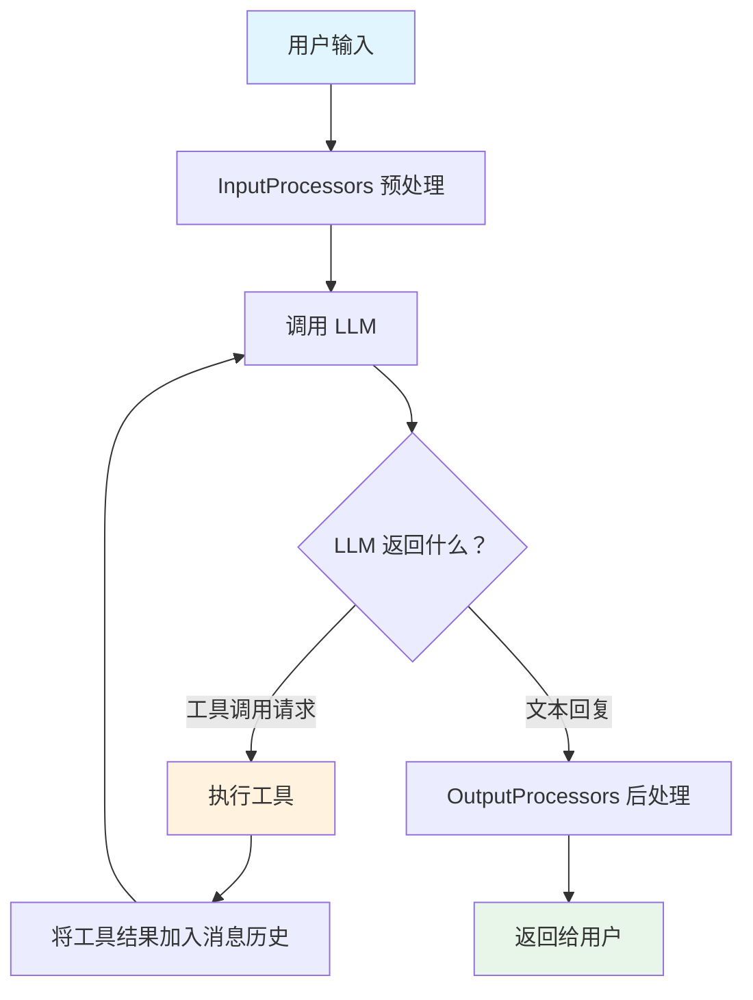
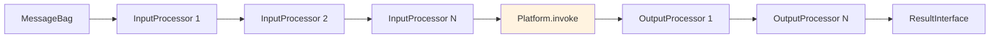
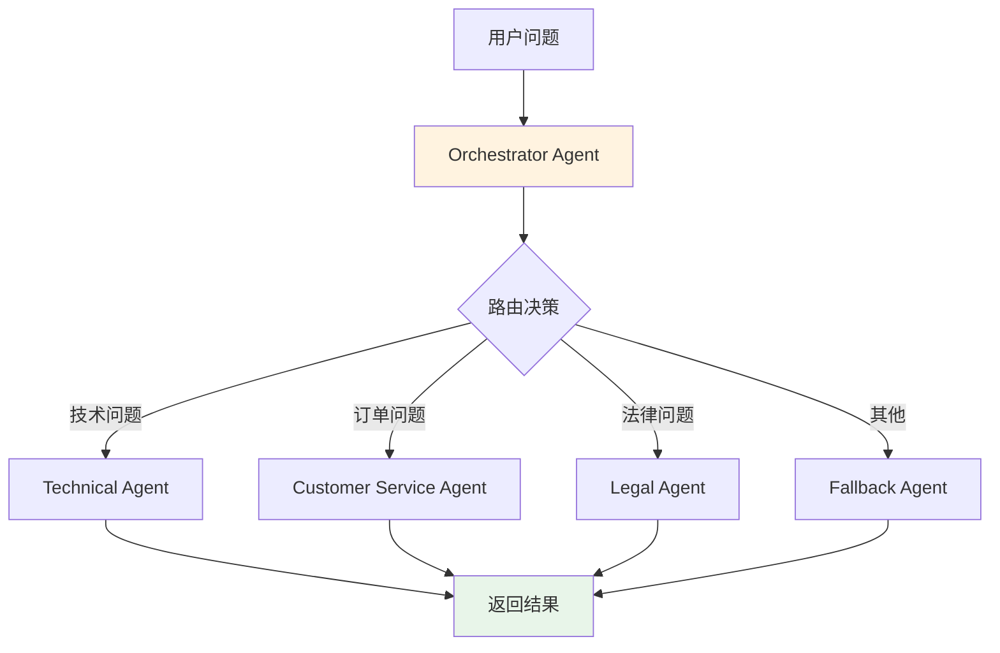
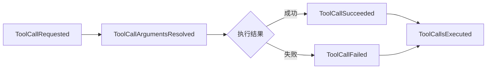

# 第 3 章：Agent 组件 —— 构建智能代理

## 🎯 本章学习目标

掌握 Agent 组件的完整架构：工具调用循环、Toolbox 工具系统、处理器管线、记忆注入、多 Agent 编排、容错机制与事件系统，学会构建能够执行实际任务的 AI 智能代理。

---

## 1. 回顾

在 [第 2 章：Platform 组件深入剖析](02-platform.md) 中，我们掌握了 Platform 的核心能力：

- `PlatformInterface` 提供统一的 `invoke()` 方法与 33+ AI 平台通信
- `MessageBag` 管理对话历史（system / user / assistant / tool 消息）
- `DeferredResult` 延迟求值，通过 `asText()`、`asObject()`、`asStream()` 等方法获取结果
- 结构化输出、流式响应、多模态输入等高级功能

Platform 解决了「如何与 AI 平台通信」的问题。但在实际应用中，我们需要 AI 不仅能对话，还能**执行操作**——查询数据库、搜索网页、调用 API、读写文件。这正是 Agent 组件要解决的问题。

---

## 2. 什么是 Agent？

### 2.1 简单 API 调用 vs Agent

**简单 API 调用**就像问一个封闭在房间里的专家——他只能根据已知知识回答，无法查阅资料或操作任何东西：

```php
// 简单调用：只能基于训练数据回答
$result = $platform->invoke('gpt-4o', new MessageBag(
    Message::ofUser('北京现在天气怎么样？')
))->asText();
// "我无法获取实时天气数据，建议您查看天气网站..."
```

**Agent** 则像一个拥有工具箱的助手——他可以决定何时使用哪个工具，获取实时信息后给出准确回答：

```php
// Agent：可以调用天气工具获取实时数据
$result = $agent->call(new MessageBag(
    Message::ofUser('北京现在天气怎么样？')
));
// "北京当前天气晴朗，气温 28°C，风速 12km/h。"
```

### 2.2 Agent 的工作原理：工具调用循环

Agent 的核心机制是 **工具调用循环（Tool Call Loop）**：

1. 接收用户输入
2. 调用 LLM（大语言模型）
3. 如果 LLM 返回工具调用请求 → 执行工具 → 将结果反馈给 LLM → 回到步骤 2
4. 如果 LLM 返回文本回复 → 结束，返回给用户



> 💡 这个循环由 `AgentProcessor` 自动驱动——它同时作为输入处理器（注入工具列表）和输出处理器（执行工具调用循环），开发者无需手写任何循环逻辑。

### 2.3 一次完整调用的内部流程

以用户问「现在几点了？」为例，Agent 内部执行如下：

```
Agent::call($messages, $options)
    │
    ├─ 1. 创建 Input(model, messageBag, options)
    │
    ├─ 2. 遍历 InputProcessors
    │      ├── SystemPromptInputProcessor → 注入系统提示
    │      ├── MemoryInputProcessor → 注入记忆内容
    │      └── AgentProcessor::processInput → 注入 tools 列表到 options
    │
    ├─ 3. 调用 Platform
    │      platform->invoke(model, messageBag, options)
    │      → LLM 返回 ToolCallResult（请求调用 clock 工具）
    │
    ├─ 4. 创建 Output(model, result, messageBag, options)
    │
    ├─ 5. 遍历 OutputProcessors
    │      └── AgentProcessor::processOutput
    │            ├── 检测到 ToolCallResult
    │            ├── 执行 clock 工具 → "Current date is 2025-01-15..."
    │            ├── 将工具结果追加到 messageBag
    │            ├── 再次调用 Agent → LLM 返回文本回复
    │            └── 循环结束
    │
    └─ 6. 返回最终文本结果
```

---

## 3. 创建你的第一个 Agent

### 3.1 安装

```bash
composer require symfony/ai-agent
```

Agent 组件依赖 Platform 组件（`symfony/ai-platform`），还需要安装至少一个平台桥接器：

```bash
# 以 OpenAI 为例
composer require symfony/ai-open-ai-platform
```

### 3.2 AgentInterface

所有 Agent 实现遵循统一接口：

```php
namespace Symfony\AI\Agent;

use Symfony\AI\Platform\Message\MessageBag;
use Symfony\AI\Platform\Result\ResultInterface;

interface AgentInterface
{
    /**
     * @param array<string, mixed> $options
     */
    public function call(MessageBag $messages, array $options = []): ResultInterface;

    public function getName(): string;
}
```

- `call()` 是唯一的业务入口，接收消息袋和可选参数，返回结果
- `getName()` 返回 Agent 标识名，在多 Agent 场景用于路由和调试

### 3.3 Agent 类

`Agent` 是 `AgentInterface` 的核心实现，通过**处理管线**模式协调输入处理、Platform 调用和输出处理：

```php
namespace Symfony\AI\Agent;

use Symfony\AI\Platform\PlatformInterface;

final class Agent implements AgentInterface
{
    /**
     * @param iterable<InputProcessorInterface>  $inputProcessors
     * @param iterable<OutputProcessorInterface> $outputProcessors
     */
    public function __construct(
        private readonly PlatformInterface $platform,
        private readonly string $model,
        private readonly iterable $inputProcessors = [],
        private readonly iterable $outputProcessors = [],
        private readonly string $name = 'agent',
    ) {}

    public function call(MessageBag $messages, array $options = []): ResultInterface
    {
        // 1. 创建 Input
        // 2. 遍历 InputProcessors
        // 3. 调用 Platform
        // 4. 创建 Output
        // 5. 遍历 OutputProcessors
        // 6. 返回结果
    }
}
```

### 3.4 Input 和 Output 容器

**Input** 是可变的数据容器，承载一次调用的完整输入状态：

```php
final class Input
{
    public function __construct(
        private string $model,
        private MessageBag $messageBag,
        private array $options,
    ) {}

    public function getModel(): string;
    public function setModel(string $model): void;

    public function getMessageBag(): MessageBag;
    public function setMessageBag(MessageBag $messageBag): void;

    public function getOptions(): array;
    public function setOptions(array $options): void;
}
```

InputProcessors 可以通过 setter 方法修改即将发送给 Platform 的所有内容。

**Output** 是半只读容器，仅允许替换 `result`：

```php
final class Output
{
    public function __construct(
        private readonly string $model,
        private ResultInterface $result,
        private readonly MessageBag $messageBag,
        private readonly array $options,
    ) {}

    public function getResult(): ResultInterface;
    public function setResult(ResultInterface $result): void;  // 输出处理器可替换结果
    // model、messageBag、options 为只读
}
```

### 3.5 最简 Agent 示例

一个不带任何工具的纯对话 Agent：

```php
<?php

require 'vendor/autoload.php';

use Symfony\AI\Agent\Agent;
use Symfony\AI\Agent\InputProcessor\SystemPromptInputProcessor;
use Symfony\AI\Platform\Bridge\OpenAi\PlatformFactory;
use Symfony\AI\Platform\Message\Message;
use Symfony\AI\Platform\Message\MessageBag;
use Symfony\Component\HttpClient\HttpClient;

// 1. 创建 Platform
$platform = PlatformFactory::create(
    apiKey: $_ENV['OPENAI_API_KEY'],
    httpClient: HttpClient::create(),
);

// 2. 创建 Agent（带系统提示处理器）
$agent = new Agent(
    platform: $platform,
    model: 'gpt-4o-mini',
    inputProcessors: [
        new SystemPromptInputProcessor('你是一位友善的中文助手，始终用中文回答。'),
    ],
);

// 3. 调用 Agent
$result = $agent->call(new MessageBag(
    Message::ofUser('介绍一下 Symfony 框架的主要特点'),
));

echo $result->getContent();
```

> 📌 此时 Agent 只是 Platform 的简单包装。真正的威力在于接下来要学的 **工具系统**。

---

## 4. 工具系统（Toolbox）

### 4.1 为什么 Agent 需要工具

LLM 的训练数据有截止日期，无法获取实时信息，也无法执行任何操作。**工具**赋予 Agent 与外部世界交互的能力——查询数据库、搜索网页、调用 API、读写文件等。

Agent 组件的工具系统由三个核心部件组成：

| 组件 | 职责 |
|------|------|
| `Toolbox` | 工具容器，持有所有可用工具，负责工具发现和执行 |
| `AgentProcessor` | 桥梁，输入阶段注入工具定义，输出阶段驱动工具调用循环 |
| `#[AsTool]` | PHP 属性，将普通类方法声明为 AI 可调用的工具 |

### 4.2 #[AsTool] 属性：将 PHP 方法变为工具

使用 `#[AsTool]` 属性标记一个 PHP 类，即可让 AI 调用它：

```php
use Symfony\AI\Agent\Toolbox\Attribute\AsTool;

#[\Attribute(\Attribute::TARGET_CLASS | \Attribute::IS_REPEATABLE)]
final class AsTool
{
    public function __construct(
        public readonly string $name,               // 工具名称 —— LLM 通过它来调用
        public readonly string $description,         // 工具描述 —— LLM 依赖它判断何时调用
        public readonly string $method = '__invoke', // 要调用的方法，默认 __invoke
    ) {}
}
```

> ⚠️ `description` 非常关键——LLM 完全依赖它来决定何时使用该工具。描述要清晰具体，说明功能和适用场景。模糊的描述会导致 LLM 错误地调用或遗漏工具。

### 4.3 创建自定义工具

以一个简单的计算器工具为例：

```php
<?php

namespace App\Tool;

use Symfony\AI\Agent\Toolbox\Attribute\AsTool;

#[AsTool('calculator', description: '对两个数字执行基础数学运算（加减乘除）')]
class CalculatorTool
{
    /**
     * @param float  $a        第一个操作数
     * @param float  $b        第二个操作数
     * @param string $operator 运算符：+、-、*、/
     */
    public function __invoke(float $a, float $b, string $operator): string
    {
        $result = match ($operator) {
            '+' => $a + $b,
            '-' => $a - $b,
            '*' => $a * $b,
            '/' => 0.0 === $b
                ? throw new \InvalidArgumentException('除数不能为零')
                : $a / $b,
            default => throw new \InvalidArgumentException("不支持的运算符：{$operator}"),
        };

        return "计算结果：{$a} {$operator} {$b} = {$result}";
    }
}
```

> 💡 `ReflectionToolFactory` 会自动从方法签名和 PHPDoc `@param` 标签生成 JSON Schema。你只需写好类型声明和注释，无需手动编写 Schema。例如上面的 `float $a` 加上 `@param float $a 第一个操作数` 会生成对应的 JSON Schema 参数定义。

### 4.4 一个类提供多个工具

`#[AsTool]` 是可重复属性，同一个类可以暴露多个工具方法：

```php
<?php

namespace App\Tool;

use Symfony\AI\Agent\Toolbox\Attribute\AsTool;

#[AsTool('search_products', description: '根据关键词搜索商品', method: 'search')]
#[AsTool('get_product_detail', description: '根据商品ID获取详细信息', method: 'detail')]
#[AsTool('check_stock', description: '检查商品库存数量', method: 'stock')]
class ProductTool
{
    /**
     * @param string $keyword 搜索关键词
     */
    public function search(string $keyword): string
    {
        return "搜索'{$keyword}'的结果：1) 蓝牙耳机(P001) ¥199  2) 降噪耳机(P002) ¥599";
    }

    /**
     * @param string $productId 商品ID
     */
    public function detail(string $productId): string
    {
        $products = [
            'P001' => '蓝牙耳机 - ¥199 - 蓝牙5.3，续航8小时，IPX4防水',
            'P002' => '降噪耳机 - ¥599 - 主动降噪，续航30小时，Hi-Res认证',
        ];

        return $products[$productId] ?? "未找到商品 {$productId}";
    }

    /**
     * @param string $productId 商品ID
     */
    public function stock(string $productId): string
    {
        $stocks = ['P001' => 156, 'P002' => 23, 'P003' => 0];
        $qty = $stocks[$productId] ?? -1;

        if (-1 === $qty) {
            return "未找到商品 {$productId}";
        }

        return 0 === $qty
            ? "商品 {$productId} 已售罄"
            : "商品 {$productId} 库存：{$qty} 件";
    }
}
```

### 4.5 使用 #[With] 属性添加参数约束

通过 Platform 组件的 `#[With]` 属性，可以为工具参数添加 JSON Schema 约束：

```php
use Symfony\AI\Agent\Toolbox\Attribute\AsTool;
use Symfony\AI\Platform\Contract\JsonSchema\Attribute\With;

#[AsTool('geocode', '将地址转换为经纬度坐标')]
class GeocodingTool
{
    public function __invoke(
        #[With(description: '要查询的地址或地名', example: '天安门广场')]
        string $address,
        #[With(description: '返回的坐标格式', example: 'wgs84')]
        string $format = 'wgs84',
    ): array {
        // 调用地理编码 API...
        return ['latitude' => 39.9087, 'longitude' => 116.3975];
    }
}
```

### 4.6 Toolbox 类：注册和管理工具

`Toolbox` 实现 `ToolboxInterface`，负责管理工具的注册、发现、参数解析和执行：

```php
namespace Symfony\AI\Agent\Toolbox;

final class Toolbox implements ToolboxInterface
{
    public function __construct(
        private readonly iterable $tools,                                          // 工具对象列表
        private readonly ToolFactoryInterface $toolFactory = new ReflectionToolFactory(), // 工具元数据工厂
        private readonly ToolCallArgumentResolverInterface $argumentResolver = new ToolCallArgumentResolver(),
        private readonly LoggerInterface $logger = new NullLogger(),
        private readonly ?EventDispatcherInterface $eventDispatcher = null,
    ) {}

    /** @return Tool[] 获取所有可用工具的元数据（含 JSON Schema） */
    public function getTools(): array;

    /** 执行指定的工具调用 */
    public function execute(ToolCall $toolCall): ToolResult;
}
```

工具执行的完整流程：

```
Toolbox::execute(ToolCall $toolCall)
    │
    ├─ 1. 根据 toolCall.name 查找工具元数据
    ├─ 2. 分发 ToolCallRequested 事件（可被拦截或跳过）
    ├─ 3. 通过 ToolCallArgumentResolver 解析参数
    ├─ 4. 分发 ToolCallArgumentsResolved 事件
    ├─ 5. 若工具实现 HasSourcesInterface → 注入 SourceCollection
    ├─ 6. 调用工具方法 → $tool->{$method}(...$arguments)
    ├─ 7. 成功 → 分发 ToolCallSucceeded → 返回 ToolResult
    └─ 8. 失败 → 分发 ToolCallFailed → 抛出异常
```

### 4.7 ReflectionToolFactory

`ReflectionToolFactory` 是默认的工具工厂，使用 PHP 反射机制从 `#[AsTool]` 标记的类中自动生成工具元数据：

1. 读取 `#[AsTool]` 属性获取工具名称、描述和方法名
2. 反射方法签名获取参数的 PHP 类型
3. 解析 PHPDoc `@param` 标签获取参数描述
4. 识别 `#[With]` 属性提取额外约束
5. 组装为 JSON Schema 格式的参数定义

### 4.8 ToolResult 和 ToolResultConverter

```php
final class ToolResult
{
    public function __construct(
        private readonly ToolCall $toolCall,
        private readonly mixed $result,
        private readonly ?SourceCollection $sources = null,
    ) {}

    public function getToolCall(): ToolCall;
    public function getResult(): mixed;
    public function getSources(): ?SourceCollection;
}
```

`ToolResultConverter` 将各种返回类型（字符串、数组、对象）转换为 LLM 可理解的文本格式，追加到消息历史中。

### 4.9 完整示例：带自定义工具的 Agent

```php
<?php

require 'vendor/autoload.php';

use App\Tool\ProductTool;
use Symfony\AI\Agent\Agent;
use Symfony\AI\Agent\InputProcessor\SystemPromptInputProcessor;
use Symfony\AI\Agent\Toolbox\AgentProcessor;
use Symfony\AI\Agent\Toolbox\Toolbox;
use Symfony\AI\Platform\Bridge\OpenAi\PlatformFactory;
use Symfony\AI\Platform\Message\Message;
use Symfony\AI\Platform\Message\MessageBag;
use Symfony\Component\HttpClient\HttpClient;

$platform = PlatformFactory::create($_ENV['OPENAI_API_KEY'], HttpClient::create());

// 1. 创建工具实例并放入 Toolbox
$toolbox = new Toolbox([new ProductTool()]);

// 2. 创建 AgentProcessor（同时作为输入和输出处理器）
$processor = new AgentProcessor($toolbox);

// 3. 创建 Agent
$agent = new Agent(
    platform: $platform,
    model: 'gpt-4o',
    inputProcessors: [
        new SystemPromptInputProcessor('你是一个电商购物助手，帮用户搜索商品、查库存。'),
        $processor,  // 注入工具列表
    ],
    outputProcessors: [
        $processor,  // 驱动工具调用循环
    ],
);

// 4. 用户提问 —— AI 会自动选择合适的工具
$result = $agent->call(new MessageBag(
    Message::ofUser('我想买蓝牙耳机，有什么推荐？P002 还有货吗？'),
));

echo $result->getContent();
// AI 会自动调用 search_products("蓝牙耳机")，再调用 check_stock("P002")
// 最终综合信息给出推荐和库存状态
```

> 📌 注意 `$processor` 同时出现在 `inputProcessors` 和 `outputProcessors` 中——输入阶段注入工具定义，输出阶段执行工具调用。这是 Agent 工具系统的关键设计。

---

## 5. 内置工具桥接器

Agent 组件提供 **13 个内置桥接器**，每个桥接器是独立的 Composer 包，按需安装即可。

### 5.1 桥接器总览

| 桥接器 | Composer 包 | 工具名称 | 功能 | 需要 API Key |
|--------|------------|---------|------|:---:|
| **Brave** | `symfony/ai-brave-tool` | `brave_search` | Brave 隐私搜索引擎 | ✅ |
| **Clock** | `symfony/ai-clock-tool` | `clock` | 获取当前日期和时间 | ❌ |
| **Filesystem** | `symfony/ai-filesystem-tool` | `filesystem_read`, `filesystem_write` 等 10 个 | 文件系统操作（沙箱化） | ❌ |
| **Firecrawl** | `symfony/ai-firecrawl-tool` | `firecrawl_scrape`, `firecrawl_crawl`, `firecrawl_map` | 专业网页爬虫（支持 JS 渲染） | ✅ |
| **Mapbox** | `symfony/ai-mapbox-tool` | `geocode`, `reverse_geocode` | 地理编码 / 逆地理编码 | ✅ |
| **Ollama** | `symfony/ai-ollama-tool` | `web_search`, `fetch_webpage` | 通过 Ollama 进行网页搜索 | ❌ |
| **OpenMeteo** | `symfony/ai-open-meteo-tool` | `weather_current`, `weather_forecast` | 天气查询（免费开放 API） | ❌ |
| **Scraper** | `symfony/ai-scraper-tool` | `scraper` | 简单网页文本提取 | ❌ |
| **SerpApi** | `symfony/ai-serp-api-tool` | `serpapi` | Google 等搜索引擎 API | ✅ |
| **SimilaritySearch** | `symfony/ai-similarity-search-tool` | `similarity_search` | 向量相似度文档检索 | ❌* |
| **Tavily** | `symfony/ai-tavily-tool` | `tavily_search`, `tavily_extract` | AI 优化搜索 + 内容提取 | ✅ |
| **Wikipedia** | `symfony/ai-wikipedia-tool` | `wikipedia_search`, `wikipedia_article` | 维基百科搜索与文章获取 | ❌ |
| **Youtube** | `symfony/ai-youtube-tool` | `youtube_transcript` | YouTube 视频字幕获取 | ❌ |

> 💡 标 ❌* 的 SimilaritySearch 不需要自身的 API Key，但需要 Platform（用于生成嵌入向量）和向量数据库（来自 Store 组件）。

### 5.2 使用示例：Tavily 搜索

```bash
composer require symfony/ai-tavily-tool
```

```php
use Symfony\AI\Agent\Agent;
use Symfony\AI\Agent\Bridge\Tavily\Tavily;
use Symfony\AI\Agent\Toolbox\AgentProcessor;
use Symfony\AI\Agent\Toolbox\Toolbox;

$tavily = new Tavily(
    httpClient: $httpClient,
    apiKey: $_ENV['TAVILY_API_KEY'],
    options: ['include_images' => false],
);

$toolbox = new Toolbox([$tavily]);
$processor = new AgentProcessor($toolbox);

$agent = new Agent($platform, 'gpt-4o', [$processor], [$processor]);

$result = $agent->call(new MessageBag(
    Message::ofUser('PHP 8.4 有哪些新特性？'),
));

echo $result->getContent();
// AI 调用 tavily_search 搜索最新信息，基于搜索结果回答
```

### 5.3 使用示例：SimilaritySearch 向量检索

```bash
composer require symfony/ai-similarity-search-tool
```

```php
use Symfony\AI\Agent\Bridge\SimilaritySearch\SimilaritySearch;

$similaritySearch = new SimilaritySearch(
    vectorizer: $vectorizer,   // VectorizerInterface（来自 Store 组件）
    store: $vectorStore,       // StoreInterface（如 Pinecone、Qdrant 等）
);

$toolbox = new Toolbox([$similaritySearch]);
$processor = new AgentProcessor($toolbox);

$agent = new Agent($platform, 'gpt-4o', [$processor], [$processor]);

// Agent 会先在知识库中搜索相关文档，再基于文档内容回答
$result = $agent->call(new MessageBag(
    Message::ofUser('如何配置 Symfony 的消息队列？'),
));
```

### 5.4 组合多个工具

一个 Agent 可以同时拥有多个工具，LLM 会自动选择合适的：

```php
use Symfony\AI\Agent\Bridge\Clock\Clock;
use Symfony\AI\Agent\Bridge\Wikipedia\Wikipedia;
use Symfony\AI\Agent\Bridge\OpenMeteo\OpenMeteo;

$toolbox = new Toolbox([
    new Clock(new \Symfony\Component\Clock\Clock()),
    new Wikipedia($httpClient),
    new OpenMeteo($httpClient),
]);

$processor = new AgentProcessor($toolbox);
$agent = new Agent($platform, 'gpt-4o', [$processor], [$processor]);

// 问时间 → 自动调用 clock
$agent->call(new MessageBag(Message::ofUser('现在几点了？')));

// 问知识 → 自动调用 wikipedia
$agent->call(new MessageBag(Message::ofUser('Symfony 框架是什么？')));

// 问天气 → 自动调用 weather_current
$agent->call(new MessageBag(Message::ofUser('纬度39.9经度116.4的天气如何？')));

// 普通闲聊 → 不调用任何工具，直接回复
$agent->call(new MessageBag(Message::ofUser('你好！')));
```

### 5.5 运行时限制可用工具

通过 `options['tools']` 可以在调用时动态限制本次使用的工具子集：

```php
// Toolbox 中有 clock、wikipedia_search、wikipedia_article、weather_current 等工具
// 但此次调用只允许使用 clock
$result = $agent->call($messages, ['tools' => ['clock']]);

// 另一次调用只允许 wikipedia 相关工具
$result = $agent->call($messages, ['tools' => ['wikipedia_search', 'wikipedia_article']]);
```

---

## 6. Agent 处理器（Processors）

### 6.1 处理器接口

Agent 的处理管线由两种处理器组成：

```php
namespace Symfony\AI\Agent;

interface InputProcessorInterface
{
    public function processInput(Input $input): void;
}

interface OutputProcessorInterface
{
    public function processOutput(Output $output): void;
}
```

- **InputProcessor** 在调用 LLM 之前运行，可以修改 Input 的所有字段
- **OutputProcessor** 在 LLM 返回结果之后运行，可以替换 Output 的结果



### 6.2 内置：SystemPromptInputProcessor

自动注入系统提示，无需每次在 MessageBag 中手动添加：

```php
use Symfony\AI\Agent\InputProcessor\SystemPromptInputProcessor;

// 字符串字面量
$processor = new SystemPromptInputProcessor(
    '你是一位专业的代码审查者，始终用中文回答。'
);

// Stringable 对象（支持动态生成）
$processor = new SystemPromptInputProcessor(new MyDynamicPrompt($context));

// 附带工具描述（自动将工具名称和描述追加到系统提示中）
$processor = new SystemPromptInputProcessor(
    'You are a helpful assistant with access to various tools.',
    toolbox: $toolbox,
);
```

> 📌 如果 `MessageBag` 中已存在系统消息，`SystemPromptInputProcessor` 会跳过注入，避免覆盖。

### 6.3 内置：ModelOverrideInputProcessor

根据运行时条件动态覆盖模型——同一个 Agent 实例可以根据场景使用不同模型：

```php
use Symfony\AI\Agent\InputProcessor\ModelOverrideInputProcessor;

$agent = new Agent(
    platform: $platform,
    model: 'gpt-4o-mini',  // 默认使用轻量模型
    inputProcessors: [new ModelOverrideInputProcessor()],
);

// 普通问题用默认模型
$result = $agent->call($messages);

// 复杂任务临时升级到高级模型
$result = $agent->call($messages, ['model' => 'gpt-4o']);
```

### 6.4 核心：AgentProcessor —— 工具调用执行者

`AgentProcessor` 是连接 `Toolbox` 与 `Agent` 的核心桥梁，同时实现了输入和输出处理器接口：

```php
namespace Symfony\AI\Agent\Toolbox;

final class AgentProcessor implements InputProcessorInterface, OutputProcessorInterface
{
    public function __construct(
        private readonly ToolboxInterface $toolbox,
        private readonly ToolResultConverter $resultConverter = new ToolResultConverter(),
        private readonly ?EventDispatcherInterface $eventDispatcher = null,
        private readonly bool $excludeToolMessages = false,
        private readonly bool $includeSources = false,
        private readonly ?int $maxToolCalls = null,
    ) {}
}
```

| 参数 | 说明 |
|------|------|
| `$toolbox` | 工具容器 |
| `$resultConverter` | 将 ToolResult 转换为字符串传回 LLM |
| `$eventDispatcher` | 事件调度器，监听工具生命周期 |
| `$excludeToolMessages` | 为 true 时，工具消息不追加到后续请求（减少 Token 消耗） |
| `$includeSources` | 启用后收集工具的来源引用 |
| `$maxToolCalls` | 最大工具调用轮数（防止无限循环） |

**工具调用循环的简化逻辑**：

```php
// AgentProcessor 内部（简化版）
private function handleToolCalls(Output $output, ToolCallResult $result): void
{
    $iterationCount = 0;

    do {
        if (null !== $this->maxToolCalls && $iterationCount >= $this->maxToolCalls) {
            throw new MaxIterationsExceededException($this->maxToolCalls);
        }

        $toolCalls = $result->getContent(); // ToolCall[]
        $messages = $output->getMessageBag();

        // 1. 将 AI 的工具调用请求添加到消息历史
        $messages->add(Message::ofAssistant(toolCalls: $toolCalls));

        // 2. 执行每个工具调用
        foreach ($toolCalls as $toolCall) {
            $toolResult = $this->toolbox->execute($toolCall);
            $messages->add(Message::ofToolCall(
                $toolCall,
                $this->resultConverter->convert($toolResult),
            ));
        }

        // 3. 再次调用 Agent（消息历史已包含工具结果）
        $result = $this->agent->call($messages, $output->getOptions());
        $iterationCount++;

    } while ($result instanceof ToolCallResult);

    $output->setResult($result);
}
```

> ⚠️ `maxToolCalls` 建议设定：简单问答设 3~5，复杂研究任务设 10~20，`null`（默认不限制）慎用。

### 6.5 处理器执行顺序

多个处理器按注册顺序依次执行：

```php
$agent = new Agent(
    platform: $platform,
    model: 'gpt-4o',
    inputProcessors: [
        new SystemPromptInputProcessor('...'),   // 第 1 步：注入系统提示
        new ModelOverrideInputProcessor(),        // 第 2 步：覆盖模型（如有）
        $memoryProcessor,                         // 第 3 步：注入记忆
        $agentProcessor,                          // 第 4 步：注入工具列表
    ],
    outputProcessors: [
        $agentProcessor,                          // 处理工具调用循环
    ],
);
```

### 6.6 创建自定义处理器

实现 `InputProcessorInterface` 或 `OutputProcessorInterface` 即可创建自定义处理器：

```php
<?php

namespace App\Processor;

use Symfony\AI\Agent\Input;
use Symfony\AI\Agent\InputProcessorInterface;
use Symfony\Bundle\SecurityBundle\Security;

class UserContextProcessor implements InputProcessorInterface
{
    public function __construct(
        private readonly Security $security,
    ) {}

    public function processInput(Input $input): void
    {
        $user = $this->security->getUser();
        if (null === $user) {
            return;
        }

        // 将用户上下文注入到 options 中
        $options = $input->getOptions();
        $options['user_context'] = [
            'id' => $user->getId(),
            'locale' => $user->getLocale(),
        ];
        $input->setOptions($options);
    }
}
```

在 Symfony 应用中，使用 `#[AsInputProcessor]` 属性可以自动将服务注册为处理器：

```php
use Symfony\AI\Agent\Attribute\AsInputProcessor;

#[AsInputProcessor(agent: 'my_agent', priority: 10)]
class UserContextProcessor implements InputProcessorInterface
{
    // ...
}
```

---

## 7. 记忆系统（Memory）

### 7.1 为什么 Agent 需要记忆

默认情况下，每次 `$agent->call()` 都是独立的——Agent 不会记住之前的对话。记忆系统允许向 Agent 注入背景知识，让 AI 在回答时能利用这些信息。

```php
// 无记忆：每次对话独立
$agent->call(new MessageBag(Message::ofUser('我叫张三')));
$agent->call(new MessageBag(Message::ofUser('我叫什么名字？')));
// "我不知道您的名字，您还没有告诉我。"

// 有记忆：Agent 拥有背景知识
// "您叫张三！"
```

### 7.2 MemoryProviderInterface

所有记忆提供者遵循统一接口：

```php
namespace Symfony\AI\Agent\Memory;

interface MemoryProviderInterface
{
    /** @return Memory[] */
    public function getMemories(Input $input): array;
}
```

`Memory` 是一个简单的值对象：

```php
final class Memory
{
    public function __construct(
        private readonly string $content,
    ) {}

    public function getContent(): string;
}
```

### 7.3 StaticMemoryProvider —— 固定知识注入

预定义的静态记忆，适合存储固定的背景知识，如公司信息、业务规则等：

```php
use Symfony\AI\Agent\Memory\StaticMemoryProvider;

$staticMemory = new StaticMemoryProvider(
    '公司名称：Acme Corp',
    '客服热线：400-123-4567',
    '退换货政策：7天无理由退换',
    '工作时间：周一至周五 9:00-18:00',
);
```

注入后的系统提示会包含如下内容：

```
## Static Memory

- 公司名称：Acme Corp
- 客服热线：400-123-4567
- 退换货政策：7天无理由退换
- 工作时间：周一至周五 9:00-18:00
```

### 7.4 EmbeddingProvider —— 动态语义检索

基于向量相似度搜索的动态记忆提供者，只注入与当前问题**最相关**的记忆：

```php
use Symfony\AI\Agent\Memory\EmbeddingProvider;
use Symfony\AI\Platform\Model;

$embeddingMemory = new EmbeddingProvider(
    platform: $platform,                         // 用于生成嵌入向量
    model: new Model('text-embedding-3-small'),  // 嵌入模型
    vectorStore: $pineconeStore,                  // 向量存储（来自 Store 组件）
);
```

**工作原理**：

1. 取当前 MessageBag 最后一条用户消息的文本
2. 调用嵌入模型生成查询向量
3. 在向量数据库中检索最相似的文档
4. 将相关文档作为动态记忆注入系统提示

> 💡 `EmbeddingProvider` 是实现 **RAG（检索增强生成）** 的关键组件之一。详细的向量存储配置将在 [第 4 章：Store 组件](04-store.md) 中介绍。

### 7.5 MemoryInputProcessor —— 将记忆注入提示

`MemoryInputProcessor` 是将记忆系统接入 Agent 管线的处理器：

```php
use Symfony\AI\Agent\Memory\MemoryInputProcessor;

$memoryProcessor = new MemoryInputProcessor(
    providers: [
        $staticMemory,      // 固定知识
        $embeddingMemory,   // 动态检索
    ],
);
```

### 7.6 完整示例：带记忆的客服 Agent

```php
<?php

require 'vendor/autoload.php';

use Symfony\AI\Agent\Agent;
use Symfony\AI\Agent\InputProcessor\SystemPromptInputProcessor;
use Symfony\AI\Agent\Memory\MemoryInputProcessor;
use Symfony\AI\Agent\Memory\StaticMemoryProvider;
use Symfony\AI\Agent\Toolbox\AgentProcessor;
use Symfony\AI\Agent\Toolbox\Toolbox;
use Symfony\AI\Agent\Bridge\Clock\Clock;
use Symfony\AI\Platform\Bridge\OpenAi\PlatformFactory;
use Symfony\AI\Platform\Message\Message;
use Symfony\AI\Platform\Message\MessageBag;
use Symfony\Component\HttpClient\HttpClient;

$platform = PlatformFactory::create($_ENV['OPENAI_API_KEY'], HttpClient::create());

// 1. 静态记忆：公司知识库
$companyKnowledge = new StaticMemoryProvider(
    '公司名称：Acme Corp',
    '退换货政策：商品签收后7天内可无理由退换，需保持原包装',
    '会员等级：普通会员/银卡/金卡/钻石，各级享受不同折扣',
    '客服工作时间：周一至周五 9:00-18:00，周末 10:00-16:00',
);

// 2. 记忆处理器
$memoryProcessor = new MemoryInputProcessor([$companyKnowledge]);

// 3. 工具（查询当前时间，判断是否在工作时间内）
$toolbox = new Toolbox([new Clock(new \Symfony\Component\Clock\Clock())]);
$agentProcessor = new AgentProcessor($toolbox);

// 4. 组装 Agent
$agent = new Agent(
    platform: $platform,
    model: 'gpt-4o',
    inputProcessors: [
        new SystemPromptInputProcessor(
            '你是 Acme Corp 的智能客服助手。'
            . '根据记忆中的公司知识回答用户问题。'
            . '如果知识库中没有答案，礼貌地建议转接人工客服。'
        ),
        $memoryProcessor,      // 注入记忆
        $agentProcessor,       // 注入工具
    ],
    outputProcessors: [$agentProcessor],
);

// 5. 用户咨询退换货
$result = $agent->call(new MessageBag(
    Message::ofUser('我买的商品有质量问题，可以退货吗？现在能联系客服吗？'),
));

echo $result->getContent();
// Agent 会结合记忆中的退换货政策和 Clock 工具判断的当前时间来回答
```

> 📌 通过 `options['use_memory'] => false` 可以临时禁用记忆注入：
> ```php
> $result = $agent->call($messages, ['use_memory' => false]);
> ```

---

## 8. 多 Agent 编排（MultiAgent）

### 8.1 何时需要多 Agent

当业务场景涉及多个专业领域时，单一 Agent 难以兼顾所有能力。`MultiAgent` 将用户请求智能路由到最合适的专门 Agent：



### 8.2 MultiAgent 类

```php
namespace Symfony\AI\Agent\MultiAgent;

final class MultiAgent implements AgentInterface
{
    public function __construct(
        private AgentInterface $orchestrator,   // 负责决策路由的 Agent
        private array $handoffs,                // Handoff[] 路由规则
        private AgentInterface $fallback,       // 兜底 Agent
        private string $name = 'multi-agent',
        private LoggerInterface $logger = new NullLogger(),
    ) {}
}
```

### 8.3 Handoff 路由规则

每个 `Handoff` 定义了一个专门 Agent 及其触发条件：

```php
namespace Symfony\AI\Agent\MultiAgent;

final class Handoff
{
    public function __construct(
        private readonly AgentInterface $to,   // 目标 Agent
        private readonly array $when,          // 触发关键词 / 场景描述
    ) {}

    public function getAgent(): AgentInterface;
    public function getWhen(): array;
}
```

### 8.4 路由决策流程

```
MultiAgent::call($messages)
    │
    ├── 1. 提取用户消息文本
    ├── 2. 构建路由提示（列出所有 Handoff 及其 when 条件）
    ├── 3. 调用 orchestrator，使用结构化输出 Decision::class
    │      Decision { agentName: "technical", reasoning: "用户询问代码问题" }
    ├── 4a. 找到匹配 Agent → 转发原始消息给该 Agent
    ├── 4b. 无匹配 → 使用 fallback Agent
    └── 5. 返回结果
```

`Decision` 是编排器返回的结构化决策对象：

```php
final class Decision
{
    public string $agentName;   // 选中的 Agent 名称
    public string $reasoning;   // 路由理由

    public function hasAgent(): bool;
}
```

### 8.5 完整示例：客服系统

```php
<?php

require 'vendor/autoload.php';

use Symfony\AI\Agent\Agent;
use Symfony\AI\Agent\InputProcessor\SystemPromptInputProcessor;
use Symfony\AI\Agent\MultiAgent\Handoff;
use Symfony\AI\Agent\MultiAgent\MultiAgent;
use Symfony\AI\Agent\Toolbox\AgentProcessor;
use Symfony\AI\Agent\Toolbox\Toolbox;
use Symfony\AI\Agent\Bridge\Wikipedia\Wikipedia;
use Symfony\AI\Platform\Bridge\OpenAi\PlatformFactory;
use Symfony\AI\Platform\Message\Message;
use Symfony\AI\Platform\Message\MessageBag;
use Symfony\Component\HttpClient\HttpClient;

$httpClient = HttpClient::create();
$platform = PlatformFactory::create($_ENV['OPENAI_API_KEY'], $httpClient);

// === 创建专门 Agent ===

// 技术专家（拥有搜索工具）
$techToolbox = new Toolbox([new Wikipedia($httpClient)]);
$techProcessor = new AgentProcessor($techToolbox);

$technicalAgent = new Agent(
    platform: $platform,
    model: 'gpt-4o',
    name: 'technical',
    inputProcessors: [
        new SystemPromptInputProcessor('你是 PHP 技术专家，专门解答编程和技术问题。'),
        $techProcessor,
    ],
    outputProcessors: [$techProcessor],
);

// 客服代表
$customerServiceAgent = new Agent(
    platform: $platform,
    model: 'gpt-4o-mini',
    name: 'customer-service',
    inputProcessors: [
        new SystemPromptInputProcessor('你是友善的客服代表，专门处理订单和售后问题。'),
    ],
);

// 兜底通用助手
$generalAgent = new Agent(
    platform: $platform,
    model: 'gpt-4o-mini',
    name: 'general',
    inputProcessors: [
        new SystemPromptInputProcessor('你是一位通用助手，用中文简洁回答。'),
    ],
);

// === 创建 MultiAgent ===
$orchestrator = new Agent($platform, 'gpt-4o', name: 'orchestrator');

$multiAgent = new MultiAgent(
    orchestrator: $orchestrator,
    handoffs: [
        new Handoff(
            to: $technicalAgent,
            when: ['代码', 'bug', '报错', '技术问题', '编程', '架构设计', 'PHP', 'Symfony'],
        ),
        new Handoff(
            to: $customerServiceAgent,
            when: ['订单', '退款', '售后', '发货', '投诉', '物流'],
        ),
    ],
    fallback: $generalAgent,
);

// === 使用 ===

// 技术问题 → 路由到 technicalAgent
$result = $multiAgent->call(new MessageBag(
    Message::ofUser('PHP 代码出现内存泄漏，怎么排查？'),
));
echo "技术问题：" . $result->getContent() . "\n\n";

// 售后问题 → 路由到 customerServiceAgent
$result = $multiAgent->call(new MessageBag(
    Message::ofUser('我的订单还没发货，什么时候能到？'),
));
echo "售后问题：" . $result->getContent() . "\n\n";

// 普通问题 → 路由到 generalAgent
$result = $multiAgent->call(new MessageBag(
    Message::ofUser('今天天气怎么样？'),
));
echo "普通问题：" . $result->getContent() . "\n";
```

### 8.6 Subagent 工具：将 Agent 封装为工具

除了 MultiAgent 的路由模式，还可以通过 `Subagent` 将一个 Agent 封装为工具，让另一个 Agent 按需调用：

```php
use Symfony\AI\Agent\Toolbox\Tool\Subagent;

$codeReviewAgent = new Agent(
    platform: $platform,
    model: 'gpt-4o',
    inputProcessors: [
        new SystemPromptInputProcessor('你是代码审查专家，专注安全和性能问题。'),
    ],
    name: 'code-reviewer',
);

// 将 Agent 封装为工具
$subagentTool = new Subagent(
    agent: $codeReviewAgent,
    name: 'code_review',
    description: '审查 PHP 代码的安全漏洞和性能问题。输入代码字符串，返回审查报告。',
);

// 主 Agent 可以像调用普通工具一样调用子 Agent
$mainToolbox = new Toolbox([$subagentTool, $fileSystemTool]);
```

> 💡 `Subagent` 和 `MultiAgent` 的区别：`MultiAgent` 是路由模式——将请求整体转发给专门 Agent；`Subagent` 是委托模式——主 Agent 在推理过程中按需调用子 Agent 执行特定子任务。

---

## 9. 容错与事件

### 9.1 FaultTolerantToolbox

在生产环境中，工具可能失败（API 超时、服务不可用等）。`FaultTolerantToolbox` 是 `Toolbox` 的装饰器，将异常转化为友好的错误信息返回给 LLM，而非让程序崩溃：

```php
use Symfony\AI\Agent\Toolbox\FaultTolerantToolbox;

// 标准模式：工具失败抛出异常，中断整个 Agent 执行
$toolbox = new Toolbox([$brave, $weather]);

// 容错模式：工具失败返回错误描述给 LLM，Agent 继续执行
$faultTolerant = new FaultTolerantToolbox($toolbox);
$processor = new AgentProcessor($faultTolerant);
```

容错处理逻辑（简化版）：

```php
final class FaultTolerantToolbox implements ToolboxInterface
{
    public function execute(ToolCall $toolCall): ToolResult
    {
        try {
            return $this->innerToolbox->execute($toolCall);
        } catch (ToolExecutionExceptionInterface $e) {
            // 工具执行失败：返回错误信息给 LLM
            return new ToolResult($toolCall, $e->getToolCallResult());
        } catch (ToolNotFoundException) {
            // 工具不存在：告知 LLM 可用的工具列表
            $names = array_map(fn (Tool $t) => $t->getName(), $this->getTools());
            return new ToolResult(
                $toolCall,
                sprintf('Tool "%s" was not found. Available: %s',
                    $toolCall->getName(), implode(', ', $names)),
            );
        }
    }
}
```

> ⚠️ **生产环境强烈建议**使用 `FaultTolerantToolbox`，尤其是工具依赖外部 API 时。LLM 收到错误信息后，通常会生成友好的提示（如「暂时无法查询天气」），而非让整个应用崩溃。

### 9.2 事件系统

`Toolbox` 在工具调用的各阶段发布事件，可用于监控、审计和干预：



| 事件 | 触发时机 | 关键能力 |
|------|---------|---------|
| `ToolCallRequested` | 工具执行前 | `deny()` 拒绝执行、`setResult()` 跳过执行直接返回 |
| `ToolCallArgumentsResolved` | 参数解析后 | 查看/验证参数 |
| `ToolCallSucceeded` | 工具成功后 | 记录结果、性能监控 |
| `ToolCallFailed` | 工具失败后 | 错误报警、异常追踪 |
| `ToolCallsExecuted` | 一批调用完成后 | `setResult()` 可跳过后续 LLM 调用 |

### 9.3 事件使用示例

```php
<?php

use Symfony\AI\Agent\Toolbox\Event\ToolCallRequested;
use Symfony\AI\Agent\Toolbox\Event\ToolCallSucceeded;
use Symfony\AI\Agent\Toolbox\Event\ToolCallFailed;
use Symfony\AI\Agent\Toolbox\Event\ToolCallsExecuted;
use Symfony\Component\EventDispatcher\EventDispatcher;

$dispatcher = new EventDispatcher();

// 审计日志 + 安全拦截
$dispatcher->addListener(ToolCallRequested::class, function (ToolCallRequested $event) {
    $toolCall = $event->getToolCall();

    echo "[日志] 工具请求：{$toolCall->getName()}\n";

    // 安全拦截：拒绝危险操作
    if ('filesystem_delete' === $toolCall->getName()) {
        $event->deny('不允许通过 AI 助手删除文件');
    }
});

// 成功记录
$dispatcher->addListener(ToolCallSucceeded::class, function (ToolCallSucceeded $event) {
    echo "[日志] 工具成功：{$event->getMetadata()->name}\n";
});

// 失败告警
$dispatcher->addListener(ToolCallFailed::class, function (ToolCallFailed $event) {
    echo "[告警] 工具失败：{$event->getMetadata()->name}，"
       . "原因：{$event->getException()->getMessage()}\n";
});

// 批次完成统计
$dispatcher->addListener(ToolCallsExecuted::class, function (ToolCallsExecuted $event) {
    $results = $event->getToolResults();
    echo "[日志] 本轮执行了 " . count($results) . " 个工具\n";

    // 可通过 setResult() 跳过后续 LLM 调用，直接返回自定义结果
    // $event->setResult($customResult);
});

// 将 dispatcher 传给 Toolbox 和 AgentProcessor
$toolbox = new Toolbox($tools, eventDispatcher: $dispatcher);
$processor = new AgentProcessor($toolbox, eventDispatcher: $dispatcher);
```

> 📌 `ToolCallRequested` 事件的 `deny()` 方法是工具安全的第一道防线。对于敏感操作（删除数据、发送邮件等），务必通过事件监听器在执行前进行权限校验。

---

## 10. 数据来源追踪

### 10.1 为什么需要来源追踪

当 Agent 使用搜索工具回答问题时，用户可能需要知道信息来自哪里。来源追踪系统让工具记录数据来源，最终在结果中提供引用。

### 10.2 HasSourcesInterface

工具类实现此接口后可追踪数据来源：

```php
namespace Symfony\AI\Agent\Toolbox\Source;

interface HasSourcesInterface
{
    public function getSources(): SourceCollection;
}

// 配套的 Trait 简化实现
trait HasSourcesTrait
{
    private SourceCollection $sources;

    protected function addSource(Source $source): void;
    protected function getSources(): SourceCollection;
}
```

### 10.3 Source 对象

```php
final class Source
{
    public function __construct(
        private readonly string $name,       // 来源名称
        private readonly string $reference,  // 来源 URL 或标识符
        private readonly string $content,    // 摘要内容
    ) {}
}
```

### 10.4 实现带来源追踪的自定义工具

```php
<?php

namespace App\Tool;

use Symfony\AI\Agent\Toolbox\Attribute\AsTool;
use Symfony\AI\Agent\Toolbox\Source\HasSourcesInterface;
use Symfony\AI\Agent\Toolbox\Source\HasSourcesTrait;
use Symfony\AI\Agent\Toolbox\Source\Source;

#[AsTool('search_knowledge', description: '搜索内部知识库')]
class KnowledgeBaseTool implements HasSourcesInterface
{
    use HasSourcesTrait;

    /**
     * @param DocumentRepository $repository 你的文档仓库实现
     */
    public function __construct(
        private readonly DocumentRepository $repository, // 需自行实现此接口
    ) {}

    /**
     * @param string $query 搜索关键词
     */
    public function __invoke(string $query): string
    {
        $results = $this->repository->search($query);

        foreach ($results as $doc) {
            // 记录每条结果的来源
            $this->addSource(new Source(
                name: $doc->getTitle(),
                reference: $doc->getUrl(),
                content: $doc->getSummary(),
            ));
        }

        return implode("\n\n", array_map(
            fn ($doc) => $doc->getContent(),
            $results,
        ));
    }
}
```

### 10.5 启用来源收集

在 `AgentProcessor` 中开启 `includeSources`：

```php
$processor = new AgentProcessor(
    toolbox: $toolbox,
    includeSources: true,  // 启用来源收集
);

$agent = new Agent($platform, 'gpt-4o', [$processor], [$processor]);

$result = $agent->call($messages);

// 获取来源引用
$sources = $result->getMetadata()->get('sources'); // SourceCollection

foreach ($sources as $source) {
    echo "来源：{$source->getName()} ({$source->getReference()})\n";
}
```

> 💡 内置桥接器中 Brave、Scraper、SerpApi、Tavily、Wikipedia、Clock 均实现了 `HasSourcesInterface`，开启 `includeSources` 后会自动收集来源。

---

## 11. 测试 Agent

### 11.1 MockAgent

`MockAgent` 用于在测试中替代真实 Agent，无需实际调用 AI API：

```php
use Symfony\AI\Agent\MockAgent;
use Symfony\AI\Agent\MockResponse;

// 基于输入文本返回固定响应
$mock = new MockAgent([
    '你好' => '你好！有什么可以帮你的？',
    '天气怎么样' => '今天天气晴朗，温度适宜。',
]);

// 返回带元数据的响应
$mock = new MockAgent([
    '测试' => MockResponse::create('测试响应'),
]);
```

### 11.2 断言方法

```php
$mock->assertCalled();              // 至少被调用一次
$mock->assertNotCalled();           // 从未被调用
$mock->assertCallCount(3);          // 被调用了 3 次
$mock->assertCalledWith('你好');    // 以特定输入被调用过

$lastCall = $mock->getLastCall();   // 获取最后一次调用信息
```

### 11.3 在 PHPUnit 中使用

```php
<?php

namespace App\Tests;

use PHPUnit\Framework\TestCase;
use Symfony\AI\Agent\MockAgent;
use Symfony\AI\Platform\Message\Message;
use Symfony\AI\Platform\Message\MessageBag;

class ChatServiceTest extends TestCase
{
    public function testChatWithUser()
    {
        // 1. 创建 MockAgent
        $mockAgent = new MockAgent([
            '请介绍 Symfony' => 'Symfony 是一个高性能的 PHP 框架...',
        ]);

        // 2. 注入到被测服务
        $service = new ChatService($mockAgent);

        // 3. 执行
        $response = $service->chat('请介绍 Symfony');

        // 4. 断言
        $this->assertSame('Symfony 是一个高性能的 PHP 框架...', $response);
        $mockAgent->assertCalledWith('请介绍 Symfony');
        $mockAgent->assertCallCount(1);
    }

    public function testMultiAgentRouting()
    {
        $techMock = new MockAgent([
            'PHP 内存泄漏' => '检查循环引用和未释放的资源...',
        ]);

        $csMock = new MockAgent([
            '订单查询' => '请提供订单号...',
        ]);

        // MockAgent 可以直接用于 MultiAgent 的 Handoff
        $multiAgent = new MultiAgent(
            orchestrator: new MockAgent(['*' => 'technical']),
            handoffs: [new Handoff(to: $techMock, when: ['技术'])],
            fallback: $csMock,
        );

        $result = $multiAgent->call(new MessageBag(
            Message::ofUser('PHP 内存泄漏'),
        ));

        $techMock->assertCalled();
        $csMock->assertNotCalled();
    }
}
```

### 11.4 测试策略建议

| 测试层级 | 方法 | 说明 |
|---------|------|------|
| 工具单元测试 | 直接调用工具方法 | 验证工具逻辑，不涉及 Agent |
| Agent 单元测试 | MockAgent | 验证业务层与 Agent 的集成 |
| 处理器测试 | 构造 Input/Output 对象 | 验证自定义处理器的逻辑 |
| 集成测试 | MockHttpClient | 模拟 HTTP 响应，验证完整流程 |

---

## 12. 下一步

本章我们掌握了 Agent 组件的完整体系：

| 概念 | 说明 |
|------|------|
| **Agent** | 协调 Platform、处理器管线的核心类 |
| **Toolbox** | 工具容器，管理工具注册和执行 |
| **#[AsTool]** | PHP 属性，将普通方法声明为 AI 工具 |
| **AgentProcessor** | 工具调用循环的驱动者 |
| **Processors** | 输入 / 输出处理管线 |
| **Memory** | 静态知识 + 语义检索的记忆系统 |
| **MultiAgent** | 多 Agent 路由编排 |
| **FaultTolerantToolbox** | 容错机制 |
| **Events** | 工具生命周期事件 |
| **Sources** | 数据来源追踪 |
| **MockAgent** | 测试支持 |

Agent 让 AI 能够执行操作和获取实时数据，但很多场景需要 AI 基于**大量文档**回答问题（如产品手册、法律条文、技术文档）。这就需要 **RAG（检索增强生成）** 技术——将文档切分、向量化、存储到向量数据库，再在回答时检索最相关的片段。

在 [第 4 章：Store 组件](04-store.md) 中，我们将学习 Symfony AI 的向量存储系统，构建完整的 RAG 应用。
