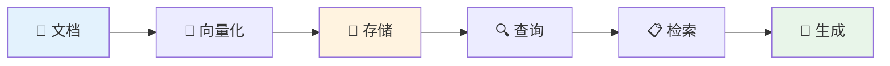
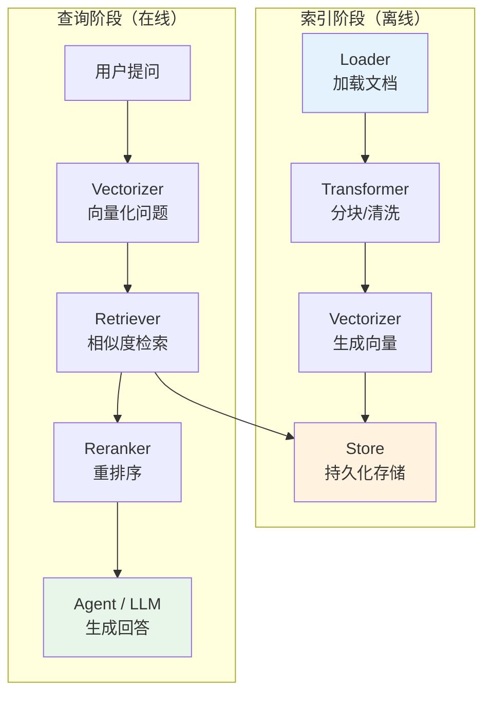
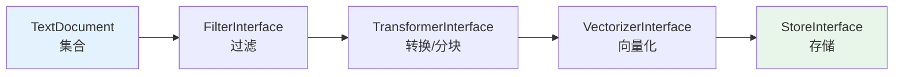
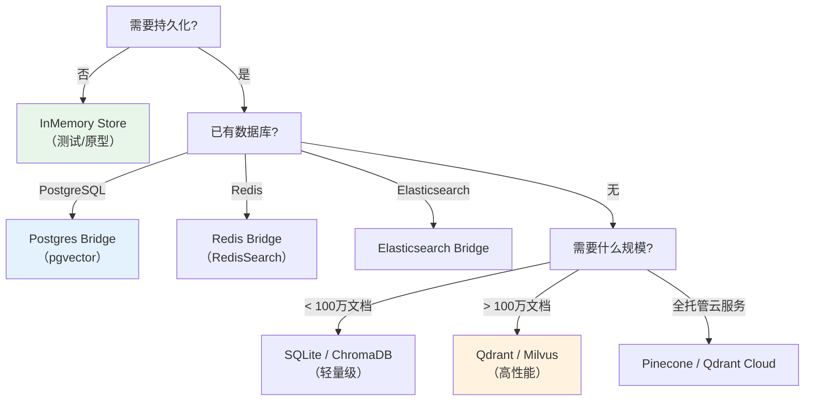
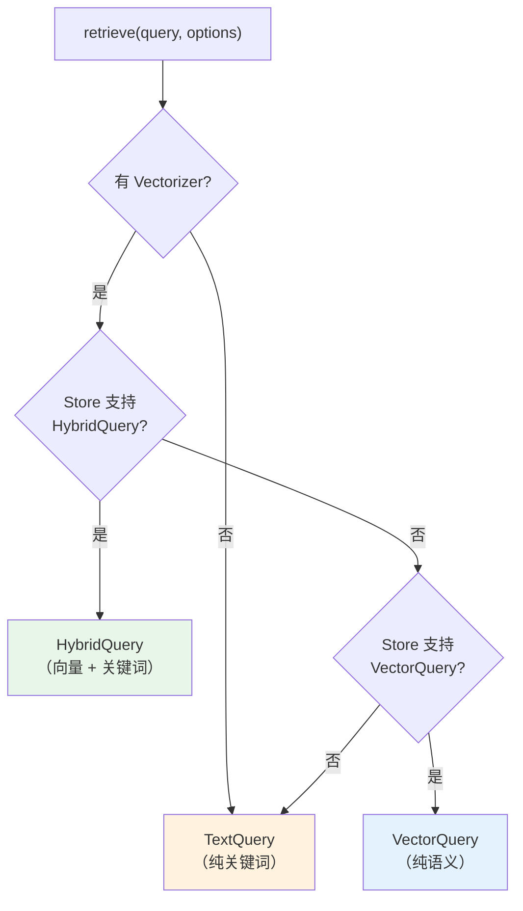
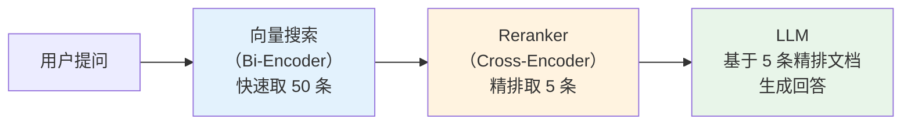

# 第 4 章：Store 组件 —— 向量数据库与 RAG

## 🎯 本章学习目标

掌握 Store 组件的完整架构：文档加载与转换、向量化与索引流水线、25+ 存储后端、向量/全文/混合查询、检索器与重排序、事件系统，学会构建端到端的 RAG（检索增强生成）应用。

---

## 1. 回顾

在 [第 3 章：Agent 组件](03-agent.md) 中，我们掌握了 Agent 的核心能力：

- **工具调用循环**：Agent 通过 LLM → 工具调用 → 反馈结果 → 再次调用的闭环机制执行实际任务
- **Toolbox 工具系统**：通过 `#[AsTool]` 注解将 PHP 方法注册为 AI 可调用的工具
- **处理器管线**：`InputProcessor` 和 `OutputProcessor` 在调用前后拦截和增强消息
- **多 Agent 编排**：通过 `AgentTool` 实现多个专业 Agent 的路由与协作

Agent 解决了「如何让 AI 执行操作」的问题。但 AI 的训练数据有截止日期，无法回答关于**你的私有数据**的问题——你的产品文档、内部知识库、业务数据。这就引出了本章的核心主题：**如何让 AI 基于你的数据回答问题？**

---

## 2. 向量数据库与 RAG 入门

### 2.1 什么是向量嵌入（Vector Embedding）？

向量嵌入是 AI 模型对文本语义的数学表示。简单来说，就是把一段文本转换为一组浮点数（向量），使得**语义相近的文本在向量空间中距离也近**：

```
"如何退款？"    → [0.12, -0.34, 0.56, ..., 0.78]  (1536 维)
"退款政策是什么？" → [0.11, -0.33, 0.55, ..., 0.77]  (非常接近！)
"今天天气如何？"  → [0.89, 0.23, -0.41, ..., 0.15]  (距离很远)
```

向量化由**嵌入模型（Embedding Model）**完成，如 OpenAI 的 `text-embedding-3-small`（输出 1536 维向量）。

### 2.2 什么是 RAG（检索增强生成）？

RAG（Retrieval-Augmented Generation）是一种让 AI 基于外部知识回答问题的架构模式。核心思路是：先从知识库中**检索**相关文档，再将文档作为上下文送给 LLM **生成**回答。



与直接让 AI 回答相比，RAG 有三大优势：

| | 直接问 LLM | RAG 模式 |
|---|---|---|
| **知识来源** | 训练数据（有截止日期） | 你的实时文档 |
| **准确性** | 可能产生幻觉 | 基于真实文档，可追溯来源 |
| **私有数据** | 无法访问 | 可以检索企业内部知识 |

### 2.3 Store 组件在架构中的位置

Store 组件是 Symfony AI 的 **RAG 引擎**，提供了从文档到向量再到检索的完整流水线：



> 💡 Store 组件同时服务于**索引阶段**和**查询阶段**。索引阶段通常是离线批处理任务，查询阶段则是每次用户提问时实时执行。

---

## 3. 文档系统

Store 组件的文档系统围绕三个核心类展开：`TextDocument`（原始文档）、`VectorDocument`（向量文档）、`Metadata`（元数据）。

### 3.1 TextDocument：原始文本文档

`TextDocument` 是索引流水线的**输入**，表示一个尚未向量化的文本文档：

```php
use Symfony\AI\Store\Document\TextDocument;
use Symfony\AI\Store\Document\Metadata;

$document = new TextDocument(
    id: 'doc-001',                     // 文档唯一标识
    content: '退款政策：购买后 14 天内可申请全额退款。', // 文本内容
    metadata: new Metadata([
        '_title'  => '退款政策',
        '_source' => 'docs/refund.md',
        'category' => 'billing',
    ]),
);

echo $document->getId();      // 'doc-001'
echo $document->getContent(); // '退款政策：购买后 14 天内可申请全额退款。'

// TextDocument 是不可变的，withContent 返回新实例
$updated = $document->withContent('更新后的退款政策...');
```

### 3.2 VectorDocument：向量文档

`VectorDocument` 是实际存入向量数据库的数据结构，包含嵌入向量和相似度得分：

```php
use Symfony\AI\Store\Document\VectorDocument;
use Symfony\AI\Store\Document\Metadata;
use Symfony\AI\Platform\Vector\Vector;

$vectorDoc = new VectorDocument(
    id: 'doc-001',
    vector: new Vector([0.12, -0.34, 0.56, ...]), // 嵌入向量
    metadata: new Metadata(['_text' => '原始文本内容']),
    score: null,  // 存储时为 null，查询结果中有得分
);

// 查询后带得分的文档（不可变更新）
$scored = $vectorDoc->withScore(0.95);
echo $scored->getScore(); // 0.95
```

> 📌 文档生命周期：`TextDocument`（原始文本）→ 经过 `Vectorizer` → `VectorDocument`（带向量）→ 存入 `Store` → 查询返回带 `score` 的 `VectorDocument`。

### 3.3 Metadata：元数据

`Metadata` 继承自 `\ArrayObject`，支持任意键值对，同时定义了一组内置的保留键：

```php
use Symfony\AI\Store\Document\Metadata;

$metadata = new Metadata();

// 内置键的便捷方法
$metadata->setText('原始文本内容');           // _text —— 向量化时自动填充
$metadata->setSource('/docs/refund.md');    // _source —— 文档来源路径
$metadata->setTitle('退款政策');             // _title —— 文档标题
$metadata->setSummary('14 天退款');          // _summary —— AI 生成的摘要
$metadata->setParentId('parent-doc-001');   // _parent_id —— 分块后关联原文档
$metadata->setDepth(2);                    // _depth —— 目录树深度

// 读取
if ($metadata->hasText()) {
    echo $metadata->getText();
}

// 自定义键
$metadata['department'] = 'HR';
$metadata['year'] = 2024;
```

| 内置键 | 常量 | 说明 |
|--------|------|------|
| `_text` | `Metadata::KEY_TEXT` | 原始文本，`Vectorizer` 自动填充 |
| `_source` | `Metadata::KEY_SOURCE` | 文档来源（文件路径 / URL） |
| `_title` | `Metadata::KEY_TITLE` | 文档标题 |
| `_summary` | `Metadata::KEY_SUMMARY` | AI 生成的摘要 |
| `_parent_id` | `Metadata::KEY_PARENT_ID` | 分块后关联原文档 ID |
| `_depth` | `Metadata::KEY_DEPTH` | 在文档树中的嵌套深度 |

> 💡 `Metadata::KEY_TEXT` 尤其重要——`Vectorizer` 会自动将原始文本保存到该字段，这是后续 `Reranker` 重排序和检索结果展示的基础。

---

## 4. 文档加载器（Loaders）

文档加载器负责从各种数据源读取文档，返回 `TextDocument` 的可迭代集合。

### 4.1 LoaderInterface

```php
namespace Symfony\AI\Store\Document;

interface LoaderInterface
{
    /**
     * @return iterable<TextDocument>
     */
    public function load(?string $source = null, array $options = []): iterable;
}
```

### 4.2 内置加载器一览

| 加载器 | 数据源 | 输出 | 典型用途 |
|--------|--------|------|----------|
| `TextFileLoader` | 纯文本文件 | 1 个 TextDocument / 文件 | 日志、配置文件 |
| `MarkdownLoader` | Markdown 文件 | 1 个 TextDocument / 文件 | 技术文档、README |
| `CsvLoader` | CSV 文件 | 每行 1 个 TextDocument | 产品目录、FAQ |
| `JsonFileLoader` | JSON 文件 | 每条记录 1 个 TextDocument | API 数据、配置 |
| `RssFeedLoader` | RSS/Atom URL | 每篇文章 1 个 TextDocument | 新闻、博客 |
| `RstLoader` | RST 文件 | 1 个 TextDocument / 文件 | Sphinx 文档 |
| `RstToctreeLoader` | RST 目录树 | 递归加载所有文档 | Sphinx 文档树 |
| `InMemoryLoader` | 内存中的文档 | 传入的文档集合 | 测试、动态内容 |

### 4.3 MarkdownLoader

```php
use Symfony\AI\Store\Document\Loader\MarkdownLoader;

$loader = new MarkdownLoader();

foreach ($loader->load('/docs/guide.md') as $document) {
    echo $document->getMetadata()->getTitle(); // 自动从 # 标题提取
    echo $document->getContent();
}
```

### 4.4 CsvLoader

```php
use Symfony\AI\Store\Document\Loader\CsvLoader;

$loader = new CsvLoader(
    contentColumn: 'answer',           // 内容列（列名或索引）
    idColumn: 'id',                    // ID 列（可选）
    metadataColumns: ['question', 'category'], // 元数据列
    delimiter: ',',
    hasHeader: true,
);

// faq.csv 格式：id,question,answer,category
foreach ($loader->load('/data/faq.csv') as $document) {
    echo $document->getContent();              // answer 列的内容
    echo $document->getMetadata()['category']; // 元数据
}
```

### 4.5 JsonFileLoader

```php
use Symfony\AI\Store\Document\Loader\JsonFileLoader;

$loader = new JsonFileLoader(
    id: '$.articles[*].id',
    content: '$.articles[*].body',
    metadata: [
        'title'  => '$.articles[*].title',
        'author' => '$.articles[*].author.name',
    ],
);

foreach ($loader->load('/data/articles.json') as $document) {
    echo $document->getMetadata()['title'];
}
```

### 4.6 RssFeedLoader

```php
use Symfony\AI\Store\Document\Loader\RssFeedLoader;

$loader = new RssFeedLoader(
    httpClient: $httpClient,
    uuidNamespace: '6ba7b810-9dad-11d1-80b4-00c04fd430c8',
);

foreach ($loader->load('https://example.com/feed.rss') as $document) {
    echo $document->getMetadata()['title'];
    echo $document->getMetadata()['link'];
}
```

### 4.7 InMemoryLoader

适合测试或动态生成的文档场景：

```php
use Symfony\AI\Store\Document\Loader\InMemoryLoader;
use Symfony\AI\Store\Document\TextDocument;

$documents = [
    new TextDocument('doc-1', '第一篇文档内容'),
    new TextDocument('doc-2', '第二篇文档内容'),
];

$loader = new InMemoryLoader($documents);

foreach ($loader->load() as $document) {
    echo $document->getContent();
}
```

### 4.8 实战：加载整个知识库目录

```php
use Symfony\AI\Store\Document\Loader\MarkdownLoader;

$loader = new MarkdownLoader();
$allDocuments = [];

// 遍历目录中的所有 Markdown 文件
foreach (glob('/docs/knowledge-base/*.md') as $file) {
    foreach ($loader->load($file) as $document) {
        $allDocuments[] = $document;
    }
}

echo count($allDocuments) . ' 篇文档已加载';
```

---

## 5. 文档转换器（Transformers）

加载后的文档通常需要经过转换处理——分块、清洗、生成摘要等——才能有效地向量化和检索。

### 5.1 TransformerInterface

```php
namespace Symfony\AI\Store\Document;

interface TransformerInterface
{
    /**
     * @param iterable<TextDocument> $documents
     * @return iterable<TextDocument>
     */
    public function transform(iterable $documents, array $options = []): iterable;
}
```

### 5.2 TextSplitTransformer：文本分块

这是 RAG 应用中最重要的转换器。将长文档切分为带重叠的小块，确保每块在嵌入模型的最佳处理长度内：

```php
use Symfony\AI\Store\Document\Transformer\TextSplitTransformer;

$splitter = new TextSplitTransformer(
    chunkSize: 1000, // 每块最大字符数
    overlap: 200,    // 相邻块重叠字符数
);

$chunks = $splitter->transform($documents);

foreach ($chunks as $chunk) {
    echo "块内容：" . mb_substr($chunk->getContent(), 0, 50) . "...\n";
    echo "原文档 ID：" . $chunk->getMetadata()->getParentId() . "\n";
}
```

**重叠（overlap）** 的作用是防止关键信息被切割在块边界：

```
原始文档（2600 字符）:
┌─────────────────────────────────────────────────────────┐
│ ...关于退款的详细说明...在14天内可以申请退款...退款流程...  │
└─────────────────────────────────────────────────────────┘

chunkSize=1000, overlap=200:
块 1: [0        ......        1000]
块 2:          [800   ......        1800]
块 3:                   [1600  ......     2600]
                ↑ 重叠区 ↑
```

运行时也可以通过 `$options` 覆盖默认参数：

```php
$chunks = $splitter->transform($documents, [
    TextSplitTransformer::OPTION_CHUNK_SIZE => 500,
    TextSplitTransformer::OPTION_OVERLAP => 100,
]);
```

> ⚠️ **分块策略对 RAG 效果影响巨大**：

| chunkSize | overlap | 效果 | 适用场景 |
|-----------|---------|------|----------|
| 256 | 32 | 粒度细，精确定位短句 | 短问答、代码注释 |
| 500 | 50 | 段落级检索 | FAQ、Wiki |
| 1000 | 200 | 保留更多上下文（推荐默认） | 技术文档、长文 |
| 2000 | 400 | 粗粒度，适合概念性搜索 | 摘要生成 |

### 5.3 SummaryGeneratorTransformer：AI 摘要

使用 LLM 为每篇文档生成摘要，并存入元数据的 `_summary` 字段。开启 `yieldSummaryDocuments` 时，还会额外生成独立的摘要文档（双重索引模式）：

```php
use Symfony\AI\Store\Document\Transformer\SummaryGeneratorTransformer;

$summarizer = new SummaryGeneratorTransformer(
    platform: $platform,
    model: 'gpt-4o-mini',
    yieldSummaryDocuments: true,  // 同时生成独立摘要文档
    systemPrompt: '用 2-3 句话总结以下文本的核心内容。',
);

foreach ($summarizer->transform($documents) as $doc) {
    echo $doc->getMetadata()->getSummary(); // AI 生成的摘要
}
```

> 💡 **双重索引（Dual Indexing）策略**：同时存储原文块向量和摘要向量。查询时摘要向量更聚焦于主题，命中率更高；通过 `_parent_id` 可以追溯回完整原文。

### 5.4 其他内置转换器

```php
use Symfony\AI\Store\Document\Transformer\TextTrimTransformer;
use Symfony\AI\Store\Document\Transformer\TextReplaceTransformer;
use Symfony\AI\Store\Document\Transformer\ChunkDelayTransformer;

// TextTrimTransformer：去除首尾空白
$trimmer = new TextTrimTransformer();

// TextReplaceTransformer：文本替换
$replacer = new TextReplaceTransformer(
    search: '{{DRAFT}}',
    replace: '',
);

// ChunkDelayTransformer：在块之间添加延迟，避免 API 限速
$delayer = new ChunkDelayTransformer(delayMs: 1000);
```

### 5.5 ChainTransformer：组合多个转换器

将多个转换器串联成管线：

```php
use Symfony\AI\Store\Document\Transformer\ChainTransformer;
use Symfony\AI\Store\Document\Transformer\TextTrimTransformer;
use Symfony\AI\Store\Document\Transformer\TextReplaceTransformer;
use Symfony\AI\Store\Document\Transformer\TextSplitTransformer;

$transformer = new ChainTransformer(
    new TextTrimTransformer(),                          // 1. 清除空白
    new TextReplaceTransformer('<!-- TODO -->', ''),     // 2. 移除注释标记
    new TextSplitTransformer(chunkSize: 800, overlap: 150), // 3. 分块
);

$processedDocs = $transformer->transform($rawDocuments);
```

> 📌 转换器的执行顺序很重要：先清洗再分块，避免脏数据影响分块效果。

---

## 6. 向量化（Vectorization）

### 6.1 VectorizerInterface 与 Vectorizer

`Vectorizer` 通过 Platform 组件调用嵌入模型，将文本或文档转换为向量：

```php
use Symfony\AI\Store\Document\Vectorizer;

$vectorizer = new Vectorizer(
    platform: $platform,              // PlatformInterface 实例
    model: 'text-embedding-3-small',  // 嵌入模型名称
    logger: $logger,                  // 可选的 PSR-3 日志记录器
);
```

`vectorize()` 方法支持多种输入类型：

```php
// 1. 单个字符串 → Vector
$vector = $vectorizer->vectorize('如何申请退款？');
// 返回: Vector([0.12, -0.34, 0.56, ...])

// 2. 单个 TextDocument → VectorDocument
$vectorDoc = $vectorizer->vectorize($textDocument);
// 返回: VectorDocument（自动将原文保存到 metadata._text）

// 3. 字符串数组 → Vector 数组（批量）
$vectors = $vectorizer->vectorize(['文本一', '文本二', '文本三']);

// 4. TextDocument 数组 → VectorDocument 数组（批量）
$vectorDocs = $vectorizer->vectorize([$doc1, $doc2, $doc3]);
```

> 💡 `Vectorizer` 会自动检测嵌入模型是否支持批量输入（`Capability::INPUT_MULTIPLE`）。支持批量的模型（如 OpenAI text-embedding 系列）会一次 API 调用处理整批文档，大幅降低延迟和成本。

### 6.2 常用嵌入模型对比

| 模型 | 提供商 | 维度 | 每文档存储 | 适用场景 |
|------|--------|------|-----------|----------|
| `text-embedding-3-small` | OpenAI | 1536 | ~6KB | 通用 RAG（推荐） |
| `text-embedding-3-large` | OpenAI | 3072 | ~12KB | 高精度检索 |
| `text-embedding-ada-002` | OpenAI | 1536 | ~6KB | 旧版，兼容用途 |
| `nomic-embed-text` | Ollama | 768 | ~3KB | 本地部署 |
| `mxbai-embed-large` | Ollama | 1024 | ~4KB | 本地高精度 |

### 6.3 示例：向量化文档

```php
use Symfony\AI\Platform\Bridge\OpenAi\PlatformFactory;
use Symfony\AI\Store\Document\Vectorizer;
use Symfony\AI\Store\Document\TextDocument;
use Symfony\Component\HttpClient\HttpClient;

// 创建 Platform 和 Vectorizer
$platform = PlatformFactory::create($_ENV['OPENAI_API_KEY'], HttpClient::create());
$vectorizer = new Vectorizer($platform, 'text-embedding-3-small');

// 向量化单个文档
$textDoc = new TextDocument('doc-001', '退款政策：14 天内可全额退款。');
$vectorDoc = $vectorizer->vectorize($textDoc);

echo '向量维度：' . count($vectorDoc->getVector()->getData()) . "\n"; // 1536
echo '原始文本：' . $vectorDoc->getMetadata()->getText() . "\n";     // 自动保存
```

---

## 7. 索引器（Indexer）

索引器是文档处理流水线的入口，将文档从加载到存储的完整流程自动化。

### 7.1 DocumentProcessor：核心管线编排器

`DocumentProcessor` 负责 **过滤 → 转换 → 向量化 → 存储** 的完整链路：

```php
use Symfony\AI\Store\Indexer\DocumentProcessor;
use Symfony\AI\Store\Document\Transformer\TextTrimTransformer;
use Symfony\AI\Store\Document\Transformer\TextSplitTransformer;
use Symfony\AI\Store\Document\Filter\TextContainsFilter;

$processor = new DocumentProcessor(
    vectorizer: $vectorizer,
    store: $store,
    filters: [
        new TextContainsFilter('关键词'), // 只保留包含关键词的文档
    ],
    transformers: [
        new TextTrimTransformer(),
        new TextSplitTransformer(chunkSize: 1000, overlap: 200),
    ],
    logger: $logger,
);

// 直接处理文档集合
$processor->process($documents, [
    'chunk_size' => 50,                        // 每批向量化的文档数
    'platform_options' => ['timeout' => 30],   // 传递给 Platform 的选项
]);
```



### 7.2 SourceIndexer：从文件路径索引

`SourceIndexer` 接受文件路径或 URL，先通过 Loader 加载文档，再交给 `DocumentProcessor` 处理：

```php
use Symfony\AI\Store\Indexer\SourceIndexer;
use Symfony\AI\Store\Document\Loader\MarkdownLoader;

$indexer = new SourceIndexer(
    loader: new MarkdownLoader(),
    processor: $processor,
);

// 索引单个文件
$indexer->index('/docs/guide.md');

// 索引多个文件
$indexer->index([
    '/docs/chapter1.md',
    '/docs/chapter2.md',
    '/docs/chapter3.md',
]);
```

### 7.3 DocumentIndexer：直接索引文档对象

当你已经有了 `TextDocument` 对象（比如从数据库查询），可以跳过 Loader 直接索引：

```php
use Symfony\AI\Store\Indexer\DocumentIndexer;

$indexer = new DocumentIndexer($processor);

// 索引单个文档
$indexer->index($textDocument);

// 批量索引
$indexer->index([$doc1, $doc2, $doc3]);
```

### 7.4 ConfiguredSourceIndexer：预配置默认来源

使用装饰器模式，允许在 Symfony 容器中预配置默认文档来源：

```php
use Symfony\AI\Store\Indexer\ConfiguredSourceIndexer;

$indexer = new ConfiguredSourceIndexer(
    indexer: $sourceIndexer,
    defaultSource: '/var/knowledge-base/', // 默认来源
);

// 使用默认来源
$indexer->index();

// 运行时覆盖
$indexer->index('/var/other-docs/');
```

### 7.5 完整索引工作流示例

```php
use Symfony\AI\Platform\Bridge\OpenAi\PlatformFactory;
use Symfony\AI\Store\Bridge\Postgres\Store;
use Symfony\AI\Store\Document\Loader\MarkdownLoader;
use Symfony\AI\Store\Document\Transformer\TextTrimTransformer;
use Symfony\AI\Store\Document\Transformer\TextSplitTransformer;
use Symfony\AI\Store\Document\Transformer\ChainTransformer;
use Symfony\AI\Store\Document\Vectorizer;
use Symfony\AI\Store\Indexer\DocumentProcessor;
use Symfony\AI\Store\Indexer\SourceIndexer;
use Symfony\Component\HttpClient\HttpClient;

// 1. 创建平台和向量化器
$platform = PlatformFactory::create($_ENV['OPENAI_API_KEY'], HttpClient::create());
$vectorizer = new Vectorizer($platform, 'text-embedding-3-small');

// 2. 创建 PostgreSQL 存储
$pdo = new \PDO('pgsql:host=localhost;dbname=knowledge_base', 'postgres', 'secret');
$store = Store::fromPdo($pdo, 'document_embeddings');
$store->setup(); // 自动创建表和 pgvector 索引

// 3. 构建完整管线
$processor = new DocumentProcessor(
    vectorizer: $vectorizer,
    store: $store,
    transformers: [
        new TextTrimTransformer(),
        new TextSplitTransformer(chunkSize: 1000, overlap: 200),
    ],
);

$indexer = new SourceIndexer(
    loader: new MarkdownLoader(),
    processor: $processor,
);

// 4. 索引整个文档目录
foreach (glob('/docs/knowledge-base/*.md') as $file) {
    $indexer->index($file);
    echo "✅ 已索引：{$file}\n";
}

echo "索引完成！\n";
```

---

## 8. 存储后端

### 8.1 StoreInterface：核心存储接口

```php
namespace Symfony\AI\Store;

interface StoreInterface
{
    /**
     * @param VectorDocument|VectorDocument[] $documents
     */
    public function add(VectorDocument|array $documents): void;

    /**
     * @param string|array<string> $ids
     */
    public function remove(string|array $ids, array $options = []): void;

    /**
     * @return iterable<VectorDocument>
     * @throws UnsupportedQueryTypeException
     */
    public function query(QueryInterface $query, array $options = []): iterable;

    /**
     * @param class-string<QueryInterface> $queryClass
     */
    public function supports(string $queryClass): bool;
}
```

### 8.2 ManagedStoreInterface：基础设施管理

大多数存储后端还实现了 `ManagedStoreInterface`，支持创建和销毁底层基础设施：

```php
interface ManagedStoreInterface
{
    public function setup(array $options = []): void; // 创建表/集合/索引
    public function drop(array $options = []): void;  // 删除所有数据
}
```

对应的 CLI 命令：

```bash
# 初始化存储（创建表/索引）
php bin/console ai:store:setup

# 清空存储（危险操作！）
php bin/console ai:store:drop
```

### 8.3 25+ 存储后端一览

Store 组件提供了覆盖主流向量数据库和搜索引擎的桥接器：

#### 云服务

| 后端 | 包名 | 特点 |
|------|------|------|
| **Pinecone** | `symfony/ai-pinecone-store` | 全托管，零运维，自动扩展 |
| **Qdrant Cloud** | `symfony/ai-qdrant-store` | 高性能向量搜索，支持云端和自托管 |
| **Weaviate** | `symfony/ai-weaviate-store` | 多模态支持，GraphQL 查询 |
| **Milvus** | `symfony/ai-milvus-store` | 千亿级向量，GPU 加速 |
| **Supabase** | `symfony/ai-supabase-store` | 基于 PostgreSQL + pgvector 的 REST API |
| **Azure AI Search** | `symfony/ai-azure-search-store` | Azure 生态集成 |
| **S3Vectors** | `symfony/ai-s3-vectors-store` | AWS S3 向量存储，成本极低 |
| **Cloudflare** | `symfony/ai-cloudflare-store` | 边缘计算向量存储 |

#### 自托管

| 后端 | 包名 | 特点 |
|------|------|------|
| **PostgreSQL** | `symfony/ai-postgres-store` | pgvector 扩展，原生混合查询，ACID 事务 |
| **Redis** | `symfony/ai-redis-store` | 超低延迟，RedisSearch 模块 |
| **Elasticsearch** | `symfony/ai-elasticsearch-store` | 企业级，kNN 搜索 |
| **OpenSearch** | `symfony/ai-opensearch-store` | Elasticsearch 开源分支 |
| **ChromaDB** | `symfony/ai-chroma-db-store` | 轻量级，Python 生态流行 |
| **MongoDB** | `symfony/ai-mongodb-store` | Atlas Vector Search |
| **Neo4j** | `symfony/ai-neo4j-store` | 图数据库 + 向量搜索 |
| **MariaDB** | `symfony/ai-mariadb-store` | 内置向量功能 |
| **SQLite** | `symfony/ai-sqlite-store` | sqlite-vec 扩展，零配置 |
| **ClickHouse** | `symfony/ai-clickhouse-store` | 列式存储，大规模数据 |
| **SurrealDB** | `symfony/ai-surrealdb-store` | 多模型数据库 |

#### 搜索引擎

| 后端 | 包名 | 特点 |
|------|------|------|
| **Meilisearch** | `symfony/ai-meilisearch-store` | 向量 + 全文搜索 |
| **Typesense** | `symfony/ai-typesense-store` | 快速搜索引擎 |
| **ManticoreSearch** | `symfony/ai-manticore-search-store` | 全文搜索引擎 |

#### 工具类

| 后端 | 包名 | 特点 |
|------|------|------|
| **InMemory** | 内置（无需安装） | 零依赖，适合测试和原型 |
| **Cache** | `symfony/ai-cache-store` | 基于 PSR-6 缓存池，支持 TTL |
| **CombinedStore** | 内置（无需安装） | 组合多个后端，RRF 融合 |
| **Vektor** | `symfony/ai-vektor-store` | 轻量向量数据库 |

### 8.4 查询类型支持矩阵

| 存储后端 | VectorQuery | TextQuery | HybridQuery | ManagedStore |
|----------|:-----------:|:---------:|:-----------:|:------------:|
| **InMemory** | ✅ | ✅ | ✅ | ✅ |
| **PostgreSQL** | ✅ | ✅ | ✅ | ✅ |
| **SQLite** | ✅ | ✅ | ✅ | ✅ |
| **Cache** | ✅ | ✅ | ✅ | ✅ |
| **ChromaDB** | ✅ | ✅ | ❌ | ✅ |
| **Meilisearch** | ✅ | ✅ | ❌ | ✅ |
| **Elasticsearch** | ✅ | ✅ | ✅ | ✅ |
| **OpenSearch** | ✅ | ✅ | ✅ | ✅ |
| **AzureSearch** | ✅ | ✅ | ❌ | ✅ |
| **Typesense** | ✅ | ✅ | ❌ | ✅ |
| **ManticoreSearch** | ✅ | ✅ | ❌ | ✅ |
| **Qdrant** | ✅ | ❌ | ❌ | ✅ |
| **Redis** | ✅ | ❌ | ❌ | ✅ |
| **Pinecone** | ✅ | ❌ | ❌ | ✅ |
| **MongoDB** | ✅ | ❌ | ❌ | ✅ |
| **Milvus** | ✅ | ❌ | ❌ | ✅ |
| **Weaviate** | ✅ | ❌ | ❌ | ✅ |
| **Neo4j** | ✅ | ❌ | ❌ | ✅ |
| **Cloudflare** | ✅ | ❌ | ❌ | ✅ |
| **S3Vectors** | ✅ | ❌ | ❌ | ✅ |
| **MariaDB** | ✅ | ❌ | ❌ | ✅ |
| **SurrealDB** | ✅ | ❌ | ❌ | ✅ |
| **ClickHouse** | ✅ | ❌ | ❌ | ✅ |
| **Supabase** | ✅ | ❌ | ❌ | ❌ |
| **CombinedStore** | ✅ | ✅ | ✅（RRF） | ❌ |

> 💡 不支持 `HybridQuery` 的后端，可以通过 `CombinedStore` 组合一个向量后端和一个文本后端来实现混合搜索。

### 8.5 PostgreSQL（pgvector）安装与配置

PostgreSQL 是最推荐的生产环境后端，原生支持三种查询类型：

```bash
# 安装
composer require symfony/ai-postgres-store

# Docker 启动 PostgreSQL + pgvector
docker run -d --name pgvector \
    -e POSTGRES_PASSWORD=secret \
    -e POSTGRES_DB=knowledge_base \
    -p 5432:5432 \
    pgvector/pgvector:pg17
```

```php
use Symfony\AI\Store\Bridge\Postgres\Store;
use Symfony\AI\Store\Bridge\Postgres\Distance;

$pdo = new \PDO('pgsql:host=localhost;dbname=knowledge_base', 'postgres', 'secret');

$store = new Store(
    connection: $pdo,
    tableName: 'embeddings',
    vectorFieldName: 'embedding',
    distance: Distance::Cosine,  // Cosine, InnerProduct, L1, L2
);

// 创建表和索引
$store->setup([
    'vector_type' => 'vector',    // 或 'halfvec'（半精度，省空间）
    'vector_size' => 1536,
    'index_method' => 'hnsw',     // HNSW 索引加速查询
]);
```

### 8.6 其他常用后端配置示例

#### Qdrant

```php
use Symfony\AI\Store\Bridge\Qdrant\Store;

$store = new Store(
    httpClient: $httpClient,
    collectionName: 'my_collection',
    embeddingsDimension: 1536,
    embeddingsDistance: 'Cosine',
);
$store->setup();
```

#### Redis（RedisSearch）

```php
use Symfony\AI\Store\Bridge\Redis\Store;
use Symfony\AI\Store\Bridge\Redis\Distance;

$store = new Store(
    redis: $redis,
    indexName: 'vector_index',
    keyPrefix: 'vector:',
    distance: Distance::Cosine,
);
$store->setup(['vector_size' => 1536, 'index_method' => 'HNSW']);
```

#### InMemory（开发/测试）

```php
use Symfony\AI\Store\InMemory\Store;
use Symfony\AI\Store\Distance\DistanceStrategy;

$store = new Store(
    strategy: DistanceStrategy::COSINE_DISTANCE,
);
```

#### CombinedStore（组合多后端）

```php
use Symfony\AI\Store\CombinedStore;

// 用 Qdrant 做向量搜索，Elasticsearch 做全文搜索
$combined = new CombinedStore(
    vectorStore: $qdrantStore,
    textStore: $elasticsearchStore,
    rrfK: 60,  // Reciprocal Rank Fusion 常数
);

// 写入时同步到两个后端
$combined->add($vectorDocuments);

// HybridQuery 自动分解为向量+文本查询，结果通过 RRF 算法融合
$results = $combined->query(
    new HybridQuery($vector, 'search terms', semanticRatio: 0.7),
    ['limit' => 10],
);
```

### 8.7 选型决策树



---

## 9. 查询系统

### 9.1 QueryInterface

所有查询类型都实现标记接口 `QueryInterface`：

```php
namespace Symfony\AI\Store\Query;

interface QueryInterface {}
```

### 9.2 VectorQuery：向量相似度搜索

经典的语义搜索，通过向量距离找到语义最接近的文档：

```php
use Symfony\AI\Store\Query\VectorQuery;
use Symfony\AI\Platform\Vector\Vector;

$query = new VectorQuery(
    vector: new Vector([0.12, -0.34, 0.56, ...]),
);

$results = $store->query($query, ['limit' => 5]);

foreach ($results as $doc) {
    echo $doc->getMetadata()->getText() . "\n";
    echo "相似度得分：" . $doc->getScore() . "\n\n";
}
```

### 9.3 TextQuery：全文关键词搜索

精确匹配关键词，不经过向量化：

```php
use Symfony\AI\Store\Query\TextQuery;

// 单个文本搜索
$query = new TextQuery('退款政策');

// 多文本搜索（OR 逻辑）
$query = new TextQuery(['退款', '政策', 'refund']);

$results = $store->query($query, ['limit' => 10]);
```

### 9.4 HybridQuery：混合搜索

结合语义搜索和关键词搜索，通过 `semanticRatio` 控制两者权重：

```php
use Symfony\AI\Store\Query\HybridQuery;

$query = new HybridQuery(
    vector: $vector,
    text: 'Symfony AI 退款',
    semanticRatio: 0.7,  // 70% 语义权重，30% 关键词权重
);

echo $query->getSemanticRatio(); // 0.7
echo $query->getKeywordRatio();  // 0.3（自动计算）
```

| semanticRatio | 语义权重 | 关键词权重 | 适用场景 |
|:-------------:|:--------:|:----------:|----------|
| 0.0 | 0% | 100% | 代码搜索、型号搜索、精确匹配 |
| 0.3 | 30% | 70% | 技术文档、产品规格 |
| 0.5 | 50% | 50% | 通用 FAQ（默认值） |
| 0.7 | 70% | 30% | 企业知识库、自然语言问答 |
| 1.0 | 100% | 0% | 推荐系统、意图理解 |

### 9.5 查询选项

所有查询都可以通过 `$options` 传递额外参数：

```php
$results = $store->query($query, [
    'limit' => 10,            // 返回结果数量
    'where' => [...],         // 元数据过滤条件（部分后端支持）
    'params' => [...],        // 后端特定参数
]);
```

### 9.6 使用 supports() 检测后端能力

在运行时检查后端是否支持特定查询类型，实现优雅降级：

```php
use Symfony\AI\Store\Query\HybridQuery;
use Symfony\AI\Store\Query\VectorQuery;
use Symfony\AI\Store\Query\TextQuery;

if ($store->supports(HybridQuery::class)) {
    $query = new HybridQuery($vector, $searchText, semanticRatio: 0.7);
} elseif ($store->supports(VectorQuery::class)) {
    $query = new VectorQuery($vector);
} else {
    $query = new TextQuery($searchText);
}

$results = $store->query($query, ['limit' => 10]);
```

---

## 10. 检索器（Retriever）

### 10.1 Retriever 类

`Retriever` 是 Store 组件的高层检索 API，封装了向量化 + 查询 + 事件分发的完整流程：

```php
use Symfony\AI\Store\Retriever;

$retriever = new Retriever(
    store: $store,
    vectorizer: $vectorizer,
    eventDispatcher: $dispatcher,  // 可选，用于 Pre/PostQueryEvent
    logger: $logger,               // 可选 PSR-3 日志
);

// 只需传入自然语言查询
$documents = $retriever->retrieve('如何申请退款？', ['limit' => 5]);

foreach ($documents as $doc) {
    echo $doc->getMetadata()->getText() . "\n";
    echo "得分：" . $doc->getScore() . "\n\n";
}
```

### 10.2 Retriever 的内部查询策略

`Retriever` 会根据 Store 的能力自动选择最优查询类型：



### 10.3 与 Agent 的 SimilaritySearch 工具集成

Agent 组件提供了 `SimilaritySearch` 工具，让 AI 自动决定何时检索知识库：

```php
use Symfony\AI\Agent\Agent;
use Symfony\AI\Agent\Bridge\SimilaritySearch\SimilaritySearch;
use Symfony\AI\Agent\Toolbox\AgentProcessor;
use Symfony\AI\Agent\Toolbox\Toolbox;
use Symfony\AI\Platform\Message\Message;
use Symfony\AI\Platform\Message\MessageBag;

// 1. 创建 SimilaritySearch 工具
$similaritySearch = new SimilaritySearch($vectorizer, $store);

// 2. 构建 Agent
$toolbox = new Toolbox([$similaritySearch]);
$agentProcessor = new AgentProcessor($toolbox);
$agent = new Agent($platform, 'gpt-4o-mini', [$agentProcessor], [$agentProcessor]);

// 3. Agent 会自动调用 SimilaritySearch 检索相关文档
$result = $agent->call(new MessageBag(
    Message::forSystem('你是产品客服。根据 SimilaritySearch 检索到的文档回答用户问题。'),
    Message::ofUser('你们支持退款吗？'),
));

echo $result->getContent();
```

> 💡 `SimilaritySearch` 工具使用 `#[AsTool('similarity_search')]` 注解注册。当 LLM 判断需要查阅知识库时，会自动调用该工具，将搜索词向量化并查询 Store，返回最相关的文档内容。

---

## 11. 重排序（Reranking）

### 11.1 为什么需要重排序？

向量检索使用**双编码器（Bi-Encoder）**架构——查询和文档分别独立编码，通过向量距离排序。速度快，但精度有限。

**交叉编码器（Cross-Encoder）** 将查询和文档拼接后一起送入模型，可以做细粒度的语义匹配，精度远高于双编码器，但速度慢。

**两阶段检索策略** 兼顾速度与精度：

```
向量搜索（快，取 50 条）→ Reranker 精排（慢但准，取 5 条）→ LLM 生成回答
```



### 11.2 RerankerInterface 与 Reranker

```php
use Symfony\AI\Store\Reranker\Reranker;

$reranker = new Reranker(
    platform: $platform,
    model: 'rerank-v3.5',  // Cohere 等提供的重排序模型
    logger: $logger,
);

// 对检索结果重排序
$reranked = $reranker->rerank(
    query: '如何申请退款？',
    documents: $initialResults,  // VectorDocument 数组
    topK: 5,                     // 返回前 5 条
);

foreach ($reranked as $doc) {
    echo $doc->getMetadata()->getText() . "\n";
    echo "交叉编码器得分：" . $doc->getScore() . "\n\n";
}
```

> ⚠️ **Reranker 依赖 `Metadata::getText()`** 获取文档文本。只要通过 `Vectorizer` 索引的文档，原文会自动保存到 `_text` 字段，天然支持 Reranker。

### 11.3 RerankerListener：事件驱动的自动重排序

通过事件监听器无缝集成重排序，**无需修改任何业务代码**：

```php
use Symfony\AI\Store\EventListener\RerankerListener;
use Symfony\AI\Store\Event\PostQueryEvent;

$listener = new RerankerListener(
    reranker: $reranker,
    topK: 5,
);

// 注册到事件分发器
$dispatcher->addListener(PostQueryEvent::class, $listener);

// 之后所有 Retriever::retrieve() 调用都自动经过 Reranker
$docs = $retriever->retrieve('如何退款？', ['limit' => 50]);
// 实际返回 5 条重排序后的精排结果
```

### 11.4 Reranker 模型对比

| 模型 | 提供商 | 语言支持 | 特点 |
|------|--------|----------|------|
| `rerank-v3.5` | Cohere | 多语言 | 业界标杆，精度高 |
| `rerank-english-v3.0` | Cohere | 英文 | 英文精度最优 |
| `jina-reranker-v2-base-multilingual` | Jina AI | 多语言 | 可本地部署 |
| `bge-reranker-large` | BAAI | 中英文 | 中文效果好 |

---

## 12. 事件系统

Store 组件通过 Symfony 事件调度器支持查询前后的拦截与增强。

### 12.1 PreQueryEvent：查询前拦截

在向量化查询之前触发，监听器可以修改查询字符串和选项：

```php
use Symfony\AI\Store\Event\PreQueryEvent;

// 示例：拼写纠正
$dispatcher->addListener(PreQueryEvent::class, function (PreQueryEvent $event): void {
    $corrected = $spellingCorrector->correct($event->getQuery());
    $event->setQuery($corrected);
});

// 示例：同义词扩展
$dispatcher->addListener(PreQueryEvent::class, function (PreQueryEvent $event): void {
    $options = $event->getOptions();
    $options['synonyms'] = $synonymDict->expand($event->getQuery());
    $event->setOptions($options);
});
```

**常见用途**：拼写纠正、查询改写、同义词扩展、A/B 测试（修改 `semanticRatio`）。

### 12.2 PostQueryEvent：查询后拦截

在存储返回结果之后、业务代码接收之前触发：

```php
use Symfony\AI\Store\Event\PostQueryEvent;

// 示例：过滤低分结果
$dispatcher->addListener(PostQueryEvent::class, function (PostQueryEvent $event): void {
    $docs = iterator_to_array($event->getDocuments());
    $filtered = array_filter($docs, fn ($doc) => $doc->getScore() > 0.7);
    $event->setDocuments(array_values($filtered));
});

// 示例：搜索日志
$dispatcher->addListener(PostQueryEvent::class, function (PostQueryEvent $event): void {
    $logger->info('搜索查询', [
        'query' => $event->getQuery(),
        'result_count' => count(iterator_to_array($event->getDocuments())),
    ]);
});
```

**常见用途**：结果重排序（`RerankerListener`）、低分过滤、结果去重、搜索日志埋点。

---

## 13. 距离计算

### 13.1 DistanceStrategy

`DistanceStrategy` 枚举定义了向量距离的计算方式：

```php
use Symfony\AI\Store\Distance\DistanceStrategy;

DistanceStrategy::COSINE_DISTANCE;    // 余弦距离（最常用）
DistanceStrategy::ANGULAR_DISTANCE;   // 角距离
DistanceStrategy::EUCLIDEAN_DISTANCE; // 欧几里得距离（L2）
DistanceStrategy::MANHATTAN_DISTANCE; // 曼哈顿距离（L1）
DistanceStrategy::CHEBYSHEV_DISTANCE; // 切比雪夫距离
```

| 距离策略 | 公式 | 适用场景 | 推荐模型 |
|----------|------|----------|----------|
| 余弦距离 | `1 - cos(A, B)` | 文本语义相似度（最常用） | OpenAI Embedding |
| 欧氏距离 | `√Σ(aᵢ-bᵢ)²` | 图像特征、数值特征 | CLIP |
| 内积 | `Σ(aᵢ·bᵢ)` | 归一化向量（等价余弦） | 已归一化的模型 |
| 曼哈顿距离 | `Σ\|aᵢ-bᵢ\|` | 对异常值鲁棒的场景 | — |
| 切比雪夫距离 | `max\|aᵢ-bᵢ\|` | 最大偏差敏感 | — |

> 💡 **选择建议**：使用 OpenAI 嵌入模型（text-embedding-3-*）时，推荐**余弦距离**，这是模型训练优化的目标。

### 13.2 DistanceCalculator

`DistanceCalculator` 用于 InMemory Store 中的本地向量距离计算：

```php
use Symfony\AI\Store\Distance\DistanceCalculator;
use Symfony\AI\Store\Distance\DistanceStrategy;

$calculator = new DistanceCalculator(
    strategy: DistanceStrategy::COSINE_DISTANCE,
    batchSize: 100, // 大数据集分批计算，控制内存
);

// 计算查询向量与文档集合的距离并排序
$sorted = $calculator->calculate(
    documents: $allDocuments,
    vector: $queryVector,
    maxItems: 10,
);
```

---

## 14. 完整 RAG 示例

下面是一个端到端的 RAG 知识库问答系统示例，涵盖从文档加载到 AI 问答的全流程。

### 14.1 索引阶段

```php
<?php

require 'vendor/autoload.php';

use Symfony\AI\Platform\Bridge\OpenAi\PlatformFactory;
use Symfony\AI\Store\Bridge\Postgres\Store;
use Symfony\AI\Store\Document\Loader\InMemoryLoader;
use Symfony\AI\Store\Document\Metadata;
use Symfony\AI\Store\Document\TextDocument;
use Symfony\AI\Store\Document\Transformer\TextSplitTransformer;
use Symfony\AI\Store\Document\Transformer\TextTrimTransformer;
use Symfony\AI\Store\Document\Vectorizer;
use Symfony\AI\Store\Indexer\DocumentProcessor;
use Symfony\AI\Store\Indexer\SourceIndexer;
use Symfony\Component\HttpClient\HttpClient;
use Symfony\Component\Uid\Uuid;

// 1. 创建 Platform 和 Vectorizer
$platform = PlatformFactory::create($_ENV['OPENAI_API_KEY'], HttpClient::create());
$vectorizer = new Vectorizer($platform, 'text-embedding-3-small');

// 2. 创建 PostgreSQL 存储
$pdo = new \PDO('pgsql:host=localhost;dbname=knowledge_base', 'postgres', 'secret');
$store = Store::fromPdo($pdo, 'document_embeddings');
$store->setup();

// 3. 准备知识库文档
$knowledgeBase = [
    new TextDocument(
        id: Uuid::v4(),
        content: 'CloudFlow 提供 14 天无理由退款。用户在购买后 14 天内可以申请全额退款。'
            . '退款将在 3-5 个工作日内退回原支付方式。',
        metadata: new Metadata(['_title' => '退款政策', 'category' => 'billing']),
    ),
    new TextDocument(
        id: Uuid::v4(),
        content: 'CloudFlow 有三个版本：基础版 ¥99/月（5 用户、10GB 存储）；'
            . '专业版 ¥299/月（20 用户、100GB 存储、API 访问）；'
            . '企业版按需定价（无限用户、私有部署）。',
        metadata: new Metadata(['_title' => '定价方案', 'category' => 'billing']),
    ),
    new TextDocument(
        id: Uuid::v4(),
        content: 'CloudFlow 数据安全：AES-256 加密、SOC 2 Type II 和 ISO 27001 认证。'
            . '支持 SSO（SAML 2.0）和双因素认证。企业版支持私有部署。',
        metadata: new Metadata(['_title' => '数据安全', 'category' => 'security']),
    ),
];

// 4. 构建索引管线并执行
$processor = new DocumentProcessor(
    vectorizer: $vectorizer,
    store: $store,
    transformers: [
        new TextTrimTransformer(),
        new TextSplitTransformer(chunkSize: 800, overlap: 150),
    ],
);

$indexer = new SourceIndexer(
    loader: new InMemoryLoader($knowledgeBase),
    processor: $processor,
);

$indexer->index();
echo "✅ 索引了 " . count($knowledgeBase) . " 篇文档\n";
```

### 14.2 查询阶段：使用 Retriever

```php
use Symfony\AI\Store\Retriever;
use Symfony\AI\Store\Reranker\Reranker;
use Symfony\AI\Store\EventListener\RerankerListener;
use Symfony\AI\Store\Event\PostQueryEvent;
use Symfony\Component\EventDispatcher\EventDispatcher;

// 5. 可选：配置 Reranker
$dispatcher = new EventDispatcher();
$reranker = new Reranker($platform, 'rerank-v3.5');
$dispatcher->addListener(
    PostQueryEvent::class,
    new RerankerListener($reranker, topK: 3),
);

// 6. 创建 Retriever
$retriever = new Retriever(
    store: $store,
    vectorizer: $vectorizer,
    eventDispatcher: $dispatcher,
);

// 7. 检索相关文档
$documents = $retriever->retrieve('你们支持退款吗？', ['limit' => 20]);

foreach ($documents as $doc) {
    echo "📄 " . $doc->getMetadata()->getTitle() . "\n";
    echo "   " . $doc->getMetadata()->getText() . "\n";
    echo "   得分：" . round($doc->getScore(), 4) . "\n\n";
}
```

### 14.3 结合 Agent：自动检索与回答

```php
use Symfony\AI\Agent\Agent;
use Symfony\AI\Agent\Bridge\SimilaritySearch\SimilaritySearch;
use Symfony\AI\Agent\Toolbox\AgentProcessor;
use Symfony\AI\Agent\Toolbox\Toolbox;
use Symfony\AI\Platform\Message\Message;
use Symfony\AI\Platform\Message\MessageBag;

// 8. 构建 RAG Agent
$similaritySearch = new SimilaritySearch($vectorizer, $store);
$toolbox = new Toolbox([$similaritySearch]);
$agentProcessor = new AgentProcessor($toolbox);
$agent = new Agent($platform, 'gpt-4o-mini', [$agentProcessor], [$agentProcessor]);

$systemPrompt = '你是 CloudFlow 产品客服。'
    . '只根据 SimilaritySearch 工具检索到的文档内容回答用户问题。'
    . '如果没有找到相关信息，请诚实告知用户。';

// 9. 用户提问
$questions = [
    '你们支持退款吗？多久能到账？',
    '最便宜的方案多少钱？',
    '你们通过了哪些安全认证？',
    '你们支持 GraphQL 吗？',  // 知识库中没有的信息
];

foreach ($questions as $question) {
    echo "👤 用户：{$question}\n";

    $result = $agent->call(new MessageBag(
        Message::forSystem($systemPrompt),
        Message::ofUser($question),
    ));

    echo "🤖 客服：" . $result->getContent() . "\n\n";
}
```

### 14.4 Symfony 服务配置

在 Symfony 项目中，使用 AI Bundle 自动注入所有依赖：

```yaml
# config/services.yaml
services:
    # 向量化器
    Symfony\AI\Store\Document\Vectorizer:
        arguments:
            $platform: '@Symfony\AI\Platform\PlatformInterface'
            $model: 'text-embedding-3-small'

    # PostgreSQL 存储
    Symfony\AI\Store\Bridge\Postgres\Store:
        arguments:
            $connection: '@database_connection'
            $tableName: 'document_embeddings'

    # 文档处理器
    Symfony\AI\Store\Indexer\DocumentProcessor:
        arguments:
            $vectorizer: '@Symfony\AI\Store\Document\Vectorizer'
            $store: '@Symfony\AI\Store\Bridge\Postgres\Store'
            $transformers:
                - '@Symfony\AI\Store\Document\Transformer\TextTrimTransformer'
                - '@text_split_transformer'

    text_split_transformer:
        class: Symfony\AI\Store\Document\Transformer\TextSplitTransformer
        arguments:
            $chunkSize: 1000
            $overlap: 200

    # 来源索引器
    Symfony\AI\Store\Indexer\SourceIndexer:
        arguments:
            $loader: '@Symfony\AI\Store\Document\Loader\MarkdownLoader'
            $processor: '@Symfony\AI\Store\Indexer\DocumentProcessor'

    # 检索器
    Symfony\AI\Store\Retriever:
        arguments:
            $store: '@Symfony\AI\Store\Bridge\Postgres\Store'
            $vectorizer: '@Symfony\AI\Store\Document\Vectorizer'
            $eventDispatcher: '@event_dispatcher'
```

使用 CLI 命令管理索引：

```bash
# 初始化存储
php bin/console ai:store:setup

# 索引文档
php bin/console ai:index blog --source=/docs/knowledge-base/

# 测试检索
php bin/console ai:retrieve blog "如何申请退款？"

# 清空存储
php bin/console ai:store:drop
```

---

## 15. RAG 参数调优速查表

| 参数 | 默认值 | 推荐调整 | 说明 |
|------|--------|----------|------|
| `chunkSize` | 1000 | 短问答: 500，长文: 2000 | 分块大小 |
| `overlap` | 200 | chunkSize 的 10~20% | 块间重叠 |
| `limit`（粗召回） | — | 配合 Reranker: 20~50 | 初始检索数量 |
| `topK`（Reranker） | 5 | 3~10 | 精排后返回数量 |
| `semanticRatio` | 0.5 | 语义场景: 0.7，精确匹配: 0.3 | 混合查询权重 |
| 嵌入模型维度 | 1536 | 高精度: 3072，性能优先: 768 | 影响存储和精度 |

> 📌 **生产环境推荐配置**：`chunkSize=800` + `overlap=150` + `limit=20`（粗召回）+ `Reranker topK=5`（精排），使用 `text-embedding-3-small` 嵌入模型 + 余弦距离。

---

## 16. 下一步

在本章中，我们掌握了 Store 组件的完整能力：

- ✅ **文档系统**：TextDocument、VectorDocument、Metadata 的生命周期
- ✅ **加载与转换**：8 种 Loader + 6 种 Transformer 构建文档处理管线
- ✅ **向量化与索引**：Vectorizer + DocumentProcessor + SourceIndexer 的完整工作流
- ✅ **25+ 存储后端**：从 InMemory 到 PostgreSQL 到云服务的选型与配置
- ✅ **三种查询类型**：VectorQuery、TextQuery、HybridQuery 的使用场景
- ✅ **检索与重排序**：Retriever + Reranker 两阶段检索策略
- ✅ **事件系统**：PreQueryEvent / PostQueryEvent 实现查询扩展与结果增强
- ✅ **Agent 集成**：SimilaritySearch 工具让 AI 自动检索知识库

在 [第 5 章：Chat 组件](05-chat.md) 中，我们将学习如何构建交互式的 AI 聊天界面，将 Platform、Agent 和 Store 组件整合为完整的对话应用。
