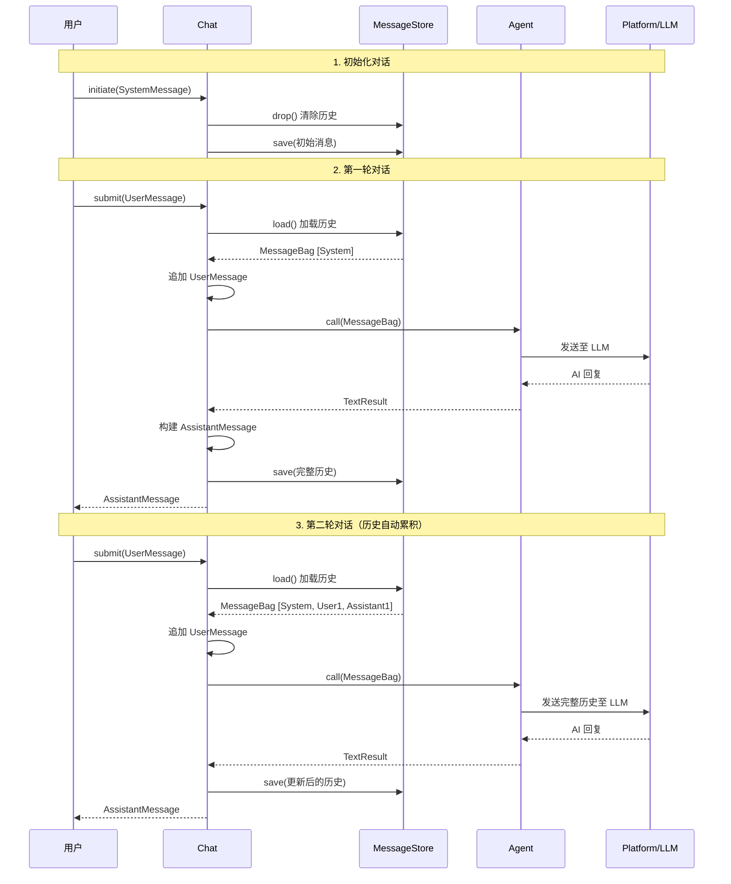

# 第 5 章：Chat 组件 —— 多轮对话管理

## 🎯 本章学习目标

掌握 Chat 组件的完整能力：对话会话管理、消息持久化存储、10 个存储后端选型、消息序列化机制、会话隔离策略，学会构建支持上下文保持的多轮对话应用。

---

## 1. 回顾

在 [第 4 章：Store 组件](04-store.md) 中，我们掌握了 RAG 的核心能力：

- **向量嵌入**：将文本转换为高维向量，实现语义级别的相似度检索
- **文档加载与索引**：通过 Loader → Transformer → Embedder → Store 流水线构建知识库
- **24 个存储后端**：覆盖主流向量数据库（Pinecone、ChromaDB、Milvus 等）和传统数据库
- **检索增强生成**：让 AI 基于你的私有数据回答问题

Store 解决了「如何让 AI 基于私有数据回答问题」的问题。但还有一个重要场景未覆盖——**多轮对话的上下文保持**。AI API 是无状态的，每次请求都是一次全新的调用，它不记得你之前说了什么。这就引出了本章的核心主题：**如何让 AI 记住对话历史？**

---

## 2. 为什么需要 Chat 组件？

### 2.1 问题：无状态的 AI API

所有 AI 平台的 API（OpenAI、Anthropic、Gemini 等）本质上都是**无状态的**。每次请求都是独立的，模型不会"记住"之前的对话：

```yaml
# 第一轮请求
用户: "我叫张三"
AI: "你好张三！"

# 第二轮请求（AI 完全不记得第一轮）
用户: "我叫什么名字？"
AI: "抱歉，我不知道你的名字。"  ← 上下文丢失！
```

要实现多轮连续对话，你必须在每次请求时把**完整的对话历史**一起发送给 API：

```yaml
# 第二轮请求（附带完整历史）
消息历史: [
    {"role": "user", "content": "我叫张三"},
    {"role": "assistant", "content": "你好张三！"},
    {"role": "user", "content": "我叫什么名字？"}
]
AI: "你叫张三！"  ← 有上下文了！
```

这意味着你需要：

1. **存储每轮对话消息**（用户消息 + AI 回复）
2. **在每次请求前加载完整历史**
3. **在每次响应后更新历史**
4. **管理会话生命周期**（创建、重置、清除）

手动管理这些逻辑既繁琐又容易出错。Chat 组件正是为此而生。

### 2.2 Chat 组件提供什么

Chat 组件（`symfony/ai-chat`）是 Symfony AI 中负责**对话历史持久化**的专用组件，提供：

| 能力 | 说明 |
|------|------|
| **统一接口** | 通过 `ChatInterface` 提供一致的对话 API |
| **自动历史管理** | 自动加载、追加、保存对话消息 |
| **10 个存储后端** | 覆盖缓存、数据库、键值存储等主流方案 |
| **消息序列化** | 通过 `MessageNormalizer` 支持各种消息类型的序列化/反序列化 |
| **生命周期管理** | 支持会话的创建、保存、加载和清除 |
| **Agent 集成** | 无缝包装 Agent，自动处理多轮对话的上下文传递 |

### 2.3 架构位置

Chat 组件位于 Agent 之上，用户之下，承担对话状态管理职责：

```text
用户请求
   │
   ▼
ChatInterface (Chat.php)
   │  ┌─────────────────────────────┐
   │  │  MessageStoreInterface       │  ←── Chat 组件核心
   │  │  (Cache / Redis / Doctrine   │
   │  │   / Session / MongoDB / …)   │
   │  └─────────────────────────────┘
   │
   ▼
AgentInterface (来自 symfony/ai-agent)
   │
   ▼
PlatformInterface (来自 symfony/ai-platform)
   │
   ▼
LLM API（OpenAI / Anthropic / Gemini 等）
```

> 💡 Chat 组件本身**不直接与 AI 模型通信**——这由 Platform 层负责。Chat 的职责是：在每次用户与助手的交互之间，负责**持久化和恢复完整的对话上下文**。

---

## 3. 核心概念

### 3.1 ChatInterface

`ChatInterface` 定义了对话的两个核心操作：

```php
namespace Symfony\AI\Chat;

use Symfony\AI\Platform\Message\AssistantMessage;
use Symfony\AI\Platform\Message\MessageBag;
use Symfony\AI\Platform\Message\UserMessage;

interface ChatInterface
{
    /**
     * 初始化对话，传入系统提示等初始消息包。
     * 调用此方法会重置当前存储中的消息历史。
     */
    public function initiate(MessageBag $messages): void;

    /**
     * 提交用户消息，获取助手回复。
     */
    public function submit(UserMessage $message): AssistantMessage;
}
```

| 方法 | 作用 | 触发行为 |
|------|------|----------|
| `initiate()` | 开始新对话 | 清除历史 → 保存初始消息（如系统提示词） |
| `submit()` | 发送用户消息 | 加载历史 → 追加消息 → 调用 Agent → 保存响应 |

### 3.2 MessageStoreInterface

`MessageStoreInterface` 定义了消息存储的基本操作：

```php
namespace Symfony\AI\Chat;

use Symfony\AI\Platform\Message\MessageBag;

interface MessageStoreInterface
{
    /** 持久化完整的消息包（覆盖写入） */
    public function save(MessageBag $messages): void;

    /** 加载完整的消息包，若不存在则返回空 MessageBag */
    public function load(): MessageBag;
}
```

### 3.3 ManagedStoreInterface

`ManagedStoreInterface` 提供存储基础设施的生命周期管理：

```php
namespace Symfony\AI\Chat;

interface ManagedStoreInterface
{
    /**
     * 初始化存储基础设施（创建表、索引等）
     *
     * @param array<mixed> $options 特定后端的扩展选项
     */
    public function setup(array $options = []): void;

    /** 销毁/清空存储（表、集合、键等） */
    public function drop(): void;
}
```

> ⚠️ `Chat` 类要求传入的存储必须**同时实现**两个接口，通过 PHP 8.1 交叉类型约束：
> ```php
> public function __construct(
>     private readonly AgentInterface $agent,
>     private readonly MessageStoreInterface&ManagedStoreInterface $store,
> ) {}
> ```

### 3.4 对话生命周期

一个完整的对话生命周期如下：



### 3.5 Chat.php 的 submit() 内部流程

```php
// src/chat/src/Chat.php
public function submit(UserMessage $message): AssistantMessage
{
    // 1. 从存储恢复完整历史
    $messages = $this->store->load();

    // 2. 追加当前用户消息
    $messages->add($message);

    // 3. 将完整历史发给 AI Agent
    $result = $this->agent->call($messages);
    assert($result instanceof TextResult);

    // 4. 构建助手消息对象，合并元数据
    $assistantMessage = Message::ofAssistant($result->getContent());
    $assistantMessage->getMetadata()->merge($result->getMetadata());

    // 5. 将助手回复也追加进历史
    $messages->add($assistantMessage);

    // 6. 持久化更新后的完整历史
    $this->store->save($messages);

    return $assistantMessage;
}
```

> 📌 每次 `submit()` 都会加载**完整历史**、追加新消息、再保存回去。这意味着随着对话轮数增加，发送给 LLM 的 token 数也会增长。在生产环境中需要注意 token 限制。

---

## 4. 消息存储后端

Chat 组件提供了 10 种存储后端，覆盖从开发测试到生产部署的各种场景。

### 4.1 后端一览表

| 存储后端 | 包名 | 持久化 | 分布式 | 自动过期 | 适用场景 |
|----------|------|:------:|:------:|:--------:|----------|
| **InMemory** | 内置 | ❌ | ❌ | ❌ | 测试/开发 |
| **Cache** | `symfony/cache` | 取决于驱动 | 取决于驱动 | ✅ | 简单部署 |
| **Session** | `symfony/http-foundation` | ❌ | ❌ | 随 Session | Web 应用 |
| **Redis** | `symfony/ai-redis-message-store` | ✅ | ✅ | 可配置 | 高并发生产 |
| **Doctrine** | `symfony/ai-doctrine-message-store` | ✅ | ✅ | ❌ | 已有数据库 |
| **MongoDB** | `symfony/ai-mongodb-message-store` | ✅ | ✅ | ✅ | NoSQL 场景 |
| **Meilisearch** | `symfony/ai-meilisearch-message-store` | ✅ | ✅ | ❌ | 全文搜索对话 |
| **Cloudflare** | `symfony/ai-cloudflare-message-store` | ✅ | ✅ | ✅ | 无服务器/边缘 |
| **Pogocache** | `symfony/ai-pogocache-message-store` | ✅ | ✅ | ❌ | 专用缓存 |
| **SurrealDB** | `symfony/ai-surrealdb-message-store` | ✅ | ✅ | ❌ | 多模型数据库 |

### 4.2 InMemory Store

基于 PHP 内存的轻量级存储，实现了 `ResetInterface` 支持 Symfony 服务重置：

```php
use Symfony\AI\Chat\InMemory\Store;

$store = new Store(
    identifier: '_message_store_memory', // 可选，支持多实例隔离
);

$store->setup();                    // 初始化空 MessageBag
$store->save($messageBag);          // 保存消息
$messageBag = $store->load();       // 加载消息
$store->drop();                     // 清空消息
$store->reset();                    // 完全重置（清除所有数据）
```

> 💡 InMemory Store 无需任何外部依赖，非常适合单元测试和开发调试。进程结束后数据即丢失。

### 4.3 Cache Store

使用 PSR-6 `CacheItemPoolInterface` 的消息存储，支持任意 Symfony Cache 适配器：

```php
use Symfony\AI\Chat\Bridge\Cache\MessageStore;
use Symfony\Component\Cache\Adapter\FilesystemAdapter;

$cachePool = new FilesystemAdapter('chat', 86400, '/tmp/cache');

$store = new MessageStore(
    cache: $cachePool,           // PSR-6 CacheItemPoolInterface
    cacheKey: '_message_store_cache',
    ttl: 86400,                  // 缓存 TTL（秒），默认 24 小时
);
```

安装：

```bash
composer require symfony/cache
```

> 💡 Cache Store 的 TTL 机制：每次 `save()` 都会刷新过期时间，所以活跃的对话不会被意外清除。

### 4.4 Session Store

将消息存储在 Symfony HTTP Session 中，自动跟随用户浏览器会话：

```php
use Symfony\AI\Chat\Bridge\Session\MessageStore;

$store = new MessageStore(
    requestStack: $requestStack,
    sessionKey: 'messages',       // Session 中的键名
);
```

> 💡 Session Store 特别适合不需要长期保存的 Web 对话——用户关闭浏览器，对话自动消失。

### 4.5 Redis Store

使用 Redis 的高性能消息存储，支持持久化和分布式部署：

```php
use Symfony\AI\Chat\Bridge\Redis\MessageStore;
use Symfony\AI\Chat\MessageNormalizer;
use Symfony\Component\Serializer\Serializer;
use Symfony\Component\Serializer\Encoder\JsonEncoder;
use Symfony\Component\Serializer\Normalizer\ArrayDenormalizer;

$redis = new \Redis();
$redis->connect('127.0.0.1', 6379);

$store = new MessageStore(
    redis: $redis,                // \Redis 实例
    indexName: 'chat_messages',   // Redis 键名
    serializer: new Serializer(   // 可选，自定义序列化器
        [new ArrayDenormalizer(), new MessageNormalizer()],
        [new JsonEncoder()],
    ),
);

$store->setup();
```

安装：

```bash
composer require symfony/ai-redis-message-store
```

**Redis Store 实现细节：**
- 使用 `$redis->set()` / `$redis->get()` 操作
- 整个 MessageBag 序列化为 JSON 字符串存储
- `drop()` 将键值设为空数组 `[]`（保留键的存在）
- `setup()` 仅在键不存在时创建

### 4.6 Doctrine DBAL Store

使用 Doctrine DBAL 将消息持久化到关系型数据库（MySQL、PostgreSQL、SQLite 等）：

```php
use Symfony\AI\Chat\Bridge\Doctrine\DoctrineDbalMessageStore;

$store = new DoctrineDbalMessageStore(
    tableName: 'chat_messages',
    dbalConnection: $connection,   // Doctrine DBAL Connection
    clock: $clock,                 // PSR-20 ClockInterface（可选）
);

// 创建表结构
$store->setup();
```

安装：

```bash
composer require symfony/ai-doctrine-message-store
```

**自动创建的表结构：**

| 列名 | 类型 | 说明 |
|------|------|------|
| `id` | BIGINT (AUTO_INCREMENT) | 主键 |
| `messages` | TEXT | JSON 序列化的消息数组 |
| `added_at` | INTEGER | Unix 时间戳 |

**Doctrine Store 特殊行为：**
- 每次 `save()` 都执行 `INSERT`（追加模式，不更新）
- `load()` 按 `added_at ASC` 排序，合并所有行的消息
- `drop()` 执行 `DELETE` 清空所有行（保留表结构）
- 支持 Oracle 数据库的序列化自增 ID

### 4.7 MongoDB Store

使用 MongoDB 存储会话消息，灵活的文档结构适合多模态内容：

```php
use Symfony\AI\Chat\Bridge\MongoDb\MessageStore;

$store = new MessageStore(
    client: $mongoClient,
    databaseName: 'chat_db',
    collectionName: 'messages',
);
```

### 4.8 其他后端

**Meilisearch Store** —— 适合需要全文搜索对话历史的场景：

```php
use Symfony\AI\Chat\Bridge\Meilisearch\MessageStore;
use Symfony\Component\Clock\NativeClock;

$store = new MessageStore(
    httpClient: $httpClient,
    endpointUrl: 'http://localhost:7700',
    apiKey: 'masterKey',
    clock: new NativeClock(),
    indexName: '_message_store_meilisearch',
);
```

**Cloudflare KV Store** —— 适合无服务器和边缘计算场景：

```php
use Symfony\AI\Chat\Bridge\Cloudflare\MessageStore;

$store = new MessageStore(
    httpClient: $httpClient,
    namespace: 'chat_messages',
    accountId: 'your-account-id',
    apiKey: 'your-api-key',
    endpointUrl: 'https://api.cloudflare.com/client/v4/accounts',
);
```

**SurrealDB Store** —— 多模型数据库，支持图/文档/关系查询：

```php
use Symfony\AI\Chat\Bridge\SurrealDb\MessageStore;

$store = new MessageStore(
    httpClient: $httpClient,
    endpointUrl: 'http://localhost:8000',
    user: 'root',
    password: 'root',
    namespace: 'chat',
    database: 'messages',
    table: '_message_store_surrealdb',
    isNamespacedUser: false,
);
```

### 4.9 如何选择存储后端？

```text
需要持久化吗？
├── 否  →  InMemory（测试/原型）
│          Session（Web 临时对话）
└── 是  →  已有 Redis？ → Redis Store
           已有数据库？ → Doctrine Store
           已有 MongoDB？ → MongoDB Store
           需要全文搜索？ → Meilisearch Store
           全球边缘部署？ → Cloudflare Store
           多模型查询？ → SurrealDB Store
           简单文件缓存？ → Cache Store（Filesystem 驱动）
```

---

## 5. 创建聊天应用

### 5.1 基本步骤

构建一个 Chat 应用需要四个步骤：创建 Platform → 创建 Agent → 创建 Store → 创建 Chat。

```php
use Symfony\AI\Agent\Agent;
use Symfony\AI\Chat\Chat;
use Symfony\AI\Chat\InMemory\Store;
use Symfony\AI\Platform\Bridge\OpenAi\PlatformFactory;
use Symfony\AI\Platform\Message\Message;
use Symfony\AI\Platform\Message\MessageBag;

// 1. 创建 Platform
$platform = PlatformFactory::create($_ENV['OPENAI_API_KEY']);

// 2. 创建 Agent
$agent = new Agent($platform, 'gpt-4o');

// 3. 创建消息存储
$store = new Store();
$store->setup();

// 4. 创建 Chat
$chat = new Chat(agent: $agent, store: $store);
```

### 5.2 初始化对话：initiate()

使用 `initiate()` 开始一个新对话，通常传入系统提示词：

```php
$chat->initiate(new MessageBag(
    Message::forSystem('你是一个友好的助手，请用中文回答问题。')
));
```

> ⚠️ `initiate()` 会**清除所有历史消息**，然后保存初始消息。请勿在对话进行中调用，否则会丢失上下文。

### 5.3 提交消息：submit()

使用 `submit()` 发送用户消息并获取 AI 回复：

```php
$response = $chat->submit(Message::ofUser('你好，请介绍一下 Symfony AI。'));
echo $response->getContent();

// 继续多轮对话（历史自动持久化和恢复）
$response2 = $chat->submit(Message::ofUser('它支持哪些向量数据库？'));
echo $response2->getContent();
```

每次 `submit()` 的内部流程：

1. `store->load()` 加载完整历史
2. 追加当前 `UserMessage`
3. `agent->call()` 将完整历史发送给 LLM
4. 构建 `AssistantMessage`，合并元数据
5. 将 AI 回复追加进历史
6. `store->save()` 持久化更新后的历史

### 5.4 加载对话历史

你可以随时通过存储加载当前的对话历史：

```php
$history = $store->load();
$messages = $history->getMessages();

foreach ($messages as $message) {
    $type = match (true) {
        $message instanceof \Symfony\AI\Platform\Message\SystemMessage => '系统',
        $message instanceof \Symfony\AI\Platform\Message\UserMessage => '用户',
        $message instanceof \Symfony\AI\Platform\Message\AssistantMessage => '助手',
        default => '其他',
    };
    echo "[{$type}] {$message->getContent()}\n";
}
```

### 5.5 完整示例：简单聊天应用

```php
<?php

use Symfony\AI\Agent\Agent;
use Symfony\AI\Chat\Chat;
use Symfony\AI\Chat\Bridge\Cache\MessageStore;
use Symfony\AI\Platform\Bridge\OpenAi\PlatformFactory;
use Symfony\AI\Platform\Message\Message;
use Symfony\AI\Platform\Message\MessageBag;
use Symfony\Component\Cache\Adapter\FilesystemAdapter;

// 初始化组件
$platform = PlatformFactory::create($_ENV['OPENAI_API_KEY']);
$agent = new Agent($platform, 'gpt-4o');

$cache = new FilesystemAdapter('chat', 3600);
$store = new MessageStore($cache, '_chat_session', 3600);
$store->setup();

$chat = new Chat(agent: $agent, store: $store);

// 初始化对话
$chat->initiate(new MessageBag(
    Message::forSystem(
        '你是一个 Symfony 专家助手。' .
        '你的回答应当简洁、专业，并给出可运行的代码示例。'
    ),
));

// 模拟多轮对话
$questions = [
    '什么是 Symfony AI？',
    '它与 OpenAI 如何集成？',
    '给我一个简单的代码示例',
];

foreach ($questions as $question) {
    echo "用户: {$question}\n";
    $response = $chat->submit(Message::ofUser($question));
    echo "助手: {$response->getContent()}\n\n";
}

// 检查对话历史
$history = $store->load();
echo '历史消息数: ' . count($history->getMessages()) . "\n";
// 输出: 历史消息数: 7（1 System + 3 User + 3 Assistant）
```

---

## 6. 消息序列化

### 6.1 MessageNormalizer

`MessageNormalizer` 实现了 Symfony Serializer 的 `NormalizerInterface` 和 `DenormalizerInterface`，是所有需要持久化的消息存储的序列化基础。

```php
use Symfony\AI\Chat\MessageNormalizer;
use Symfony\Component\Serializer\Encoder\JsonEncoder;
use Symfony\Component\Serializer\Normalizer\ArrayDenormalizer;
use Symfony\Component\Serializer\Serializer;

$serializer = new Serializer(
    [new ArrayDenormalizer(), new MessageNormalizer()],
    [new JsonEncoder()],
);

// 序列化消息数组为 JSON
$json = $serializer->serialize($messageBag->getMessages(), 'json');

// 反序列化 JSON 为消息数组
use Symfony\AI\Platform\Message\MessageInterface;
$messages = $serializer->deserialize($json, MessageInterface::class.'[]', 'json');
$messageBag = new MessageBag(...$messages);
```

### 6.2 支持的消息类型

| 消息类型 | 类名 | 说明 |
|----------|------|------|
| 系统消息 | `SystemMessage` | 系统提示词，对话全程有效 |
| 用户消息 | `UserMessage` | 用户输入，支持多模态内容 |
| 助手消息 | `AssistantMessage` | AI 回复，可含工具调用 |
| 工具调用消息 | `ToolCallMessage` | 工具调用结果（Function Calling 场景） |

### 6.3 序列化格式

**UserMessage 序列化示例：**

```json
{
    "id": "018e7b9c-3d2f-7000-a1b2-c3d4e5f67890",
    "type": "Symfony\\AI\\Platform\\Message\\UserMessage",
    "content": "",
    "contentAsBase64": [
        {
            "type": "Symfony\\AI\\Platform\\Message\\Content\\Text",
            "content": "你好，请帮我解释一下 PHP 8.2 的新特性。"
        }
    ],
    "toolsCalls": [],
    "metadata": {
        "addedAt": 1735027200
    },
    "addedAt": 1735027200
}
```

**AssistantMessage 序列化示例（含工具调用）：**

```json
{
    "id": "018e7b9c-4a1e-7000-b2c3-d4e5f6789abc",
    "type": "Symfony\\AI\\Platform\\Message\\AssistantMessage",
    "content": "好的，我来为您解释...",
    "contentAsBase64": [],
    "toolsCalls": [
        {
            "id": "call_abc123",
            "function": {
                "name": "search_database",
                "arguments": "{\"query\": \"PHP 8.2\"}"
            }
        }
    ],
    "metadata": {
        "usage": {"prompt_tokens": 150, "completion_tokens": 200},
        "addedAt": 1735027201
    },
    "addedAt": 1735027201
}
```

### 6.4 支持的内容类型

`UserMessage` 的内容支持以下类型（通过 `contentAsBase64` 数组存储）：

| 内容类型 | 类名 | 存储方式 |
|----------|------|----------|
| 文本 | `Text` | 文本字符串 |
| 图像 | `Image` | Base64 编码 |
| 音频 | `Audio` | Base64 编码 |
| 文件 | `File` | Base64 编码 |
| 文档 | `Document` | Base64 编码 |
| 图像 URL | `ImageUrl` | URL 字符串 |
| 文档 URL | `DocumentUrl` | URL 字符串 |

### 6.5 自定义 ID 键

部分存储后端使用不同的 ID 字段名（如 MongoDB 使用 `_id`），可通过序列化上下文指定：

```php
$normalizer->normalize($message, context: ['identifier' => '_id']);
$normalizer->denormalize($data, MessageInterface::class, context: ['identifier' => '_id']);
```

---

## 7. 会话隔离策略

Chat 组件本身没有内置"chatId"参数——不同对话的隔离通过**实例化不同存储对象**（指向不同存储键）来实现。

### 7.1 按用户 ID 隔离

每个用户拥有独立的对话历史：

```php
$userId = $security->getUser()->getId();

$store = new \Symfony\AI\Chat\Bridge\Cache\MessageStore(
    cache: $cachePool,
    cacheKey: sprintf('chatbot_user_%d', $userId),
    ttl: 7200,
);

$chat = new Chat($agent, $store);
```

适用场景：客服机器人、个人助手。

### 7.2 按会话 ID 隔离

同一用户可并发多个独立对话（类似 ChatGPT 的多会话窗口）：

```php
$sessionId = $request->getSession()->getId();

$store = new \Symfony\AI\Chat\Bridge\Redis\MessageStore(
    redis: $redis,
    indexName: 'chat:session:' . $sessionId,
);

$chat = new Chat($agent, $store);
```

### 7.3 按任务/主题隔离

为特定任务或主题创建独立上下文：

```php
$taskId = $request->attributes->get('taskId');

$store = new \Symfony\AI\Chat\Bridge\Doctrine\DoctrineDbalMessageStore(
    tableName: 'chat_messages_' . $taskId,
    dbalConnection: $connection,
);

$chat = new Chat($agent, $store);
```

适用场景：代码审查对话（每个 PR 独立上下文）、项目协作。

### 7.4 命名对话

使用 Redis 存储键的命名约定管理多个对话：

```php
use Symfony\AI\Chat\Bridge\Redis\MessageStore;

// 用户 42 的不同对话
$store1 = new MessageStore($redis, indexName: 'user:42:chat:general');
$store2 = new MessageStore($redis, indexName: 'user:42:chat:code-review');
$store3 = new MessageStore($redis, indexName: 'user:42:chat:learning');
```

> 📌 会话隔离的核心原则：**一个 Store 实例 = 一个对话上下文**。通过不同的存储键、表名或命名空间来区分不同对话。

---

## 8. 与 Agent 集成

### 8.1 Chat 包装带工具的 Agent

Chat 可以无缝包装一个配置了工具的 Agent，实现多轮对话中的工具调用：

```php
use Symfony\AI\Agent\Agent;
use Symfony\AI\Agent\Toolbox\Toolbox;
use Symfony\AI\Agent\Toolbox\Attribute\AsTool;
use Symfony\AI\Chat\Chat;
use Symfony\AI\Chat\InMemory\Store;
use Symfony\AI\Platform\Message\Message;
use Symfony\AI\Platform\Message\MessageBag;

// 定义工具
#[AsTool('get_weather', description: '获取城市天气信息')]
class WeatherTool
{
    public function __invoke(string $city): string
    {
        // 实际调用天气 API
        return sprintf('%s 的天气：晴天，25°C', $city);
    }
}

// 创建带工具的 Agent
$toolbox = new Toolbox([new WeatherTool()]);
$agentProcessor = new AgentProcessor($toolbox);
$agent = new Agent($platform, 'gpt-4o', [$agentProcessor], [$agentProcessor]);

// 用 Chat 包装 Agent
$store = new Store();
$store->setup();
$chat = new Chat(agent: $agent, store: $store);

$chat->initiate(new MessageBag(
    Message::forSystem('你是一个能查询天气的助手。')
));

// 多轮对话中使用工具
$response = $chat->submit(Message::ofUser('北京今天天气怎么样？'));
echo $response->getContent();
// AI 会调用 get_weather 工具获取北京天气，然后回复用户

$response2 = $chat->submit(Message::ofUser('那上海呢？'));
echo $response2->getContent();
// AI 记得上下文，自动调用工具获取上海天气
```

### 8.2 Chat + Agent + Store（RAG 对话）

将 Chat、Agent 和 Store 三个组件结合，实现基于私有知识的多轮对话：

```php
use Symfony\AI\Agent\Agent;
use Symfony\AI\Agent\Bridge\SimilaritySearch\SimilaritySearch;
use Symfony\AI\Agent\Toolbox\AgentProcessor;
use Symfony\AI\Agent\Toolbox\Toolbox;
use Symfony\AI\Chat\Chat;
use Symfony\AI\Chat\Bridge\Redis\MessageStore as ChatMessageStore;
use Symfony\AI\Store\Bridge\ChromaDb\Store as VectorStore;

// 1. 向量存储（RAG 知识库）
$vectorStore = new VectorStore(/* ChromaDB 配置 */);

// 2. Agent 配置 RAG 工具
$similaritySearch = new SimilaritySearch($vectorizer, $vectorStore);
$toolbox = new Toolbox([$similaritySearch]);
$agentProcessor = new AgentProcessor($toolbox);
$agent = new Agent(
    platform: $platform,
    model: 'gpt-4o',
    inputProcessors: [$agentProcessor],
    outputProcessors: [$agentProcessor],
);

// 3. Chat 消息存储（对话历史）
$chatStore = new ChatMessageStore(
    redis: $redis,
    indexName: 'rag_chat_session',
);
$chatStore->setup();

// 4. 创建 Chat
$chat = new Chat(agent: $agent, store: $chatStore);

$chat->initiate(new MessageBag(
    Message::forSystem('你是一个基于知识库回答问题的助手。请基于检索到的文档回答。')
));

// 多轮 RAG 对话
$response = $chat->submit(Message::ofUser('公司的退款政策是什么？'));
echo $response->getContent(); // 基于向量检索的知识库回答

$response2 = $chat->submit(Message::ofUser('退款需要多长时间？'));
echo $response2->getContent(); // 保持对话上下文的追问
```

> 💡 注意区分两种 Store：**向量 Store**（`symfony/ai-store`）用于 RAG 知识检索，**消息 Store**（`symfony/ai-chat`）用于对话历史持久化。它们解决不同的问题。

---

## 9. CLI 命令

Chat 组件提供两个 CLI 命令用于管理消息存储基础设施。

### 9.1 初始化存储

```bash
php bin/console ai:message-store:setup <store>
```

- 初始化消息存储的基础设施（如创建数据库表、Redis 键等）
- 支持 Shell 自动补全（列出所有可用存储名称）

```bash
# 初始化 Doctrine 消息存储
php bin/console ai:message-store:setup doctrine

# 初始化 Redis 消息存储
php bin/console ai:message-store:setup redis
```

### 9.2 清空存储

```bash
php bin/console ai:message-store:drop <store> [--force]
```

- `--force` / `-f`：**必须指定**此选项才会执行删除（防止误操作）

```bash
# 必须加 --force 才能执行
php bin/console ai:message-store:drop doctrine --force

# 不加 --force 会显示警告并返回失败
php bin/console ai:message-store:drop redis
# ⚠ 请使用 --force 选项确认删除操作
```

> ⚠️ `drop` 命令会**清空所有对话历史数据**，请在执行前确认操作。在生产环境中谨慎使用。

---

## 10. 完整示例

### 10.1 端到端聊天应用（Redis 存储）

```php
<?php

require_once __DIR__ . '/vendor/autoload.php';

use Symfony\AI\Agent\Agent;
use Symfony\AI\Chat\Chat;
use Symfony\AI\Chat\Bridge\Redis\MessageStore;
use Symfony\AI\Chat\MessageNormalizer;
use Symfony\AI\Platform\Bridge\OpenAi\PlatformFactory;
use Symfony\AI\Platform\Message\Message;
use Symfony\AI\Platform\Message\MessageBag;
use Symfony\Component\Serializer\Encoder\JsonEncoder;
use Symfony\Component\Serializer\Serializer;

// --- 初始化基础组件 ---

$platform = PlatformFactory::create($_ENV['OPENAI_API_KEY']);
$agent = new Agent($platform, 'gpt-4o');

// Redis 连接
$redis = new \Redis();
$redis->connect('127.0.0.1', 6379);

// 消息存储（每用户隔离）
$userId = 42;
$store = new MessageStore(
    redis: $redis,
    indexName: sprintf('chat:user:%d', $userId),
    serializer: new Serializer(
        [new ArrayDenormalizer(), new MessageNormalizer()],
        [new JsonEncoder()],
    ),
);
$store->setup();

// --- 创建 Chat ---

$chat = new Chat(agent: $agent, store: $store);

// --- 初始化对话 ---

$chat->initiate(new MessageBag(
    Message::forSystem(
        '你是一个智能客服助手。请用简洁、友好的语气回答问题。' .
        '如果不确定答案，请诚实告知。'
    ),
));

// --- 多轮对话 ---

echo "=== 多轮对话示例 ===\n\n";

$conversations = [
    '你好，我想了解你们的退款政策',
    '如果商品已经使用了一周，还能退吗？',
    '好的，那退款需要多长时间到账？',
    '谢谢你的帮助！',
];

foreach ($conversations as $input) {
    echo "👤 用户: {$input}\n";

    $response = $chat->submit(Message::ofUser($input));

    echo "🤖 助手: {$response->getContent()}\n\n";
}

// --- 查看完整对话历史 ---

echo "=== 对话历史 ===\n";
$history = $store->load();
echo sprintf("共 %d 条消息\n", count($history->getMessages()));
```

### 10.2 多轮工具调用对话

```php
<?php

use Symfony\AI\Agent\Agent;
use Symfony\AI\Agent\Toolbox\Toolbox;
use Symfony\AI\Agent\Toolbox\Attribute\AsTool;
use Symfony\AI\Chat\Chat;
use Symfony\AI\Chat\Bridge\Cache\MessageStore;
use Symfony\AI\Platform\Bridge\OpenAi\PlatformFactory;
use Symfony\AI\Platform\Message\Message;
use Symfony\AI\Platform\Message\MessageBag;
use Symfony\Component\Cache\Adapter\FilesystemAdapter;

// 工具定义
#[AsTool('search_products', description: '搜索商品信息')]
class ProductSearchTool
{
    public function __invoke(string $query): string
    {
        // 模拟商品搜索
        return json_encode([
            ['name' => 'Symfony AI 入门', 'price' => 99],
            ['name' => 'PHP 8.2 高级编程', 'price' => 129],
        ]);
    }
}

#[AsTool('get_order_status', description: '查询订单状态')]
class OrderStatusTool
{
    public function __invoke(string $orderId): string
    {
        return sprintf('订单 %s 状态：已发货，预计明天送达', $orderId);
    }
}

// 创建组件
$platform = PlatformFactory::create($_ENV['OPENAI_API_KEY']);
$toolbox = new Toolbox([new ProductSearchTool(), new OrderStatusTool()]);
$agentProcessor = new AgentProcessor($toolbox);
$agent = new Agent($platform, 'gpt-4o', [$agentProcessor], [$agentProcessor]);

$cache = new FilesystemAdapter('chat', 7200);
$store = new MessageStore($cache, 'tool_chat', 7200);
$store->setup();

$chat = new Chat(agent: $agent, store: $store);

// 初始化
$chat->initiate(new MessageBag(
    Message::forSystem('你是一个电商客服助手，可以搜索商品和查询订单。')
));

// 对话
$r1 = $chat->submit(Message::ofUser('帮我搜索一下关于 PHP 的书'));
echo $r1->getContent() . "\n";  // AI 调用 search_products 工具

$r2 = $chat->submit(Message::ofUser('第二本多少钱？'));
echo $r2->getContent() . "\n";  // AI 记得上下文

$r3 = $chat->submit(Message::ofUser('帮我查一下订单 ORD-12345'));
echo $r3->getContent() . "\n";  // AI 调用 get_order_status 工具
```

### 10.3 Web 控制器集成

```php
// src/Controller/ChatController.php
namespace App\Controller;

use Symfony\AI\Chat\Chat;
use Symfony\AI\Platform\Message\Message;
use Symfony\AI\Platform\Message\MessageBag;
use Symfony\Bundle\FrameworkBundle\Controller\AbstractController;
use Symfony\Component\HttpFoundation\JsonResponse;
use Symfony\Component\HttpFoundation\Request;
use Symfony\Component\Routing\Attribute\Route;

class ChatController extends AbstractController
{
    public function __construct(
        private readonly Chat $chat,
    ) {}

    #[Route('/chat/send', methods: ['POST'])]
    public function send(Request $request): JsonResponse
    {
        $userInput = $request->getPayload()->getString('message');
        $response = $this->chat->submit(Message::ofUser($userInput));

        return $this->json([
            'response' => $response->getContent(),
        ]);
    }

    #[Route('/chat/reset', methods: ['POST'])]
    public function reset(): JsonResponse
    {
        $this->chat->initiate(new MessageBag(
            Message::forSystem('你好，有什么可以帮助你的？')
        ));

        return $this->json(['status' => 'reset']);
    }
}
```

对应的 Symfony 服务配置：

```yaml
# config/services.yaml
services:
    # 消息存储（使用 Redis）
    Symfony\AI\Chat\Bridge\Redis\MessageStore:
        arguments:
            $redis: '@Redis'
            $indexName: 'chat_messages'

    # Chat 服务
    Symfony\AI\Chat\Chat:
        arguments:
            $agent: '@Symfony\AI\Agent\Agent'
            $store: '@Symfony\AI\Chat\Bridge\Redis\MessageStore'
```

---

## 11. 异常处理

Chat 组件定义了专用的异常层次结构：

```php
// 基础接口，所有 Chat 异常都实现此接口
Symfony\AI\Chat\Exception\ExceptionInterface

// 无效参数（如不支持的选项、无效配置）
Symfony\AI\Chat\Exception\InvalidArgumentException

// 运行时错误（如网络请求失败、数据库连接失败）
Symfony\AI\Chat\Exception\RuntimeException

// 逻辑错误（如 MessageNormalizer 遇到未知消息类型）
Symfony\AI\Chat\Exception\LogicException
```

**异常处理示例：**

```php
use Symfony\AI\Chat\Exception\RuntimeException;
use Symfony\AI\Agent\Exception\ExceptionInterface as AgentException;

try {
    $response = $chat->submit(Message::ofUser('你好'));
} catch (AgentException $e) {
    // Agent 调用失败（如 API 超时、速率限制等）
    $logger->error('Agent 调用失败: ' . $e->getMessage());
} catch (RuntimeException $e) {
    // 消息存储操作失败
    $logger->error('消息存储失败: ' . $e->getMessage());
}
```

---

## 12. 下一步

在本章中，我们学习了 Chat 组件的完整能力：

- **ChatInterface** 的 `initiate()` 和 `submit()` 两个核心方法
- **10 个消息存储后端**的选型与配置
- **消息序列化**机制（MessageNormalizer）
- **会话隔离策略**（按用户、按会话、按任务）
- **与 Agent 集成**实现工具调用和 RAG 对话

至此，我们已经掌握了 Symfony AI 的四大核心组件：**Platform**（AI 平台接入）、**Agent**（智能代理）、**Store**（向量检索）、**Chat**（对话管理）。

在 [第 6 章：AI Bundle](06-ai-bundle.md) 中，我们将学习如何用 **AI Bundle** 将这些组件无缝集成到 Symfony 框架中——通过配置文件自动装配 Platform、Agent、Store 和 Chat，享受依赖注入、自动配置、命令行工具等 Symfony 生态的全部优势。
