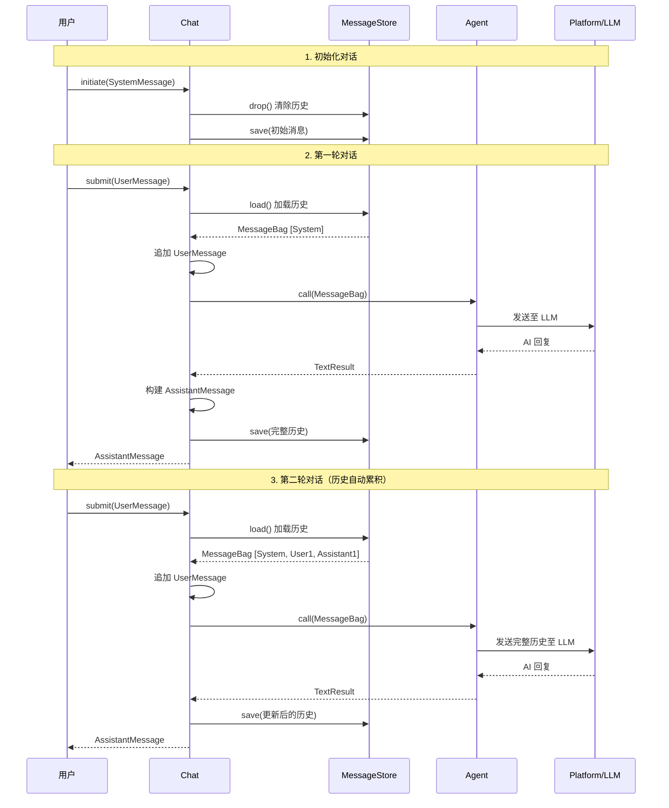

# 5 Chat —— 

## 

 Chat 10+ 

---

## 1. 

 [ 4 Store ](04-store.md) RAG 

- ****
- **** Loader → Transformer → Embedder → Store 
- **25+ **PineconeChromaDBMilvus 
- **** AI 

Store AI ——****AI API ** AI **

---

## 2. Chat 

### 2.1 AI API

 AI APIOpenAIAnthropicGemini ****""

```
# 第一轮请求
用户: "我叫张三"
AI: "你好张三！"

# 第二轮请求（AI 完全不记得第一轮）
用户: "我叫什么名字？"
AI: "抱歉，我不知道你的名字。"  ← 上下文丢失！
```

**** API

```
# 第二轮请求（附带完整历史）
消息历史: [
    {"role": "user", "content": "我叫张三"},
    {"role": "assistant", "content": "你好张三！"},
    {"role": "user", "content": "我叫什么名字？"}
]
AI: "你叫张三！"  ← 有上下文了！
```


1. **** + AI 
2. ****
3. ****
4. ****

Chat 

### 2.2 Chat 

Chat `symfony/ai-chat` Symfony AI ****

| | |
|------|------|
| **** | `ChatInterface` API |
| **** | |
| **10+ ** | |
| **** | `MessageNormalizer` / |
| **** | |
| **Agent ** | Agent |

### 2.3 

Chat Agent 

```
用户请求
   │
   ▼
ChatInterface (Chat.php)
   │  ┌─────────────────────────────┐
   │  │  MessageStoreInterface       │  ←── Chat 组件核心
   │  │  (Cache / Redis / Doctrine   │
   │  │   / Session / MongoDB / …)   │
   │  └─────────────────────────────┘
   │
   ▼
AgentInterface (来自 symfony/ai-agent)
   │
   ▼
PlatformInterface (来自 symfony/ai-platform)
   │
   ▼
LLM API（OpenAI / Anthropic / Gemini 等）
```

> Chat ** AI **—— Platform Chat ****

---

## 3. 

### 3.1 ChatInterface

`ChatInterface` 

```php
namespace Symfony\AI\Chat;

use Symfony\AI\Platform\Message\AssistantMessage;
use Symfony\AI\Platform\Message\MessageBag;
use Symfony\AI\Platform\Message\UserMessage;

interface ChatInterface
{
    /**
     * 初始化对话，传入系统提示等初始消息包。
     * 调用此方法会重置当前存储中的消息历史。
     */
    public function initiate(MessageBag $messages): void;

    /**
     * 提交用户消息，获取助手回复。
     */
    public function submit(UserMessage $message): AssistantMessage;
}
```

| | | |
|------|------|----------|
| `initiate()` | | → |
| `submit()` | | → → Agent → |

### 3.2 MessageStoreInterface

`MessageStoreInterface` 

```php
namespace Symfony\AI\Chat;

use Symfony\AI\Platform\Message\MessageBag;

interface MessageStoreInterface
{
    /** 持久化完整的消息包（覆盖写入） */
    public function save(MessageBag $messages): void;

    /** 加载完整的消息包，若不存在则返回空 MessageBag */
    public function load(): MessageBag;
}
```

### 3.3 ManagedStoreInterface

`ManagedStoreInterface` 

```php
namespace Symfony\AI\Chat;

interface ManagedStoreInterface
{
    /**
     * 初始化存储基础设施（创建表、索引等）
     *
     * @param array<mixed> $options 特定后端的扩展选项
     */
    public function setup(array $options = []): void;

    /** 销毁/清空存储（表、集合、键等） */
    public function drop(): void;
}
```

> `Chat` **** PHP 8.1 
> ```php
> public function __construct(
> private readonly AgentInterface $agent,
> private readonly MessageStoreInterface&ManagedStoreInterface $store,
> ) {}
> ```

### 3.4 




### 3.5 Chat.php submit() 

```php
// src/chat/src/Chat.php
public function submit(UserMessage $message): AssistantMessage
{
    // 1. 从存储恢复完整历史
    $messages = $this->store->load();

    // 2. 追加当前用户消息
    $messages->add($message);

    // 3. 将完整历史发给 AI Agent
    $result = $this->agent->call($messages);
    assert($result instanceof TextResult);

    // 4. 构建助手消息对象，合并元数据
    $assistantMessage = Message::ofAssistant($result->getContent());
    $assistantMessage->getMetadata()->merge($result->getMetadata());

    // 5. 将助手回复也追加进历史
    $messages->add($assistantMessage);

    // 6. 持久化更新后的完整历史
    $this->store->save($messages);

    return $assistantMessage;
}
```

> `submit()` **** LLM token token 

---

## 4. 

Chat 10+ 

### 4.1 

| | | | | | |
|----------|------|:------:|:------:|:--------:|----------|
| **InMemory** | | ❌ | ❌ | ❌ | / |
| **Cache** | `symfony/ai-cache-message-store` | | | ✅ | |
| **Session** | `symfony/ai-session-message-store` | ❌ | ❌ | Session | Web |
| **Redis** | `symfony/ai-redis-message-store` | ✅ | ✅ | | |
| **Doctrine** | `symfony/ai-doctrine-message-store` | ✅ | ✅ | ❌ | |
| **MongoDB** | `symfony/ai-mongo-db-message-store` | ✅ | ✅ | ✅ | NoSQL |
| **Meilisearch** | `symfony/ai-meilisearch-message-store` | ✅ | ✅ | ❌ | |
| **Cloudflare** | `symfony/ai-cloudflare-message-store` | ✅ | ✅ | ✅ | / |
| **Pogocache** | `symfony/ai-pogocache-message-store` | ✅ | ✅ | ❌ | |
| **SurrealDB** | `symfony/ai-surreal-db-message-store` | ✅ | ✅ | ❌ | |

### 4.2 InMemory Store

 PHP `ResetInterface` Symfony 

```php
use Symfony\AI\Chat\InMemory\Store;

$store = new Store(
    identifier: '_message_store_memory', // 可选，支持多实例隔离
);

$store->setup();                    // 初始化空 MessageBag
$store->save($messageBag);          // 保存消息
$messageBag = $store->load();       // 加载消息
$store->drop();                     // 清空消息
$store->reset();                    // 完全重置（清除所有数据）
```

> InMemory Store 

### 4.3 Cache Store

 PSR-6 `CacheItemPoolInterface` Symfony Cache 

```php
use Symfony\AI\Chat\Bridge\Cache\MessageStore;
use Symfony\Component\Cache\Adapter\FilesystemAdapter;

$cachePool = new FilesystemAdapter('chat', 86400, '/tmp/cache');

$store = new MessageStore(
    cache: $cachePool,           // PSR-6 CacheItemPoolInterface
    cacheKey: '_message_store_cache',
    ttl: 86400,                  // 缓存 TTL（秒），默认 24 小时
);
```


```bash
composer require symfony/cache
```

> Cache Store TTL `save()` 

### 4.4 Session Store

 Symfony HTTP Session 

```php
use Symfony\AI\Chat\Bridge\Session\MessageStore;

$store = new MessageStore(
    requestStack: $requestStack,
    sessionKey: 'messages',       // Session 中的键名
);
```

> Session Store Web ——

### 4.5 Redis Store

 Redis 

```php
use Symfony\AI\Chat\Bridge\Redis\MessageStore;
use Symfony\AI\Chat\MessageNormalizer;
use Symfony\Component\Serializer\Serializer;
use Symfony\Component\Serializer\Encoder\JsonEncoder;
use Symfony\Component\Serializer\Normalizer\ArrayDenormalizer;

$redis = new \Redis();
$redis->connect('127.0.0.1', 6379);

$store = new MessageStore(
    redis: $redis,                // \Redis 实例
    indexName: 'chat_messages',   // Redis 键名
    serializer: new Serializer(   // 可选，自定义序列化器
        [new ArrayDenormalizer(), new MessageNormalizer()],
        [new JsonEncoder()],
    ),
);

$store->setup();
```


```bash
composer require symfony/ai-redis-message-store
```

**Redis Store **
- `$redis->set()` / `$redis->get()` 
- MessageBag JSON 
- `drop()` `[]`
- `setup()` 

### 4.6 Doctrine DBAL Store

 Doctrine DBAL MySQLPostgreSQLSQLite 

```php
use Symfony\AI\Chat\Bridge\Doctrine\DoctrineDbalMessageStore;

$store = new DoctrineDbalMessageStore(
    tableName: 'chat_messages',
    dbalConnection: $connection,   // Doctrine DBAL Connection
    clock: $clock,                 // PSR-20 ClockInterface（可选）
);

// 创建表结构
$store->setup();
```


```bash
composer require symfony/ai-doctrine-message-store
```

****

| | | |
|------|------|------|
| `id` | BIGINT (AUTO_INCREMENT) | |
| `messages` | TEXT | JSON |
| `added_at` | INTEGER | Unix |

**Doctrine Store **
- `save()` `INSERT`
- `load()` `added_at ASC` 
- `drop()` `DELETE` 
- Oracle ID

### 4.7 MongoDB Store

 MongoDB 

```php
use Symfony\AI\Chat\Bridge\MongoDb\MessageStore;

$store = new MessageStore(
    client: $mongoClient,
    databaseName: 'chat_db',
    collectionName: 'messages',
);
```

### 4.8 

**Meilisearch Store** —— 

```php
use Symfony\AI\Chat\Bridge\Meilisearch\MessageStore;
use Symfony\Component\Clock\NativeClock;

$store = new MessageStore(
    httpClient: $httpClient,
    endpointUrl: 'http://localhost:7700',
    apiKey: 'masterKey',
    clock: new NativeClock(),
    indexName: '_message_store_meilisearch',
);
```

**Cloudflare KV Store** —— 

```php
use Symfony\AI\Chat\Bridge\Cloudflare\MessageStore;

$store = new MessageStore(
    httpClient: $httpClient,
    namespace: 'chat_messages',
    accountId: 'your-account-id',
    apiKey: 'your-api-key',
    endpointUrl: 'https://api.cloudflare.com/client/v4/accounts',
);
```

**SurrealDB Store** —— //

```php
use Symfony\AI\Chat\Bridge\SurrealDb\MessageStore;

$store = new MessageStore(
    httpClient: $httpClient,
    endpointUrl: 'http://localhost:8000',
    user: 'root',
    password: 'root',
    namespace: 'chat',
    database: 'messages',
    table: '_message_store_surrealdb',
    isNamespacedUser: false,
);
```

### 4.9 

```
需要持久化吗？
├── 否  →  InMemory（测试/原型）
│          Session（Web 临时对话）
└── 是  →  已有 Redis？ → Redis Store
           已有数据库？ → Doctrine Store
           已有 MongoDB？ → MongoDB Store
           需要全文搜索？ → Meilisearch Store
           全球边缘部署？ → Cloudflare Store
           多模型查询？ → SurrealDB Store
           简单文件缓存？ → Cache Store（Filesystem 驱动）
```

---

## 5. 

### 5.1 

 Chat Platform → Agent → Store → Chat

```php
use Symfony\AI\Agent\Agent;
use Symfony\AI\Chat\Chat;
use Symfony\AI\Chat\InMemory\Store;
use Symfony\AI\Platform\Bridge\OpenAi\PlatformFactory;
use Symfony\AI\Platform\Message\Message;
use Symfony\AI\Platform\Message\MessageBag;

// 1. 创建 Platform
$platform = PlatformFactory::create($_ENV['OPENAI_API_KEY']);

// 2. 创建 Agent
$agent = new Agent($platform, 'gpt-4o');

// 3. 创建消息存储
$store = new Store();
$store->setup();

// 4. 创建 Chat
$chat = new Chat(agent: $agent, store: $store);
```

### 5.2 initiate()

 `initiate()` 

```php
$chat->initiate(new MessageBag(
    Message::forSystem('你是一个友好的助手，请用中文回答问题。')
));
```

> `initiate()` ****

### 5.3 submit()

 `submit()` AI 

```php
$response = $chat->submit(Message::ofUser('你好，请介绍一下 Symfony AI。'));
echo $response->getContent();

// 继续多轮对话（历史自动持久化和恢复）
$response2 = $chat->submit(Message::ofUser('它支持哪些向量数据库？'));
echo $response2->getContent();
```

 `submit()` 

1. `store->load()` 
2. `UserMessage`
3. `agent->call()` LLM
4. `AssistantMessage`
5. AI 
6. `store->save()` 

### 5.4 


```php
$history = $store->load();
$messages = $history->getMessages();

foreach ($messages as $message) {
    $type = match (true) {
        $message instanceof \Symfony\AI\Platform\Message\SystemMessage => '系统',
        $message instanceof \Symfony\AI\Platform\Message\UserMessage => '用户',
        $message instanceof \Symfony\AI\Platform\Message\AssistantMessage => '助手',
        default => '其他',
    };
    echo "[{$type}] {$message->getContent()}\n";
}
```

### 5.5 

```php
<?php

use Symfony\AI\Agent\Agent;
use Symfony\AI\Chat\Chat;
use Symfony\AI\Chat\Bridge\Cache\MessageStore;
use Symfony\AI\Platform\Bridge\OpenAi\PlatformFactory;
use Symfony\AI\Platform\Message\Message;
use Symfony\AI\Platform\Message\MessageBag;
use Symfony\Component\Cache\Adapter\FilesystemAdapter;

// 初始化组件
$platform = PlatformFactory::create($_ENV['OPENAI_API_KEY']);
$agent = new Agent($platform, 'gpt-4o');

$cache = new FilesystemAdapter('chat', 3600);
$store = new MessageStore($cache, '_chat_session', 3600);
$store->setup();

$chat = new Chat(agent: $agent, store: $store);

// 初始化对话
$chat->initiate(new MessageBag(
    Message::forSystem(
        '你是一个 Symfony 专家助手。' .
        '你的回答应当简洁、专业，并给出可运行的代码示例。'
    ),
));

// 模拟多轮对话
$questions = [
    '什么是 Symfony AI？',
    '它与 OpenAI 如何集成？',
    '给我一个简单的代码示例',
];

foreach ($questions as $question) {
    echo "用户: {$question}\n";
    $response = $chat->submit(Message::ofUser($question));
    echo "助手: {$response->getContent()}\n\n";
}

// 检查对话历史
$history = $store->load();
echo '历史消息数: ' . count($history->getMessages()) . "\n";
// 输出: 历史消息数: 7（1 System + 3 User + 3 Assistant）
```

---

## 6. 

### 6.1 MessageNormalizer

`MessageNormalizer` Symfony Serializer `NormalizerInterface` `DenormalizerInterface`

```php
use Symfony\AI\Chat\MessageNormalizer;
use Symfony\Component\Serializer\Encoder\JsonEncoder;
use Symfony\Component\Serializer\Normalizer\ArrayDenormalizer;
use Symfony\Component\Serializer\Serializer;

$serializer = new Serializer(
    [new ArrayDenormalizer(), new MessageNormalizer()],
    [new JsonEncoder()],
);

// 序列化消息数组为 JSON
$json = $serializer->serialize($messageBag->getMessages(), 'json');

// 反序列化 JSON 为消息数组
use Symfony\AI\Platform\Message\MessageInterface;
$messages = $serializer->deserialize($json, MessageInterface::class.'[]', 'json');
$messageBag = new MessageBag(...$messages);
```

### 6.2 

| | | |
|----------|------|------|
| | `SystemMessage` | |
| | `UserMessage` | |
| | `AssistantMessage` | AI |
| | `ToolCallMessage` | Function Calling |

### 6.3 

**UserMessage **

```json
{
    "id": "018e7b9c-3d2f-7000-a1b2-c3d4e5f67890",
    "type": "Symfony\\AI\\Platform\\Message\\UserMessage",
    "content": "",
    "contentAsBase64": [
        {
            "type": "Symfony\\AI\\Platform\\Message\\Content\\Text",
            "content": "你好，请帮我解释一下 PHP 8.2 的新特性。"
        }
    ],
    "toolsCalls": [],
    "metadata": {
        "addedAt": 1735027200
    },
    "addedAt": 1735027200
}
```

**AssistantMessage **

```json
{
    "id": "018e7b9c-4a1e-7000-b2c3-d4e5f6789abc",
    "type": "Symfony\\AI\\Platform\\Message\\AssistantMessage",
    "content": "好的，我来为您解释...",
    "contentAsBase64": [],
    "toolsCalls": [
        {
            "id": "call_abc123",
            "function": {
                "name": "search_database",
                "arguments": "{\"query\": \"PHP 8.2\"}"
            }
        }
    ],
    "metadata": {
        "usage": {"prompt_tokens": 150, "completion_tokens": 200},
        "addedAt": 1735027201
    },
    "addedAt": 1735027201
}
```

### 6.4 

`UserMessage` `contentAsBase64` 

| | | |
|----------|------|----------|
| | `Text` | |
| | `Image` | Base64 |
| | `Audio` | Base64 |
| | `File` | Base64 |
| | `Document` | Base64 |
| URL | `ImageUrl` | URL |
| URL | `DocumentUrl` | URL |

### 6.5 ID 

 ID MongoDB `_id`

```php
$normalizer->normalize($message, context: ['identifier' => '_id']);
$normalizer->denormalize($data, MessageInterface::class, context: ['identifier' => '_id']);
```

---

## 7. 

Chat "chatId"——****

### 7.1 ID 


```php
$userId = $security->getUser()->getId();

$store = new \Symfony\AI\Chat\Bridge\Cache\MessageStore(
    cache: $cachePool,
    cacheKey: sprintf('chatbot_user_%d', $userId),
    ttl: 7200,
);

$chat = new Chat($agent, $store);
```


### 7.2 ID 

 ChatGPT 

```php
$sessionId = $request->getSession()->getId();

$store = new \Symfony\AI\Chat\Bridge\Redis\MessageStore(
    redis: $redis,
    indexName: 'chat:session:' . $sessionId,
);

$chat = new Chat($agent, $store);
```

### 7.3 /


```php
$taskId = $request->attributes->get('taskId');

$store = new \Symfony\AI\Chat\Bridge\Doctrine\DoctrineDbalMessageStore(
    tableName: 'chat_messages_' . $taskId,
    dbalConnection: $connection,
);

$chat = new Chat($agent, $store);
```

 PR 

### 7.4 

 Redis 

```php
use Symfony\AI\Chat\Bridge\Redis\MessageStore;

// 用户 42 的不同对话
$store1 = new MessageStore($redis, indexName: 'user:42:chat:general');
$store2 = new MessageStore($redis, indexName: 'user:42:chat:code-review');
$store3 = new MessageStore($redis, indexName: 'user:42:chat:learning');
```

> ** Store = **

---

## 8. Agent 

### 8.1 Chat Agent

Chat Agent

```php
use Symfony\AI\Agent\Agent;
use Symfony\AI\Agent\Toolbox\Toolbox;
use Symfony\AI\Agent\Toolbox\Attribute\AsTool;
use Symfony\AI\Chat\Chat;
use Symfony\AI\Chat\InMemory\Store;
use Symfony\AI\Platform\Message\Message;
use Symfony\AI\Platform\Message\MessageBag;

// 定义工具
#[AsTool('get_weather', description: '获取城市天气信息')]
class WeatherTool
{
    public function __invoke(string $city): string
    {
        // 实际调用天气 API
        return sprintf('%s 的天气：晴天，25°C', $city);
    }
}

// 创建带工具的 Agent
$toolbox = new Toolbox([new WeatherTool()]);
$agentProcessor = new AgentProcessor($toolbox);
$agent = new Agent($platform, 'gpt-4o', [$agentProcessor], [$agentProcessor]);

// 用 Chat 包装 Agent
$store = new Store();
$store->setup();
$chat = new Chat(agent: $agent, store: $store);

$chat->initiate(new MessageBag(
    Message::forSystem('你是一个能查询天气的助手。')
));

// 多轮对话中使用工具
$response = $chat->submit(Message::ofUser('北京今天天气怎么样？'));
echo $response->getContent();
// AI 会调用 get_weather 工具获取北京天气，然后回复用户

$response2 = $chat->submit(Message::ofUser('那上海呢？'));
echo $response2->getContent();
// AI 记得上下文，自动调用工具获取上海天气
```

### 8.2 Chat + Agent + StoreRAG 

 ChatAgent Store 

```php
use Symfony\AI\Agent\Agent;
use Symfony\AI\Agent\Bridge\SimilaritySearch\SimilaritySearch;
use Symfony\AI\Agent\Toolbox\AgentProcessor;
use Symfony\AI\Agent\Toolbox\Toolbox;
use Symfony\AI\Chat\Chat;
use Symfony\AI\Chat\Bridge\Redis\MessageStore as ChatMessageStore;
use Symfony\AI\Store\Bridge\ChromaDb\Store as VectorStore;

// 1. 向量存储（RAG 知识库）
$vectorStore = new VectorStore(/* ChromaDb 配置 */);

// 2. Agent 配置 RAG 工具
$similaritySearch = new SimilaritySearch($vectorizer, $vectorStore);
$toolbox = new Toolbox([$similaritySearch]);
$agentProcessor = new AgentProcessor($toolbox);
$agent = new Agent(
    platform: $platform,
    model: 'gpt-4o',
    inputProcessors: [$agentProcessor],
    outputProcessors: [$agentProcessor],
);

// 3. Chat 消息存储（对话历史）
$chatStore = new ChatMessageStore(
    redis: $redis,
    indexName: 'rag_chat_session',
);
$chatStore->setup();

// 4. 创建 Chat
$chat = new Chat(agent: $agent, store: $chatStore);

$chat->initiate(new MessageBag(
    Message::forSystem('你是一个基于知识库回答问题的助手。请基于检索到的文档回答。')
));

// 多轮 RAG 对话
$response = $chat->submit(Message::ofUser('公司的退款政策是什么？'));
echo $response->getContent(); // 基于向量检索的知识库回答

$response2 = $chat->submit(Message::ofUser('退款需要多长时间？'));
echo $response2->getContent(); // 保持对话上下文的追问
```

> Store** Store**`symfony/ai-store` RAG ** Store**`symfony/ai-chat`

---

## 9. CLI 

Chat CLI 

### 9.1 

```bash
php bin/console ai:message-store:setup <store>
```

- Redis 
- Shell 

```bash
# 初始化 Doctrine 消息存储
php bin/console ai:message-store:setup doctrine

# 初始化 Redis 消息存储
php bin/console ai:message-store:setup redis
```

### 9.2 

```bash
php bin/console ai:message-store:drop <store> [--force]
```

- `--force` / `-f`****

```bash
# 必须加 --force 才能执行
php bin/console ai:message-store:drop doctrine --force

# 不加 --force 会显示警告并返回失败
php bin/console ai:message-store:drop redis
# ⚠ 请使用 --force 选项确认删除操作
```

> `drop` ****

---

## 10. 

### 10.1 Redis 

```php
<?php

require_once __DIR__ . '/vendor/autoload.php';

use Symfony\AI\Agent\Agent;
use Symfony\AI\Chat\Chat;
use Symfony\AI\Chat\Bridge\Redis\MessageStore;
use Symfony\AI\Chat\MessageNormalizer;
use Symfony\AI\Platform\Bridge\OpenAi\PlatformFactory;
use Symfony\AI\Platform\Message\Message;
use Symfony\AI\Platform\Message\MessageBag;
use Symfony\Component\Serializer\Encoder\JsonEncoder;
use Symfony\Component\Serializer\Serializer;

// --- 初始化基础组件 ---

$platform = PlatformFactory::create($_ENV['OPENAI_API_KEY']);
$agent = new Agent($platform, 'gpt-4o');

// Redis 连接
$redis = new \Redis();
$redis->connect('127.0.0.1', 6379);

// 消息存储（每用户隔离）
$userId = 42;
$store = new MessageStore(
    redis: $redis,
    indexName: sprintf('chat:user:%d', $userId),
    serializer: new Serializer(
        [new ArrayDenormalizer(), new MessageNormalizer()],
        [new JsonEncoder()],
    ),
);
$store->setup();

// --- 创建 Chat ---

$chat = new Chat(agent: $agent, store: $store);

// --- 初始化对话 ---

$chat->initiate(new MessageBag(
    Message::forSystem(
        '你是一个智能客服助手。请用简洁、友好的语气回答问题。' .
        '如果不确定答案，请诚实告知。'
    ),
));

// --- 多轮对话 ---

echo "=== 多轮对话示例 ===\n\n";

$conversations = [
    '你好，我想了解你们的退款政策',
    '如果商品已经使用了一周，还能退吗？',
    '好的，那退款需要多长时间到账？',
    '谢谢你的帮助！',
];

foreach ($conversations as $input) {
    echo "👤 用户: {$input}\n";

    $response = $chat->submit(Message::ofUser($input));

    echo "🤖 助手: {$response->getContent()}\n\n";
}

// --- 查看完整对话历史 ---

echo "=== 对话历史 ===\n";
$history = $store->load();
echo sprintf("共 %d 条消息\n", count($history->getMessages()));
```

### 10.2 

```php
<?php

use Symfony\AI\Agent\Agent;
use Symfony\AI\Agent\Toolbox\Toolbox;
use Symfony\AI\Agent\Toolbox\Attribute\AsTool;
use Symfony\AI\Chat\Chat;
use Symfony\AI\Chat\Bridge\Cache\MessageStore;
use Symfony\AI\Platform\Bridge\OpenAi\PlatformFactory;
use Symfony\AI\Platform\Message\Message;
use Symfony\AI\Platform\Message\MessageBag;
use Symfony\Component\Cache\Adapter\FilesystemAdapter;

// 工具定义
#[AsTool('search_products', description: '搜索商品信息')]
class ProductSearchTool
{
    public function __invoke(string $query): string
    {
        // 模拟商品搜索
        return json_encode([
            ['name' => 'Symfony AI 入门', 'price' => 99],
            ['name' => 'PHP 8.2 高级编程', 'price' => 129],
        ]);
    }
}

#[AsTool('get_order_status', description: '查询订单状态')]
class OrderStatusTool
{
    public function __invoke(string $orderId): string
    {
        return sprintf('订单 %s 状态：已发货，预计明天送达', $orderId);
    }
}

// 创建组件
$platform = PlatformFactory::create($_ENV['OPENAI_API_KEY']);
$toolbox = new Toolbox([new ProductSearchTool(), new OrderStatusTool()]);
$agentProcessor = new AgentProcessor($toolbox);
$agent = new Agent($platform, 'gpt-4o', [$agentProcessor], [$agentProcessor]);

$cache = new FilesystemAdapter('chat', 7200);
$store = new MessageStore($cache, 'tool_chat', 7200);
$store->setup();

$chat = new Chat(agent: $agent, store: $store);

// 初始化
$chat->initiate(new MessageBag(
    Message::forSystem('你是一个电商客服助手，可以搜索商品和查询订单。')
));

// 对话
$r1 = $chat->submit(Message::ofUser('帮我搜索一下关于 PHP 的书'));
echo $r1->getContent() . "\n";  // AI 调用 search_products 工具

$r2 = $chat->submit(Message::ofUser('第二本多少钱？'));
echo $r2->getContent() . "\n";  // AI 记得上下文

$r3 = $chat->submit(Message::ofUser('帮我查一下订单 ORD-12345'));
echo $r3->getContent() . "\n";  // AI 调用 get_order_status 工具
```

### 10.3 Web 

```php
// src/Controller/ChatController.php
namespace App\Controller;

use Symfony\AI\Chat\Chat;
use Symfony\AI\Platform\Message\Message;
use Symfony\AI\Platform\Message\MessageBag;
use Symfony\Bundle\FrameworkBundle\Controller\AbstractController;
use Symfony\Component\HttpFoundation\JsonResponse;
use Symfony\Component\HttpFoundation\Request;
use Symfony\Component\Routing\Attribute\Route;

class ChatController extends AbstractController
{
    public function __construct(
        private readonly Chat $chat,
    ) {}

    #[Route('/chat/send', methods: ['POST'])]
    public function send(Request $request): JsonResponse
    {
        $userInput = $request->getPayload()->getString('message');
        $response = $this->chat->submit(Message::ofUser($userInput));

        return $this->json([
            'response' => $response->getContent(),
        ]);
    }

    #[Route('/chat/reset', methods: ['POST'])]
    public function reset(): JsonResponse
    {
        $this->chat->initiate(new MessageBag(
            Message::forSystem('你好，有什么可以帮助你的？')
        ));

        return $this->json(['status' => 'reset']);
    }
}
```

 Symfony 

```yaml
# config/services.yaml
services:
    # 消息存储（使用 Redis）
    Symfony\AI\Chat\Bridge\Redis\MessageStore:
        arguments:
            $redis: '@Redis'
            $indexName: 'chat_messages'

    # Chat 服务
    Symfony\AI\Chat\Chat:
        arguments:
            $agent: '@Symfony\AI\Agent\Agent'
            $store: '@Symfony\AI\Chat\Bridge\Redis\MessageStore'
```

---

## 11. 

Chat 

```php
// 基础接口，所有 Chat 异常都实现此接口
Symfony\AI\Chat\Exception\ExceptionInterface

// 无效参数（如不支持的选项、无效配置）
Symfony\AI\Chat\Exception\InvalidArgumentException

// 运行时错误（如网络请求失败、数据库连接失败）
Symfony\AI\Chat\Exception\RuntimeException

// 逻辑错误（如 MessageNormalizer 遇到未知消息类型）
Symfony\AI\Chat\Exception\LogicException
```

****

```php
use Symfony\AI\Chat\Exception\RuntimeException;
use Symfony\AI\Agent\Exception\ExceptionInterface as AgentException;

try {
    $response = $chat->submit(Message::ofUser('你好'));
} catch (AgentException $e) {
    // Agent 调用失败（如 API 超时、速率限制等）
    $logger->error('Agent 调用失败: ' . $e->getMessage());
} catch (RuntimeException $e) {
    // 消息存储操作失败
    $logger->error('消息存储失败: ' . $e->getMessage());
}
```

---

## 12. 

 Chat 

- **ChatInterface** `initiate()` `submit()` 
- **10+ **
- ****MessageNormalizer
- ****
- ** Agent ** RAG 

 Symfony AI **Platform**AI **Agent****Store****Chat**

 [ 6 AI Bundle](06-ai-bundle.md) **AI Bundle** Symfony —— PlatformAgentStore Chat Symfony 
