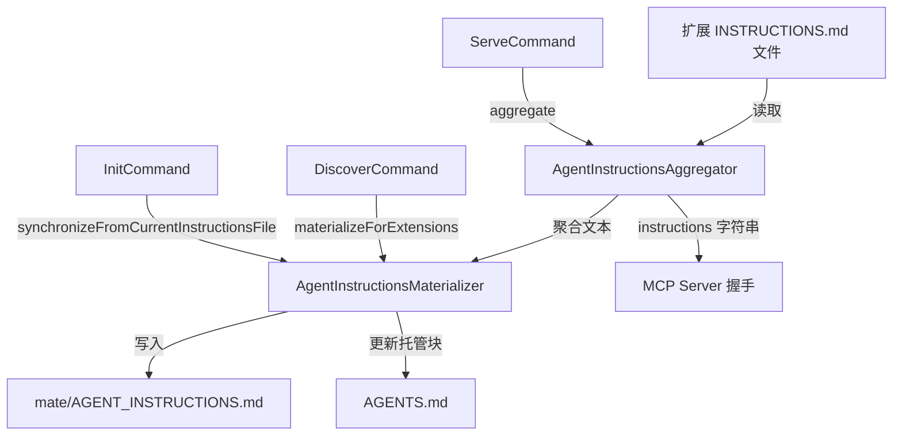

# Agent 目录分析报告

## 目录职责

Agent 目录负责管理 AI 代理（Coding Agent）的指令生命周期：从扩展中读取指令、聚合合并、写入文件系统，供 MCP 协议和文件系统两个渠道消费。

## 包含文件

| 文件 | 类 | 职责 |
|------|-----|------|
| `AgentInstructionsAggregator.php` | `AgentInstructionsAggregator` | 从所有扩展读取并聚合 INSTRUCTIONS.md |
| `AgentInstructionsMaterializer.php` | `AgentInstructionsMaterializer` | 将聚合结果写入 AGENT_INSTRUCTIONS.md 和 AGENTS.md |

## 设计模式

1. **职责链 (Chain of Responsibility)**: Aggregator 读取 → Materializer 写入，单向数据流
2. **聚合器模式**: Aggregator 从多个来源合并为一个文档
3. **标记模式**: Materializer 使用 HTML 注释标记管理 AGENTS.md 中的托管块

## 内部调用流程

## 两个消费渠道

1. **MCP 协议**: `ServeCommand` → `Aggregator.aggregate()` → Server Builder `setInstructions()` → AI 代理通过协议获取
2. **文件系统**: `DiscoverCommand` → `Materializer.materializeForExtensions()` → 写入文件 → AI 代理通过读取文件获取

## 与其他模块的交互

- **Discovery 层**: `ComposerExtensionDiscovery` 提供扩展数据中的 `instructions` 字段路径
- **Command 层**: `ServeCommand`、`DiscoverCommand`、`InitCommand` 是主要调用方
- **Service 层**: 日志通过 `LoggerInterface` 输出

## 可扩展性

1. 可添加新的指令来源（如数据库、远程 URL）
2. 可添加新的输出目标（如 `.cursorrules`、其他 AI 工具配置）
3. 指令内容可添加模板引擎支持
4. 标记模式可推广到更多文件的托管块管理

## 组合可能性

- 仅使用 `Aggregator` 读取指令用于自定义展示
- 使用 `Materializer` 管理任意文件中的标记块
- 两者组合用于构建自定义的 AI 代理配置管理流程
