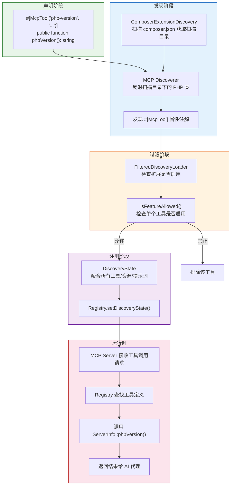
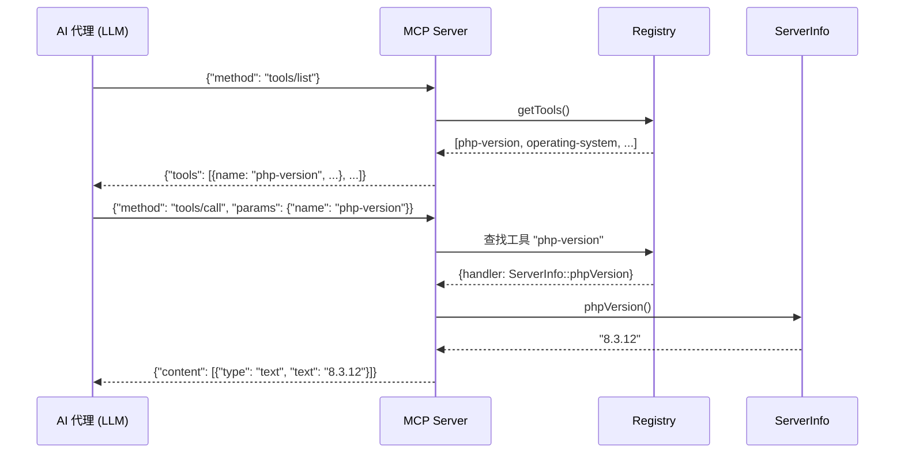
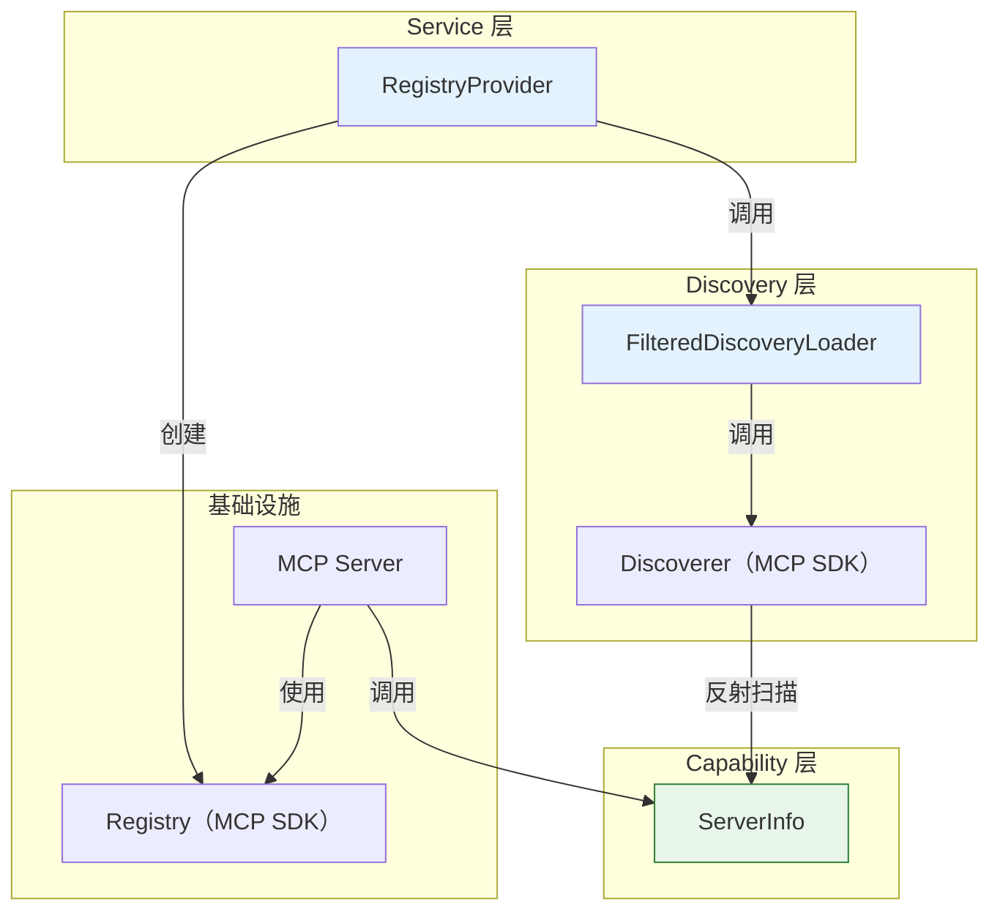
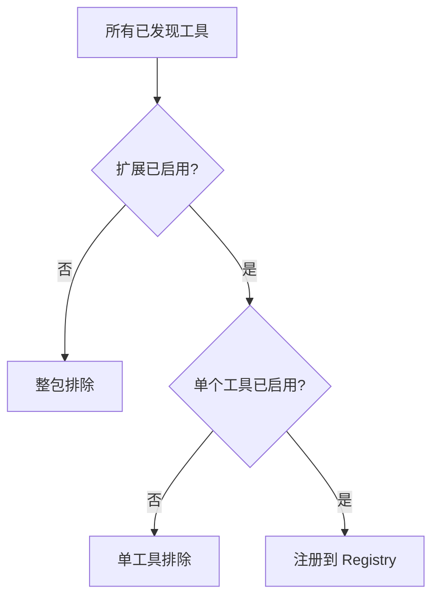

# Capability 目录分析报告

## 目录职责

`Capability/` 目录包含 Mate 模块内置的 MCP（Model Context Protocol）能力实现——即 AI 代理可以调用的工具（Tools）、资源（Resources）和提示词（Prompts）。这些能力通过 PHP 属性注解（`#[McpTool]`）声明，在运行时由 MCP Discoverer 自动发现并注册。

**目录路径**: `src/mate/src/Capability/`

---

## 包含的文件清单

| 文件 | 类名 | 提供的工具数量 | 状态 | 说明 |
|------|------|---------------|------|------|
| `ServerInfo.php` | `ServerInfo` | 4 | 无状态 | PHP 运行环境信息查询 |

**总计**: 1 个能力类，4 个 MCP 工具

---

## MCP 工具注册表

| 工具名 | 类 | 方法 | 返回类型 | 描述 |
|--------|-----|------|----------|------|
| `php-version` | `ServerInfo` | `phpVersion()` | `string` | 获取 PHP 版本号 |
| `operating-system` | `ServerInfo` | `operatingSystem()` | `string` | 获取操作系统名 |
| `operating-system-family` | `ServerInfo` | `operatingSystemFamily()` | `string` | 获取操作系统家族 |
| `php-extensions` | `ServerInfo` | `extensions()` | `array{extensions: string[]}` | 获取已加载 PHP 扩展列表 |

---

## 能力发现与注册流程

### 从声明到可调用的完整链路



### 时序图：MCP 工具调用



---

## 设计模式分析

### 1. 属性驱动注册模式（Attribute-Driven Registration）

这是 Capability 目录最核心的设计模式。MCP SDK 使用 PHP 8 属性注解实现声明式的工具注册：

```php
#[McpTool('tool-name', 'tool description')]
public function toolMethod(): ReturnType { ... }
```

**与其他注册方式的对比**:

| 方式 | 声明位置 | 发现机制 | 类型安全 | 示例 |
|------|----------|----------|----------|------|
| **属性注解** ✅ | 代码内联 | 反射扫描 | 编译时 | MCP SDK |
| YAML/XML 配置 | 外部文件 | 配置加载 | 运行时 | Symfony Services |
| 手动注册 | 引导代码 | 无需发现 | 编译时 | 传统方式 |
| 接口实现 | 类定义 | 类型检查 | 编译时 | Symfony Commands |

### 2. 无状态服务模式（Stateless Service）

所有 Capability 类设计为无状态：
- 无构造函数
- 无实例属性
- 方法为纯函数或仅依赖全局常量
- 可安全并发调用

### 3. 能力对象模式（Capability Object Pattern）

每个 Capability 类代表一组相关的能力，按领域组织：

| 类 | 领域 | 工具数 |
|-----|------|--------|
| `ServerInfo` | PHP 运行环境 | 4 |

这种按领域分组的方式使能力具有内聚性，便于整体启用/禁用。

---

## 与其他模块的关系

### 依赖链



### 消费链

| 消费者 | 交互方式 | 场景 |
|--------|----------|------|
| MCP Discoverer | 反射读取 `#[McpTool]` | 能力发现 |
| FilteredDiscoveryLoader | 过滤工具名 | 能力过滤 |
| MCP Server | 方法调用 | 运行时工具执行 |
| DebugCapabilitiesCommand | 枚举展示 | 调试输出 |
| ToolsListCommand | 枚举展示 | 工具列表 |
| ToolsCallCommand | 直接调用 | 手动测试 |

---

## 组合可能性

### 1. 扩展包提供额外能力

Mate 的插件机制允许第三方 Composer 包通过 `extra.ai-mate.scan-dirs` 提供自己的 Capability 类：

```json
{
    "name": "vendor/mate-database-tools",
    "extra": {
        "ai-mate": {
            "scan-dirs": ["src/MateCapability"]
        }
    }
}
```

```php
// vendor/mate-database-tools/src/MateCapability/DatabaseInfo.php
class DatabaseInfo
{
    #[McpTool('db-tables', 'List database tables')]
    public function listTables(): array { ... }
}
```

### 2. 按领域组织能力类

建议的能力类组织方式：

```
Capability/
├── ServerInfo.php          # 服务器环境信息（已有）
├── FileSystem.php          # 文件系统操作（潜在）
├── ComposerInfo.php        # Composer 依赖信息（潜在）
├── FrameworkInfo.php        # Symfony 框架信息（潜在）
└── CodeAnalysis.php         # 代码分析工具（潜在）
```

### 3. 参数化工具

当前的 `ServerInfo` 工具均无参数。MCP SDK 支持参数化工具：

```php
#[McpTool('ini-value', 'Get a specific PHP ini value')]
public function iniValue(
    #[McpToolParameter('key', 'The ini directive name')]
    string $key
): string {
    return ini_get($key) ?: 'not set';
}
```

### 4. 能力组合矩阵

| 组合 | 场景 | 效果 |
|------|------|------|
| ServerInfo + 文件系统工具 | 环境诊断 | AI 可完整诊断服务器环境 |
| ServerInfo + Composer 工具 | 依赖分析 | AI 了解项目依赖和 PHP 环境 |
| ServerInfo + 框架工具 | 开发辅助 | AI 了解 Symfony 版本和配置 |
| 跨扩展包的能力组合 | 插件生态 | 通过 `extensions.php` 统一管理 |

---

## 能力过滤机制

### 粒度控制

Mate 提供两级粒度的能力控制：

**1. 扩展级别**（`mate/extensions.php`）:
```php
return [
    'symfony/ai-mate' => ['enabled' => true],    // 整个核心包启用
    'vendor/some-tool' => ['enabled' => false],   // 整个第三方包禁用
];
```

**2. 工具级别**（`mate.disabled_features` 参数）:
```php
// 禁用核心包中的特定工具
'symfony/ai-mate' => [
    'php-extensions' => ['enabled' => false],  // 仅禁用扩展列表工具
],
```



---

## 质量评估

| 维度 | 评分 | 说明 |
|------|------|------|
| **代码简洁性** | ⭐⭐⭐⭐⭐ | 48 行，零冗余 |
| **无状态设计** | ⭐⭐⭐⭐⭐ | 纯函数，无副作用 |
| **可测试性** | ⭐⭐⭐⭐⭐ | 无需 Mock，直接断言返回值 |
| **可扩展性** | ⭐⭐⭐⭐ | 非 final，可继承添加工具 |
| **文档** | ⭐⭐⭐⭐ | MCP 注解提供描述，PHPDoc 定义返回类型 |
| **安全性** | ⭐⭐⭐⭐⭐ | 只读操作，无用户输入 |

### 安全性说明

`ServerInfo` 暴露的信息（PHP 版本、OS、扩展列表）属于环境元数据。在 MCP 场景中，这些信息对 AI 代理做出正确决策至关重要。但在公开暴露的场景中，应考虑通过能力过滤机制限制这些工具的可用性。
