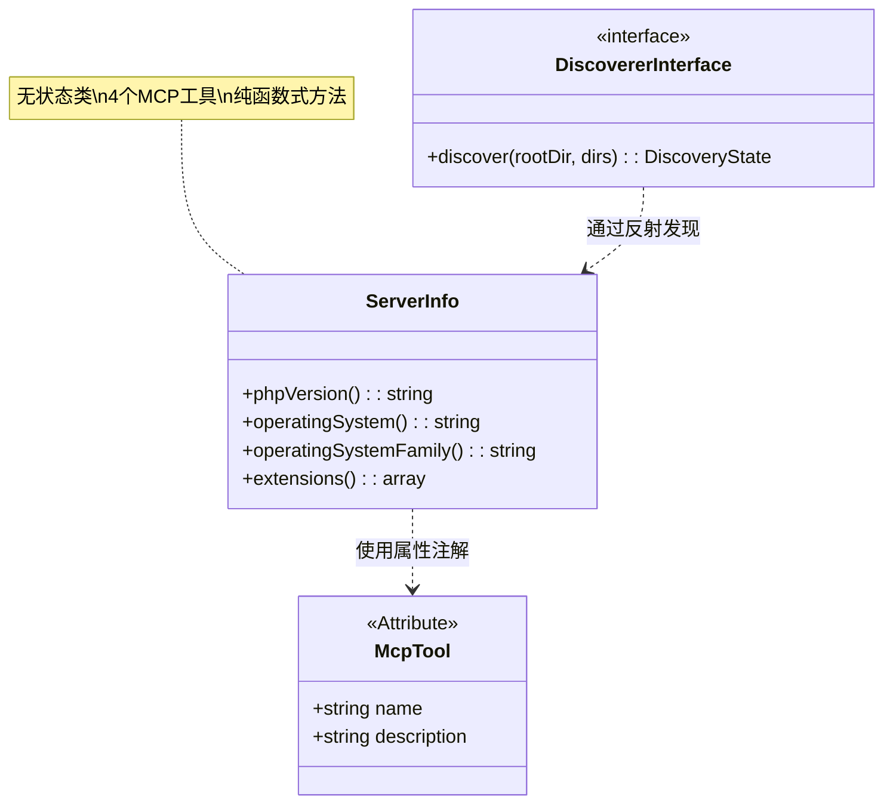
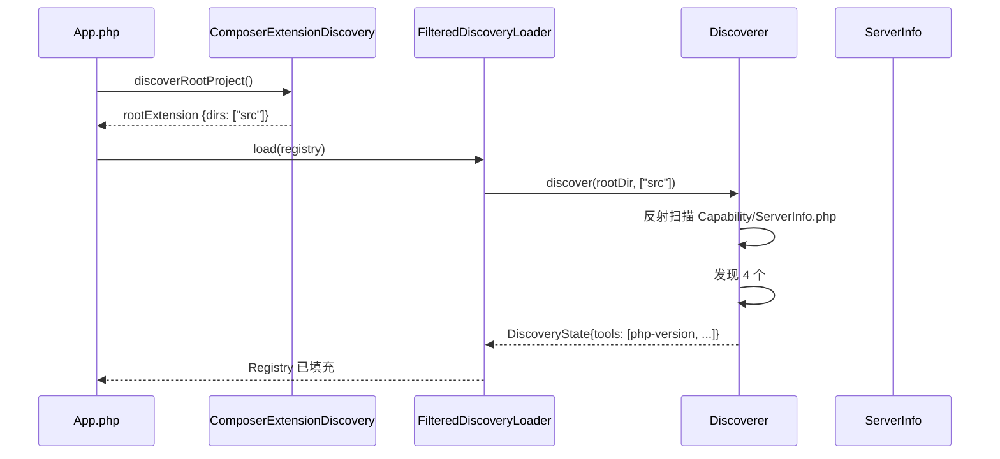
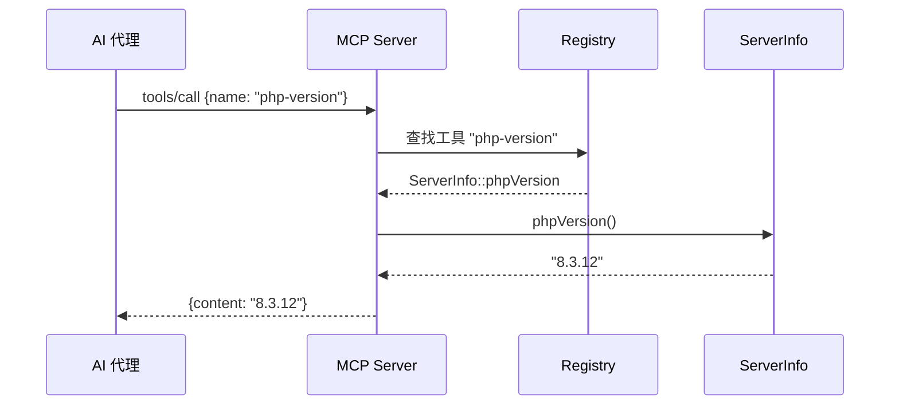

# ServerInfo 类分析报告

## 文件概述

| 属性 | 值 |
|------|-----|
| **文件路径** | `src/mate/src/Capability/ServerInfo.php` |
| **命名空间** | `Symfony\AI\Mate\Capability` |
| **类型** | 具体类（非 final） |
| **父类** | 无 |
| **作者** | Johannes Wachter, Tobias Nyholm |
| **行数** | 48 行 |

`ServerInfo` 是 Mate 模块内置的 MCP（Model Context Protocol）工具类，通过 PHP 属性注解（Attributes）声明一组用于获取服务器环境信息的轻量级工具。这些工具使 AI 代理能够了解其运行的 PHP 环境，包括 PHP 版本、操作系统和已加载的扩展。

---

## 类签名与依赖

### 类图



### 导入依赖

| 依赖 | 类型 | 来源 | 用途 |
|------|------|------|------|
| `Mcp\Capability\Attribute\McpTool` | 属性类 | `mcp/sdk` | MCP 工具声明注解 |

> 这是该类的**唯一**外部依赖，体现了极简的设计理念。

### 构造函数

该类**无构造函数**，也**无实例属性**。所有方法均为纯函数（依赖 PHP 常量和内置函数），可以直接在无状态实例上调用。

---

## 方法级别分析

### 工具注册机制

每个公开方法通过 `#[McpTool]` 属性注解声明为 MCP 工具：

```php
#[McpTool(name: string, description: string)]
```

MCP Discoverer 在能力发现阶段通过 PHP 反射读取这些属性，将方法注册为可调用的工具。

---

### 1. `phpVersion(): string`

```php
#[McpTool('php-version', 'Get the version of PHP')]
public function phpVersion(): string
{
    return \PHP_VERSION;
}
```

| 属性 | 值 |
|------|-----|
| **MCP 工具名** | `php-version` |
| **描述** | `Get the version of PHP` |
| **输入参数** | 无 |
| **返回类型** | `string` |
| **返回值** | `PHP_VERSION` 常量（如 `"8.3.12"`） |
| **副作用** | 无 |
| **确定性** | 确定性（同一 PHP 安装返回相同值） |

**使用场景**: AI 代理判断 PHP 版本以决定可用的语言特性（如 PHP 8.1+ 的纤程、枚举等）。

---

### 2. `operatingSystem(): string`

```php
#[McpTool('operating-system', 'Get the current operating system')]
public function operatingSystem(): string
{
    return \PHP_OS;
}
```

| 属性 | 值 |
|------|-----|
| **MCP 工具名** | `operating-system` |
| **描述** | `Get the current operating system` |
| **输入参数** | 无 |
| **返回类型** | `string` |
| **返回值** | `PHP_OS` 常量（如 `"Linux"`, `"Darwin"`, `"WINNT"`） |
| **副作用** | 无 |

**使用场景**: AI 代理根据操作系统选择合适的命令或路径分隔符。

---

### 3. `operatingSystemFamily(): string`

```php
#[McpTool('operating-system-family', 'Get the current operating system family')]
public function operatingSystemFamily(): string
{
    return \PHP_OS_FAMILY;
}
```

| 属性 | 值 |
|------|-----|
| **MCP 工具名** | `operating-system-family` |
| **描述** | `Get the current operating system family` |
| **输入参数** | 无 |
| **返回类型** | `string` |
| **返回值** | `PHP_OS_FAMILY` 常量（如 `"Linux"`, `"Darwin"`, `"Windows"`, `"BSD"`） |
| **副作用** | 无 |

**与 `operatingSystem()` 的区别**:

| 方法 | 返回值示例 | 粒度 |
|------|-----------|------|
| `operatingSystem()` | `"Darwin"`, `"WINNT"`, `"FreeBSD"` | 具体操作系统名 |
| `operatingSystemFamily()` | `"Darwin"`, `"Windows"`, `"BSD"` | 操作系统家族 |

**使用场景**: AI 代理在进行跨平台逻辑判断时，使用 family 级别的粗粒度分类更为可靠。

---

### 4. `extensions(): array`

```php
/**
 * @return array{extensions: string[]}
 */
#[McpTool('php-extensions', 'Get a list of PHP extensions')]
public function extensions(): array
{
    return ['extensions' => get_loaded_extensions()];
}
```

| 属性 | 值 |
|------|-----|
| **MCP 工具名** | `php-extensions` |
| **描述** | `Get a list of PHP extensions` |
| **输入参数** | 无 |
| **返回类型** | `array{extensions: string[]}` |
| **返回值** | 包含所有已加载 PHP 扩展名的数组 |
| **副作用** | 无 |

**返回值结构示例**:
```json
{
    "extensions": ["Core", "date", "json", "openssl", "pcre", "pdo", "mbstring", ...]
}
```

**使用场景**: AI 代理检查特定扩展是否可用（如 `pdo_mysql`、`redis`、`intl`），为用户提供环境诊断或依赖建议。

> 注意：返回值使用 `['extensions' => ...]` 包装而非直接返回数组，这是 MCP 工具的惯用做法——提供语义化的键名便于 AI 理解返回值结构。

---

## 设计模式分析

### 1. 属性驱动注册模式（Attribute-Driven Registration）

这是 Mate 模块 MCP 能力声明的核心模式。通过 PHP 8 属性注解取代传统的配置文件或手动注册：


**优势**:
- **就近声明**: 工具的元数据与实现代码紧邻
- **零配置**: 无需额外的注册文件
- **IDE 友好**: 属性注解提供类型检查和自动补全
- **可发现**: 通过反射即可获取所有工具信息

### 2. 无状态服务模式（Stateless Service）

`ServerInfo` 没有构造函数、没有实例属性、所有方法无副作用。这意味着：
- 可安全地多线程/并发调用
- 不需要特殊的生命周期管理
- 可以作为单例或每次创建新实例，行为完全一致

### 3. 环境内省模式（Environment Introspection）

所有方法都通过 PHP 内置常量或函数获取环境信息，而非外部配置。这是一种"零配置环境感知"的设计：

| 数据来源 | 方法 | 说明 |
|----------|------|------|
| `\PHP_VERSION` | `phpVersion()` | 编译时常量 |
| `\PHP_OS` | `operatingSystem()` | 编译时常量 |
| `\PHP_OS_FAMILY` | `operatingSystemFamily()` | PHP 7.2+ 编译时常量 |
| `get_loaded_extensions()` | `extensions()` | 运行时查询 |

### 4. 外观模式（Facade Pattern — 轻量级）

将多个 PHP 常量和函数调用封装为语义化的方法名，为 AI 代理提供统一、易理解的环境信息入口。

---

## 在模块中的调用场景

### 1. 能力发现与注册

`ServerInfo` 随 Mate 核心包被自动发现：



### 2. MCP 工具调用

当 AI 代理通过 MCP 协议请求调用工具时：



### 3. 调试命令

```bash
$ mate debug:capabilities

Tools:
  php-version              Get the version of PHP
  operating-system         Get the current operating system
  operating-system-family  Get the current operating system family
  php-extensions           Get a list of PHP extensions
```

---

## 可扩展性分析

### 可继承性

`ServerInfo` 类**未声明 `final`**，可以被继承以添加更多工具方法：

```php
class ExtendedServerInfo extends ServerInfo
{
    #[McpTool('php-ini-values', 'Get important PHP ini values')]
    public function iniValues(): array
    {
        return [
            'memory_limit' => ini_get('memory_limit'),
            'max_execution_time' => ini_get('max_execution_time'),
        ];
    }
}
```

### 扩展方向

| 方向 | 可行性 | 方式 |
|------|--------|------|
| 添加更多环境信息工具 | 高 | 添加新的 `#[McpTool]` 方法 |
| 添加运行时配置查询 | 高 | `ini_get()`, `phpinfo()` 等 |
| 添加 Composer 信息 | 中等 | 需注入 `rootDir` 参数 |
| 添加框架信息（Symfony 版本等） | 中等 | 需额外依赖 |
| 添加性能指标 | 高 | `memory_get_usage()`, `sys_getloadavg()` 等 |

### 新工具添加示例

在同一类中添加新工具只需一个方法和一个属性注解：

```php
#[McpTool('php-memory-limit', 'Get the PHP memory limit')]
public function memoryLimit(): string
{
    return ini_get('memory_limit') ?: 'unlimited';
}
```

无需修改任何配置文件或注册代码 — Discoverer 会自动通过反射发现新方法。

---

## 技巧与最佳实践

### 1. 结构化返回值

```php
return ['extensions' => get_loaded_extensions()];
```

而非直接返回 `get_loaded_extensions()`。使用关联数组包装返回值，为 AI 代理提供语义化的字段名，提升 MCP 响应的可解释性。

### 2. PHP 内置常量的直接使用

```php
return \PHP_VERSION;  // 使用反斜杠前缀访问全局常量
```

使用 `\` 前缀（全局命名空间）访问 PHP 常量，避免命名空间解析开销，也是 Symfony 编码规范的推荐写法。

### 3. 属性注解的声明式编程

```php
#[McpTool('php-version', 'Get the version of PHP')]
public function phpVersion(): string
```

将元数据（工具名、描述）与行为（方法实现）紧密耦合，遵循"就近原则"（Principle of Proximity）。相比 YAML/XML 配置或手动注册，代码的内聚性更强。

### 4. 最小依赖原则

整个类仅依赖 `Mcp\Capability\Attribute\McpTool` 一个外部类。没有日志、没有配置、没有 I/O。这种极简设计使类：
- 易于测试（无需 Mock）
- 易于理解（47 行代码）
- 易于维护（无状态突变）

### 5. 方法命名与 MCP 工具名的映射关系

| PHP 方法 | MCP 工具名 | 命名规则 |
|----------|-----------|----------|
| `phpVersion()` | `php-version` | camelCase → kebab-case |
| `operatingSystem()` | `operating-system` | camelCase → kebab-case |
| `operatingSystemFamily()` | `operating-system-family` | camelCase → kebab-case |
| `extensions()` | `php-extensions` | 添加 `php-` 前缀以消歧义 |

MCP 工具名使用 kebab-case 格式，与 PHP 方法名的 camelCase 形成一致的映射规则。
