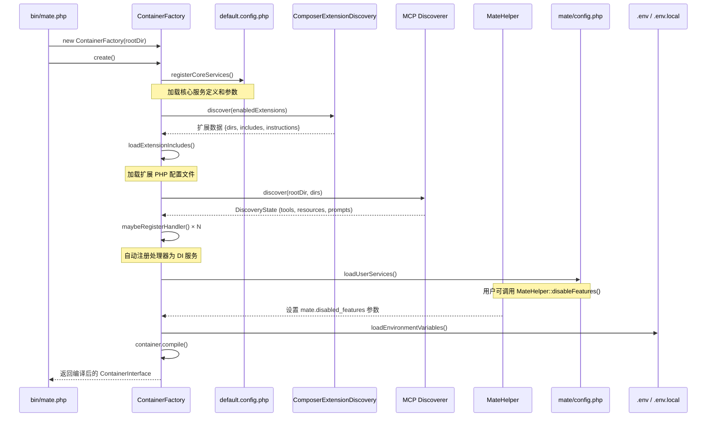
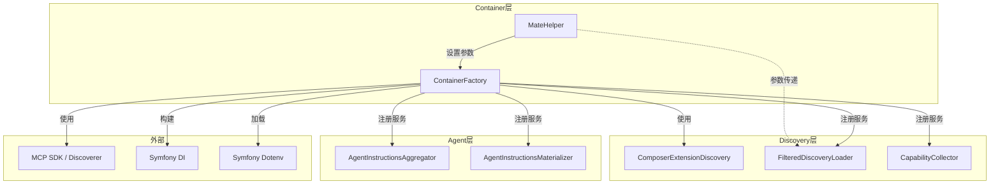

# Container 目录分析报告

## 8. 目录职责

Container 目录是 Mate 模块的**依赖注入基础设施层**，负责：

- **容器构建**：通过 `ContainerFactory` 编排分层加载策略，将核心服务、扩展服务、用户服务和环境变量统一注入 Symfony DI 容器
- **用户配置 API**：通过 `MateHelper` 提供语义化的静态方法，简化用户在 `mate/config.php` 中的配置操作
- **服务自动发现**：结合 MCP Discoverer 自动扫描 PHP 类中的 MCP 属性，将工具/资源/提示处理器注册为 DI 服务

| 文件 | 职责 |
|------|------|
| `ContainerFactory.php` | 核心工厂，构建完整配置的 DI 容器 |
| `MateHelper.php` | 用户配置辅助工具，提供功能禁用等静态 API |

---

## 9. 内部调用流程图



---

## 10. 与其他模块的交互



**交互关系说明**：

| 方向 | 目标 | 交互方式 |
|------|------|---------|
| Container → Discovery | `ComposerExtensionDiscovery` | 直接实例化并调用发现扩展 |
| Container → Discovery | `FilteredDiscoveryLoader` | 注册为 DI 服务，传递 `mate.disabled_features` |
| Container → Agent | `AgentInstructionsAggregator` / `Materializer` | 注册为 DI 服务 |
| Container → MCP SDK | `Discoverer` | 扫描目录发现 MCP 能力 |
| MateHelper → Container | 容器参数 | 设置 `mate.disabled_features` 参数 |

---

## 11. 组合可能性

### 11.1 自定义扩展开发

第三方包通过 `composer.json` 的 `extra.ai-mate` 配置即可被 Container 层自动发现和加载：

```json
{
    "extra": {
        "ai-mate": {
            "scan-dirs": ["src/MCP"],
            "includes": ["config/mate.php"]
        }
    }
}
```

### 11.2 测试隔离

可利用 `ContainerFactory` 构建独立的测试容器，配合 `MateHelper::disableFeatures()` 精确控制测试范围。

### 11.3 多环境配置

通过 `.env` / `.env.local` 文件和容器参数的组合，支持开发、测试、生产等多环境配置切换。

### 11.4 扩展组合控制

`extensions.php`（扩展级别开关）与 `MateHelper::disableFeatures()`（功能级别开关）提供了两层粒度的控制：

```
扩展级别：extensions.php → enabled: true/false
功能级别：MateHelper::disableFeatures() → 禁用特定工具/资源
```
