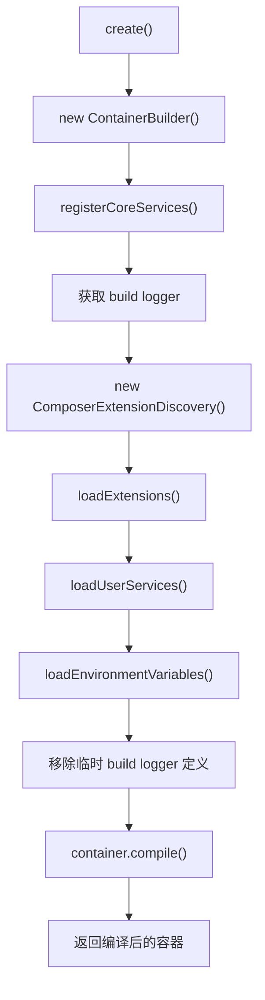
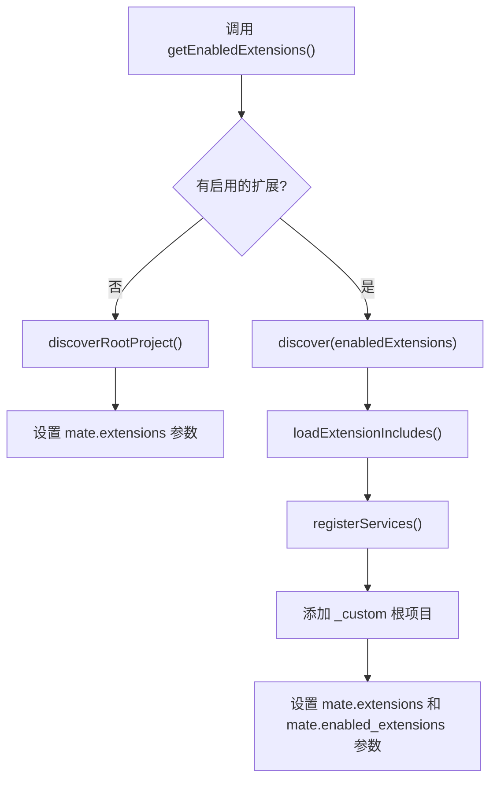
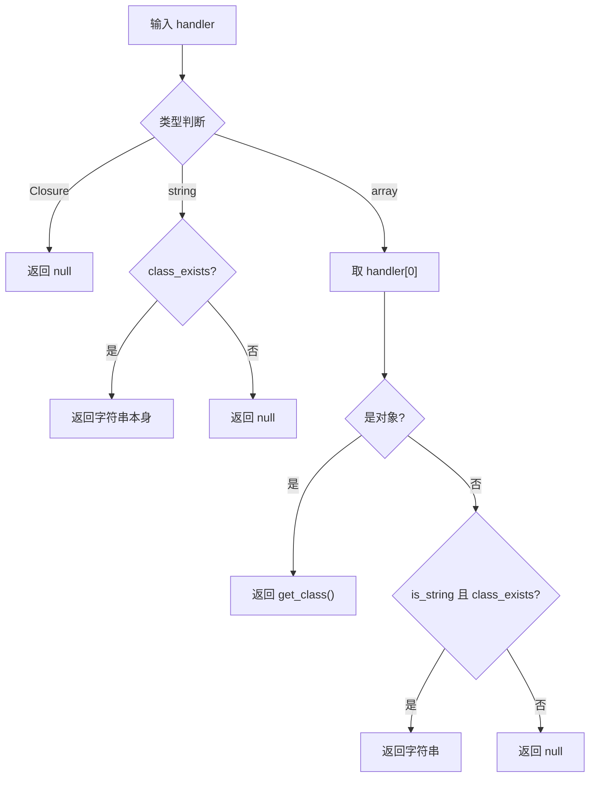
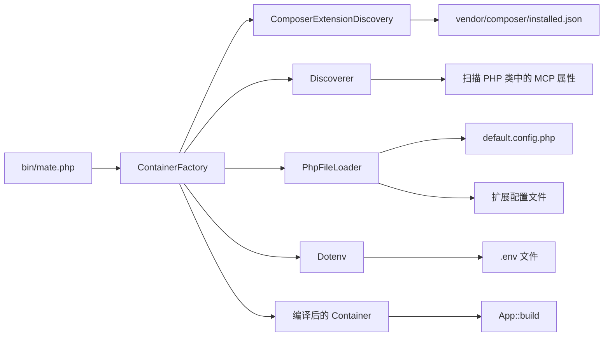

# ContainerFactory.php 深度分析报告

## 1. 文件概述

`ContainerFactory.php` 是 Mate 模块的**核心工厂类**，负责构建一个完整配置的 Symfony 依赖注入容器。该容器集成了所有 MCP（Model Context Protocol）扩展的服务定义、用户自定义配置、环境变量以及自动发现的工具/资源/提示处理器。

作为整个 Mate 应用的启动入口之一，`ContainerFactory` 通过分层加载策略，将核心服务、扩展服务、用户服务和环境变量按顺序注册到容器中，最终编译生成一个高性能的不可变容器实例。

**文件路径**：`src/mate/src/Container/ContainerFactory.php`

---

## 2. 类签名与依赖

### 命名空间与导入

```php
namespace Symfony\AI\Mate\Container;

use Mcp\Capability\Discovery\Discoverer;
use Psr\Log\LoggerInterface;
use Symfony\AI\Mate\Discovery\ComposerExtensionDiscovery;
use Symfony\AI\Mate\Exception\MissingDependencyException;
use Symfony\Component\Config\FileLocator;
use Symfony\Component\DependencyInjection\ContainerBuilder;
use Symfony\Component\DependencyInjection\ContainerInterface;
use Symfony\Component\DependencyInjection\Loader\PhpFileLoader;
use Symfony\Component\Dotenv\Dotenv;
```

### 类声明

```php
final class ContainerFactory
```

- 使用 `final` 修饰符，禁止继承
- 不实现任何接口或使用 trait
- 作者：Johannes Wachter、Tobias Nyholm

### 属性

| 属性 | 类型 | 可见性 | 说明 |
|------|------|--------|------|
| `$rootDir` | `string` | `private` | 项目根目录路径 |

### 构造函数

```php
public function __construct(
    private string $rootDir,
)
```

### 外部依赖关系

| 依赖 | 来源 | 用途 |
|------|------|------|
| `Discoverer` | MCP SDK | 扫描目录发现 MCP 能力（工具/资源/提示） |
| `ComposerExtensionDiscovery` | Mate Discovery 层 | 从 Composer 包中发现扩展 |
| `PhpFileLoader` | Symfony Config | 加载 PHP 配置文件 |
| `FileLocator` | Symfony Config | 定位配置文件路径 |
| `ContainerBuilder` | Symfony DI | 构建依赖注入容器 |
| `Dotenv` | Symfony Dotenv（可选） | 加载 `.env` 环境变量文件 |
| `LoggerInterface` | PSR-3 | 日志记录 |
| `MissingDependencyException` | Mate Exception | 缺失依赖时的异常 |

---

## 3. 方法级别分析

### 3.1 `create(): ContainerInterface`（公有方法）

**职责**：主入口方法，编排整个容器构建流程。

**输入**：无参数

**输出**：`ContainerInterface` —— 完全编译的 Symfony DI 容器

**执行流程**：



**关键实现细节**：
- 创建临时的 `_build.logger` 服务用于构建过程中的日志记录
- 在编译前移除该临时服务定义，避免污染最终容器
- 调用 `$container->compile()` 后容器变为不可变的冻结状态

---

### 3.2 `registerCoreServices(ContainerBuilder $container): void`（私有方法）

**职责**：加载 `default.config.php` 中定义的核心服务。

**输入**：
- `$container`：`ContainerBuilder` —— 待配置的容器构建器

**输出**：`void`

**实现逻辑**：
1. 创建 `PhpFileLoader` 实例，指向 `src` 目录
2. 加载 `default.config.php` 配置文件
3. 设置 `mate.root_dir` 容器参数

**加载的核心配置**：
- 容器参数：`mate.root_dir`、`mate.cache_dir`、`mate.env_file`、`mate.disabled_features` 等
- 服务绑定：`$rootDir`、`$cacheDir`、`$extensions`、`$disabledFeatures` 等命名参数
- 核心服务：Logger、Discoverer、FilteredDiscoveryLoader、CapabilityCollector 等
- 命令服务：InitCommand、ServeCommand、DiscoverCommand 等

---

### 3.3 `loadExtensions(ContainerBuilder $container, ComposerExtensionDiscovery $extensionDiscovery, LoggerInterface $logger): void`（私有方法）

**职责**：发现、加载并注册所有启用的 MCP 扩展。

**输入**：
- `$container`：`ContainerBuilder`
- `$extensionDiscovery`：`ComposerExtensionDiscovery` —— 扩展发现服务
- `$logger`：`LoggerInterface`

**输出**：`void`

**执行流程**：



**关键行为**：
- 若无启用的扩展，仅发现根项目配置
- 启用的扩展通过白名单过滤传递给 `discover()` 方法
- `_custom` 键名保留给根项目自身的 MCP 配置

---

### 3.4 `registerServices(ContainerBuilder $container, array $extensions, LoggerInterface $logger): void`（私有方法）

**职责**：使用 MCP Discoverer 自动发现并注册所有扩展中的工具、资源、提示和模板处理器。

**输入**：
- `$container`：`ContainerBuilder`
- `$extensions`：`array<string, array{dirs: string[], includes: string[]}>` —— 扩展数据映射
- `$logger`：`LoggerInterface`

**输出**：`void`

**实现逻辑**：
1. 创建 `Discoverer` 实例
2. 遍历每个扩展，调用 `Discoverer::discover()` 扫描指定目录
3. 获取 `DiscoveryState`，迭代其工具、资源、提示和资源模板
4. 对每个能力的处理器调用 `maybeRegisterHandler()`

**处理的能力类型**：
- `getTools()` → 工具（Tool）
- `getResources()` → 资源（Resource）
- `getPrompts()` → 提示（Prompt）
- `getResourceTemplates()` → 资源模板（ResourceTemplate）

---

### 3.5 `maybeRegisterHandler(ContainerBuilder $container, \Closure|array|string $handler): void`（私有方法）

**职责**：有条件地将处理器类注册为容器服务。

**输入**：
- `$container`：`ContainerBuilder`
- `$handler`：`\Closure|array|string` —— 处理器引用

**输出**：`void`

**处理逻辑**：

| 处理器类型 | 行为 |
|-----------|------|
| `\Closure` | 跳过，不注册（闭包无法序列化） |
| `string`（类名） | 提取类名，注册为服务 |
| `array` `[object\|string, method]` | 提取第一个元素的类名，注册为服务 |

**注册行为**：
- 若容器中已有该类定义：标记为 `public`
- 若容器中无该类定义：创建新定义，启用 `autowired` 和 `public`

---

### 3.6 `extractClassName(\Closure|array|string $handler): ?string`（私有方法）

**职责**：从各种格式的处理器引用中提取类名。

**输入**：`$handler` —— `\Closure|array|string`

**输出**：`?string` —— 类名或 `null`

**提取逻辑**：



---

### 3.7 `getEnabledExtensions(): array`（私有方法）

**职责**：读取并解析 `mate/extensions.php` 文件获取启用的扩展列表。

**输入**：无

**输出**：`array<string>` —— 启用的包名数组

**文件格式**：

```php
// mate/extensions.php
return [
    'vendor/package-a' => ['enabled' => true],
    'vendor/package-b' => ['enabled' => false],
];
```

**处理逻辑**：
1. 检查文件是否存在，不存在则返回空数组
2. `include` 文件并验证返回值为数组
3. 遍历配置项，仅包含 `enabled => true` 的包
4. 验证键为字符串、值为数组

---

### 3.8 `loadExtensionIncludes(ContainerBuilder $container, LoggerInterface $logger, string $packageName, array $includeFiles): void`（私有方法）

**职责**：加载扩展提供的 PHP 配置文件。

**输入**：
- `$container`：`ContainerBuilder`
- `$logger`：`LoggerInterface`
- `$packageName`：`string` —— 包名（用于日志）
- `$includeFiles`：`array<string>` —— 配置文件绝对路径列表

**输出**：`void`

**错误处理**：
- 文件不存在时记录警告日志并跳过
- 加载异常时捕获并记录警告，不中断整体流程

---

### 3.9 `loadEnvironmentVariables(ContainerBuilder $container): void`（私有方法）

**职责**：从 `.env` 文件加载环境变量。

**输入**：`$container` —— `ContainerBuilder`

**输出**：`void`

**实现逻辑**：
1. 读取 `mate.env_file` 参数
2. 若为空则静默返回
3. 检查 `Dotenv` 类是否可用（可选依赖）
4. 不可用时抛出 `MissingDependencyException`
5. 加载主文件 `{rootDir}/{env_file}` 和本地覆盖文件 `{rootDir}/{env_file}.local`

---

### 3.10 `loadUserServices(ContainerBuilder $container, ComposerExtensionDiscovery $extensionDiscovery, LoggerInterface $logger): void`（私有方法）

**职责**：加载用户根项目中自定义的服务配置。

**输入**：
- `$container`：`ContainerBuilder`
- `$extensionDiscovery`：`ComposerExtensionDiscovery`
- `$logger`：`LoggerInterface`

**输出**：`void`

**实现逻辑**：
1. 调用 `$extensionDiscovery->discoverRootProject()` 获取根项目配置
2. 遍历其 `includes` 文件列表
3. 对每个文件创建 `PhpFileLoader` 并加载
4. 异常时记录警告，不中断流程

**加载优先级**：用户服务最后加载，可覆盖或扩展扩展定义

---

## 4. 设计模式分析

### 4.1 工厂方法模式（Factory Method）

`create()` 方法作为工厂方法，封装了容器创建的复杂逻辑。调用方只需传入 `rootDir`，即可获得完全配置的容器实例。

### 4.2 构建者模式（Builder Pattern）

整个 `create()` 方法体现了构建者模式的思想——通过一系列有序的步骤（`registerCoreServices` → `loadExtensions` → `loadUserServices` → `loadEnvironmentVariables` → `compile`）逐步构建最终产品。

### 4.3 模板方法模式（Template Method）

`create()` 定义了容器构建的骨架算法，各步骤作为私有方法实现。虽然类被标记为 `final`，但步骤的编排顺序本身就是一种模板。

### 4.4 服务定位器模式（Service Locator）

最终生成的 `ContainerInterface` 实际上充当了服务定位器的角色，提供对所有注册服务的集中访问。

### 4.5 优雅降级模式（Graceful Degradation）

扩展加载过程中采用了优雅降级策略：
- 缺失的配置文件被记录警告但不中断执行
- 无效的扩展配置被跳过
- 可选依赖（如 Dotenv）在缺失时提供明确的错误信息

---

## 5. 在模块中的调用场景

### 5.1 应用启动入口

```php
// bin/mate.php
$containerFactory = new ContainerFactory($root);
$container = $containerFactory->create();
App::build($container)->run();
```

这是 ContainerFactory 的主要使用场景——作为 CLI 应用的启动引导。

### 5.2 测试环境

在测试中，ContainerFactory 通常用于构建测试用容器：

```php
$factory = new ContainerFactory($testRootDir);
$container = $factory->create();
$service = $container->get(SomeService::class);
```

### 5.3 与其他层的交互



---

## 6. 可扩展性分析

### 6.1 扩展注册机制

通过 Composer 的 `extra.ai-mate` 配置，第三方包可以无侵入地注册 MCP 能力：

```json
{
    "extra": {
        "ai-mate": {
            "scan-dirs": ["src"],
            "includes": ["config/services.php"],
            "instructions": "INSTRUCTIONS.md"
        }
    }
}
```

### 6.2 用户配置覆盖

用户可通过 `mate/config.php` 覆盖或扩展任何服务定义，同时使用 `MateHelper::disableFeatures()` 精细控制扩展功能。

### 6.3 环境变量支持

通过 `mate.env_file` 参数和 Dotenv 集成，支持在不同环境（开发/测试/生产）中使用不同配置。

### 6.4 局限性

- 类为 `final`，无法通过继承扩展容器构建流程
- 加载步骤顺序固定，无法插入自定义的加载阶段
- 扩展发现仅支持 Composer 安装的包

---

## 7. 技巧与最佳实践

### 7.1 分层加载策略

```
核心服务 (default.config.php)
    ↓ 被扩展覆盖
扩展服务 (includes 文件)
    ↓ 被用户覆盖
用户服务 (mate/config.php)
    ↓ 最终注入
环境变量 (.env / .env.local)
```

后加载的服务定义可覆盖先前的定义，这种分层策略确保了用户始终拥有最终控制权。

### 7.2 临时服务模式

构建过程中使用临时的 `_build.logger` 服务，在编译前移除。这是一种巧妙的技巧——在容器编译期间需要但最终不需要暴露的服务。

### 7.3 处理器自动注册

`maybeRegisterHandler()` 通过分析处理器类型自动注册依赖注入服务定义，省去了手动注册每个工具类的繁琐工作。配合 `autowire` 功能，工具类的依赖会被自动解析。

### 7.4 安全性考量

- 文件路径验证防止路径遍历攻击
- 通过白名单（`extensions.php`）控制扩展加载
- 环境变量文件按约定路径加载，避免任意文件读取

### 7.5 错误处理策略

采用"记录并继续"的策略——扩展配置加载失败不会阻止整个应用启动。这在多扩展环境中尤为重要，一个有缺陷的扩展不应影响其他扩展的正常运行。
