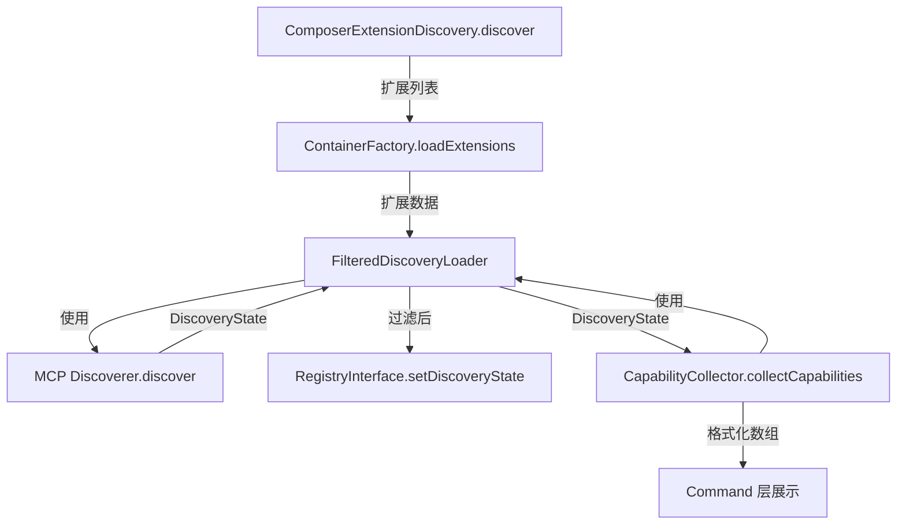

# Discovery 目录分析报告

## 目录职责

Discovery 目录负责 MCP 扩展的发现、能力加载与格式化输出，是 Mate 模块的核心基础设施层。

## 包含文件

| 文件 | 类 | 职责 |
|------|-----|------|
| `ComposerExtensionDiscovery.php` | `ComposerExtensionDiscovery` | 从 Composer 包中发现 MCP 扩展 |
| `FilteredDiscoveryLoader.php` | `FilteredDiscoveryLoader` | 发现并过滤 MCP 能力（工具/资源/提示/模板） |
| `CapabilityCollector.php` | `CapabilityCollector` | 将 MCP 能力引用格式化为可展示的数组 |

## 设计模式

1. **策略模式 (Strategy)**: `ComposerExtensionDiscovery` 封装了"从 Composer 包发现扩展"这一策略，可替换为其他发现策略。
2. **装饰器模式 (Decorator)**: `FilteredDiscoveryLoader` 包装了 MCP SDK 的 `Discoverer`，在其基础上添加了特性过滤功能。
3. **适配器模式 (Adapter)**: `CapabilityCollector` 将 MCP SDK 的 Reference 对象适配为简单数组结构。
4. **懒加载 (Lazy Loading)**: `ComposerExtensionDiscovery` 缓存 `installedPackages` 避免重复读取 JSON。

## 内部调用流程



## 与其他模块的交互

- **Container 层**: `ContainerFactory` 使用 `ComposerExtensionDiscovery` 发现扩展并注册服务
- **Service 层**: `RegistryProvider` 使用 `FilteredDiscoveryLoader` 加载能力到 Registry
- **Command 层**: `DebugCapabilitiesCommand`、`ToolsListCommand`、`ToolsInspectCommand` 使用 `CapabilityCollector` 格式化输出
- **Agent 层**: `DiscoverCommand` 将发现结果传递给 `AgentInstructionsMaterializer`

## 数据流

```
installed.json → ComposerExtensionDiscovery → ExtensionData[]
                                                    ↓
                              FilteredDiscoveryLoader.loadByExtension()
                                                    ↓
                                    MCP Discoverer.discover(rootDir, dirs)
                                                    ↓
                                         DiscoveryState (tools, resources, prompts, templates)
                                                    ↓
                                    isFeatureAllowed() 过滤
                                                    ↓
                                         过滤后的 DiscoveryState
                                           ↙              ↘
                            Registry (运行时)      CapabilityCollector (调试)
```

## 可扩展性

1. 可实现自定义的扩展发现机制替换 `ComposerExtensionDiscovery`
2. `FilteredDiscoveryLoader` 的过滤逻辑可扩展（当前仅支持 enabled/disabled）
3. `CapabilityCollector` 可扩展输出格式
4. 三个类可独立使用，也可自由组合

## 组合可能性

- 仅使用 `ComposerExtensionDiscovery` 扫描 Composer 包中的 ai-mate 配置
- 使用 `FilteredDiscoveryLoader` + 自定义过滤规则实现更细粒度的能力控制
- 使用 `CapabilityCollector` 构建自定义的能力展示界面
