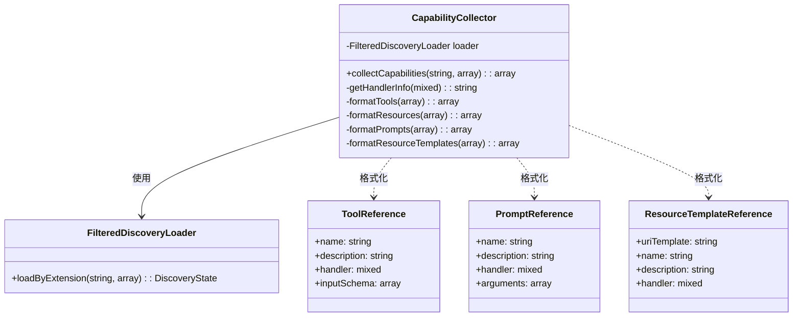
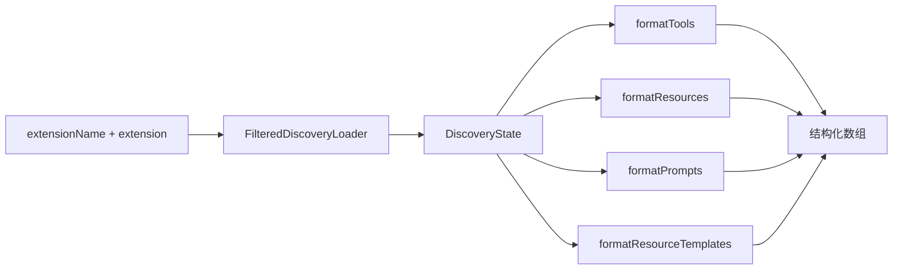
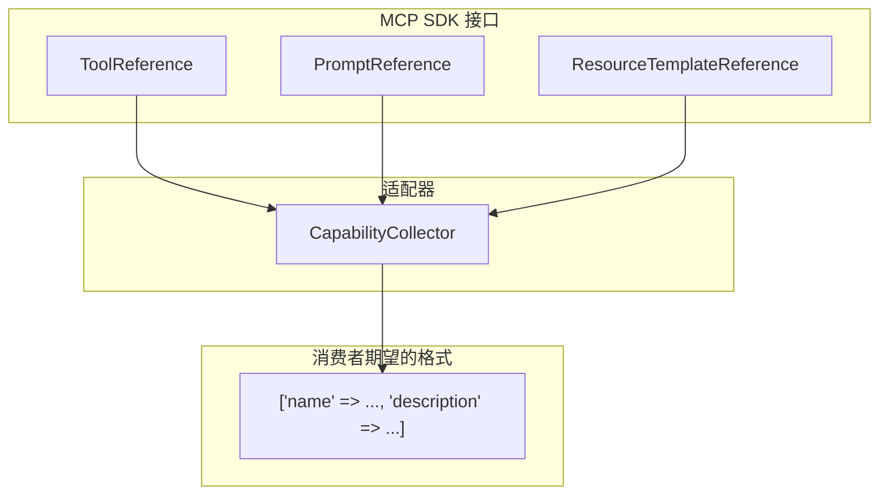
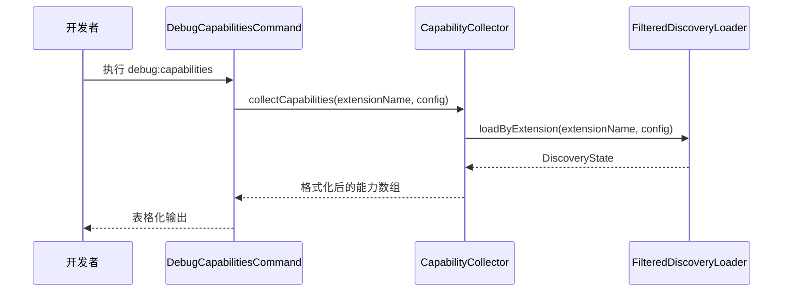
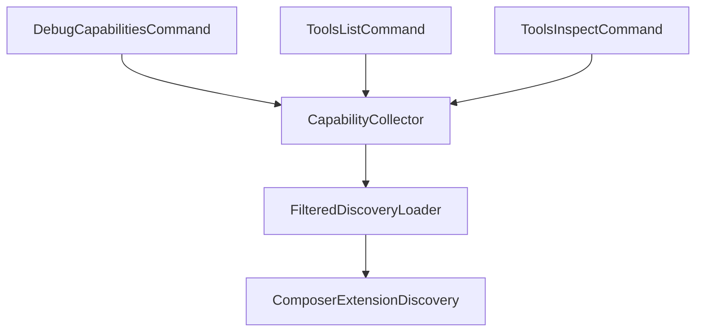
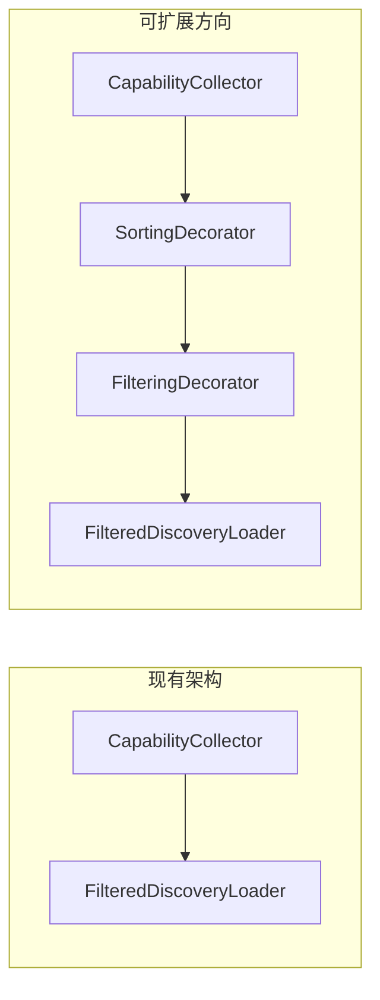

# CapabilityCollector 源码分析报告

## 1. 文件概述

`CapabilityCollector.php` 位于 `src/mate/src/Discovery/` 目录下，隶属于 Symfony AI Mate 模块的发现层（Discovery Layer）。该类的核心职责是**收集并格式化 MCP（Model Context Protocol）能力信息**，将底层的能力引用对象转换为结构化的数组格式，以供命令行工具和调试界面展示。

该类是发现层的最终输出节点——它不直接参与能力的发现或过滤过程，而是作为**展示适配器**，将内部数据模型转化为人类可读的格式。

## 2. 类签名与依赖

### 类定义

```php
namespace Symfony\AI\Mate\Discovery;

use Mcp\Capability\Registry\PromptReference;
use Mcp\Capability\Registry\ResourceTemplateReference;
use Mcp\Capability\Registry\ToolReference;

class CapabilityCollector
{
    public function __construct(private FilteredDiscoveryLoader $loader) {}
}
```

### 依赖关系

| 依赖类型 | 依赖对象 | 说明 |
|---------|---------|------|
| 构造函数注入 | `FilteredDiscoveryLoader` | 提供经过过滤的 MCP 能力发现服务 |
| 外部引用 | `Mcp\Capability\Registry\PromptReference` | MCP 提示引用数据结构 |
| 外部引用 | `Mcp\Capability\Registry\ResourceTemplateReference` | MCP 资源模板引用数据结构 |
| 外部引用 | `Mcp\Capability\Registry\ToolReference` | MCP 工具引用数据结构 |

### 依赖关系图



## 3. 方法级别分析

### 3.1 `collectCapabilities(string $extensionName, array $extension): array`

**职责**：收集指定扩展的所有 MCP 能力并返回格式化后的结构化数据。

| 项目 | 说明 |
|------|------|
| **输入参数** | `$extensionName` — 扩展标识名称（如 Composer 包名）；`$extension` — 扩展配置数组 |
| **返回值** | 关联数组，包含 `tools`、`resources`、`prompts`、`resource_templates` 四个键 |
| **内部流程** | 1. 调用 `FilteredDiscoveryLoader::loadByExtension()` 获取发现状态对象<br>2. 分别调用四个格式化方法处理不同类型的能力引用<br>3. 组装并返回结果数组 |

```php
public function collectCapabilities(string $extensionName, array $extension): array
{
    $state = $this->loader->loadByExtension($extensionName, $extension);
    return [
        'tools' => $this->formatTools($state->getTools()),
        'resources' => $this->formatResources($state->getResources()),
        'prompts' => $this->formatPrompts($state->getPrompts()),
        'resource_templates' => $this->formatResourceTemplates($state->getResourceTemplates()),
    ];
}
```

**数据流向**：



### 3.2 `getHandlerInfo(mixed $handler): string`

**职责**：将处理器（handler）信息转换为可读的字符串标识。

| 项目 | 说明 |
|------|------|
| **输入参数** | `$handler` — 可以是数组、字符串或 Closure |
| **返回值** | 处理器的人类可读字符串描述 |
| **分支逻辑** | 数组 → `"ClassName::method"`；字符串且类存在 → 类名；其他 → `"Closure"` |

该方法体现了 PHP 回调（callable）类型的多态处理策略：

| Handler 类型 | 示例输入 | 输出结果 |
|-------------|---------|---------|
| 数组（类方法对） | `[MyService::class, 'handle']` | `"MyService::handle"` |
| 字符串（类名） | `"App\\Handler\\MyHandler"` | `"App\\Handler\\MyHandler"` |
| 闭包 | `function() {}` | `"Closure"` |

### 3.3 `formatTools(array $tools): array`

**职责**：将工具引用数组转换为标准展示格式。

| 项目 | 说明 |
|------|------|
| **输入参数** | `ToolReference[]` 数组 |
| **返回值** | 格式化后的关联数组列表 |
| **输出字段** | `name`、`description`、`handler`、`input_schema` |

### 3.4 `formatResources(array $resources): array`

**职责**：将资源引用数组转换为标准展示格式。

| 项目 | 说明 |
|------|------|
| **输入参数** | 资源引用数组 |
| **返回值** | 格式化后的关联数组列表 |
| **输出字段** | `uri`、`name`、`description`、`handler`、`mime_type` |

### 3.5 `formatPrompts(array $prompts): array`

**职责**：将提示引用数组转换为标准展示格式。

| 项目 | 说明 |
|------|------|
| **输入参数** | `PromptReference[]` 数组 |
| **返回值** | 格式化后的关联数组列表 |
| **输出字段** | `name`、`description`、`handler`、`arguments` |

### 3.6 `formatResourceTemplates(array $templates): array`

**职责**：将资源模板引用数组转换为标准展示格式。

| 项目 | 说明 |
|------|------|
| **输入参数** | `ResourceTemplateReference[]` 数组 |
| **返回值** | 格式化后的关联数组列表 |
| **输出字段** | `uri_template`、`name`、`description`、`handler` |

## 4. 设计模式分析

### 4.1 适配器模式（Adapter Pattern）

`CapabilityCollector` 是一个经典的**适配器**，它将 MCP SDK 的引用对象（`ToolReference`、`PromptReference` 等）转换为简单的关联数组格式。这一转换屏蔽了底层 MCP 数据结构的复杂性，使得上层消费者（命令行工具）无需了解 MCP SDK 的细节。



### 4.2 外观模式（Facade Pattern）

`collectCapabilities()` 方法充当了**外观**的角色，将多步骤操作（加载发现状态 → 分类格式化 → 聚合结果）封装为单一的、简洁的接口调用。调用方只需提供扩展名和配置，即可获得完整的能力概览。

### 4.3 策略模式的隐式运用

`getHandlerInfo()` 方法通过条件分支处理不同类型的 handler，本质上是一种**内联策略选择**。虽然没有显式定义策略接口，但其处理逻辑体现了根据输入类型选择不同转换策略的设计思想。

## 5. 在模块中的调用场景

### 5.1 调试能力命令 (`DebugCapabilitiesCommand`)



### 5.2 工具列表命令 (`ToolsListCommand`)

用于列出所有可用的 MCP 工具。通过 `CapabilityCollector` 获取工具列表后，以列表或表格形式呈现给开发者。

### 5.3 工具检视命令 (`ToolsInspectCommand`)

用于深入查看某个特定工具的详细信息，包括其输入模式（input schema）、处理器信息等。`CapabilityCollector` 提供的 `input_schema` 字段在此场景中特别有价值。

### 5.4 调用关系总览



## 6. 可扩展性分析

### 6.1 新能力类型扩展

当 MCP 协议引入新的能力类型时，扩展 `CapabilityCollector` 需要：

1. 在 `collectCapabilities()` 中添加新的格式化调用
2. 实现对应的 `formatXxx()` 私有方法
3. 确保 `DiscoveryState` 支持新类型的获取方法

**评估**：扩展成本较低，但需要修改类内部代码（违反开闭原则）。可考虑引入格式化器注册机制以提升可扩展性。

### 6.2 输出格式定制

当前实现将所有引用统一转换为关联数组。若需支持多种输出格式（如 JSON、YAML、表格），建议：

- 引入 `CapabilityFormatterInterface`，定义格式化契约
- `CapabilityCollector` 可接受格式化器策略参数
- 不同命令可使用不同的格式化策略

### 6.3 过滤与排序增强



### 6.4 缓存支持

对于包含大量扩展的项目，能力收集可能涉及较多 I/O 操作。可考虑在 `CapabilityCollector` 层面引入缓存装饰器，避免重复发现和格式化相同扩展的能力。

## 7. 技巧与最佳实践

### 7.1 Handler 类型安全处理

`getHandlerInfo()` 方法展示了处理 PHP callable 多态性的最佳实践：

- **数组形式检测**：先检查 `is_array($handler)` 处理 `[class, method]` 形式
- **字符串类存在性检查**：使用 `class_exists()` 区分类名字符串和普通字符串
- **兜底处理**：对无法识别的类型统一返回 `"Closure"`，确保不会抛出异常

### 7.2 单一职责与关注点分离

`CapabilityCollector` 严格遵循单一职责原则——它**只负责格式化**，不参与发现、过滤或执行。这种设计使得：

- 格式化逻辑的变更不影响发现逻辑
- 可以独立测试格式化行为
- 命令层不需要了解 MCP SDK 的内部结构

### 7.3 构造函数依赖注入

通过构造函数注入 `FilteredDiscoveryLoader`，而非在方法内部创建实例，这使得：

- 易于在测试中注入 Mock 对象
- 符合 Symfony 容器的自动注入（autowiring）约定
- 依赖关系在类声明时即可明确

### 7.4 统一的数组输出格式

所有格式化方法都返回统一结构的关联数组，这是命令行工具的最佳数据交换格式——既可以直接用于 `Table` 输出组件，也可以轻松序列化为 JSON 或其他格式。

### 7.5 命名约定一致性

- 所有格式化方法遵循 `formatXxx()` 命名模式
- 输出键名使用蛇形命名（snake_case），与 MCP 协议约定一致
- 方法可见性清晰：唯一的公共方法 `collectCapabilities()` 作为入口，其余均为私有辅助方法
