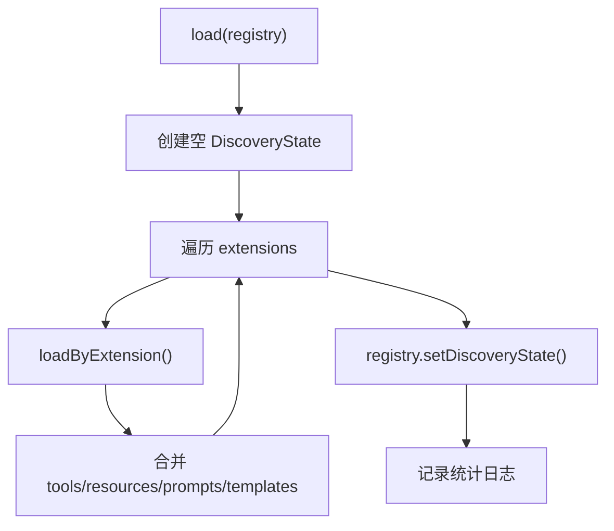

# FilteredDiscoveryLoader.php 深度分析报告

## 1. 文件概述

`FilteredDiscoveryLoader.php` 实现了 MCP SDK 的 `LoaderInterface`，是能力发现与过滤的核心组件。它遍历所有扩展，使用 `DiscovererInterface` 发现 MCP 能力，再根据 `disabledFeatures` 配置过滤禁用项，最终将聚合结果注入 MCP 注册表。

**文件路径**：`src/mate/src/Discovery/FilteredDiscoveryLoader.php`

---

## 2. 类签名与依赖

```php
namespace Symfony\AI\Mate\Discovery;

use Mcp\Capability\Discovery\DiscovererInterface;
use Mcp\Capability\Discovery\DiscoveryState;
use Mcp\Capability\Registry\Loader\LoaderInterface;
use Mcp\Capability\RegistryInterface;
use Psr\Log\LoggerInterface;

final class FilteredDiscoveryLoader implements LoaderInterface
```

### 属性

| 属性 | 类型 | 可见性 | 说明 |
|------|------|--------|------|
| `$rootDir` | `string` | `private` | 项目根目录 |
| `$extensions` | `array<string, array{dirs: string[], includes: string[]}>` | `private` | 扩展配置映射 |
| `$disabledFeatures` | `array<string, array<string, array{enabled: bool}>>` | `private` | 禁用功能配置 |
| `$discoverer` | `DiscovererInterface` | `private` | MCP 能力发现器 |
| `$logger` | `LoggerInterface` | `private` | 日志接口 |

### 构造函数

```php
public function __construct(
    private string $rootDir,
    private array $extensions,
    private array $disabledFeatures,
    private DiscovererInterface $discoverer,
    private LoggerInterface $logger,
)
```

---

## 3. 方法级别分析

### 3.1 `load(RegistryInterface $registry): void`

**输入**：`$registry` —— `RegistryInterface` MCP 注册表

**输出**：`void`（通过 `$registry->setDiscoveryState()` 设置状态）

**实现逻辑**：
1. 创建空的 `DiscoveryState` 作为聚合容器
2. 遍历 `$extensions`，对每个扩展调用 `loadByExtension()`
3. 将各扩展的工具、资源、提示、模板合并到聚合状态
4. 调用 `$registry->setDiscoveryState($filteredState)`
5. 记录加载的能力数量统计



### 3.2 `loadByExtension(string $extensionName, array $extension): DiscoveryState`

**输入**：
- `$extensionName`：扩展包名
- `$extension`：`array{dirs: string[], includes: string[]}` 扩展配置

**输出**：`DiscoveryState` —— 过滤后的能力状态

**过滤维度**：

| 能力类型 | 过滤键 | 来源 |
|---------|--------|------|
| Tools | 工具名 (`$tool->tool->name`) | `ToolReference` |
| Resources | URI (`$resource->resource->uri`) | `ResourceReference` |
| Prompts | 提示名 (`$prompt->prompt->name`) | `PromptReference` |
| ResourceTemplates | URI 模板 (`$template->resourceTemplate->uriTemplate`) | `ResourceTemplateReference` |

每个被排除的功能都会记录 debug 级别日志。

### 3.3 `isFeatureAllowed(string $extensionName, string $feature): bool`

**输入**：
- `$extensionName`：扩展包名
- `$feature`：功能标识（工具名/URI/提示名等）

**输出**：`bool` —— `true` 表示允许，`false` 表示已禁用

**逻辑**：
```php
$data = $this->disabledFeatures[$extensionName][$feature] ?? [];
return $data['enabled'] ?? true;
```

**默认行为**：未明确禁用的功能默认为启用（白名单逻辑）。

---

## 4. 设计模式分析

- **策略模式（Strategy）**：实现 `LoaderInterface`，可被替换为其他加载策略
- **过滤器模式（Filter/Criteria）**：在发现层面过滤能力，过滤发生在注册之前
- **聚合器模式（Aggregator）**：将多个扩展的能力聚合为单一 `DiscoveryState`
- **装饰器思想**：在 `Discoverer` 基础上添加过滤功能

---

## 5. 在模块中的调用场景

- `RegistryProvider::getRegistry()` —— 延迟初始化注册表时调用 `load()`
- `CapabilityCollector::collectCapabilities()` —— 调用 `loadByExtension()` 获取单个扩展的过滤后能力
- `ServeCommand` —— 通过 `RegistryProvider` 间接触发加载

---

## 6. 可扩展性分析

- `LoaderInterface` 允许替换整个加载策略
- `disabledFeatures` 数据结构预留了 `enabled` 之外的扩展字段空间
- 过滤逻辑基于键值查找，支持高效的大规模过滤

---

## 7. 技巧与最佳实践

- **编译时过滤**：过滤在发现阶段执行，被禁用的功能永远不会进入运行时注册表，减少运行时开销
- **默认启用策略**：使用 `?? true` 确保未配置的功能默认可用，降低配置负担
- **可观测性**：每个被排除的功能都有 debug 日志记录，方便排查问题
