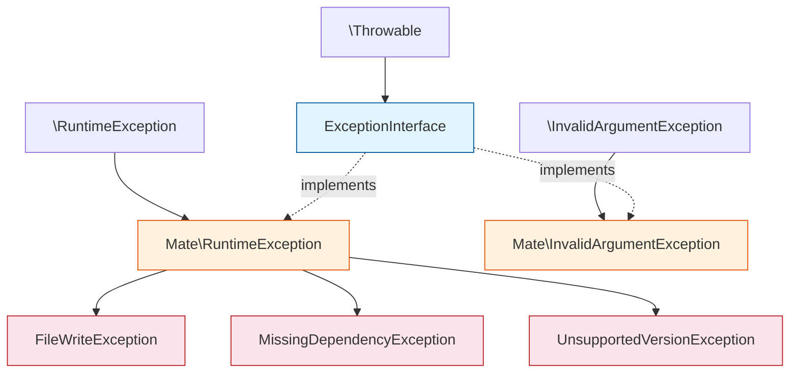

# Exception 目录分析报告

## 目录职责

`Exception/` 目录包含 Symfony AI Mate 模块的异常类层次结构，为模块中可能发生的各种错误情况提供类型化的异常处理机制。这些异常遵循 Symfony 最佳实践，都实现了公共的 `ExceptionInterface` 接口，形成了一个结构清晰、语义明确的异常体系。

**目录路径**: `src/mate/src/Exception/`

---

## 包含的文件清单

| 文件 | 说明 | 父类/接口 | 直接抛出次数 |
|------|------|-----------|-------------|
| `ExceptionInterface.php` | 标记接口，所有 Mate 异常的根接口 | `\Throwable` | 0（接口） |
| `RuntimeException.php` | 运行时异常基类 | `\RuntimeException` | 0（仅作基类） |
| `InvalidArgumentException.php` | 无效参数异常 | `\InvalidArgumentException` | 5 |
| `FileWriteException.php` | 文件写入失败异常 | `RuntimeException` | 2 |
| `MissingDependencyException.php` | Composer 依赖缺失异常 | `RuntimeException` | 1 |
| `UnsupportedVersionException.php` | 框架版本不兼容异常 | `RuntimeException` | 1 |

**总计**: 6 个文件，9 处抛出点

---

## 异常层级图



### 层次说明

异常体系分为**三个层次**：

| 层次 | 组成 | 职责 |
|------|------|------|
| **接口层** | `ExceptionInterface` | 类型标记，统一捕获入口 |
| **桥接层** | `RuntimeException`, `InvalidArgumentException` | 连接 PHP SPL 异常与模块异常体系 |
| **业务层** | `FileWriteException`, `MissingDependencyException`, `UnsupportedVersionException` | 具体业务场景的语义异常 |

异常体系包含**两个独立分支**：

| 分支 | 根基类 | 语义 | 子类数量 |
|------|--------|------|----------|
| **RuntimeException 分支** | `\RuntimeException` | 运行时环境错误 | 3 个子类 |
| **InvalidArgumentException 分支** | `\InvalidArgumentException` | 参数验证错误 | 0 个子类 |

---

## 设计模式分析

### 1. 标记接口模式（Marker Interface Pattern）
`ExceptionInterface` 不定义任何方法，仅通过 `extends \Throwable` 提供类型标记。这允许通过 `catch (ExceptionInterface $e)` 捕获所有 Mate 模块异常。

### 2. 异常桥接模式（Exception Bridge Pattern）
`RuntimeException` 和 `InvalidArgumentException` 同时继承 PHP SPL 异常和实现 `ExceptionInterface`，形成双重类型归属：
```php
// 三种捕获方式均有效
catch (\RuntimeException $e) { }        // PHP SPL 级别
catch (ExceptionInterface $e) { }       // Mate 模块级别
catch (RuntimeException $e) { }         // Mate 精确级别
```

### 3. 语义特化模式（Semantic Specialization Pattern）
从通用基类派生出具有明确业务语义的异常类：
- `FileWriteException` → 文件 I/O 错误
- `MissingDependencyException` → 依赖管理错误
- `UnsupportedVersionException` → 版本兼容性错误

### 4. Symfony 组件异常惯例
遵循 Symfony 生态的标准做法——每个组件定义独立的 `ExceptionInterface`，所有异常实现该接口。此惯例在 Symfony 核心组件中广泛使用。

---

## 调用流程

### 异常抛出分布

```
Mate 模块
├── App.php
│     └── addCommand()
│           └── throw UnsupportedVersionException  (1处)
│
├── Container/
│     └── ContainerFactory.php
│           └── loadEnvironment()
│                 └── throw MissingDependencyException  (1处)
│
├── Service/
│     └── Logger.php
│           ├── ensureDirectory()
│           │     └── throw FileWriteException  (1处)
│           └── writeLog()
│                 └── throw FileWriteException  (1处)
│
├── Command/
│     ├── ToolsListCommand.php
│     │     ├── validateExtension()
│     │     │     └── throw InvalidArgumentException  (1处)
│     │     └── validatePattern()
│     │           └── throw InvalidArgumentException  (1处)
│     │
│     └── DebugCapabilitiesCommand.php
│           ├── validateExtension()
│           │     └── throw InvalidArgumentException  (1处)
│           └── validateType()
│                 └── throw InvalidArgumentException  (1处)
│
└── Bridge/
      └── Symfony/Capability/
            └── ProfilerTool.php
                  └── __invoke()
                        └── throw InvalidArgumentException  (1处)
```

### 异常处理流向

```
抛出点 → [Mate 内部无 catch 块] → Symfony Console ErrorHandler → 终端输出
```

**关键发现**: Mate 模块内部**不捕获任何自定义异常**。所有异常都向上传播，由 Symfony Console 的错误处理机制统一渲染为终端错误输出。这是合理的设计——作为 CLI 工具，异常应直接展示给用户。

### 按异常类型的调用场景

| 异常类型 | 抛出文件 | 检测方式 | 错误性质 |
|----------|----------|----------|----------|
| `FileWriteException` | Logger | 函数返回值检查 | 文件系统权限/空间问题 |
| `InvalidArgumentException` | Command 类, ProfilerTool | 参数值验证 | 用户输入错误 |
| `MissingDependencyException` | ContainerFactory | `class_exists()` | 包未安装 |
| `UnsupportedVersionException` | App | `method_exists()` | 版本不兼容 |

---

## Bridge 层异常扩展

Mate 模块的 Bridge 层定义了额外的异常类，均继承自核心 `RuntimeException`：

| Bridge 异常 | 所在 Bridge | 说明 |
|-------------|-------------|------|
| `LogFileNotFoundException` | Monolog Bridge | 日志文件未找到 |
| `FileNotFoundException` | Symfony Bridge | 通用文件未找到 |
| `XmlContainerCouldNotBeLoadedException` | Symfony Bridge | XML 容器加载失败 |
| `XmlContainerPathIsNotConfiguredException` | Symfony Bridge | XML 容器路径未配置 |
| `InvalidCollectorException` | Symfony Profiler Bridge | 无效的 Profiler Collector |

这些 Bridge 异常展示了异常体系的可扩展性——各 Bridge 基于核心异常类创建领域特定的异常。

---

## 组合可能性

### 1. 分层捕获策略

```php
use Symfony\AI\Mate\Exception\ExceptionInterface;
use Symfony\AI\Mate\Exception\FileWriteException;
use Symfony\AI\Mate\Exception\MissingDependencyException;
use Symfony\AI\Mate\Exception\RuntimeException;

try {
    $mate->run();
} catch (FileWriteException $e) {
    // 最精确：文件写入失败 → 检查文件权限
    $this->checkFilePermissions($e);
} catch (MissingDependencyException $e) {
    // 精确：依赖缺失 → 提示安装
    $output->writeln('请安装缺失的依赖: ' . $e->getMessage());
} catch (RuntimeException $e) {
    // 宽泛：所有运行时错误 → 通用处理
    $logger->error('运行时错误', ['exception' => $e]);
} catch (ExceptionInterface $e) {
    // 最宽泛：所有 Mate 异常 → 包含 InvalidArgumentException
    $output->writeln('<error>' . $e->getMessage() . '</error>');
}
```

### 2. 与 PHP SPL 异常的组合捕获

```php
try {
    $mate->execute($input);
} catch (\InvalidArgumentException $e) {
    // 同时捕获 Mate\InvalidArgumentException 和 PHP 标准 InvalidArgumentException
    $output->writeln('参数错误: ' . $e->getMessage());
} catch (\RuntimeException $e) {
    // 同时捕获 Mate\RuntimeException 及其子类和 PHP 标准运行时异常
    $output->writeln('运行时错误: ' . $e->getMessage());
}
```

### 3. 异常类型判断组合

```php
catch (ExceptionInterface $e) {
    if ($e instanceof MissingDependencyException) {
        // 依赖缺失 → 自动安装建议
        $this->suggestInstallation($e);
    } elseif ($e instanceof UnsupportedVersionException) {
        // 版本不兼容 → 升级建议
        $this->suggestUpgrade($e);
    } elseif ($e instanceof FileWriteException) {
        // 文件写入失败 → 权限修复建议
        $this->suggestPermissionFix($e);
    } else {
        // 其他异常 → 通用错误报告
        $this->reportError($e);
    }
}
```

### 4. Bridge 异常与核心异常的协作

```php
use Symfony\AI\Mate\Exception\RuntimeException;
use Symfony\AI\Mate\Bridge\Symfony\Exception\FileNotFoundException;

try {
    $tool->analyze($projectPath);
} catch (FileNotFoundException $e) {
    // Bridge 层文件未找到
    $output->writeln('文件缺失: ' . $e->getMessage());
} catch (RuntimeException $e) {
    // 核心层所有运行时异常（包括 Bridge 层继承的）
    $output->writeln('分析失败: ' . $e->getMessage());
}
```

---

## 异常体系完整视图

```mermaid
graph TD
    subgraph "核心异常层 (Exception/)"
        EI["ExceptionInterface"]
        RE["RuntimeException"]
        IAE["InvalidArgumentException"]
        FWE["FileWriteException"]
        MDE["MissingDependencyException"]
        UVE["UnsupportedVersionException"]
    end

    subgraph "Bridge 异常层"
        LFNE["LogFileNotFoundException\n(Monolog Bridge)"]
        FNE["FileNotFoundException\n(Symfony Bridge)"]
        XCLE["XmlContainerCouldNotBeLoadedException\n(Symfony Bridge)"]
        XCPE["XmlContainerPathIsNotConfiguredException\n(Symfony Bridge)"]
        ICE["InvalidCollectorException\n(Symfony Profiler Bridge)"]
    end

    subgraph "抛出点"
        APP["App.php"]
        LOG["Logger.php"]
        CF["ContainerFactory.php"]
        TLC["ToolsListCommand.php"]
        DCC["DebugCapabilitiesCommand.php"]
        PT["ProfilerTool.php"]
    end

    EI -.-> RE
    EI -.-> IAE
    RE --> FWE
    RE --> MDE
    RE --> UVE
    RE --> LFNE
    RE --> FNE
    RE --> XCLE
    RE --> XCPE
    RE --> ICE

    APP -->|throws| UVE
    LOG -->|throws| FWE
    CF -->|throws| MDE
    TLC -->|throws| IAE
    DCC -->|throws| IAE
    PT -->|throws| IAE
```



---

## 总结

Mate 模块的异常体系是一个精简而完整的设计：

1. **6 个类/接口**覆盖了模块的所有错误场景
2. **两个分支**（运行时 / 参数验证）清晰分类错误性质
3. **三层结构**（接口 → 桥接 → 业务）提供了灵活的捕获粒度
4. **无内部 catch 块**——异常直接传播到 Symfony Console，简化了控制流
5. **Bridge 层可扩展**——各 Bridge 可自由添加领域异常而不污染核心层
6. **遵循 Symfony 惯例**——与生态系统中的其他组件保持一致的异常设计风格
