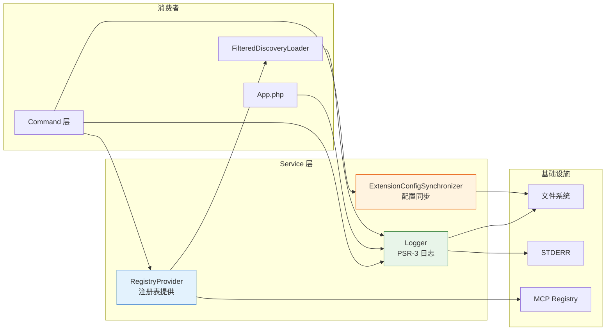
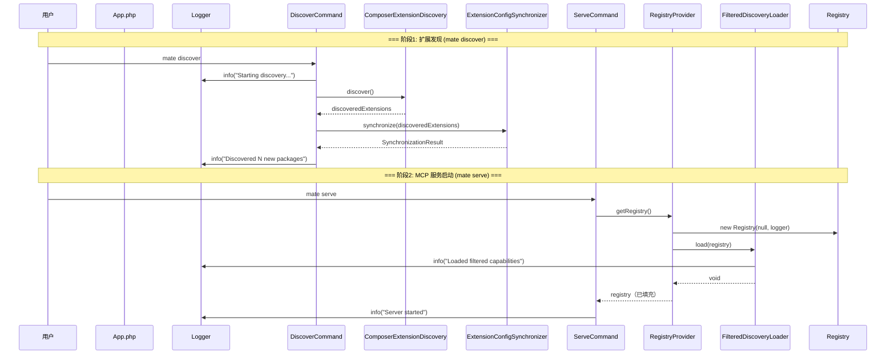
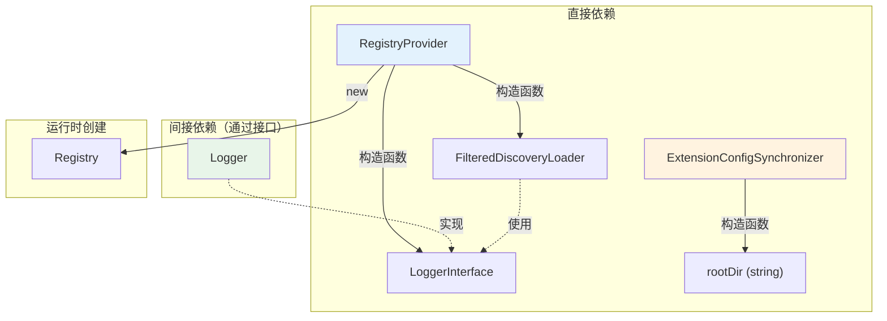
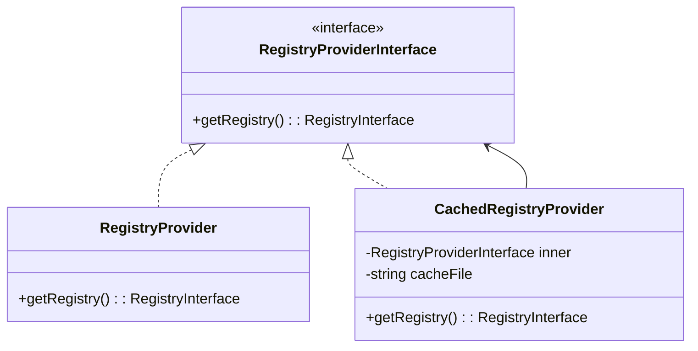

# Service 目录分析报告

## 目录职责

`Service/` 目录包含 Mate 模块的核心业务服务层，为命令层（`Command/`）和应用入口（`App.php`）提供基础设施支撑。该目录中的服务遵循"单一职责"原则，每个类聚焦于一个明确的基础设施功能。

**目录路径**: `src/mate/src/Service/`

---

## 包含的文件清单

| 文件 | 类名 | 职责 | 修饰符 | 核心依赖 |
|------|------|------|--------|----------|
| `Logger.php` | `Logger` | PSR-3 日志实现，支持文件/STDERR 双通道 | 非 final | `Psr\Log\AbstractLogger` |
| `RegistryProvider.php` | `RegistryProvider` | MCP 能力注册表的延迟初始化提供者 | `final` | `FilteredDiscoveryLoader`, `Registry` |
| `ExtensionConfigSynchronizer.php` | `ExtensionConfigSynchronizer` | 扩展配置文件同步与管理 | `final` | 文件系统 I/O |

**总计**: 3 个服务类

---

## 服务职责矩阵



---

## 各服务详细概述

### 1. Logger — 日志基础设施

| 特性 | 说明 |
|------|------|
| **实现标准** | PSR-3（`Psr\Log\LoggerInterface`） |
| **输出通道** | 文件 + STDERR（可配置） |
| **上下文处理** | 递归规范化（`Throwable`、对象、数组） |
| **错误容错** | 文件写入失败 → STDERR 回退 → `FileWriteException` |
| **配置来源** | 环境变量 `MATE_DEBUG`、`MATE_DEBUG_FILE`、`MATE_DEBUG_LOG_FILE` |

**核心方法**:
- `log($level, $message, $context)` — 唯一公开方法，实现完整的日志写入流程
- `normalizeContext()` / `normalizeValue()` — 上下文序列化
- `ensureDirectoryExists()` — 目录自动创建

### 2. RegistryProvider — 注册表生命周期管理

| 特性 | 说明 |
|------|------|
| **设计模式** | 延迟初始化（Lazy Initialization） |
| **管理对象** | `Mcp\Capability\Registry` |
| **加载策略** | 委托给 `FilteredDiscoveryLoader` |
| **缓存语义** | 实例级别单例，首次创建后复用 |

**核心方法**:
- `getRegistry()` — 获取或创建注册表（延迟初始化 + 缓存）

### 3. ExtensionConfigSynchronizer — 配置持久化

| 特性 | 说明 |
|------|------|
| **目标文件** | `{rootDir}/mate/extensions.php` |
| **同步策略** | 发现 → 对比 → 合并 → 写入 |
| **用户设置保留** | 已有扩展的 `enabled` 标志不会被覆盖 |
| **幂等性** | 多次执行结果一致 |

**核心方法**:
- `synchronize($discoveredExtensions)` — 执行完整同步并返回报告
- `readExistingExtensions()` — 读取现有配置
- `writeExtensionsFile()` — 生成 PHP 配置代码

---

## 内部调用流程图

### 完整服务协作流程



### 服务间依赖关系



---

## 设计模式分析

### 1. 服务层模式（Service Layer Pattern）

三个服务类共同构成模块的服务层，将业务逻辑从命令层（表现层）和基础设施层（文件系统、MCP SDK）中分离：

| 层次 | 职责 | 示例 |
|------|------|------|
| 表现层 | 用户交互、输出格式化 | `DiscoverCommand`, `ServeCommand` |
| **服务层** | **业务逻辑、协调** | **`Logger`, `RegistryProvider`, `ExtensionConfigSynchronizer`** |
| 基础设施层 | 外部系统交互 | 文件系统、MCP SDK、Composer |

### 2. 依赖注入模式（Dependency Injection）

所有服务通过构造函数注入依赖，在 `default.config.php` 中以 Symfony DI 容器进行装配：

```php
->defaults()
    ->autowire()
    ->autoconfigure()
    ->bind('$rootDir', '%mate.root_dir%')
```

### 3. 接口隔离

`Logger` 通过 `LoggerInterface` 向消费者暴露标准化接口，而非具体类：

```php
->set(LoggerInterface::class, Logger::class)
    ->alias(Logger::class, LoggerInterface::class)
```

### 4. 环境适配模式

`Logger` 根据运行环境（是否定义 `STDERR` 常量）自动选择输出策略，适配 CLI 与非 CLI 环境。

---

## 组合可能性

### 当前组合关系

| 组合 | 说明 |
|------|------|
| `Logger` ← 全局 | 被几乎所有组件注入，是横切关注点 |
| `RegistryProvider` ← `FilteredDiscoveryLoader` | Provider 封装 Loader 的调用时机 |
| `ExtensionConfigSynchronizer` → `extensions.php` → `App.php` | 生成配置 → 后续启动加载 |

### 潜在组合优化

#### 1. 缓存装饰器

为 `RegistryProvider` 添加文件缓存，避免每次启动都执行能力发现：



#### 2. 事件化同步

为 `ExtensionConfigSynchronizer` 添加事件调度：

```
同步前事件 → synchronize() → 同步后事件
                              ├── 新包发现事件
                              └── 包移除事件
```

#### 3. 日志通道分离

将 `Logger` 扩展为支持多通道的分层日志器：

| 通道 | 级别 | 目标 |
|------|------|------|
| 调试通道 | `debug` | 文件 |
| 操作通道 | `info`+ | STDERR |
| 错误通道 | `error`+ | 文件 + STDERR |

---

## 服务配置汇总

### 环境变量

| 变量 | 默认值 | 影响的服务 | 说明 |
|------|--------|-----------|------|
| `MATE_DEBUG` | `false` | `Logger` | 启用 debug 级别日志 |
| `MATE_DEBUG_FILE` | `false` | `Logger` | 启用文件日志输出 |
| `MATE_DEBUG_LOG_FILE` | `'dev.log'` | `Logger` | 日志文件路径 |

### 容器参数

| 参数 | 绑定到 | 消费者 |
|------|--------|--------|
| `%mate.root_dir%` | `$rootDir` | `ExtensionConfigSynchronizer`, `FilteredDiscoveryLoader` |
| `%mate.debug_log_file%` | `Logger::$logFile` | `Logger` |
| `%mate.debug_file_enabled%` | `Logger::$fileLogEnabled` | `Logger` |
| `%mate.debug_enabled%` | `Logger::$debugEnabled` | `Logger` |

---

## 质量评估

| 维度 | 评分 | 说明 |
|------|------|------|
| **单一职责** | ⭐⭐⭐⭐⭐ | 每个服务聚焦一个功能 |
| **可测试性** | ⭐⭐⭐⭐ | 构造函数注入，可 Mock |
| **错误处理** | ⭐⭐⭐⭐ | Logger 有完整容错；ECS 较弱 |
| **类型安全** | ⭐⭐⭐⭐⭐ | PHPStan 类型定义完整 |
| **可替换性** | ⭐⭐⭐⭐ | Logger 可替换为 Monolog；其他服务为 final |
| **文档** | ⭐⭐⭐⭐ | DocBlock 完整，类型注解清晰 |
