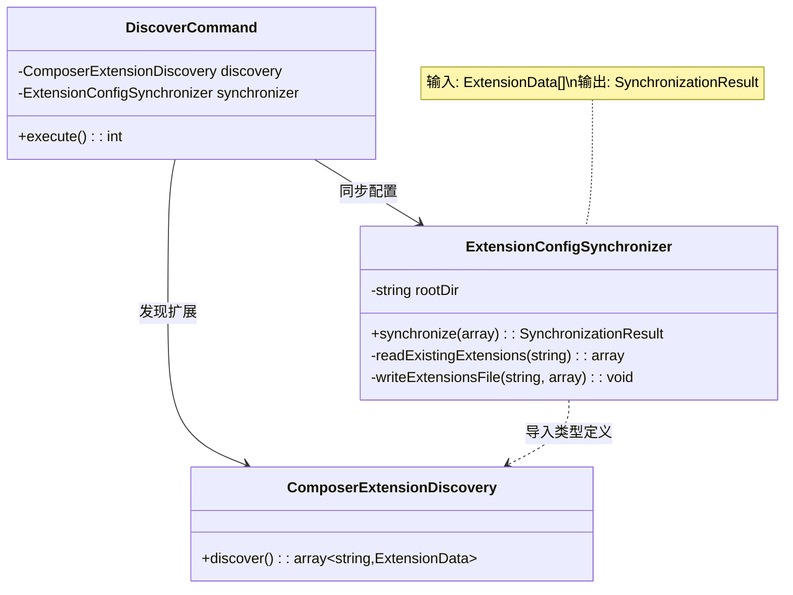
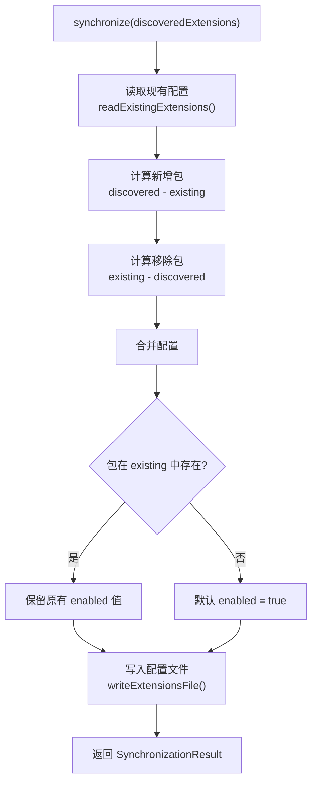
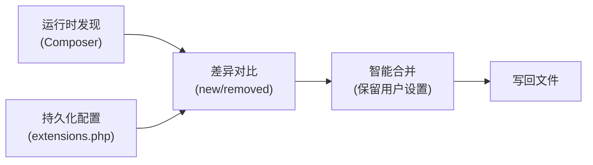
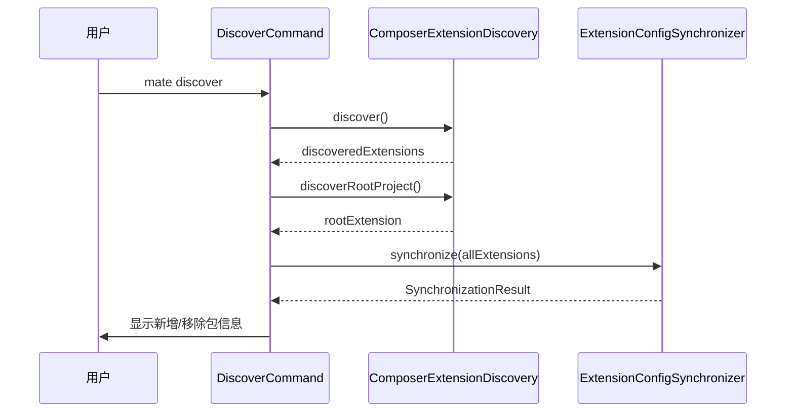
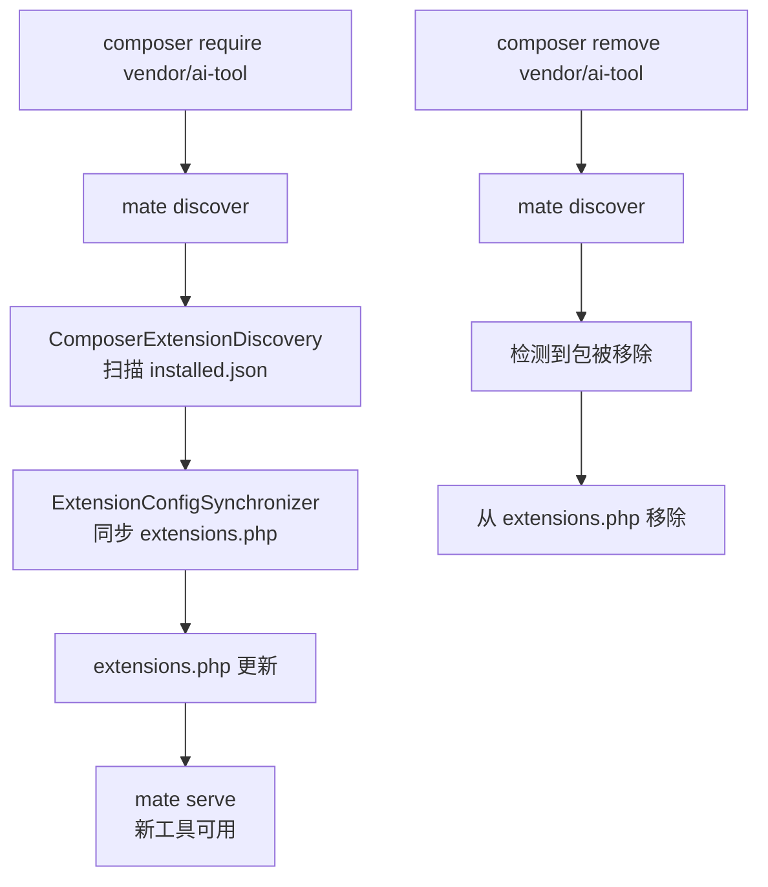

# ExtensionConfigSynchronizer 类分析报告

## 文件概述

| 属性 | 值 |
|------|-----|
| **文件路径** | `src/mate/src/Service/ExtensionConfigSynchronizer.php` |
| **命名空间** | `Symfony\AI\Mate\Service` |
| **类型** | `final` 类 |
| **父类** | 无 |
| **作者** | Johannes Wachter |
| **行数** | 130 行 |

`ExtensionConfigSynchronizer` 负责将运行时发现的 Composer 扩展包信息与持久化配置文件 `mate/extensions.php` 进行双向同步。它会检测新增/移除的扩展包，保留用户对已有扩展的启用/禁用设置，并将最终状态写回配置文件。这是 `mate discover` 命令的核心业务逻辑。

---

## 类签名与依赖

### 类型定义（PHPStan）

```php
/**
 * @phpstan-import-type ExtensionData from ComposerExtensionDiscovery
 *
 * @phpstan-type ExtensionConfig array{enabled: bool}
 * @phpstan-type ExtensionConfigMap array<string, ExtensionConfig>
 * @phpstan-type SynchronizationResult array{
 *     extensions: ExtensionConfigMap,
 *     new_packages: string[],
 *     removed_packages: string[],
 *     file: string,
 * }
 */
```

### 类型关系图



### 导入依赖

| 依赖 | 类型 | 来源 | 用途 |
|------|------|------|------|
| `Symfony\AI\Mate\Discovery\ComposerExtensionDiscovery` | 类型导入 | 内部 | 导入 `ExtensionData` 类型定义 |

> 注意：该类运行时不依赖任何外部服务或接口，仅依赖文件系统操作。

### 构造函数

```php
public function __construct(
    private string $rootDir,
)
```

| 参数 | 类型 | 说明 |
|------|------|------|
| `$rootDir` | `string` | 项目根目录路径，用于定位 `mate/extensions.php` |

---

## 方法级别分析

### 1. `synchronize(array $discoveredExtensions): array`

**职责**: 核心同步方法，对比发现的扩展与已有配置，生成同步报告并更新配置文件。

**输入**:

| 参数 | 类型 | 说明 |
|------|------|------|
| `$discoveredExtensions` | `array<string, ExtensionData>` | 由 `ComposerExtensionDiscovery` 发现的扩展包映射 |

**输出**: `SynchronizationResult` 结构：

```php
array{
    extensions: array<string, array{enabled: bool}>,  // 最终扩展配置
    new_packages: string[],                            // 新发现的包
    removed_packages: string[],                        // 已移除的包
    file: string,                                      // 配置文件路径
}
```

**处理流程**:



**详细逻辑分解**:

**步骤 1 — 读取现有配置**:
```php
$extensionsFile = $this->rootDir.'/mate/extensions.php';
$existingExtensions = $this->readExistingExtensions($extensionsFile);
```

**步骤 2 — 计算新增包**（存在于 discovered，不存在于 existing）:
```php
$newPackages = [];
foreach (array_keys($discoveredExtensions) as $packageName) {
    if (!isset($existingExtensions[$packageName])) {
        $newPackages[] = $packageName;
    }
}
```

**步骤 3 — 计算移除包**（存在于 existing，不存在于 discovered）:
```php
$removedPackages = [];
foreach (array_keys($existingExtensions) as $packageName) {
    if (!isset($discoveredExtensions[$packageName])) {
        $removedPackages[] = $packageName;
    }
}
```

**步骤 4 — 合并配置**（保留用户设置）:
```php
$finalExtensions = [];
foreach (array_keys($discoveredExtensions) as $packageName) {
    $enabled = true;
    if (isset($existingExtensions[$packageName]) && \is_array($existingExtensions[$packageName])) {
        $enabledValue = $existingExtensions[$packageName]['enabled'] ?? true;
        if (\is_bool($enabledValue)) {
            $enabled = $enabledValue;
        }
    }
    $finalExtensions[$packageName] = ['enabled' => $enabled];
}
```

---

### 2. `readExistingExtensions(string $extensionsFile): array`（private）

**职责**: 读取并解析现有的 `extensions.php` 配置文件。

| 输入 | 输出 |
|------|------|
| `string` 文件路径 | `array<string, array{enabled?: bool}>` |

**容错策略**:

| 情况 | 处理 |
|------|------|
| 文件不存在 | 返回空数组 `[]` |
| 文件返回非数组 | 返回空数组 `[]` |
| 文件返回合法数组 | 原样返回 |

```php
if (!file_exists($extensionsFile)) {
    return [];
}
$existingExtensions = include $extensionsFile;
if (!\is_array($existingExtensions)) {
    return [];
}
```

---

### 3. `writeExtensionsFile(string $filePath, array $extensions): void`（private）

**职责**: 将扩展配置以 PHP 代码的形式写入文件。

| 输入 | 输出 |
|------|------|
| `string` 文件路径, `ExtensionConfigMap` 扩展映射 | `void`（写入文件） |

**生成的文件格式**:

```php
<?php

// This file is managed by 'mate discover'
// You can manually edit to enable/disable extensions

return [
    'vendor/package-a' => ['enabled' => true],
    'vendor/package-b' => ['enabled' => false],
];
```

**实现细节**:
- 自动创建目标目录（`mkdir($dir, 0755, true)`）
- 为每个扩展生成一行配置
- 将布尔值显式转为 `'true'` / `'false'` 字符串
- 使用 `file_put_contents()` 原子写入

---

## 设计模式分析

### 1. 配置同步模式（Config Synchronization Pattern）

核心设计是"发现 → 对比 → 合并 → 持久化"的四步同步：



这种模式在配置管理领域非常常见（类似于数据库 migration、Terraform state 等）。

### 2. 幂等操作模式（Idempotent Operation）

多次执行 `synchronize()` 与执行一次的效果相同（假设 `discoveredExtensions` 不变）：
- 新包只在首次发现时记录
- 移除包只在首次消失时记录
- 已存在包的 `enabled` 状态不会改变

### 3. 代码生成模式（Code Generation Pattern）

`writeExtensionsFile()` 生成可执行的 PHP 配置文件。生成的文件：
- 可被 `include` 直接加载为 PHP 数组
- 包含人类可读的注释说明
- 支持用户手动编辑

### 4. 值对象返回模式

`synchronize()` 返回结构化的关联数组（`SynchronizationResult`），包含完整的同步报告，供命令层展示给用户。使用 PHPStan 类型别名确保类型安全。

---

## 在模块中的调用场景

### 1. 服务容器注册

```php
// default.config.php
->set(ExtensionConfigSynchronizer::class)  // 自动装配，$rootDir 通过参数绑定注入
```

### 2. 主要调用者 — DiscoverCommand

`DiscoverCommand` 是 `ExtensionConfigSynchronizer` 的主要消费者：



### 3. 工作流集成



### 4. 生成的配置文件在后续流程中的使用

`extensions.php` 的消费者：

| 消费者 | 用途 |
|--------|------|
| `App.php` | 启动时加载扩展配置，确定 `mate.extensions` 参数 |
| `FilteredDiscoveryLoader` | 基于 `enabled` 标志过滤能力 |
| `DebugExtensionsCommand` | 展示扩展启用/禁用状态 |

---

## 可扩展性分析

### final 约束

类声明为 `final`，不可继承。扩展需通过组合或替换实现。

### 扩展方向

| 方向 | 可行性 | 方式 |
|------|--------|------|
| 支持 YAML/JSON 配置格式 | 中等 | 修改 `read` / `write` 方法 |
| 添加版本约束（per-extension） | 高 | 扩展 `ExtensionConfig` 类型定义 |
| 添加同步事件/钩子 | 中等 | 引入事件调度器 |
| 支持配置锁定（防止手动修改） | 低 | 需额外的文件完整性检查 |
| 添加回滚/备份机制 | 中等 | 写入前备份旧文件 |

### 当前局限

1. **无文件锁定**: 并发执行 `mate discover` 可能导致配置文件竞争写入
2. **无备份机制**: 写入失败时无法回退到上一版本
3. **硬编码路径**: `mate/extensions.php` 路径在 `synchronize()` 内硬编码
4. **无异常处理**: `writeExtensionsFile()` 中的 `file_put_contents()` 和 `mkdir()` 未进行错误检查（与 `Logger` 中的处理不同）

---

## 技巧与最佳实践

### 1. PHPStan 类型导入

```php
/** @phpstan-import-type ExtensionData from ComposerExtensionDiscovery */
```

使用 `@phpstan-import-type` 在类之间共享复杂类型定义，避免重复定义，确保类型一致性。

### 2. 防御性类型检查

```php
if (isset($existingExtensions[$packageName]) && \is_array($existingExtensions[$packageName])) {
    $enabledValue = $existingExtensions[$packageName]['enabled'] ?? true;
    if (\is_bool($enabledValue)) {
        $enabled = $enabledValue;
    }
}
```

三重防御：
1. `isset()` — 检查键存在
2. `\is_array()` — 检查值为数组
3. `\is_bool()` — 检查 `enabled` 为布尔值

即使配置文件被手动编辑为非法值，也不会导致运行时错误。

### 3. 生成可编辑的 PHP 配置文件

选择 PHP 而非 YAML/JSON 作为配置格式的优势：
- **无需额外解析器**: `include` 直接加载
- **类型安全**: PHP 原生类型（`true`/`false`），不存在 YAML 的布尔歧义
- **IDE 支持**: PHP 文件享有完整的语法高亮和检查
- **注释支持**: 可在文件中添加人类可读的说明

### 4. 集合差异计算的朴素实现

使用简单的 `foreach` + `isset()` 代替 `array_diff_key()`：

```php
foreach (array_keys($discoveredExtensions) as $packageName) {
    if (!isset($existingExtensions[$packageName])) {
        $newPackages[] = $packageName;
    }
}
```

虽然 `array_diff_key()` 更简洁，但显式循环的可读性更强，且允许后续在循环内添加额外逻辑（如日志记录）。

### 5. 返回结构化结果而非布尔值

```php
return [
    'extensions' => $finalExtensions,
    'new_packages' => $newPackages,
    'removed_packages' => $removedPackages,
    'file' => $extensionsFile,
];
```

返回丰富的结构化数据，而非简单的成功/失败标志，使调用者能够：
- 向用户展示详细的同步报告
- 根据新增/移除包执行后续操作
- 记录审计日志
