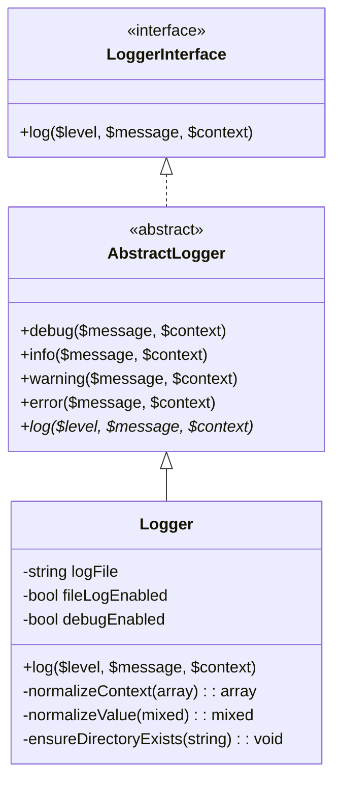
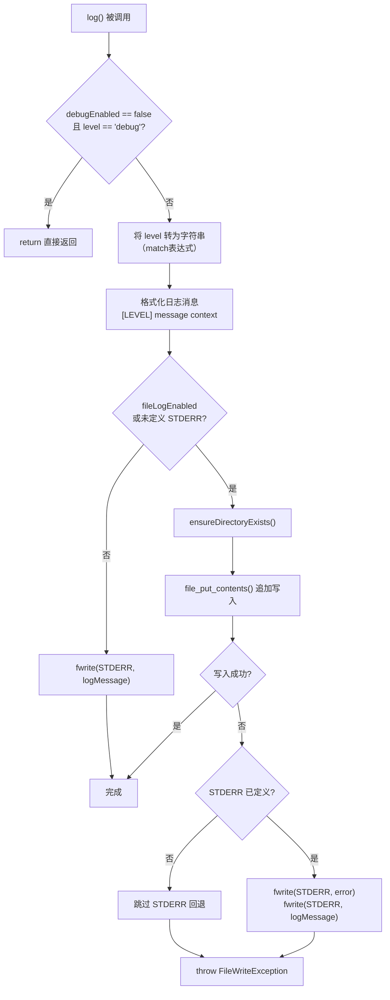
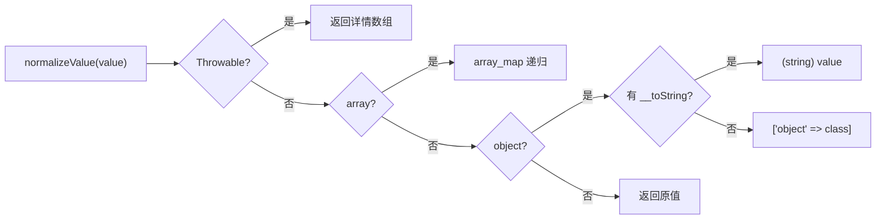

# Logger 类分析报告

## 文件概述

| 属性 | 值 |
|------|-----|
| **文件路径** | `src/mate/src/Service/Logger.php` |
| **命名空间** | `Symfony\AI\Mate\Service` |
| **类型** | 具体类（非 final） |
| **父类** | `Psr\Log\AbstractLogger` |
| **作者** | Johannes Wachter, Tobias Nyholm |
| **行数** | 124 行 |

`Logger` 是 Mate 模块的自定义 PSR-3 日志实现，继承自 `Psr\Log\AbstractLogger`。它只需实现 `log()` 方法即可获得完整的 PSR-3 日志接口（`debug()`、`info()`、`warning()`、`error()` 等）。该日志器支持双通道输出（文件 / STDERR），并提供可配置的调试级别过滤与上下文序列化功能。

---

## 类签名与依赖

### 继承关系



### 导入依赖

| 依赖 | 类型 | 来源 | 用途 |
|------|------|------|------|
| `Psr\Log\AbstractLogger` | 抽象类 | `psr/log` | PSR-3 日志抽象基类 |
| `Symfony\AI\Mate\Exception\FileWriteException` | 异常类 | 内部 | 文件写入失败时抛出 |

### 构造函数

```php
public function __construct(
    private string $logFile = 'dev.log',
    private bool $fileLogEnabled = false,
    private bool $debugEnabled = false,
)
```

| 参数 | 类型 | 默认值 | 说明 |
|------|------|--------|------|
| `$logFile` | `string` | `'dev.log'` | 日志文件路径 |
| `$fileLogEnabled` | `bool` | `false` | 是否启用文件日志（否则输出到 STDERR） |
| `$debugEnabled` | `bool` | `false` | 是否启用 debug 级别日志及上下文输出 |

---

## 方法级别分析

### 1. `log($level, \Stringable|string $message, array $context = []): void`

**职责**: 核心日志方法，实现 PSR-3 `AbstractLogger` 的抽象方法。

**输入参数**:

| 参数 | 类型 | 说明 |
|------|------|------|
| `$level` | `mixed`（PSR-3 兼容） | 日志级别，可为 `\Stringable` 或 `string` |
| `$message` | `\Stringable\|string` | 日志消息内容 |
| `$context` | `array` | 上下文数据，用于 JSON 序列化后追加到日志 |

**输出**: `void`，副作用为写入文件或 STDERR。

**处理流程**:



**关键实现细节**:

1. **级别转换** — 使用 `match(true)` 表达式处理 `$level` 的多态类型：
   ```php
   $levelString = match (true) {
       $level instanceof \Stringable => (string) $level,
       \is_string($level) => $level,
       default => 'unknown',
   };
   ```

2. **上下文条件序列化** — 仅在 `debugEnabled` 且 `$context` 非空时才序列化上下文：
   ```php
   ([] === $context || !$this->debugEnabled) ? '' : json_encode($this->normalizeContext($context))
   ```

3. **双重容错** — 文件写入失败时先回退到 STDERR（保证消息不丢失），然后再抛出异常。

4. **错误抑制** — 使用 `@file_put_contents()` 抑制 PHP 警告，改为检查返回值并抛出语义化异常。

---

### 2. `normalizeContext(array $context): array`（private）

**职责**: 将上下文数组规范化为 JSON 可序列化的格式。

| 输入 | 输出 |
|------|------|
| `array<string, mixed>` | `array<string, mixed>`（所有值经过 `normalizeValue` 处理） |

**实现**: 遍历上下文键值对，对每个值调用 `normalizeValue()` 进行递归规范化。

---

### 3. `normalizeValue(mixed $value): mixed`（private）

**职责**: 将单个值规范化为 JSON 可序列化的类型。

**类型分派逻辑**:

| 输入类型 | 输出 | 说明 |
|----------|------|------|
| `\Throwable` | `array{class, message, code, file, line, trace}` | 异常详情数组，`trace` 仅在 `debugEnabled` 时包含 |
| `array` | `array`（递归处理） | 通过 `array_map` 递归调用 `normalizeValue()` |
| 有 `__toString()` 的对象 | `string` | 调用 `__toString()` 转为字符串 |
| 其他对象 | `['object' => ClassName]` | 仅保留类名信息 |
| 标量值 | 原值 | 直接返回 |



---

### 4. `ensureDirectoryExists(string $filePath): void`（private）

**职责**: 确保日志文件所在目录存在，不存在则递归创建。

| 输入 | 输出 |
|------|------|
| `string` 文件路径 | `void`，目录不存在时创建 |

**异常**: 目录创建失败时抛出 `FileWriteException`。

**实现要点**:
- 使用 `dirname()` 提取目录路径
- 采用 `@mkdir($dir, 0755, true)` 递归创建，权限 `0755`
- 使用 `!@mkdir(...) && !is_dir(...)` 双重检查模式（避免竞态条件下的误报）

---

## 设计模式分析

### 1. 模板方法模式（Template Method Pattern）

`AbstractLogger` 定义了日志接口的模板（`debug()`, `info()`, `error()` 等方法），这些方法最终都委托给抽象的 `log()` 方法。`Logger` 类仅需实现 `log()` 即可获得完整的 PSR-3 接口。

```
AbstractLogger::info($msg, $ctx) → $this->log('info', $msg, $ctx)
AbstractLogger::error($msg, $ctx) → $this->log('error', $msg, $ctx)
...均委托到 → Logger::log($level, $msg, $ctx)
```

### 2. 策略模式（Strategy Pattern — 输出通道选择）

根据配置动态选择输出策略：

| 条件 | 输出通道 |
|------|----------|
| `$fileLogEnabled == true` | 文件写入（`file_put_contents`） |
| `STDERR` 未定义 | 文件写入（降级策略） |
| 其他情况 | STDERR（`fwrite`） |

### 3. 优雅降级模式（Graceful Degradation）

文件写入失败时的三层容错：
1. 尝试文件写入
2. 回退到 STDERR 输出错误信息与原始日志
3. 抛出 `FileWriteException` 通知调用者

### 4. 访问者模式变体（Visitor-like — 类型分派）

`normalizeValue()` 根据输入值的类型进行不同处理，类似于轻量级的类型分派/访问者模式。

---

## 在模块中的调用场景

### 1. 服务容器注册

在 `default.config.php` 中注册为 `LoggerInterface` 的实现：

```php
// 编译期使用的轻量 Logger（直接使用环境变量）
->set('_build.logger', Logger::class)
    ->arg('$logFile', $debugLogFile)
    ->arg('$fileLogEnabled', $debugFileEnabled)
    ->arg('$debugEnabled', $debugEnabled)

// 运行时使用的 Logger（使用容器参数）
->set(LoggerInterface::class, Logger::class)
    ->arg('$logFile', '%mate.root_dir%/%mate.debug_log_file%')
    ->arg('$fileLogEnabled', '%mate.debug_file_enabled%')
    ->arg('$debugEnabled', '%mate.debug_enabled%')
```

### 2. 主要消费者

| 消费者 | 注入方式 | 用途 |
|--------|----------|------|
| `RegistryProvider` | 构造函数 `LoggerInterface` | 记录 Registry 初始化信息 |
| `FilteredDiscoveryLoader` | 构造函数 `LoggerInterface` | 记录能力发现与过滤日志 |
| `ComposerExtensionDiscovery` | 构造函数 `LoggerInterface` | 记录扩展发现过程中的警告 |
| 各 `Command` 类 | 构造函数 `LoggerInterface` | 命令执行过程中的调试日志 |

### 3. 环境变量控制

| 环境变量 | 对应参数 | 说明 |
|----------|----------|------|
| `MATE_DEBUG_LOG_FILE` | `$logFile` | 日志文件路径，默认 `dev.log` |
| `MATE_DEBUG_FILE` | `$fileLogEnabled` | 是否启用文件写入 |
| `MATE_DEBUG` | `$debugEnabled` | 是否启用 debug 级别日志 |

---

## 可扩展性分析

### 可继承性

`Logger` 类未声明 `final`，可以被继承以扩展功能（如添加日志格式化器、过滤器等）。但所有辅助方法（`normalizeContext`、`normalizeValue`、`ensureDirectoryExists`）均为 `private`，子类无法覆盖。

### 扩展方向

| 方向 | 可行性 | 方式 |
|------|--------|------|
| 添加新输出通道（如远程服务器） | 中等 | 继承并重写 `log()` |
| 自定义日志格式 | 低 | 需重写 `log()` 的格式化部分 |
| 增加日志旋转 | 低 | 当前无旋转机制，需额外实现 |
| 替换为其他 PSR-3 实现 | 高 | 通过容器配置替换 `LoggerInterface` 绑定 |

### 替换性

由于所有消费者依赖 `Psr\Log\LoggerInterface` 而非具体的 `Logger` 类，可通过容器配置无缝替换为 Monolog 等成熟日志库。实际上，`src/mate/src/Bridge/Monolog/` 中已存在 Monolog 桥接支持。

---

## 技巧与最佳实践

### 1. 错误抑制与异常转换

```php
$result = @file_put_contents($this->logFile, $logMessage, \FILE_APPEND);
if (false === $result) {
    throw new FileWriteException($errorMessage);
}
```

使用 `@` 抑制 PHP 原生警告，然后通过返回值检查转为语义化异常。这是 Symfony 生态中处理文件 I/O 的惯用模式。

### 2. 竞态安全的目录创建

```php
if (!@mkdir($directory, 0755, true) && !is_dir($directory)) {
    throw new FileWriteException(...);
}
```

`!@mkdir(...) && !is_dir(...)` 模式确保在并发环境下，如果另一个进程已创建了目录，不会误报失败。

### 3. PSR-3 合规的最小实现

通过继承 `AbstractLogger`，仅实现一个 `log()` 方法即可获得完整的 8 级日志接口，是 PSR-3 最简实现模式的典范。

### 4. 空数组优先检查

```php
[] === $context  // 优先于 empty($context)
```

遵循项目规范，使用显式的空数组比较代替 `empty()` 函数。

### 5. match 表达式的多态处理

```php
$levelString = match (true) {
    $level instanceof \Stringable => (string) $level,
    \is_string($level) => $level,
    default => 'unknown',
};
```

利用 PHP 8.0+ 的 `match(true)` 模式实现类型分派，比 `if/elseif` 链更简洁且穷举安全。
