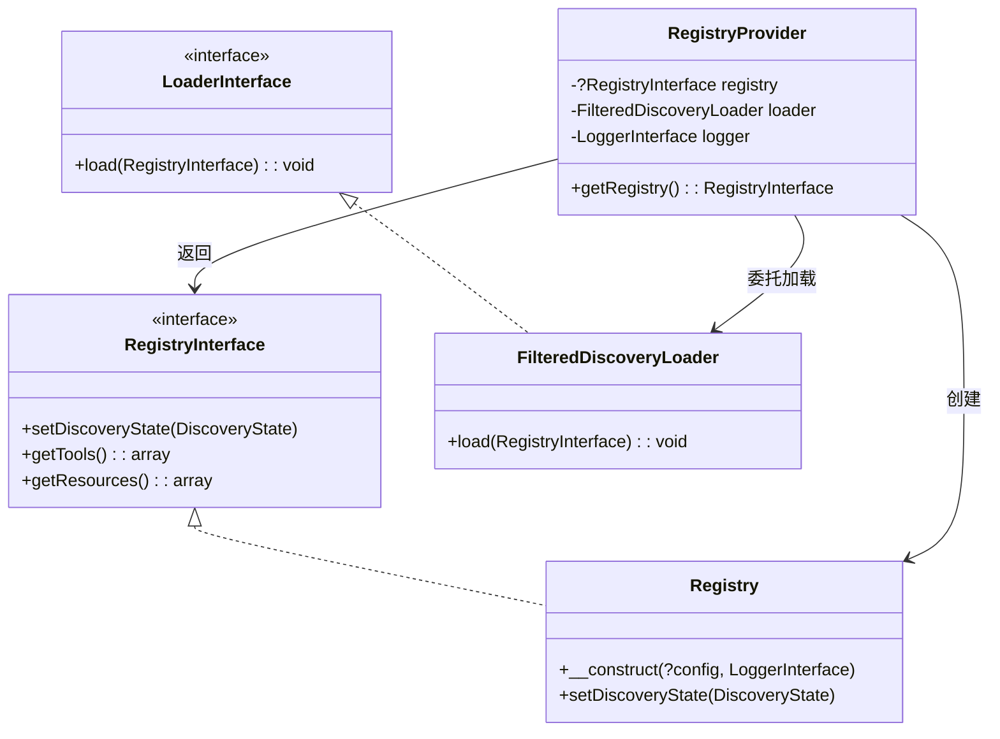
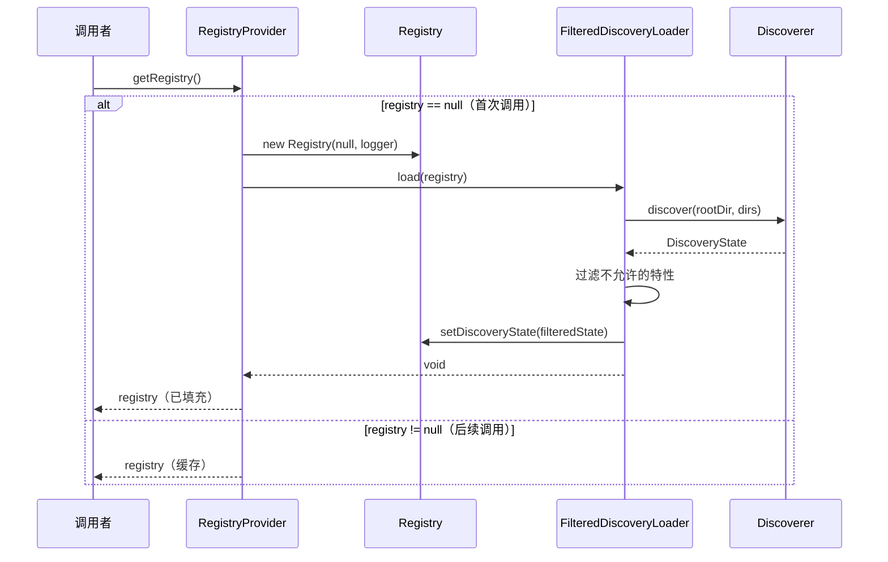
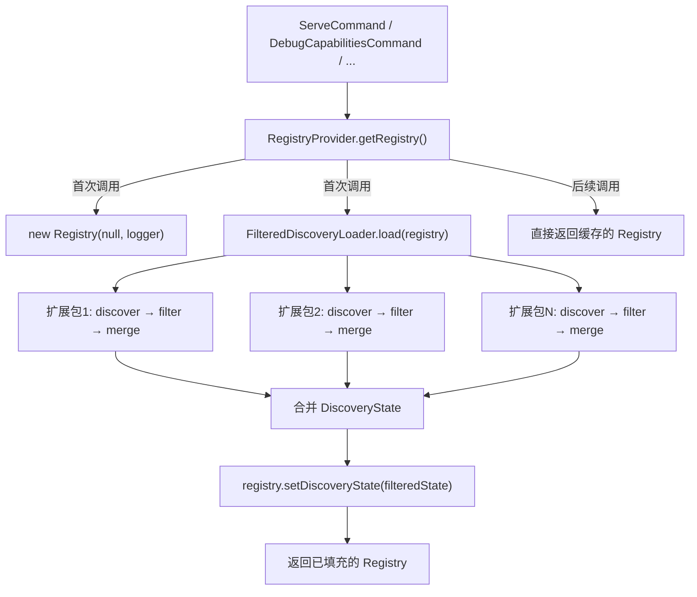

# RegistryProvider 类分析报告

## 文件概述

| 属性 | 值 |
|------|-----|
| **文件路径** | `src/mate/src/Service/RegistryProvider.php` |
| **命名空间** | `Symfony\AI\Mate\Service` |
| **类型** | `final` 类 |
| **父类** | 无 |
| **作者** | Johannes Wachter |
| **行数** | 49 行 |

`RegistryProvider` 是 MCP（Model Context Protocol）能力注册表的延迟初始化提供者。它封装了 `Registry` 实例的创建与填充逻辑，确保能力发现过程仅在首次访问时执行，避免在容器编译阶段产生不必要的开销。

---

## 类签名与依赖

### 类图



### 导入依赖

| 依赖 | 类型 | 来源 | 用途 |
|------|------|------|------|
| `Mcp\Capability\Registry` | 具体类 | `mcp/sdk` | MCP 能力注册表实现 |
| `Mcp\Capability\RegistryInterface` | 接口 | `mcp/sdk` | 注册表契约 |
| `Psr\Log\LoggerInterface` | 接口 | `psr/log` | 日志记录 |
| `Symfony\AI\Mate\Discovery\FilteredDiscoveryLoader` | 具体类 | 内部 | 过滤式能力发现加载器 |

### 构造函数

```php
public function __construct(
    private FilteredDiscoveryLoader $loader,
    private LoggerInterface $logger,
)
```

| 参数 | 类型 | 说明 |
|------|------|------|
| `$loader` | `FilteredDiscoveryLoader` | 负责发现并过滤 MCP 能力（工具、资源、提示词等） |
| `$logger` | `LoggerInterface` | 传递给 `Registry` 构造函数，用于注册表内部日志 |

### 实例属性

| 属性 | 类型 | 初始值 | 说明 |
|------|------|--------|------|
| `$registry` | `?RegistryInterface` | `null` | 延迟初始化的注册表实例 |

---

## 方法级别分析

### `getRegistry(): RegistryInterface`

**职责**: 获取 MCP 能力注册表实例，首次调用时进行延迟初始化。

**输入**: 无参数。

**输出**: `RegistryInterface` — 已填充能力数据的注册表实例。

**处理流程**:



**关键实现**:

```php
public function getRegistry(): RegistryInterface
{
    if (null === $this->registry) {
        $this->registry = new Registry(null, $this->logger);
        $this->loader->load($this->registry);
    }

    return $this->registry;
}
```

**初始化过程分解**:

| 步骤 | 操作 | 说明 |
|------|------|------|
| 1 | `null === $this->registry` | 检查是否已初始化 |
| 2 | `new Registry(null, $this->logger)` | 创建空注册表（第一个参数 `null` 表示无预设配置） |
| 3 | `$this->loader->load($this->registry)` | 触发完整的能力发现流程 |
| 4 | 返回 `$this->registry` | 返回已填充的注册表 |

**加载器内部执行链**:

当 `$this->loader->load($this->registry)` 被调用时，`FilteredDiscoveryLoader` 会：
1. 遍历所有已启用的扩展包
2. 对每个扩展调用 `MCP\Discoverer` 扫描其目录
3. 按 `disabledFeatures` 配置过滤个别工具/资源
4. 将所有过滤后的 `DiscoveryState` 合并
5. 调用 `registry->setDiscoveryState()` 写入最终结果

---

## 设计模式分析

### 1. 延迟初始化模式（Lazy Initialization Pattern）

这是 `RegistryProvider` 的核心设计模式。通过 `null` 检查与首次赋值实现：

```php
if (null === $this->registry) {
    $this->registry = new Registry(null, $this->logger);
    $this->loader->load($this->registry);
}
```

**优势**:
- **避免启动开销**: 能力发现涉及文件系统扫描和反射，代价高昂
- **按需计算**: 某些命令（如 `clear-cache`）不需要注册表
- **容器编译安全**: 不会在容器编译阶段触发副作用

### 2. 提供者模式（Provider Pattern）

`RegistryProvider` 将 `Registry` 的创建与配置封装在 `getRegistry()` 方法中，作为注册表实例的工厂与缓存的统一入口。消费者只需调用 `getRegistry()` 而无需了解初始化细节。

### 3. 组合模式（Composition over Inheritance）

不继承 `Registry` 或 `RegistryInterface`，而是通过组合持有引用：
- 持有 `FilteredDiscoveryLoader`（加载策略）
- 持有 `LoggerInterface`（日志策略）
- 创建并持有 `Registry`（被管理的对象）

### 4. 单例语义（Singleton Semantics — 实例级别）

虽然不是传统的全局单例，但在单个 `RegistryProvider` 实例的生命周期内，`getRegistry()` 始终返回同一个 `Registry` 对象，保证注册表状态的一致性。

---

## 在模块中的调用场景

### 1. 服务容器注册

```php
// default.config.php
->set(RegistryProvider::class)  // 自动装配
```

通过 Symfony 的 `autowire` 机制自动注入 `FilteredDiscoveryLoader` 和 `LoggerInterface`。

### 2. 主要消费者

| 消费者 | 场景 | 说明 |
|--------|------|------|
| `ServeCommand` | MCP 服务器启动 | 获取注册表用于创建 MCP Server 实例 |
| `DebugCapabilitiesCommand` | 调试命令 | 列出所有已注册的工具/资源/提示词 |
| `ToolsListCommand` | 工具列表 | 列出可用 MCP 工具 |
| `ToolsInspectCommand` | 工具详情 | 查看特定工具的详细信息 |
| `ToolsCallCommand` | 工具调用 | 调用特定 MCP 工具 |
| `CapabilityCollector` | 能力收集 | 聚合所有已发现的能力 |

### 3. 调用链路图



---

## 可扩展性分析

### final 约束

类声明为 `final`，不可继承。这是有意为之的设计，确保注册表初始化逻辑不会被意外覆盖。

### 扩展方向

| 方向 | 可行性 | 方式 |
|------|--------|------|
| 替换加载器实现 | 高 | 传入不同的 `FilteredDiscoveryLoader` 实例 |
| 添加注册表缓存（持久化） | 中等 | 创建装饰器或修改 `getRegistry()` 逻辑 |
| 预热注册表（Warm-up） | 高 | 在容器编译后主动调用 `getRegistry()` |
| 支持多注册表 | 低 | 当前设计为单注册表语义 |

### 接口提取建议

当前 `RegistryProvider` 未实现任何接口。如果未来需要替换（如缓存装饰器），可考虑提取 `RegistryProviderInterface`：

```php
interface RegistryProviderInterface {
    public function getRegistry(): RegistryInterface;
}
```

---

## 技巧与最佳实践

### 1. 延迟初始化的空检查惯用法

```php
if (null === $this->registry) {
    // 仅首次执行
}
```

将 `null` 放在 `===` 左侧是 Symfony 编码规范的推荐写法（Yoda 条件），可避免误写为赋值 `=`。

### 2. 构造函数中不执行重操作

`RegistryProvider` 的构造函数仅保存依赖引用，不执行任何 I/O 或反射操作。这是依赖注入最佳实践——构造函数应当轻量，副作用延迟到实际使用时。

### 3. 显式传递 null 给 Registry

```php
new Registry(null, $this->logger)
```

第一个参数 `null` 明确表示"无预设配置"，由后续的 `load()` 调用填充数据。这种"创建空对象 → 后期填充"的模式在 MCP SDK 中是标准用法。

### 4. 关注点分离

`RegistryProvider` 不参与能力发现的细节逻辑，仅负责：
- **何时**创建注册表（延迟）
- **如何**组装（委托给 `FilteredDiscoveryLoader`）
- **返回什么**（`RegistryInterface`）

这使得发现逻辑、过滤策略、注册表实现三者可以独立演化。
