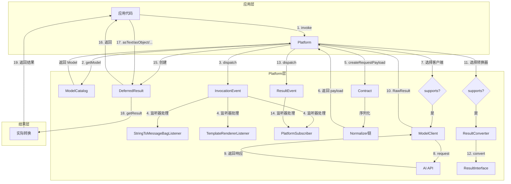
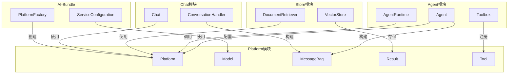

# Symfony AI Platform 模块完整分析报告

## 模块概述

**Symfony AI Platform** 是 Symfony AI 生态系统的核心组件，提供了一个统一的接口来与各种 AI 平台（如 OpenAI、Anthropic、Google Gemini、Mistral 等）进行交互。它抽象了不同 AI 服务提供商的差异，让开发者可以使用一致的 API 来调用各种 AI 模型。

### 设计哲学

1. **统一接口**: 无论使用哪个 AI 服务商，都使用相同的 `PlatformInterface::invoke()` 方法
2. **类型安全**: 使用 PHP 8 的现代特性（枚举、只读属性、联合类型）确保类型安全
3. **可扩展性**: 通过接口和事件系统支持自定义扩展
4. **关注点分离**: 消息、结果、工具等各有独立的类层次结构
5. **延迟执行**: 使用 `DeferredResult` 实现懒加载，优化性能

### 核心特性

- ✅ 多模态输入支持（文本、图像、音频、视频、PDF）
- ✅ 流式输出支持
- ✅ 结构化输出（JSON Schema）
- ✅ 工具/函数调用
- ✅ 向量嵌入
- ✅ 重排序
- ✅ Token 使用量追踪
- ✅ 事件系统
- ✅ 模板消息
- ✅ 测试工具

---

## 目录结构说明

```
src/platform/src/
├── Capability.php              # 模型能力枚举
├── Contract.php                # 数据序列化契约
├── Model.php                   # 模型实体类
├── Platform.php                # 核心平台实现
├── PlatformInterface.php       # 平台接口
├── PlainConverter.php          # 简单结果转换器
├── ModelClientInterface.php    # 模型客户端接口
├── ResultConverterInterface.php # 结果转换器接口
│
├── Contract/                   # 数据契约与序列化
│   ├── JsonSchema/             # JSON Schema 生成
│   │   ├── Factory.php         # Schema 工厂
│   │   ├── Attribute/          # Schema 属性
│   │   ├── Describer/          # 描述器集合
│   │   └── Subject/            # 描述主题
│   └── Normalizer/             # Symfony Serializer Normalizer
│       ├── Message/            # 消息 Normalizer
│       ├── Message/Content/    # 内容 Normalizer
│       ├── Result/             # 结果 Normalizer
│       └── ToolNormalizer.php  # 工具 Normalizer
│
├── Event/                      # 事件类
│   ├── InvocationEvent.php     # 调用前事件
│   └── ResultEvent.php         # 结果后事件
│
├── EventListener/              # 内置事件监听器
│   ├── StringToMessageBagListener.php
│   └── TemplateRendererListener.php
│
├── Exception/                  # 异常类层次结构
│   ├── ExceptionInterface.php  # 异常标记接口
│   ├── RuntimeException.php    # 运行时异常基类
│   ├── InvalidArgumentException.php
│   └── ... (其他具体异常)
│
├── Message/                    # 消息系统
│   ├── MessageInterface.php    # 消息接口
│   ├── Message.php             # 消息工厂
│   ├── MessageBag.php          # 消息容器
│   ├── Role.php                # 角色枚举
│   ├── SystemMessage.php       # 系统消息
│   ├── UserMessage.php         # 用户消息
│   ├── AssistantMessage.php    # 助手消息
│   ├── ToolCallMessage.php     # 工具调用消息
│   ├── Template.php            # 模板消息
│   ├── Content/                # 内容类型
│   │   ├── ContentInterface.php
│   │   ├── Text.php
│   │   ├── Image.php
│   │   ├── Audio.php
│   │   └── ...
│   └── TemplateRenderer/       # 模板渲染器
│
├── Metadata/                   # 元数据系统
│   ├── Metadata.php            # 元数据容器
│   ├── MetadataAwareInterface.php
│   ├── MetadataAwareTrait.php
│   └── MergeableMetadataInterface.php
│
├── ModelCatalog/               # 模型目录
│   ├── ModelCatalogInterface.php
│   ├── AbstractModelCatalog.php
│   └── FallbackModelCatalog.php
│
├── Reranking/                  # 重排序
│   └── RerankingEntry.php
│
├── Result/                     # 结果系统
│   ├── ResultInterface.php     # 结果接口
│   ├── BaseResult.php          # 结果基类
│   ├── DeferredResult.php      # 延迟结果
│   ├── TextResult.php          # 文本结果
│   ├── BinaryResult.php        # 二进制结果
│   ├── ObjectResult.php        # 对象结果
│   ├── StreamResult.php        # 流式结果
│   ├── VectorResult.php        # 向量结果
│   ├── ToolCallResult.php      # 工具调用结果
│   ├── RawResultInterface.php  # 原始结果接口
│   ├── RawHttpResult.php       # HTTP 原始结果
│   ├── Stream/                 # 流相关
│   └── Exception/              # 结果异常
│
├── StructuredOutput/           # 结构化输出
│   ├── PlatformSubscriber.php
│   ├── ResponseFormatFactory.php
│   ├── ResultConverter.php
│   └── Serializer.php
│
├── Test/                       # 测试工具
│   ├── InMemoryPlatform.php
│   └── ModelCatalogTestCase.php
│
├── TokenUsage/                 # Token 使用量
│   ├── TokenUsageInterface.php
│   ├── TokenUsage.php
│   ├── TokenUsageAggregation.php
│   └── TokenUsageExtractorInterface.php
│
├── Tool/                       # 工具系统
│   ├── Tool.php
│   └── ExecutionReference.php
│
└── Vector/                     # 向量嵌入
    ├── VectorInterface.php
    ├── Vector.php
    └── NullVector.php
```

---

## 核心概念

### 1. Model（模型）

`Model` 代表一个 AI 模型，包含：
- **名称**: 模型标识符（如 `gpt-4`, `claude-3-opus`）
- **能力**: 模型支持的功能列表（`Capability` 枚举）
- **选项**: 默认调用选项

```php
$model = new Model('gpt-4', [
    Capability::INPUT_MESSAGES,
    Capability::OUTPUT_TEXT,
    Capability::TOOL_CALLING,
], ['temperature' => 0.7]);
```

### 2. Capability（能力）

`Capability` 枚举定义了模型可能支持的所有功能：

- **输入**: `INPUT_TEXT`, `INPUT_MESSAGES`, `INPUT_IMAGE`, `INPUT_AUDIO`, `INPUT_PDF`, `INPUT_VIDEO`
- **输出**: `OUTPUT_TEXT`, `OUTPUT_STREAMING`, `OUTPUT_STRUCTURED`, `OUTPUT_IMAGE`, `OUTPUT_AUDIO`
- **功能**: `TOOL_CALLING`, `EMBEDDINGS`, `RERANKING`, `THINKING`

### 3. Platform（平台）

`Platform` 是核心调度器，协调整个调用流程：
1. 解析模型名称
2. 分发事件
3. 序列化输入
4. 发送请求
5. 转换结果

### 4. Contract（契约）

`Contract` 负责数据序列化，将消息、工具等对象转换为 API 所需的 JSON 格式。

### 5. MessageBag（消息包）

`MessageBag` 是对话消息的容器，包含系统消息、用户消息、助手消息等。

### 6. DeferredResult（延迟结果）

`DeferredResult` 实现延迟加载，只有在访问结果时才进行转换处理。提供便捷方法如 `asText()`, `asObject()`, `asStream()` 等。

---

## 完整调用流程图



### 流程详解

1. **应用调用** - 应用代码调用 `Platform::invoke(model, input, options)`

2. **模型解析** - 通过 `ModelCatalog` 将模型名称解析为 `Model` 对象

3. **InvocationEvent 分发** - 分发事件，允许监听器修改输入

4. **监听器处理**:
   - `StringToMessageBagListener`: 将字符串转换为 MessageBag
   - `TemplateRendererListener`: 渲染模板变量
   - `PlatformSubscriber`: 处理结构化输出

5. **创建请求负载** - 使用 `Contract` 序列化输入数据

6. **Normalizer 链** - 各 Normalizer 处理不同类型的数据

7. **选择 ModelClient** - 遍历所有客户端，找到支持该模型的

8. **发送请求** - ModelClient 发送 HTTP 请求到 AI API

9. **接收响应** - AI API 返回原始响应

10. **返回 RawResult** - 将响应包装为 `RawResultInterface`

11. **选择 ResultConverter** - 遍历所有转换器，找到支持该模型的

12. **转换结果** - 将原始结果转换为 `ResultInterface`

13. **ResultEvent 分发** - 分发事件，允许监听器修改结果

14. **结构化输出处理** - `PlatformSubscriber` 包装转换器以处理反序列化

15. **创建 DeferredResult** - 包装结果转换器和原始结果

16. **返回给应用** - 返回 `DeferredResult` 对象

17. **应用访问结果** - 调用 `asText()`, `asObject()` 等方法

18. **实际转换** - 此时才执行结果转换

19. **返回最终结果** - 返回转换后的结果对象

---

## 设计模式全览

### 1. 工厂模式 (Factory Pattern)

**使用位置**: `Message`, `Contract::create()`, `ResponseFormatFactory`

```php
// Message 工厂
$message = Message::ofUser('Hello');
$message = Message::forSystem('You are helpful');
$message = Message::ofAssistant('Hi there!');

// Contract 工厂
$contract = Contract::create(new CustomNormalizer());
```

### 2. 策略模式 (Strategy Pattern)

**使用位置**: `ModelClientInterface`, `ResultConverterInterface`, `TemplateRendererInterface`

```php
// 不同的 ModelClient 处理不同的平台
foreach ($this->modelClients as $client) {
    if ($client->supports($model)) {
        return $client->request($model, $payload, $options);
    }
}
```

### 3. 观察者模式 (Observer Pattern)

**使用位置**: 事件系统, `StreamResult` 监听器

```php
// 事件分发
$this->eventDispatcher->dispatch(new InvocationEvent($model, $input, $options));

// 流监听器
$streamResult->addListener(new TokenUsageListener());
```

### 4. 装饰器模式 (Decorator Pattern)

**使用位置**: `StructuredOutput\ResultConverter`, `DeferredResult`

```php
// 包装内部转换器
new ResultConverter(
    $innerConverter,
    $serializer,
    $outputType
);
```

### 5. 组合模式 (Composite Pattern)

**使用位置**: `MessageBag`, `TokenUsageAggregation`, `Normalizer` 链

```php
// MessageBag 包含多个消息
$bag = new MessageBag($system, $user, $assistant);

// TokenUsage 聚合
$aggregation = new TokenUsageAggregation([$usage1, $usage2]);
```

### 6. 代理/延迟加载模式 (Proxy/Lazy Loading)

**使用位置**: `DeferredResult`, `File` 内容类

```php
// 延迟结果转换
$deferred = new DeferredResult($converter, $rawResult);
// 只有调用 asText() 时才实际转换
$text = $deferred->asText();

// 延迟文件读取
Image::fromFile('/path/to/image.jpg'); // 文件内容延迟读取
```

### 7. 责任链模式 (Chain of Responsibility)

**使用位置**: `Normalizer` 链, `Describer` 链

```php
// Serializer 尝试每个 Normalizer
$serializer = new Serializer([
    new MessageBagNormalizer(),
    new UserMessageNormalizer(),
    // ...
]);
```

### 8. 模板方法模式 (Template Method)

**使用位置**: `BaseResult`, `AbstractStreamListener`, `AbstractModelCatalog`

```php
abstract class BaseResult implements ResultInterface
{
    use MetadataAwareTrait;
    use RawResultAwareTrait;
    // 子类只需实现 getContent()
}
```

### 9. 值对象模式 (Value Object)

**使用位置**: `Model`, 所有消息类, `ToolCall`, `Vector`

```php
// 不可变对象
final class Model
{
    public function __construct(
        private readonly string $name,
        private readonly array $capabilities,
        private readonly array $options,
    ) {}
}
```

### 10. 空对象模式 (Null Object)

**使用位置**: `NullVector`, `PlainConverter`

```php
// 空向量，避免 null 检查
$vector = $document->getVector() ?? new NullVector();
```

---

## 扩展点与替换点

### 1. 自定义 ModelClient

连接新的 AI 服务提供商：

```php
class MyAIClient implements ModelClientInterface
{
    public function supports(Model $model): bool
    {
        return str_starts_with($model->getName(), 'my-ai-');
    }
    
    public function request(Model $model, array|string $payload, array $options = []): RawResultInterface
    {
        // 发送请求到自定义 API
    }
}
```

### 2. 自定义 ResultConverter

处理特殊的响应格式：

```php
class MyResultConverter implements ResultConverterInterface
{
    public function convert(RawResultInterface $result, array $options = []): ResultInterface
    {
        // 自定义转换逻辑
    }
}
```

### 3. 自定义 Normalizer

处理特殊的消息或内容类型：

```php
class MyContentNormalizer implements NormalizerInterface
{
    public function supportsNormalization(mixed $data, ?string $format = null, array $context = []): bool
    {
        return $data instanceof MyContent;
    }
    
    public function normalize(mixed $data, ?string $format = null, array $context = []): array
    {
        // 自定义序列化
    }
}
```

### 4. 自定义 ModelCatalog

定义模型集合：

```php
class MyModelCatalog extends AbstractModelCatalog
{
    protected array $models = [
        'my-model' => [
            'class' => Model::class,
            'capabilities' => [...],
        ],
    ];
}
```

### 5. 自定义事件监听器

拦截和修改调用流程：

```php
class MyListener
{
    public function onInvocation(InvocationEvent $event): void
    {
        // 修改输入
    }
    
    public function onResult(ResultEvent $event): void
    {
        // 修改结果
    }
}
```

### 6. 自定义模板渲染器

支持新的模板语法：

```php
class TwigRenderer implements TemplateRendererInterface
{
    public function supports(string $type): bool
    {
        return 'twig' === $type;
    }
    
    public function render(Template $template, array $variables): string
    {
        return $this->twig->render($template->getTemplate(), $variables);
    }
}
```

### 7. 自定义结果类型

添加新的结果类型：

```php
class AudioTranscriptionResult extends BaseResult
{
    public function __construct(
        private readonly string $text,
        private readonly array $segments,
    ) {}
    
    public function getContent(): string
    {
        return $this->text;
    }
}
```

---

## 可自由组合的功能

### 1. 消息 + 模板

```php
$message = Message::forSystem(
    Template::string('You are a {role} assistant.')
);

$platform->invoke('gpt-4', new MessageBag($message), [
    'template_vars' => ['role' => 'coding']
]);
```

### 2. 消息 + 多模态

```php
$message = Message::ofUser(
    new Text('Describe this:'),
    Image::fromFile('photo.jpg'),
    Audio::fromFile('audio.mp3')
);
```

### 3. 工具 + 结构化输出

```php
// 工具返回结构化数据
$result = $platform->invoke('gpt-4', $messages, [
    'tools' => [$weatherTool],
    'response_format' => WeatherResponse::class,
]);
```

### 4. 流式 + Token 追踪

```php
$result = $platform->invoke('gpt-4', $messages, ['stream' => true]);

foreach ($result->asStream() as $chunk) {
    echo $chunk;
}

$tokenUsage = $result->getMetadata()->get('token_usage');
```

### 5. 事件 + 缓存

```php
class CachingListener
{
    public function onInvocation(InvocationEvent $event): void
    {
        $key = $this->generateKey($event);
        if ($cached = $this->cache->get($key)) {
            // 设置缓存的结果
        }
    }
}
```

---

## 与其他模块的关系



### Platform → Agent

Agent 组件使用 Platform 进行 AI 调用，构建 MessageBag，注册 Tool。

### Platform → Store

Store 组件使用 Platform 生成向量嵌入，存储和检索文档。

### Platform → Chat

Chat 组件使用 Platform 处理对话，管理对话历史。

### Platform → AI-Bundle

AI-Bundle 是 Symfony 集成层，配置和创建 Platform 实例。

---

## 最佳实践总结

### 1. 使用工厂方法

```php
// ✅ 好
$message = Message::ofUser('Hello');
$contract = Contract::create();

// ❌ 避免
$message = new UserMessage(new Text('Hello'));
```

### 2. 检查模型能力

```php
// ✅ 好
if ($model->supports(Capability::TOOL_CALLING)) {
    $options['tools'] = $tools;
}

// ❌ 避免 - 假设所有模型都支持
$options['tools'] = $tools;
```

### 3. 优雅处理异常

```php
try {
    $result = $platform->invoke($model, $input);
} catch (RateLimitExceededException $e) {
    sleep($e->getRetryAfter() ?? 60);
    // 重试
} catch (ExceptionInterface $e) {
    $this->logger->error('AI call failed', ['error' => $e->getMessage()]);
    throw $e;
}
```

### 4. 利用延迟结果

```php
// ✅ 延迟处理
$deferred = $platform->invoke($model, $input);
// ... 其他操作
$text = $deferred->asText(); // 此时才转换

// ❌ 立即处理（某些场景可能低效）
$text = $platform->invoke($model, $input)->asText();
```

### 5. 消费完整流

```php
// ✅ 完整消费
foreach ($result->asStream() as $chunk) {
    echo $chunk;
}

// ❌ 不完整消费可能导致资源泄漏
$first = $result->asStream()->current();
```

### 6. 使用测试工具

```php
// ✅ 使用 InMemoryPlatform 测试
$platform = new InMemoryPlatform('Mock response');
$service = new MyService($platform);

// ❌ 在测试中使用真实 API
$platform = new Platform($realClients, ...);
```

### 7. 依赖接口而非实现

```php
// ✅ 依赖接口
class MyService
{
    public function __construct(private readonly PlatformInterface $platform) {}
}

// ❌ 依赖具体类
class MyService
{
    public function __construct(private readonly Platform $platform) {}
}
```

---

## 快速入门示例

### 基础文本对话

```php
use Symfony\AI\Platform\Platform;
use Symfony\AI\Platform\Message\Message;
use Symfony\AI\Platform\Message\MessageBag;

// 假设 $platform 已通过 DI 注入

$messages = new MessageBag(
    Message::forSystem('You are a helpful assistant.'),
    Message::ofUser('What is the capital of France?')
);

$result = $platform->invoke('gpt-4', $messages);
echo $result->asText(); // Paris is the capital of France.
```

### 多模态对话

```php
use Symfony\AI\Platform\Message\Content\Image;

$messages = new MessageBag(
    Message::ofUser(
        new Text('What is in this image?'),
        Image::fromFile('/path/to/photo.jpg')
    )
);

$result = $platform->invoke('gpt-4-vision', $messages);
```

### 工具调用

```php
use Symfony\AI\Platform\Tool\Tool;
use Symfony\AI\Platform\Tool\ExecutionReference;

$tools = [
    new Tool(
        new ExecutionReference(WeatherService::class),
        'get_weather',
        'Get current weather',
        ['type' => 'object', 'properties' => ['location' => ['type' => 'string']]]
    )
];

$result = $platform->invoke('gpt-4', $messages, ['tools' => $tools]);
$toolCalls = $result->asToolCalls();
```

### 结构化输出

```php
class Weather
{
    public string $location;
    public float $temperature;
}

$result = $platform->invoke('gpt-4', 'Weather in Paris?', [
    'response_format' => Weather::class
]);

$weather = $result->asObject();
echo $weather->temperature;
```

### 流式输出

```php
$result = $platform->invoke('gpt-4', $messages, ['stream' => true]);

foreach ($result->asStream() as $chunk) {
    echo $chunk;
    flush();
}
```

---

本报告全面覆盖了 Symfony AI Platform 模块的核心功能、设计模式、扩展点和使用方法，希望能帮助开发者快速掌握这个强大的 AI 集成框架。
