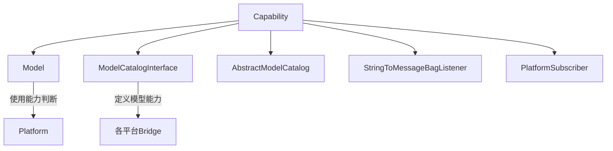

# Capability.php 文件分析报告

## 文件概述

`Capability.php` 是 Symfony AI Platform 模块的核心枚举类，定义了 AI 模型支持的所有能力类型。这个枚举用于声明模型的功能特性，使平台能够在运行时判断某个模型是否支持特定的输入/输出类型或功能。

**文件路径**: `src/platform/src/Capability.php`  
**命名空间**: `Symfony\AI\Platform`  
**作者**: Christopher Hertel

---

## 类/接口/枚举定义

### `enum Capability: string`

一个字符串支持的枚举（Backed Enum），每个枚举值都有一个对应的字符串标识符。

**特征（Traits）**:
- `OskarStark\Enum\Trait\Comparable` - 提供枚举值比较功能

---

## 枚举值详解

### 输入能力 (INPUT)

| 枚举值 | 字符串值 | 说明 |
|--------|----------|------|
| `INPUT_AUDIO` | `'input-audio'` | 支持音频输入 |
| `INPUT_IMAGE` | `'input-image'` | 支持图像输入 |
| `INPUT_MESSAGES` | `'input-messages'` | 支持消息格式输入（对话式） |
| `INPUT_MULTIPLE` | `'input-multiple'` | 支持多个输入 |
| `INPUT_PDF` | `'input-pdf'` | 支持 PDF 文档输入 |
| `INPUT_TEXT` | `'input-text'` | 支持文本输入 |
| `INPUT_VIDEO` | `'input-video'` | 支持视频输入 |
| `INPUT_MULTIMODAL` | `'input-multimodal'` | 支持多模态输入 |

### 输出能力 (OUTPUT)

| 枚举值 | 字符串值 | 说明 |
|--------|----------|------|
| `OUTPUT_AUDIO` | `'output-audio'` | 支持音频输出 |
| `OUTPUT_IMAGE` | `'output-image'` | 支持图像输出 |
| `OUTPUT_STREAMING` | `'output-streaming'` | 支持流式输出 |
| `OUTPUT_STRUCTURED` | `'output-structured'` | 支持结构化输出（JSON Schema） |
| `OUTPUT_TEXT` | `'output-text'` | 支持文本输出 |

### 功能能力 (FUNCTIONALITY)

| 枚举值 | 字符串值 | 说明 |
|--------|----------|------|
| `TOOL_CALLING` | `'tool-calling'` | 支持工具调用/函数调用 |

### 语音能力 (VOICE)

| 枚举值 | 字符串值 | 说明 |
|--------|----------|------|
| `TEXT_TO_SPEECH` | `'text-to-speech'` | 文本转语音 |
| `SPEECH_TO_TEXT` | `'speech-to-text'` | 语音转文本 |

### 图像生成能力 (IMAGE)

| 枚举值 | 字符串值 | 说明 |
|--------|----------|------|
| `TEXT_TO_IMAGE` | `'text-to-image'` | 文本生成图像 |
| `IMAGE_TO_IMAGE` | `'image-to-image'` | 图像转换 |

### 视频生成能力 (VIDEO)

| 枚举值 | 字符串值 | 说明 |
|--------|----------|------|
| `TEXT_TO_VIDEO` | `'text-to-video'` | 文本生成视频 |
| `IMAGE_TO_VIDEO` | `'image-to-video'` | 图像生成视频 |
| `VIDEO_TO_VIDEO` | `'video-to-video'` | 视频转换 |

### 嵌入能力 (EMBEDDINGS)

| 枚举值 | 字符串值 | 说明 |
|--------|----------|------|
| `EMBEDDINGS` | `'embeddings'` | 向量嵌入 |

### 重排序能力 (RERANKING)

| 枚举值 | 字符串值 | 说明 |
|--------|----------|------|
| `RERANKING` | `'reranking'` | 结果重排序 |

### 思考能力 (THINKING)

| 枚举值 | 字符串值 | 说明 |
|--------|----------|------|
| `THINKING` | `'thinking'` | 模型推理/思考过程 |

---

## 设计模式

### 1. 枚举模式 (Enum Pattern)

**使用原因**:
- **类型安全**: 使用枚举而非字符串常量，编译时即可检测错误
- **IDE 支持**: 提供完整的自动补全和类型提示
- **可维护性**: 集中管理所有能力定义，便于添加新能力

### 2. 策略标识符模式

每个能力值作为策略的标识符，用于在运行时决定模型的行为路径。

---

## 技巧与亮点

### 1. 使用 Comparable Trait

```php
use OskarStark\Enum\Trait\Comparable;
```

这个 trait 提供了 `equalsOneOf()` 等方法，允许轻松检查一个能力是否在能力列表中：

```php
// 在 Model::supports() 中使用
return $capability->equalsOneOf($this->capabilities);
```

### 2. 语义化分组

枚举值按功能类别组织，使用注释清晰分隔，提高代码可读性。

### 3. 字符串值的一致命名

所有字符串值使用小写和连字符格式（如 `'input-audio'`），便于序列化和配置文件使用。

---

## 扩展点

### 添加新能力

要添加新的 AI 能力，只需在枚举中添加新的 case：

```php
// 示例：添加代码生成能力
case CODE_GENERATION = 'code-generation';

// 示例：添加实时能力
case REALTIME = 'realtime';
```

### 自定义能力检查

通过 `Model::supports()` 方法检查能力：

```php
if ($model->supports(Capability::TOOL_CALLING)) {
    // 启用工具调用逻辑
}
```

---

## 与其他文件的关系



### 依赖此文件的组件

1. **Model** - 存储和查询模型能力
2. **ModelCatalog** - 定义各模型的能力列表
3. **StringToMessageBagListener** - 检查 INPUT_MESSAGES 能力
4. **PlatformSubscriber** - 检查 OUTPUT_STRUCTURED 能力
5. **各 Bridge 实现** - 定义平台特定模型的能力

---

## 使用场景示例

### 场景1：检查模型是否支持工具调用

```php
use Symfony\AI\Platform\Capability;
use Symfony\AI\Platform\Model;

$model = new Model('gpt-4', [
    Capability::INPUT_MESSAGES,
    Capability::OUTPUT_TEXT,
    Capability::TOOL_CALLING,
]);

if ($model->supports(Capability::TOOL_CALLING)) {
    echo "此模型支持工具调用！";
}
```

### 场景2：创建多模态模型

```php
use Symfony\AI\Platform\Capability;
use Symfony\AI\Platform\Model;

$multimodalModel = new Model('gpt-4-vision', [
    Capability::INPUT_MESSAGES,
    Capability::INPUT_IMAGE,
    Capability::INPUT_MULTIMODAL,
    Capability::OUTPUT_TEXT,
    Capability::OUTPUT_STREAMING,
]);
```

### 场景3：在 ModelCatalog 中定义模型

```php
protected array $models = [
    'claude-3-opus' => [
        'class' => Model::class,
        'capabilities' => [
            Capability::INPUT_MESSAGES,
            Capability::INPUT_IMAGE,
            Capability::OUTPUT_TEXT,
            Capability::OUTPUT_STREAMING,
            Capability::OUTPUT_STRUCTURED,
            Capability::TOOL_CALLING,
            Capability::THINKING,
        ],
    ],
];
```

### 场景4：条件性功能启用

```php
use Symfony\AI\Platform\Capability;
use Symfony\AI\Platform\Exception\MissingModelSupportException;

function requiresStructuredOutput(Model $model): void
{
    if (!$model->supports(Capability::OUTPUT_STRUCTURED)) {
        throw MissingModelSupportException::forStructuredOutput($model);
    }
}
```

---

## 最佳实践

1. **总是使用枚举值而非字符串**：避免使用 `'tool-calling'` 这样的硬编码字符串
2. **能力组合检查**：复杂功能可能需要多个能力的组合
3. **优雅降级**：当模型不支持某能力时，提供替代方案

```php
if ($model->supports(Capability::OUTPUT_STREAMING)) {
    return $platform->invoke($model, $input, ['stream' => true]);
} else {
    return $platform->invoke($model, $input);
}
```
