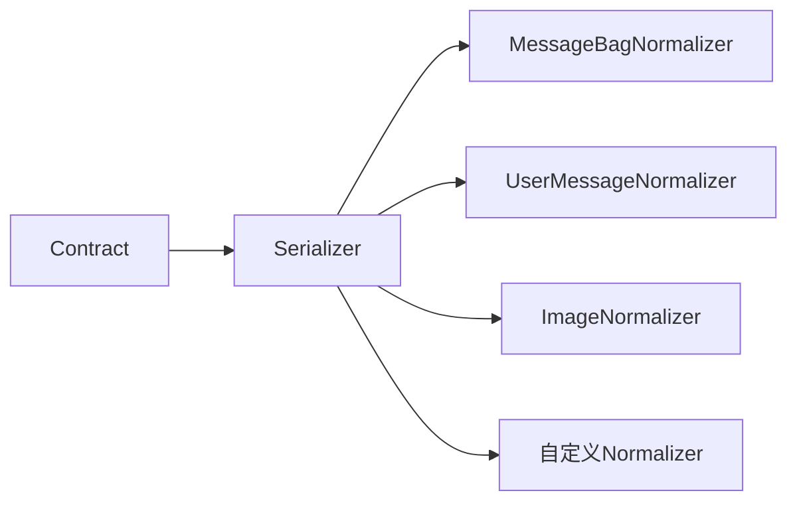
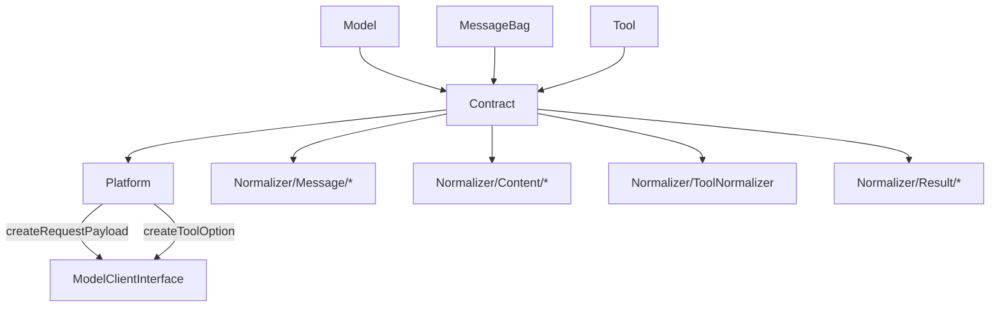

# Contract.php 文件分析报告

## 文件概述

`Contract.php` 是 Symfony AI Platform 的数据转换核心类，负责将应用层的输入数据（如消息、工具定义等）转换为各 AI 平台 API 所需的请求格式。它封装了一组标准化的 Normalizer，使用 Symfony Serializer 组件来处理复杂的数据序列化。

**文件路径**: `src/platform/src/Contract.php`  
**命名空间**: `Symfony\AI\Platform`  
**作者**: Christopher Hertel

---

## 类/接口/枚举定义

### `class Contract`

#### 类特性
- **final**: 不可继承的构造函数
- **依赖注入**: 通过构造函数注入 NormalizerInterface

#### 类常量

| 常量名 | 值 | 说明 |
|--------|-----|------|
| `CONTEXT_MODEL` | `'model'` | 序列化上下文中的模型标识键 |
| `CONTEXT_OPTIONS` | `'options'` | 序列化上下文中的选项标识键 |

---

## 方法/函数分析

### `__construct(NormalizerInterface $normalizer)`

**构造函数**

| 参数 | 类型 | 说明 |
|------|------|------|
| `$normalizer` | `NormalizerInterface` | Symfony 序列化器的 Normalizer 接口 |

**特点**: 使用 `final` 修饰符，防止子类覆盖构造函数行为。

---

### `create(NormalizerInterface ...$normalizer): self`

**静态工厂方法 - 创建预配置的 Contract 实例**

| 参数 | 类型 | 说明 |
|------|------|------|
| `...$normalizer` | `NormalizerInterface` | 可变数量的自定义 Normalizer |

**返回值**: `self` - 新的 Contract 实例

**功能**: 创建一个包含所有默认 Normalizer 的 Contract 实例。允许传入自定义 Normalizer 以扩展功能。

**默认注册的 Normalizer**:

1. **消息 Normalizer**:
   - `MessageBagNormalizer` - 消息包
   - `AssistantMessageNormalizer` - 助手消息
   - `SystemMessageNormalizer` - 系统消息
   - `ToolCallMessageNormalizer` - 工具调用消息
   - `UserMessageNormalizer` - 用户消息

2. **内容 Normalizer**:
   - `AudioNormalizer` - 音频内容
   - `ImageNormalizer` - 图像内容
   - `ImageUrlNormalizer` - 图像URL
   - `TextNormalizer` - 文本内容

3. **选项 Normalizer**:
   - `ToolNormalizer` - 工具定义

4. **结果 Normalizer**:
   - `ToolCallNormalizer` - 工具调用结果

5. **扩展 Normalizer**:
   - `JsonSerializableNormalizer` - JsonSerializable 对象

**示例**:

```php
// 使用默认配置
$contract = Contract::create();

// 添加自定义 Normalizer
$contract = Contract::create(new MyCustomNormalizer());
```

---

### `createRequestPayload(Model $model, object|array|string $input, array $options = []): string|array`

**创建 API 请求负载**

| 参数 | 类型 | 约束 | 说明 |
|------|------|------|------|
| `$model` | `Model` | 必需 | 目标模型对象 |
| `$input` | `object\|array\|string` | 必需 | 输入数据（消息包、数组或字符串） |
| `$options` | `array<string, mixed>` | 可选 | 调用选项 |

**返回值**: `string|array<string, mixed>` - 序列化后的请求负载

**功能**:
1. 将模型对象注入序列化上下文（`CONTEXT_MODEL`）
2. 将选项注入序列化上下文（`CONTEXT_OPTIONS`）
3. 使用配置的 Normalizer 链进行数据规范化

**示例**:

```php
$messageBag = new MessageBag(
    Message::forSystem('You are a helpful assistant'),
    Message::ofUser('Hello!')
);

$payload = $contract->createRequestPayload($model, $messageBag, [
    'temperature' => 0.7,
]);

// 结果类似:
// [
//     'messages' => [
//         ['role' => 'system', 'content' => 'You are a helpful assistant'],
//         ['role' => 'user', 'content' => 'Hello!']
//     ],
//     'model' => 'gpt-4'
// ]
```

---

### `createToolOption(array $tools, Model $model): array`

**创建工具配置选项**

| 参数 | 类型 | 约束 | 说明 |
|------|------|------|------|
| `$tools` | `Tool[]` | 必需 | 工具对象数组 |
| `$model` | `Model` | 必需 | 目标模型对象 |

**返回值**: `array<string, mixed>` - 序列化后的工具配置

**功能**:
1. 序列化工具定义数组
2. 保留空对象（`PRESERVE_EMPTY_OBJECTS` 上下文选项）

**示例**:

```php
$tools = [
    new Tool(
        new ExecutionReference(WeatherService::class),
        'get_weather',
        'Get the current weather for a location',
        ['type' => 'object', 'properties' => [...]]
    ),
];

$toolOption = $contract->createToolOption($tools, $model);

// 结果:
// [
//     [
//         'type' => 'function',
//         'function' => [
//             'name' => 'get_weather',
//             'description' => 'Get the current weather...',
//             'parameters' => {...}
//         ]
//     ]
// ]
```

---

## 设计模式

### 1. 工厂模式 (Factory Pattern)

`Contract::create()` 静态方法实现了工厂模式：

```php
public static function create(NormalizerInterface ...$normalizer): self
{
    // 添加默认 Normalizer
    $normalizer[] = new MessageBagNormalizer();
    // ...更多默认 Normalizer
    
    return new self(new Serializer($normalizer));
}
```

**优势**:
- 封装复杂的对象创建逻辑
- 提供合理的默认配置
- 允许自定义扩展

### 2. 策略模式 (Strategy Pattern)

通过注入不同的 Normalizer 实现不同的序列化策略：



### 3. 装饰器链 (Decorator Chain)

Normalizer 链形成装饰器模式，每个 Normalizer 处理特定类型的数据。

---

## 技巧与亮点

### 1. 上下文传递机制

通过序列化上下文将模型和选项信息传递给各 Normalizer：

```php
$this->normalizer->normalize($input, context: [
    self::CONTEXT_MODEL => $model,
    self::CONTEXT_OPTIONS => $options,
]);
```

这使得 Normalizer 可以根据模型特性调整输出格式。

### 2. 可变参数扩展

`create()` 方法使用可变参数允许优雅地添加自定义 Normalizer：

```php
$contract = Contract::create(
    new CustomMessageNormalizer(),
    new SpecialContentNormalizer()
);
```

### 3. 保留空对象

工具参数可能需要空对象 `{}`，使用 `PRESERVE_EMPTY_OBJECTS` 确保正确序列化：

```php
AbstractObjectNormalizer::PRESERVE_EMPTY_OBJECTS => true
```

---

## 扩展点

### 1. 自定义 Normalizer

创建自定义 Normalizer 来处理特殊数据类型：

```php
class CustomContentNormalizer implements NormalizerInterface
{
    public function supportsNormalization(mixed $data, ?string $format = null, array $context = []): bool
    {
        return $data instanceof MyCustomContent;
    }
    
    public function normalize(mixed $data, ?string $format = null, array $context = []): array
    {
        return [
            'type' => 'custom',
            'data' => $data->getValue(),
        ];
    }
    
    public function getSupportedTypes(?string $format): array
    {
        return [MyCustomContent::class => true];
    }
}

// 使用
$contract = Contract::create(new CustomContentNormalizer());
```

### 2. 平台特定 Contract

继承 Contract 创建平台特定的实现：

```php
class AnthropicContract extends Contract
{
    public static function create(NormalizerInterface ...$normalizer): self
    {
        // 添加 Anthropic 特定的 Normalizer
        $normalizer[] = new AnthropicMessageNormalizer();
        
        return parent::create(...$normalizer);
    }
}
```

---

## 与其他文件的关系



### 依赖关系

**被依赖**:
- `Platform` - 使用 Contract 创建请求负载
- 各 Bridge 实现 - 可能扩展或替换默认 Contract

**依赖**:
- `Symfony\Component\Serializer\Serializer`
- 所有 Normalizer 类
- `Model` 类

---

## 使用场景示例

### 场景1：基本消息序列化

```php
use Symfony\AI\Platform\Contract;
use Symfony\AI\Platform\Message\MessageBag;
use Symfony\AI\Platform\Message\Message;
use Symfony\AI\Platform\Model;

$contract = Contract::create();
$model = new Model('gpt-4');

$messageBag = new MessageBag(
    Message::forSystem('You are a helpful assistant.'),
    Message::ofUser('What is the capital of France?')
);

$payload = $contract->createRequestPayload($model, $messageBag);

// 结果:
// [
//     'messages' => [
//         ['role' => 'system', 'content' => 'You are a helpful assistant.'],
//         ['role' => 'user', 'content' => 'What is the capital of France?']
//     ],
//     'model' => 'gpt-4'
// ]
```

### 场景2：带图像的多模态消息

```php
use Symfony\AI\Platform\Message\Content\Image;
use Symfony\AI\Platform\Message\Content\Text;

$userMessage = new UserMessage(
    new Text('What is in this image?'),
    Image::fromFile('/path/to/image.jpg')
);

$messageBag = new MessageBag($userMessage);
$payload = $contract->createRequestPayload($model, $messageBag);

// 结果包含 base64 编码的图像数据
```

### 场景3：工具定义序列化

```php
use Symfony\AI\Platform\Tool\Tool;
use Symfony\AI\Platform\Tool\ExecutionReference;

$tools = [
    new Tool(
        new ExecutionReference(Calculator::class, 'calculate'),
        'calculator',
        'Perform mathematical calculations',
        [
            'type' => 'object',
            'properties' => [
                'expression' => [
                    'type' => 'string',
                    'description' => 'The math expression to evaluate'
                ]
            ],
            'required' => ['expression']
        ]
    )
];

$toolOptions = $contract->createToolOption($tools, $model);
```

### 场景4：自定义 Normalizer 集成

```php
use Symfony\AI\Platform\Contract;
use Symfony\AI\Platform\Contract\Normalizer\ModelContractNormalizer;

// 创建针对特定平台的自定义 Normalizer
class VertexAIImageNormalizer extends ModelContractNormalizer
{
    protected function supportedDataClass(): string
    {
        return Image::class;
    }
    
    protected function supportsModel(Model $model): bool
    {
        return str_starts_with($model->getName(), 'gemini-');
    }
    
    public function normalize(mixed $data, ?string $format = null, array $context = []): array
    {
        // VertexAI 特定的图像格式
        return [
            'inlineData' => [
                'mimeType' => $data->getFormat(),
                'data' => $data->asBase64(),
            ]
        ];
    }
}

// 注册自定义 Normalizer（优先于默认的）
$contract = Contract::create(new VertexAIImageNormalizer());
```

---

## 最佳实践

1. **使用静态工厂方法**: 始终使用 `Contract::create()` 而非直接构造
2. **自定义 Normalizer 优先**: 将自定义 Normalizer 作为第一个参数传入，确保优先处理
3. **利用上下文**: 在自定义 Normalizer 中使用 `CONTEXT_MODEL` 实现平台特定逻辑
4. **保持不可变性**: Contract 对象应该被视为不可变的，每次需要不同配置时创建新实例
