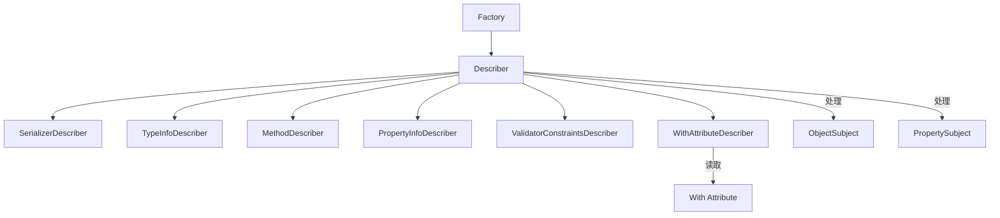

# Contract/JsonSchema 目录分析报告

## 目录职责

`Contract/JsonSchema/` 目录包含 JSON Schema 生成系统，用于从 PHP 类自动生成符合 JSON Schema 标准的结构定义。这个系统被用于：
1. 生成结构化输出的 Schema
2. 生成工具参数的 Schema

**目录路径**: `src/platform/src/Contract/JsonSchema/`

---

## 包含的文件清单

| 文件 | 说明 |
|------|------|
| `Factory.php` | Schema 工厂，提供构建入口 |

### 子目录

| 目录 | 说明 |
|------|------|
| `Attribute/` | PHP 属性类，用于添加 Schema 约束 |
| `Describer/` | 描述器集合，从不同来源提取 Schema 信息 |
| `Subject/` | 描述主题，封装反射信息 |

---

## 内部协作关系



---

## 对外暴露的接口

```php
// Factory - 主入口
class Factory
{
    public function buildParameters(string $className, string $methodName): ?array;
    public function buildProperties(string $className): ?array;
}

// With 属性 - 声明式约束
#[With(
    description: 'User age',
    minimum: 0,
    maximum: 150
)]
public int $age;
```

---

## 设计模式

### 1. 组合模式 (Composite Pattern)
`Describer` 组合多个描述器处理不同方面。

### 2. 访问者模式 (Visitor Pattern)
描述器遍历类结构收集信息。

### 3. 责任链模式 (Chain of Responsibility)
多个描述器依次处理同一主题。

---

## 典型使用场景

### 场景1：为工具生成参数 Schema

```php
use Symfony\AI\Platform\Contract\JsonSchema\Factory;

class WeatherService
{
    /**
     * @param string $location The city name
     * @param string $unit Temperature unit
     */
    public function getWeather(string $location, string $unit = 'celsius'): array
    {
        // ...
    }
}

$factory = new Factory();
$schema = $factory->buildParameters(WeatherService::class, 'getWeather');

// 结果:
// [
//     'type' => 'object',
//     'properties' => [
//         'location' => [
//             'type' => 'string',
//             'description' => 'The city name'
//         ],
//         'unit' => [
//             'type' => 'string',
//             'description' => 'Temperature unit'
//         ]
//     ],
//     'required' => ['location']
// ]
```

### 场景2：为结构化输出生成 Schema

```php
use Symfony\AI\Platform\Contract\JsonSchema\Attribute\With;

class WeatherResponse
{
    #[With(description: 'The location name')]
    public string $location;
    
    #[With(description: 'Temperature', minimum: -100, maximum: 100)]
    public float $temperature;
    
    #[With(description: 'Weather condition', enum: ['sunny', 'cloudy', 'rainy', 'snowy'])]
    public string $condition;
}

$factory = new Factory();
$schema = $factory->buildProperties(WeatherResponse::class);
```

---

## 最佳实践

1. **使用 PHPDoc**: 方法参数描述会被提取为 Schema description
2. **使用 With 属性**: 添加验证约束和详细描述
3. **使用类型声明**: PHP 类型会自动转换为 JSON Schema 类型
4. **使用 Validator 约束**: Symfony Validator 约束会自动转换
