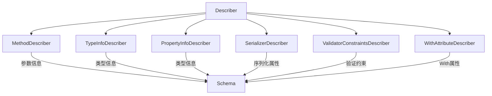

# Contract/JsonSchema/Describer 目录分析报告

## 目录职责

`Contract/JsonSchema/Describer/` 目录包含描述器集合，从不同来源提取类和属性的 Schema 信息。

**目录路径**: `src/platform/src/Contract/JsonSchema/Describer/`

---

## 包含的文件清单

| 文件 | 说明 |
|------|------|
| `Describer.php` | 主描述器，组合其他描述器 |
| `ObjectDescriberInterface.php` | 对象描述器接口 |
| `ObjectDescriberAwareInterface.php` | 对象描述器感知接口 |
| `PropertyDescriberInterface.php` | 属性描述器接口 |
| `MethodDescriber.php` | 方法参数描述器 |
| `TypeInfoDescriber.php` | TypeInfo 类型描述器 |
| `PropertyInfoDescriber.php` | PropertyInfo 类型描述器 |
| `SerializerDescriber.php` | Serializer 属性描述器 |
| `ValidatorConstraintsDescriber.php` | Validator 约束描述器 |
| `WithAttributeDescriber.php` | With 属性描述器 |

---

## 描述器链



---

## 描述器说明

### TypeInfoDescriber
从 PHP 8+ 类型信息提取 Schema 类型。

### PropertyInfoDescriber
使用 Symfony PropertyInfo 组件提取类型信息。

### SerializerDescriber
处理 Serializer 属性如 `#[SerializedName]`。

### ValidatorConstraintsDescriber
转换 Symfony Validator 约束为 Schema 约束：

| Validator 约束 | Schema 属性 |
|----------------|-------------|
| `#[NotBlank]` | `minLength: 1` |
| `#[Length(max: 100)]` | `maxLength: 100` |
| `#[Range(min: 0)]` | `minimum: 0` |
| `#[Choice(['a', 'b'])]` | `enum: ['a', 'b']` |
| `#[Email]` | `format: 'email'` |
| `#[Url]` | `format: 'uri'` |

### WithAttributeDescriber
处理 `#[With]` 属性定义的约束。

---

## 使用场景

```php
use Symfony\Component\Validator\Constraints as Assert;
use Symfony\AI\Platform\Contract\JsonSchema\Attribute\With;

class Product
{
    #[Assert\NotBlank]
    #[Assert\Length(min: 1, max: 200)]
    public string $name;
    
    #[Assert\PositiveOrZero]
    #[With(description: 'Product price in cents')]
    public int $price;
    
    #[Assert\Choice(['active', 'discontinued'])]
    public string $status;
}

// Describer 自动提取这些信息生成 Schema
```
