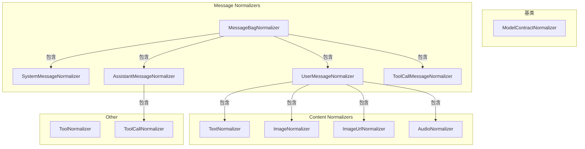

# Contract/Normalizer 目录分析报告

## 目录职责

`Contract/Normalizer/` 目录包含 Symfony Serializer 的 Normalizer 实现集合，负责将平台的消息、内容和结果对象转换为 AI API 所需的数组/JSON 格式。

**目录路径**: `src/platform/src/Contract/Normalizer/`

---

## 包含的文件清单

| 文件 | 说明 |
|------|------|
| `ModelContractNormalizer.php` | 模型感知的 Normalizer 抽象基类 |
| `ToolNormalizer.php` | 工具定义的 Normalizer |

### 子目录

| 目录 | 说明 |
|------|------|
| `Message/` | 消息类型的 Normalizer |
| `Message/Content/` | 消息内容的 Normalizer |
| `Result/` | 结果类型的 Normalizer |

---

## 内部协作关系



---

## 对外暴露的接口

### ModelContractNormalizer

```php
abstract class ModelContractNormalizer implements NormalizerInterface
{
    // 根据模型决定是否支持序列化
    public function supportsNormalization(mixed $data, ?string $format = null, array $context = []): bool;
    
    // 子类实现
    abstract protected function supportedDataClass(): string;
    abstract protected function supportsModel(Model $model): bool;
}
```

---

## 设计模式

### 1. 策略模式 (Strategy Pattern)
每个 Normalizer 处理特定类型的数据。

### 2. 模板方法模式 (Template Method)
`ModelContractNormalizer` 定义骨架，子类实现细节。

### 3. 组合模式 (Composite Pattern)
`MessageBagNormalizer` 递归处理内部消息。

---

## Normalizer 输出格式

### MessageBag

```php
// 输入
new MessageBag(
    Message::forSystem('You are helpful'),
    Message::ofUser('Hello')
);

// 输出
[
    'messages' => [
        ['role' => 'system', 'content' => 'You are helpful'],
        ['role' => 'user', 'content' => 'Hello']
    ],
    'model' => 'gpt-4'
]
```

### UserMessage with Image

```php
// 输入
Message::ofUser(
    new Text('What is this?'),
    Image::fromFile('photo.jpg')
);

// 输出
[
    'role' => 'user',
    'content' => [
        ['type' => 'text', 'text' => 'What is this?'],
        ['type' => 'image_url', 'image_url' => ['url' => 'data:image/jpeg;base64,...']]
    ]
]
```

### Tool

```php
// 输入
new Tool($ref, 'get_weather', 'Get weather', $params);

// 输出
[
    'type' => 'function',
    'function' => [
        'name' => 'get_weather',
        'description' => 'Get weather',
        'parameters' => [...]
    ]
]
```

---

## 扩展方式

### 创建平台特定的 Normalizer

```php
class AnthropicImageNormalizer extends ModelContractNormalizer
{
    protected function supportedDataClass(): string
    {
        return Image::class;
    }
    
    protected function supportsModel(Model $model): bool
    {
        return str_starts_with($model->getName(), 'claude-');
    }
    
    public function normalize(mixed $data, ?string $format = null, array $context = []): array
    {
        // Anthropic 特定的图像格式
        return [
            'type' => 'image',
            'source' => [
                'type' => 'base64',
                'media_type' => $data->getFormat(),
                'data' => $data->asBase64(),
            ]
        ];
    }
}
```
