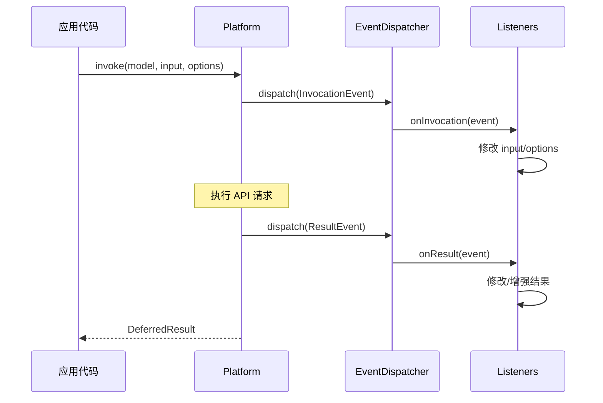

# Event 目录分析报告

## 目录职责

`Event/` 目录包含 Symfony AI Platform 的事件类，用于在平台调用流程中的关键点触发事件，允许外部代码监听和修改调用过程。

**目录路径**: `src/platform/src/Event/`

---

## 包含的文件清单

| 文件 | 说明 |
|------|------|
| `InvocationEvent.php` | 调用事件，在执行 API 请求前触发 |
| `ResultEvent.php` | 结果事件，在获取结果后触发 |

---

## 事件流程



---

## InvocationEvent

在 API 调用前触发，允许修改输入数据。

```php
class InvocationEvent extends Event
{
    public function getModel(): Model;
    public function setModel(Model $model): void;
    
    public function getInput(): array|string|object;
    public function setInput(array|string|object $input): void;
    
    public function getOptions(): array;
    public function setOptions(array $options): void;
}
```

---

## ResultEvent

在获取结果后触发，允许修改或增强结果。

```php
class ResultEvent extends Event
{
    public function getModel(): Model;
    public function setModel(Model $model): void;
    
    public function getDeferredResult(): DeferredResult;
    public function setDeferredResult(DeferredResult $deferredResult): void;
    
    public function getOptions(): array;
    public function setOptions(array $options): void;
    
    public function getInput(): array|string|object;
}
```

---

## 典型使用场景

### 场景1：日志记录

```php
class LoggingListener
{
    public function onInvocation(InvocationEvent $event): void
    {
        $this->logger->info('AI Request', [
            'model' => $event->getModel()->getName(),
            'input_type' => get_class($event->getInput()),
        ]);
    }
    
    public function onResult(ResultEvent $event): void
    {
        $this->logger->info('AI Response received');
    }
}
```

### 场景2：输入预处理

```php
class InputPreprocessor
{
    public function __invoke(InvocationEvent $event): void
    {
        // 添加系统消息
        $input = $event->getInput();
        if ($input instanceof MessageBag && !$input->getSystemMessage()) {
            $event->setInput($input->withSystemMessage(
                Message::forSystem('You are a helpful assistant.')
            ));
        }
    }
}
```

### 场景3：选项增强

```php
class OptionsEnhancer
{
    public function __invoke(InvocationEvent $event): void
    {
        $options = $event->getOptions();
        
        // 添加默认选项
        $options['user'] = $this->getCurrentUserId();
        
        $event->setOptions($options);
    }
}
```
