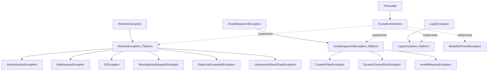

# Exception 目录分析报告

## 目录职责

`Exception/` 目录包含 Symfony AI Platform 的异常类层次结构，为平台中可能发生的各种错误情况提供类型化的异常处理机制。这些异常遵循 Symfony 最佳实践，都实现了公共的 `ExceptionInterface` 接口。

**目录路径**: `src/platform/src/Exception/`

---

## 包含的文件清单

| 文件 | 说明 | 父类 |
|------|------|------|
| `ExceptionInterface.php` | 异常接口，所有平台异常的标记接口 | `\Throwable` |
| `RuntimeException.php` | 运行时异常基类 | `\RuntimeException` |
| `InvalidArgumentException.php` | 无效参数异常基类 | `\InvalidArgumentException` |
| `LogicException.php` | 逻辑异常 | `\LogicException` |
| `IOException.php` | IO 操作异常 | `RuntimeException` |
| `AuthenticationException.php` | API 认证失败 | `RuntimeException` |
| `BadRequestException.php` | 请求格式错误 | `RuntimeException` |
| `RateLimitExceededException.php` | 速率限制超出 | `RuntimeException` |
| `ContentFilterException.php` | 内容过滤异常 | `InvalidArgumentException` |
| `ExceedContextSizeException.php` | 上下文大小超出 | `InvalidArgumentException` |
| `InvalidRequestException.php` | 无效请求异常 | `InvalidArgumentException` |
| `MissingModelSupportException.php` | 模型能力缺失 | `RuntimeException` |
| `ModelNotFoundException.php` | 模型未找到 | `\InvalidArgumentException` |
| `UnexpectedResultTypeException.php` | 结果类型不匹配 | `RuntimeException` |

---

## 异常层次结构



---

## 异常详情

### ExceptionInterface

```php
interface ExceptionInterface extends \Throwable
{
    // 标记接口，无额外方法
}
```

**用途**: 允许统一捕获所有平台异常。

---

### RuntimeException

```php
class RuntimeException extends \RuntimeException implements ExceptionInterface
```

**用途**: 运行时发生的、无法预先避免的错误的基类。

---

### InvalidArgumentException

```php
class InvalidArgumentException extends \InvalidArgumentException implements ExceptionInterface
```

**用途**: 传入无效参数时抛出的异常基类。

---

### AuthenticationException

```php
class AuthenticationException extends RuntimeException
```

**用途**: API 认证失败时抛出（如 API 密钥无效、过期）。

---

### RateLimitExceededException

```php
class RateLimitExceededException extends RuntimeException
{
    public function __construct(private readonly ?int $retryAfter = null)
    
    public function getRetryAfter(): ?int
}
```

**用途**: 超出 API 速率限制时抛出。

**特殊属性**: `$retryAfter` - 建议重试等待秒数。

---

### MissingModelSupportException

```php
class MissingModelSupportException extends RuntimeException
{
    public static function forToolCalling(Model $model): self
    public static function forAudioInput(Model $model): self
    public static function forImageInput(Model $model): self
    public static function forStructuredOutput(Model $model): self
}
```

**用途**: 当请求的功能不被模型支持时抛出。

**特点**: 提供静态工厂方法创建特定类型的异常。

---

### UnexpectedResultTypeException

```php
class UnexpectedResultTypeException extends RuntimeException
{
    public function __construct(string $expectedType, string $actualType)
}
```

**用途**: 当期望的结果类型与实际不匹配时抛出。

---

## 设计模式

### 1. 标记接口模式 (Marker Interface)

`ExceptionInterface` 作为标记接口，允许统一处理：

```php
try {
    $result = $platform->invoke($model, $input);
} catch (ExceptionInterface $e) {
    // 处理所有平台异常
}
```

### 2. 工厂方法模式

`MissingModelSupportException` 使用静态工厂方法：

```php
throw MissingModelSupportException::forToolCalling($model);
```

### 3. 异常层次结构

清晰的继承关系支持精确或宽泛的捕获策略。

---

## 使用场景

### 场景1：基础异常处理

```php
use Symfony\AI\Platform\Exception\ExceptionInterface;

try {
    $result = $platform->invoke('gpt-4', $messages);
} catch (ExceptionInterface $e) {
    $this->logger->error('AI call failed', ['error' => $e->getMessage()]);
    throw $e;
}
```

### 场景2：处理速率限制

```php
use Symfony\AI\Platform\Exception\RateLimitExceededException;

function invokeWithRetry(PlatformInterface $platform, string $model, $input, int $maxRetries = 3)
{
    for ($i = 0; $i < $maxRetries; $i++) {
        try {
            return $platform->invoke($model, $input);
        } catch (RateLimitExceededException $e) {
            $waitTime = $e->getRetryAfter() ?? (2 ** $i) * 10;
            sleep($waitTime);
        }
    }
    
    throw new \RuntimeException('Max retries exceeded');
}
```

### 场景3：认证错误处理

```php
use Symfony\AI\Platform\Exception\AuthenticationException;

try {
    $result = $platform->invoke($model, $input);
} catch (AuthenticationException $e) {
    // 可能需要刷新 API 密钥
    $this->refreshApiKey();
    // 重试
    return $platform->invoke($model, $input);
}
```

### 场景4：能力检查

```php
use Symfony\AI\Platform\Exception\MissingModelSupportException;
use Symfony\AI\Platform\Capability;

function invokeWithTools(PlatformInterface $platform, Model $model, $input, array $tools)
{
    if (!$model->supports(Capability::TOOL_CALLING)) {
        // 主动抛出而非等待运行时错误
        throw MissingModelSupportException::forToolCalling($model);
    }
    
    return $platform->invoke($model->getName(), $input, ['tools' => $tools]);
}
```

### 场景5：结果类型处理

```php
use Symfony\AI\Platform\Exception\UnexpectedResultTypeException;

try {
    $toolCalls = $result->asToolCalls();
} catch (UnexpectedResultTypeException $e) {
    // 不是工具调用，尝试作为文本处理
    $text = $result->asText();
}
```

---

## 最佳实践

1. **优先捕获具体异常**: 先捕获具体类型，再捕获基类
2. **利用 retryAfter**: 处理速率限制时使用建议的等待时间
3. **记录异常上下文**: 记录足够的上下文信息用于调试
4. **优雅降级**: 根据异常类型提供替代方案
5. **主动能力检查**: 在调用前检查模型能力，避免运行时异常
