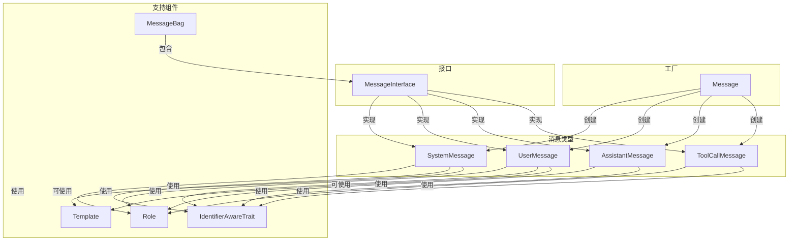

# Message 目录分析报告

## 目录职责

`Message/` 目录包含 Symfony AI Platform 的消息系统实现，提供了与 AI 模型进行对话交互所需的所有消息类型、内容类型和模板渲染功能。这是平台最常用的组件之一，几乎所有与 AI 的文本交互都会使用到这个目录中的类。

**目录路径**: `src/platform/src/Message/`

---

## 包含的文件清单

### 核心消息类

| 文件 | 说明 |
|------|------|
| `MessageInterface.php` | 消息接口，定义所有消息类型的通用方法 |
| `Message.php` | 消息工厂类，提供创建各类消息的静态方法 |
| `MessageBag.php` | 消息包容器，存储和管理消息集合 |
| `Role.php` | 角色枚举，定义消息角色（system/user/assistant/tool） |
| `AssistantMessage.php` | 助手消息，代表 AI 的响应 |
| `SystemMessage.php` | 系统消息，设定 AI 的行为规则 |
| `UserMessage.php` | 用户消息，代表用户输入 |
| `ToolCallMessage.php` | 工具调用消息，代表工具执行结果 |
| `Template.php` | 消息模板，支持变量替换 |
| `IdentifierAwareTrait.php` | ID 特征，为消息提供唯一标识符 |

### 子目录

| 目录 | 说明 |
|------|------|
| `Content/` | 消息内容类型（文本、图像、音频等） |
| `TemplateRenderer/` | 模板渲染器实现 |

---

## 内部协作关系



### 协作说明

1. **Message 工厂** 提供静态方法创建各类消息
2. **所有消息类** 实现 `MessageInterface` 接口
3. **MessageBag** 作为容器存储多条消息
4. **Role 枚举** 定义消息角色类型
5. **Template** 支持消息内容的模板化
6. **IdentifierAwareTrait** 为消息提供 UUID

---

## 对外暴露的接口

### 主要接口

```php
// 消息接口
interface MessageInterface {
    public function getRole(): Role;
    public function getId(): AbstractUid&TimeBasedUidInterface;
    public function withId(AbstractUid&TimeBasedUidInterface $id): self;
    public function getContent(): string|Template|array|null;
    public function getMetadata(): Metadata;
}
```

### 工厂方法

```php
// Message 工厂类
Message::forSystem(string|Template $content): SystemMessage
Message::ofUser(string|ContentInterface ...$content): UserMessage
Message::ofAssistant(?string $content, ?array $toolCalls): AssistantMessage
Message::ofToolCall(ToolCall $toolCall, string $content): ToolCallMessage
```

### 容器类

```php
// MessageBag 容器
class MessageBag implements Countable, IteratorAggregate {
    public function add(MessageInterface $message): void;
    public function with(MessageInterface $message): self;
    public function merge(self $messageBag): self;
    public function getMessages(): array;
    public function getSystemMessage(): ?SystemMessage;
    public function getUserMessage(): ?UserMessage;
    // ...
}
```

---

## 设计模式汇总

### 1. 工厂模式 (Factory Pattern)
`Message` 类作为工厂提供创建消息的静态方法。

### 2. 组合模式 (Composite Pattern)
`MessageBag` 包含多个 `MessageInterface` 实例。

### 3. 值对象模式 (Value Object)
所有消息类都是不可变的值对象。

### 4. 策略模式 (Strategy Pattern)
`TemplateRenderer` 接口允许不同的模板渲染策略。

### 5. 特征复用 (Trait Reuse)
`IdentifierAwareTrait` 和 `MetadataAwareTrait` 提供共享功能。

---

## 扩展方式

### 1. 自定义内容类型

```php
class CodeSnippet implements ContentInterface
{
    public function __construct(
        private readonly string $code,
        private readonly string $language,
    ) {}
    
    public function getCode(): string
    {
        return $this->code;
    }
    
    public function getLanguage(): string
    {
        return $this->language;
    }
}

// 配合自定义 Normalizer 使用
$userMessage = new UserMessage(
    new Text('Please review this code:'),
    new CodeSnippet('print("Hello")', 'python')
);
```

### 2. 自定义模板渲染器

```php
class TwigTemplateRenderer implements TemplateRendererInterface
{
    public function __construct(private readonly Environment $twig) {}
    
    public function supports(string $type): bool
    {
        return 'twig' === $type;
    }
    
    public function render(Template $template, array $variables): string
    {
        return $this->twig->createTemplate($template->getTemplate())
            ->render($variables);
    }
}
```

---

## 典型使用场景

### 场景1：简单对话

```php
use Symfony\AI\Platform\Message\Message;
use Symfony\AI\Platform\Message\MessageBag;

$messages = new MessageBag(
    Message::forSystem('You are a helpful assistant.'),
    Message::ofUser('What is the capital of France?')
);

$result = $platform->invoke('gpt-4', $messages);
```

### 场景2：多轮对话

```php
$conversation = new MessageBag(
    Message::forSystem('You are a coding assistant.'),
    Message::ofUser('Write a hello world in Python'),
    Message::ofAssistant('```python\nprint("Hello, World!")\n```'),
    Message::ofUser('Now in JavaScript')
);
```

### 场景3：多模态消息

```php
use Symfony\AI\Platform\Message\Content\Image;
use Symfony\AI\Platform\Message\Content\Text;

$userMessage = Message::ofUser(
    new Text('What is in this image?'),
    Image::fromFile('/path/to/photo.jpg')
);
```

### 场景4：使用模板

```php
use Symfony\AI\Platform\Message\Template;

$systemMessage = Message::forSystem(
    Template::string('You are an assistant for {company}. Today is {date}.')
);

$result = $platform->invoke('gpt-4', new MessageBag($systemMessage), [
    'template_vars' => [
        'company' => 'Acme Corp',
        'date' => date('Y-m-d'),
    ]
]);
```

### 场景5：工具调用流程

```php
use Symfony\AI\Platform\Result\ToolCall;

// 1. 发送消息并获取工具调用
$messages = new MessageBag(
    Message::forSystem('You can use tools to help users.'),
    Message::ofUser('What is the weather in Paris?')
);

$result = $platform->invoke('gpt-4', $messages, ['tools' => $tools]);
$toolCalls = $result->asToolCalls();

// 2. 执行工具并返回结果
$toolCall = $toolCalls[0];
$weatherData = $weatherService->getWeather($toolCall->getArguments()['location']);

// 3. 添加工具结果继续对话
$messages = $messages
    ->with(Message::ofAssistant(null, $toolCalls))
    ->with(Message::ofToolCall($toolCall, json_encode($weatherData)));

$finalResult = $platform->invoke('gpt-4', $messages);
```

---

## 最佳实践

1. **使用 Message 工厂**: 始终使用 `Message::forSystem()`, `Message::ofUser()` 等工厂方法
2. **不可变操作**: 使用 `with()` 方法而非直接修改 MessageBag
3. **模板化系统消息**: 将变量部分使用模板，保持消息可重用
4. **多模态内容分离**: 使用 Content 类型明确区分文本和媒体内容
