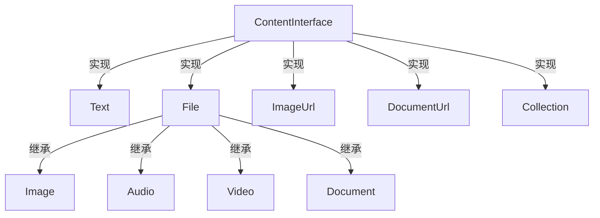

# Message/Content 目录分析报告

## 目录职责

`Message/Content/` 目录包含消息内容类型的定义，支持文本、图像、音频、视频等多种内容类型。这些类实现 `ContentInterface` 接口，可以组合在 `UserMessage` 中。

**目录路径**: `src/platform/src/Message/Content/`

---

## 包含的文件清单

| 文件 | 说明 |
|------|------|
| `ContentInterface.php` | 内容接口（标记接口） |
| `Text.php` | 文本内容 |
| `File.php` | 文件基类 |
| `Image.php` | 图像内容（继承 File） |
| `ImageUrl.php` | 图像 URL |
| `Audio.php` | 音频内容（继承 File） |
| `Video.php` | 视频内容（继承 File） |
| `Document.php` | 文档内容（继承 File） |
| `DocumentUrl.php` | 文档 URL |
| `Collection.php` | 内容集合 |

---

## 类层次结构



---

## File 基类

所有文件类型的基类，提供：

```php
class File implements ContentInterface
{
    public static function fromDataUrl(string $dataUrl): static;
    public static function fromFile(string $path): static;
    
    public function getFormat(): string;      // MIME 类型
    public function asBinary(): string;       // 二进制数据
    public function asBase64(): string;       // Base64 编码
    public function asDataUrl(): string;      // Data URL
    public function asPath(): ?string;        // 文件路径
    public function asResource();             // 文件资源句柄
    public function getFilename(): ?string;   // 文件名
}
```

---

## 典型使用场景

### 场景1：文本消息

```php
use Symfony\AI\Platform\Message\Content\Text;

$message = new UserMessage(new Text('Hello, world!'));
```

### 场景2：带图像的消息

```php
use Symfony\AI\Platform\Message\Content\Image;
use Symfony\AI\Platform\Message\Content\Text;

$message = new UserMessage(
    new Text('What is in this image?'),
    Image::fromFile('/path/to/photo.jpg')
);
```

### 场景3：图像 URL

```php
use Symfony\AI\Platform\Message\Content\ImageUrl;

$message = new UserMessage(
    new Text('Describe this:'),
    new ImageUrl('https://example.com/image.jpg')
);
```

### 场景4：音频转文字

```php
use Symfony\AI\Platform\Message\Content\Audio;

$message = new UserMessage(
    Audio::fromFile('/path/to/recording.mp3')
);

$result = $platform->invoke('whisper-1', new MessageBag($message));
```

### 场景5：多内容组合

```php
use Symfony\AI\Platform\Message\Content\Collection;

$collection = new Collection(
    new Text('Compare these images:'),
    Image::fromFile('image1.jpg'),
    Image::fromFile('image2.jpg')
);
```
