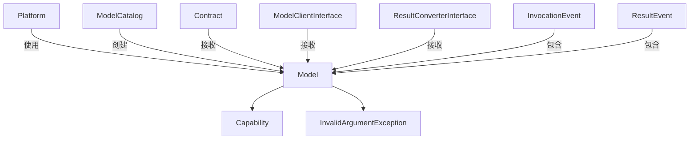

# Model.php 文件分析报告

## 文件概述

`Model.php` 是 Symfony AI Platform 的核心实体类，代表一个 AI 模型。它封装了模型的基本信息：名称、能力列表和默认选项。这个类是平台与各 AI 服务提供商交互的基础抽象。

**文件路径**: `src/platform/src/Model.php`  
**命名空间**: `Symfony\AI\Platform`  
**作者**: Christopher Hertel

---

## 类/接口/枚举定义

### `class Model`

一个简单但关键的值对象类，封装 AI 模型的元数据。

#### 类属性

| 属性 | 类型 | 可见性 | 说明 |
|------|------|--------|------|
| `$name` | `string` | private readonly | 模型名称（非空字符串） |
| `$capabilities` | `Capability[]` | private readonly | 模型支持的能力列表 |
| `$options` | `array<string, mixed>` | private readonly | 模型的默认选项 |

---

## 方法/函数分析

### `__construct(string $name, array $capabilities = [], array $options = [])`

**构造函数**

| 参数 | 类型 | 约束 | 默认值 | 说明 |
|------|------|------|--------|------|
| `$name` | `string` | `@param non-empty-string` | 无 | 模型名称 |
| `$capabilities` | `Capability[]` | 数组 | `[]` | 能力枚举数组 |
| `$options` | `array<string, mixed>` | 关联数组 | `[]` | 默认选项 |

**异常**:
- `InvalidArgumentException` - 当模型名称为空或仅包含空白字符时抛出

**验证逻辑**:

```php
if ('' === trim($name)) {
    throw new InvalidArgumentException('Model name cannot be empty.');
}
```

**示例**:

```php
// 基本用法
$model = new Model('gpt-4');

// 带能力
$model = new Model('gpt-4', [
    Capability::INPUT_MESSAGES,
    Capability::OUTPUT_TEXT,
    Capability::TOOL_CALLING,
]);

// 带默认选项
$model = new Model('gpt-4', [
    Capability::INPUT_MESSAGES,
], [
    'temperature' => 0.7,
    'max_tokens' => 2000,
]);
```

---

### `getName(): string`

**获取模型名称**

**返回值**: `non-empty-string` - 模型名称

**说明**: 返回的名称保证非空。

---

### `getCapabilities(): array`

**获取模型能力列表**

**返回值**: `Capability[]` - 能力枚举数组

**说明**: 返回构造时传入的完整能力列表。

---

### `supports(Capability $capability): bool`

**检查模型是否支持指定能力**

| 参数 | 类型 | 说明 |
|------|------|------|
| `$capability` | `Capability` | 要检查的能力 |

**返回值**: `bool` - 是否支持该能力

**实现细节**:

```php
public function supports(Capability $capability): bool
{
    return $capability->equalsOneOf($this->capabilities);
}
```

使用 `Comparable` trait 的 `equalsOneOf()` 方法进行枚举值比较。

**示例**:

```php
$model = new Model('gpt-4', [
    Capability::INPUT_MESSAGES,
    Capability::TOOL_CALLING,
]);

$model->supports(Capability::TOOL_CALLING);     // true
$model->supports(Capability::OUTPUT_STREAMING); // false
```

---

### `getOptions(): array`

**获取模型默认选项**

**返回值**: `array<string, mixed>` - 选项关联数组

**说明**: 这些选项会在调用时与传入的选项合并。

---

## 设计模式

### 1. 值对象模式 (Value Object Pattern)

Model 类是一个典型的值对象：

- **不可变性**: 所有属性都是 `readonly`
- **无副作用**: 方法只返回数据，不修改状态
- **完整性验证**: 构造函数确保对象始终处于有效状态

### 2. 能力模式 (Capability Pattern)

通过能力枚举实现功能发现机制：

```mermaid
graph TD
    A[Model] -->|hasCapabilities| B[Capability[]]
    B --> C[INPUT_MESSAGES]
    B --> D[OUTPUT_TEXT]
    B --> E[TOOL_CALLING]
    
    F[Platform] -->|检查能力| A
    F -->|根据能力决定行为| G[调用逻辑]
```

---

## 技巧与亮点

### 1. 非空字符串类型提示

使用 PHPStan 的 `@param non-empty-string` 注解：

```php
/**
 * @param non-empty-string $name
 */
public function __construct(
    private readonly string $name,
    // ...
)
```

结合运行时验证，提供双重保障。

### 2. 默认空数组

能力和选项参数默认为空数组，简化基本用法：

```php
$simpleModel = new Model('gpt-4');
```

### 3. 类型安全的能力检查

使用枚举的 `equalsOneOf()` 方法而非 `in_array()`，确保类型安全。

---

## 扩展点

### 1. 继承创建特定平台模型

```php
namespace App\Model;

use Symfony\AI\Platform\Capability;
use Symfony\AI\Platform\Model;

class OpenAIModel extends Model
{
    public function __construct(string $name, array $capabilities = [], array $options = [])
    {
        // 添加 OpenAI 特定的默认选项
        $options = array_merge([
            'presence_penalty' => 0,
            'frequency_penalty' => 0,
        ], $options);
        
        parent::__construct($name, $capabilities, $options);
    }
    
    public function getProvider(): string
    {
        return 'openai';
    }
}
```

### 2. 创建模型目录

使用 ModelCatalog 预定义模型：

```php
class MyModelCatalog extends AbstractModelCatalog
{
    protected array $models = [
        'my-model' => [
            'class' => Model::class,
            'capabilities' => [
                Capability::INPUT_MESSAGES,
                Capability::OUTPUT_TEXT,
            ],
        ],
    ];
}
```

---

## 与其他文件的关系



### 被依赖的组件

1. **Platform** - 通过 ModelCatalog 获取 Model 实例
2. **Contract** - 使用 Model 信息创建请求负载
3. **ModelClientInterface** - 基于 Model 决定是否支持请求
4. **ResultConverterInterface** - 基于 Model 决定如何转换结果
5. **Event 类** - 携带 Model 信息供监听器使用

---

## 使用场景示例

### 场景1：创建基本文本模型

```php
use Symfony\AI\Platform\Capability;
use Symfony\AI\Platform\Model;

$textModel = new Model('gpt-4', [
    Capability::INPUT_MESSAGES,
    Capability::INPUT_TEXT,
    Capability::OUTPUT_TEXT,
    Capability::OUTPUT_STREAMING,
]);

echo "模型名称: " . $textModel->getName(); // gpt-4
```

### 场景2：创建多模态模型

```php
use Symfony\AI\Platform\Capability;
use Symfony\AI\Platform\Model;

$visionModel = new Model('gpt-4-vision-preview', [
    Capability::INPUT_MESSAGES,
    Capability::INPUT_IMAGE,
    Capability::INPUT_MULTIMODAL,
    Capability::OUTPUT_TEXT,
], [
    'max_tokens' => 4096,
]);
```

### 场景3：能力检查与条件逻辑

```php
use Symfony\AI\Platform\Capability;
use Symfony\AI\Platform\Exception\MissingModelSupportException;

function processWithTools(Model $model, array $tools): void
{
    if (!$model->supports(Capability::TOOL_CALLING)) {
        throw MissingModelSupportException::forToolCalling($model);
    }
    
    // 执行工具调用逻辑
}

function streamResponse(Model $model, MessageBag $messages): \Generator
{
    if ($model->supports(Capability::OUTPUT_STREAMING)) {
        // 使用流式输出
        return $platform->invoke($model->getName(), $messages, ['stream' => true])->asStream();
    }
    
    // 回退到非流式输出
    yield $platform->invoke($model->getName(), $messages)->asText();
}
```

### 场景4：合并默认选项

```php
use Symfony\AI\Platform\Model;

$model = new Model('claude-3-opus', [], [
    'temperature' => 0.7,
    'max_tokens' => 1000,
]);

// Platform 使用时合并选项
$finalOptions = array_merge($model->getOptions(), $userOptions);
// 用户选项会覆盖默认选项
```

### 场景5：在 Platform 中使用

```php
use Symfony\AI\Platform\Platform;
use Symfony\AI\Platform\Model;

// Platform::invoke 内部流程
public function invoke(string $model, $input, array $options = []): DeferredResult
{
    // 1. 通过 ModelCatalog 获取 Model 对象
    $model = $this->modelCatalog->getModel($model);
    
    // 2. 合并模型默认选项和调用选项
    $options = array_merge($model->getOptions(), $options);
    
    // 3. 检查模型能力决定执行路径
    if ($model->supports(Capability::INPUT_MESSAGES)) {
        // 消息格式输入
    }
    
    // ...
}
```

---

## 最佳实践

### 1. 显式声明所有能力

```php
// 好的做法：明确列出所有能力
$model = new Model('gpt-4', [
    Capability::INPUT_MESSAGES,
    Capability::INPUT_TEXT,
    Capability::OUTPUT_TEXT,
    Capability::OUTPUT_STREAMING,
    Capability::OUTPUT_STRUCTURED,
    Capability::TOOL_CALLING,
]);

// 避免：空能力列表（除非测试）
$model = new Model('gpt-4'); // 没有能力检查将始终失败
```

### 2. 使用 ModelCatalog 管理模型定义

```php
// 好的做法：使用目录
$model = $modelCatalog->getModel('gpt-4');

// 避免：每次手动创建
$model = new Model('gpt-4', [...]);
```

### 3. 检查能力再调用功能

```php
// 好的做法：先检查能力
if ($model->supports(Capability::OUTPUT_STRUCTURED)) {
    $options['response_format'] = MyResponse::class;
}

// 避免：假设所有模型都支持
$options['response_format'] = MyResponse::class; // 可能抛出异常
```

### 4. 利用默认选项减少重复

```php
// 在 ModelCatalog 中定义默认选项
'gpt-4' => [
    'class' => Model::class,
    'capabilities' => [...],
    'options' => [
        'temperature' => 0.7,
    ],
],

// 调用时只需传入覆盖的选项
$platform->invoke('gpt-4', $input, ['max_tokens' => 500]);
```
