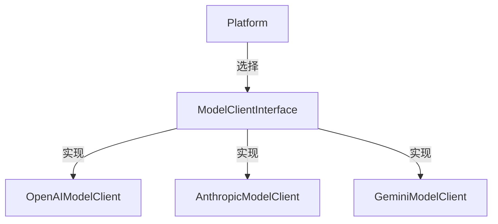
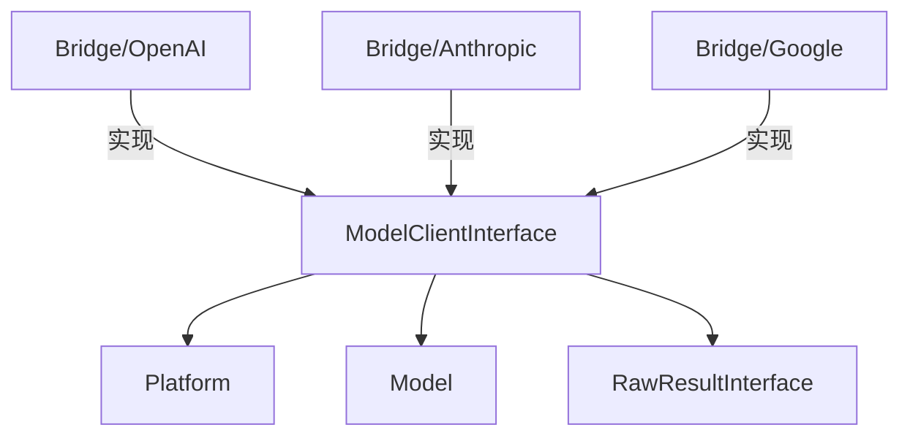

# ModelClientInterface.php 文件分析报告

## 文件概述

`ModelClientInterface.php` 定义了模型客户端的接口规范。模型客户端负责将请求发送到实际的 AI 服务提供商（如 OpenAI、Anthropic 等）并返回原始响应。每个 AI 平台的 Bridge 都会实现这个接口。

**文件路径**: `src/platform/src/ModelClientInterface.php`  
**命名空间**: `Symfony\AI\Platform`  
**作者**: Christopher Hertel

---

## 类/接口/枚举定义

### `interface ModelClientInterface`

模型客户端接口，定义了与 AI 服务通信的标准方法。

---

## 方法/函数分析

### `supports(Model $model): bool`

**检查客户端是否支持指定模型**

| 参数 | 类型 | 说明 |
|------|------|------|
| `$model` | `Model` | 要检查的模型对象 |

**返回值**: `bool` - 如果支持返回 `true`

**用途**: Platform 使用此方法找到正确的客户端来处理请求。

---

### `request(Model $model, array|string $payload, array $options = []): RawResultInterface`

**发送请求到 AI 服务**

| 参数 | 类型 | 约束 | 说明 |
|------|------|------|------|
| `$model` | `Model` | 必需 | 目标模型 |
| `$payload` | `array<string\|int, mixed>\|string` | 必需 | 请求负载 |
| `$options` | `array<string, mixed>` | 可选 | 调用选项 |

**返回值**: `RawResultInterface` - 原始响应

---

## 设计模式

### 策略模式 (Strategy Pattern)

不同的 ModelClient 实现代表不同的 AI 服务策略：



---

## 扩展点

### 实现自定义 ModelClient

```php
class CustomAIClient implements ModelClientInterface
{
    public function __construct(
        private readonly HttpClientInterface $httpClient,
        private readonly string $apiKey,
    ) {}
    
    public function supports(Model $model): bool
    {
        return str_starts_with($model->getName(), 'custom-');
    }
    
    public function request(Model $model, array|string $payload, array $options = []): RawResultInterface
    {
        $response = $this->httpClient->request('POST', 'https://api.custom-ai.com/v1/chat', [
            'headers' => [
                'Authorization' => 'Bearer ' . $this->apiKey,
            ],
            'json' => $payload,
        ]);
        
        return new RawHttpResult($response);
    }
}
```

---

## 与其他文件的关系



---

## 使用场景示例

### 场景：在 Platform 中使用

```php
// Platform::doInvoke() 内部
foreach ($this->modelClients as $modelClient) {
    if ($modelClient->supports($model)) {
        return $modelClient->request($model, $payload, $options);
    }
}

throw new RuntimeException('No ModelClient registered for model...');
```
