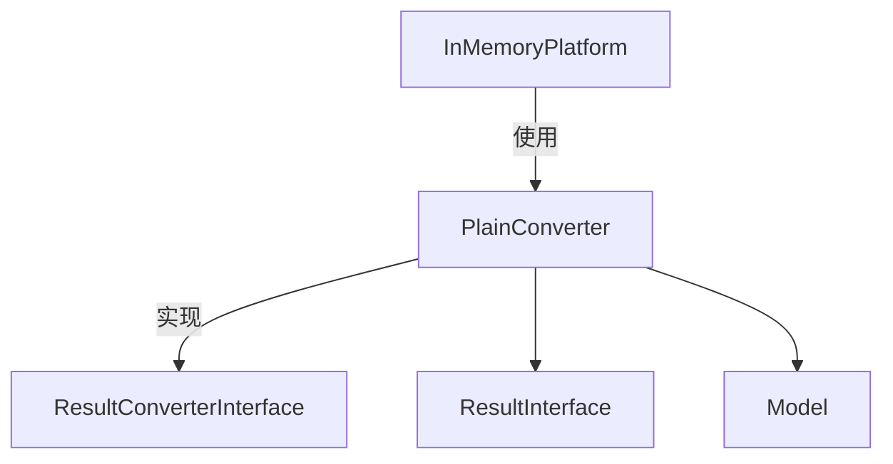

# PlainConverter.php 文件分析报告

## 文件概述

`PlainConverter.php` 是一个简单的结果转换器实现，用于直接返回预设的结果对象。它主要用于测试场景或当需要跳过正常转换流程直接返回固定结果时。

**文件路径**: `src/platform/src/PlainConverter.php`  
**命名空间**: `Symfony\AI\Platform`  

---

## 类/接口/枚举定义

### `final class PlainConverter implements ResultConverterInterface`

一个最小化的结果转换器实现，总是返回构造时传入的结果对象。

---

## 方法/函数分析

### `__construct(ResultInterface $result)`

**构造函数**

| 参数 | 类型 | 说明 |
|------|------|------|
| `$result` | `ResultInterface` | 要返回的预设结果 |

---

### `supports(Model $model): bool`

**检查是否支持模型**

**返回值**: `bool` - 始终返回 `true`

**说明**: 这个转换器支持所有模型，因为它只是返回预设的结果。

---

### `convert(RawResultInterface $result, array $options = []): ResultInterface`

**转换结果**

**返回值**: `ResultInterface` - 构造时传入的结果对象

**说明**: 忽略传入的原始结果，直接返回预设结果。

---

### `getTokenUsageExtractor(): null`

**获取 Token 使用量提取器**

**返回值**: `null` - 不提供 Token 提取功能

---

## 设计模式

### 空对象模式 / 存根模式

PlainConverter 是一个存根实现，用于测试或特殊场景：

```php
$plainConverter = new PlainConverter(new TextResult('Fixed response'));
```

---

## 与其他文件的关系



---

## 使用场景示例

### 场景1：在 InMemoryPlatform 中使用

```php
// InMemoryPlatform::createDeferredResult() 内部
private function createDeferredResult(ResultInterface $result, array $options): DeferredResult
{
    $rawResult = $result->getRawResult() ?? new InMemoryRawResult(...);
    
    return new DeferredResult(new PlainConverter($result), $rawResult, $options);
}
```

### 场景2：测试固定响应

```php
$converter = new PlainConverter(new TextResult('Test response'));

$result = $converter->convert(new InMemoryRawResult());
$this->assertSame('Test response', $result->getContent());
```
