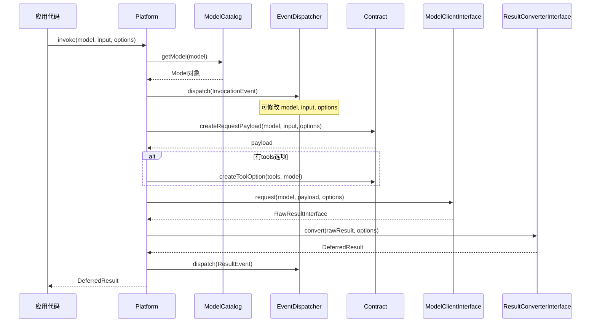
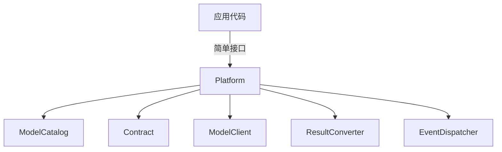
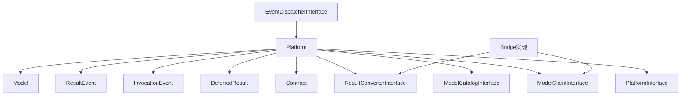

# Platform.php 文件分析报告

## 文件概述

`Platform.php` 是 Symfony AI Platform 模块的核心调度器类，实现了 `PlatformInterface`。它负责协调模型客户端、结果转换器和事件系统，提供统一的 AI 模型调用入口。这是整个平台最重要的类，所有 AI 调用都通过它来完成。

**文件路径**: `src/platform/src/Platform.php`  
**命名空间**: `Symfony\AI\Platform`  
**作者**: Christopher Hertel

---

## 类/接口/枚举定义

### `final class Platform implements PlatformInterface`

#### 类特性
- **final**: 不可继承，确保行为一致性
- **实现**: `PlatformInterface`

#### 构造函数参数

| 参数 | 类型 | 说明 |
|------|------|------|
| `$modelClients` | `iterable<ModelClientInterface>` | 模型客户端集合 |
| `$resultConverters` | `iterable<ResultConverterInterface>` | 结果转换器集合 |
| `$modelCatalog` | `ModelCatalogInterface` | 模型目录 |
| `$contract` | `?Contract` | 数据契约（可选） |
| `$eventDispatcher` | `?EventDispatcherInterface` | 事件分发器（可选） |

---

## 方法/函数分析

### `__construct(...)`

**构造函数**

```php
public function __construct(
    private readonly iterable $modelClients,
    private readonly iterable $resultConverters,
    private readonly ModelCatalogInterface $modelCatalog,
    private ?Contract $contract = null,
    private readonly ?EventDispatcherInterface $eventDispatcher = null,
)
```

**默认行为**: 如果未提供 `$contract`，自动创建默认的 `Contract::create()`。

---

### `invoke(string $model, array|string|object $input, array $options = []): DeferredResult`

**核心调用方法 - 执行 AI 模型调用**

| 参数 | 类型 | 约束 | 说明 |
|------|------|------|------|
| `$model` | `string` | `non-empty-string` | 模型名称 |
| `$input` | `array\|string\|object` | 必需 | 输入数据 |
| `$options` | `array<string, mixed>` | 可选 | 调用选项 |

**返回值**: `DeferredResult` - 延迟结果对象

**执行流程**:



**详细步骤**:

1. **模型解析**: 通过 ModelCatalog 将模型名称解析为 Model 对象
2. **事件分发 (InvocationEvent)**: 允许监听器修改输入
3. **创建请求负载**: 使用 Contract 序列化输入数据
4. **合并选项**: 将模型默认选项与调用选项合并
5. **处理工具**: 如果有 tools 选项，序列化工具定义
6. **执行请求**: 找到支持该模型的 ModelClient 并发送请求
7. **转换结果**: 找到支持该模型的 ResultConverter 并转换结果
8. **事件分发 (ResultEvent)**: 允许监听器修改结果
9. **返回延迟结果**: 返回 DeferredResult 供后续处理

**异常**:
- `RuntimeException` - 没有找到支持该模型的 ModelClient 或 ResultConverter

---

### `getModelCatalog(): ModelCatalogInterface`

**获取模型目录**

**返回值**: `ModelCatalogInterface` - 模型目录实例

---

### `doInvoke(Model $model, array|string $payload, array $options = []): RawResultInterface`

**私有方法 - 执行实际的 API 请求**

| 参数 | 类型 | 说明 |
|------|------|------|
| `$model` | `Model` | 模型对象 |
| `$payload` | `array\|string` | 请求负载 |
| `$options` | `array<string, mixed>` | 选项 |

**返回值**: `RawResultInterface` - 原始结果

**逻辑**: 遍历所有 ModelClient，找到第一个支持该模型的客户端执行请求。

```php
foreach ($this->modelClients as $modelClient) {
    if ($modelClient->supports($model)) {
        return $modelClient->request($model, $payload, $options);
    }
}
```

---

### `convertResult(Model $model, RawResultInterface $result, array $options): DeferredResult`

**私有方法 - 转换原始结果**

| 参数 | 类型 | 说明 |
|------|------|------|
| `$model` | `Model` | 模型对象 |
| `$result` | `RawResultInterface` | 原始结果 |
| `$options` | `array<string, mixed>` | 选项 |

**返回值**: `DeferredResult` - 延迟结果对象

**逻辑**: 遍历所有 ResultConverter，找到第一个支持该模型的转换器。

---

## 设计模式

### 1. 门面模式 (Facade Pattern)

Platform 作为统一入口，隐藏了复杂的子系统：



### 2. 策略模式 (Strategy Pattern)

通过 `supports()` 方法动态选择正确的 ModelClient 和 ResultConverter：

```php
foreach ($this->modelClients as $modelClient) {
    if ($modelClient->supports($model)) {
        return $modelClient->request($model, $payload, $options);
    }
}
```

### 3. 观察者模式 (Observer Pattern)

使用 EventDispatcher 允许外部代码监听和修改调用流程：

```php
$event = new InvocationEvent($model, $input, $options);
$this->eventDispatcher?->dispatch($event);
```

### 4. 延迟加载模式 (Lazy Loading)

返回 `DeferredResult` 而非直接结果，推迟实际的结果处理。

---

## 技巧与亮点

### 1. 可选依赖处理

使用空合并运算符处理可选的 EventDispatcher：

```php
$this->eventDispatcher?->dispatch($event);
```

### 2. 自动 Contract 创建

```php
$this->contract = $contract ?? Contract::create();
```

### 3. 选项合并策略

调用选项覆盖模型默认选项：

```php
$options = array_merge($model->getOptions(), $event->getOptions());
```

### 4. 工具选项的特殊处理

工具需要单独序列化：

```php
if (isset($options['tools'])) {
    $options['tools'] = $this->contract->createToolOption($options['tools'], $model);
}
```

---

## 扩展点

### 1. 自定义 ModelClient

实现 `ModelClientInterface` 连接新的 AI 服务：

```php
class MyAIClient implements ModelClientInterface
{
    public function supports(Model $model): bool
    {
        return str_starts_with($model->getName(), 'my-ai-');
    }
    
    public function request(Model $model, array|string $payload, array $options = []): RawResultInterface
    {
        // 发送请求到自定义 AI 服务
    }
}
```

### 2. 自定义 ResultConverter

实现 `ResultConverterInterface` 处理特殊响应格式：

```php
class MyResultConverter implements ResultConverterInterface
{
    public function supports(Model $model): bool
    {
        return str_starts_with($model->getName(), 'my-ai-');
    }
    
    public function convert(RawResultInterface $result, array $options = []): ResultInterface
    {
        // 转换响应数据
    }
}
```

### 3. 事件监听器

监听 InvocationEvent 或 ResultEvent：

```php
class LoggingListener
{
    public function onInvocation(InvocationEvent $event): void
    {
        $this->logger->info('Invoking model', [
            'model' => $event->getModel()->getName(),
            'input' => $event->getInput(),
        ]);
    }
}
```

---

## 与其他文件的关系



### 依赖关系

**直接依赖**:
- `Model` - 模型实体
- `Contract` - 数据序列化
- `DeferredResult` - 延迟结果封装
- `InvocationEvent` / `ResultEvent` - 事件对象
- `RawResultInterface` - 原始结果接口

**接口依赖**:
- `PlatformInterface` - 实现的接口
- `ModelCatalogInterface` - 模型目录接口
- `ModelClientInterface` - 模型客户端接口
- `ResultConverterInterface` - 结果转换器接口
- `EventDispatcherInterface` - 事件分发器接口

---

## 使用场景示例

### 场景1：基本文本生成

```php
use Symfony\AI\Platform\Platform;
use Symfony\AI\Platform\Message\MessageBag;
use Symfony\AI\Platform\Message\Message;

// 创建 Platform（通常通过 DI 容器）
$platform = new Platform(
    $modelClients,
    $resultConverters,
    $modelCatalog
);

// 调用模型
$result = $platform->invoke(
    'gpt-4',
    new MessageBag(
        Message::forSystem('You are a helpful assistant.'),
        Message::ofUser('Hello!')
    )
);

echo $result->asText();
```

### 场景2：使用选项控制生成

```php
$result = $platform->invoke(
    'gpt-4',
    $messageBag,
    [
        'temperature' => 0.7,
        'max_tokens' => 500,
        'stream' => true,
    ]
);

foreach ($result->asStream() as $chunk) {
    echo $chunk;
}
```

### 场景3：工具调用

```php
use Symfony\AI\Platform\Tool\Tool;
use Symfony\AI\Platform\Tool\ExecutionReference;

$tools = [
    new Tool(
        new ExecutionReference(WeatherService::class),
        'get_weather',
        'Get current weather',
        [
            'type' => 'object',
            'properties' => [
                'location' => ['type' => 'string']
            ],
            'required' => ['location']
        ]
    )
];

$result = $platform->invoke('gpt-4', $messageBag, ['tools' => $tools]);
$toolCalls = $result->asToolCalls();
```

### 场景4：结构化输出

```php
class WeatherResponse
{
    public string $location;
    public float $temperature;
    public string $condition;
}

$result = $platform->invoke(
    'gpt-4',
    'What is the weather in Paris?',
    ['response_format' => WeatherResponse::class]
);

$weather = $result->asObject();
// $weather 是 WeatherResponse 实例
```

### 场景5：向量嵌入

```php
$result = $platform->invoke(
    'text-embedding-3-small',
    'Hello, world!'
);

$vectors = $result->asVectors();
// 获取嵌入向量
```

### 场景6：使用事件系统

```php
use Symfony\AI\Platform\Event\InvocationEvent;
use Symfony\AI\Platform\Event\ResultEvent;

// 在 Symfony 中配置事件监听器
class AIEventListener
{
    public function onInvocation(InvocationEvent $event): void
    {
        // 记录请求
        $this->logger->info('AI Request', [
            'model' => $event->getModel()->getName(),
        ]);
        
        // 修改输入（如添加缓存标记）
        $options = $event->getOptions();
        $options['cache_control'] = true;
        $event->setOptions($options);
    }
    
    public function onResult(ResultEvent $event): void
    {
        // 记录 Token 使用
        $metadata = $event->getDeferredResult()->getMetadata();
        if ($tokenUsage = $metadata->get('token_usage')) {
            $this->metrics->record('tokens', $tokenUsage->getTotalTokens());
        }
    }
}
```

---

## 最佳实践

### 1. 使用依赖注入

```yaml
# services.yaml
services:
    Symfony\AI\Platform\PlatformInterface:
        class: Symfony\AI\Platform\Platform
        arguments:
            - !tagged_iterator ai.model_client
            - !tagged_iterator ai.result_converter
            - '@model_catalog'
            - '@contract'
            - '@event_dispatcher'
```

### 2. 统一错误处理

```php
try {
    $result = $platform->invoke($model, $input);
    return $result->asText();
} catch (RateLimitExceededException $e) {
    // 等待重试
    sleep($e->getRetryAfter() ?? 60);
    return $this->invoke($model, $input);
} catch (AuthenticationException $e) {
    // 检查 API 密钥
    throw new ConfigurationException('Invalid API key');
} catch (ExceptionInterface $e) {
    $this->logger->error('AI call failed', ['error' => $e->getMessage()]);
    throw $e;
}
```

### 3. 利用延迟结果

```php
// 延迟处理，只在需要时转换
$deferred = $platform->invoke($model, $input);

// 此时还没有解析结果
if ($shouldProcess) {
    $text = $deferred->asText(); // 此时才解析
}
```

### 4. 正确处理流式响应

```php
$result = $platform->invoke($model, $input, ['stream' => true]);

// 必须消费完整的 generator
$fullText = '';
foreach ($result->asStream() as $chunk) {
    if (is_string($chunk)) {
        $fullText .= $chunk;
        echo $chunk;
        flush();
    }
}
```
