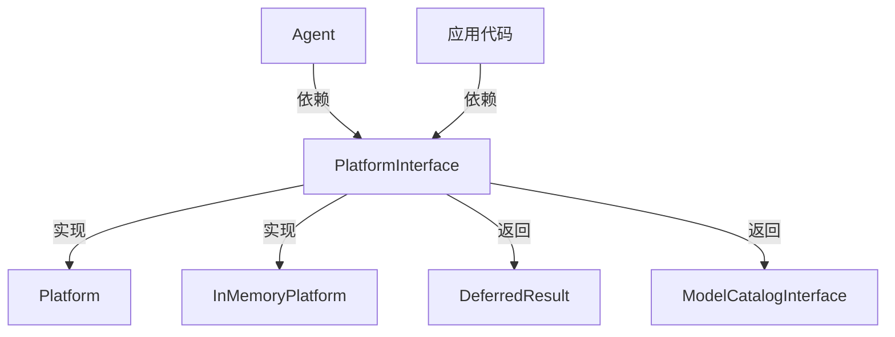

# PlatformInterface.php 文件分析报告

## 文件概述

`PlatformInterface.php` 定义了 Symfony AI Platform 的核心接口，是所有平台实现必须遵循的契约。这个接口定义了两个基本方法：调用模型和获取模型目录。

**文件路径**: `src/platform/src/PlatformInterface.php`  
**命名空间**: `Symfony\AI\Platform`  
**作者**: Christopher Hertel

---

## 类/接口/枚举定义

### `interface PlatformInterface`

核心平台接口，定义了与 AI 模型交互的标准方法。

---

## 方法/函数分析

### `invoke(string $model, array|string|object $input, array $options = []): DeferredResult`

**调用 AI 模型**

| 参数 | 类型 | 约束 | 说明 |
|------|------|------|------|
| `$model` | `string` | `@param non-empty-string` | 模型名称 |
| `$input` | `array<mixed>\|string\|object` | 必需 | 输入数据 |
| `$options` | `array<string, mixed>` | 可选 | 调用选项 |

**返回值**: `DeferredResult` - 延迟结果对象

**说明**: 
- 模型名称必须非空
- 输入可以是字符串、数组或对象（如 MessageBag）
- 选项用于自定义模型调用行为

---

### `getModelCatalog(): ModelCatalogInterface`

**获取模型目录**

**返回值**: `ModelCatalogInterface` - 模型目录实例

**说明**: 返回当前平台使用的模型目录，可用于查询可用模型。

---

## 设计模式

### 1. 接口隔离原则 (Interface Segregation Principle)

接口只定义了两个必要的方法，保持精简：

```php
interface PlatformInterface
{
    public function invoke(string $model, ...): DeferredResult;
    public function getModelCatalog(): ModelCatalogInterface;
}
```

### 2. 依赖反转原则 (Dependency Inversion Principle)

应用代码应该依赖 `PlatformInterface` 而非具体实现：

```php
class MyService
{
    public function __construct(
        private readonly PlatformInterface $platform
    ) {}
}
```

---

## 扩展点

### 1. 创建自定义 Platform 实现

```php
class CachedPlatform implements PlatformInterface
{
    public function __construct(
        private readonly PlatformInterface $innerPlatform,
        private readonly CacheInterface $cache,
    ) {}
    
    public function invoke(string $model, array|string|object $input, array $options = []): DeferredResult
    {
        $cacheKey = $this->generateCacheKey($model, $input, $options);
        
        if ($cached = $this->cache->get($cacheKey)) {
            return $this->wrapCachedResult($cached);
        }
        
        $result = $this->innerPlatform->invoke($model, $input, $options);
        // 缓存逻辑...
        
        return $result;
    }
    
    public function getModelCatalog(): ModelCatalogInterface
    {
        return $this->innerPlatform->getModelCatalog();
    }
}
```

### 2. 装饰器模式

```php
class LoggingPlatform implements PlatformInterface
{
    public function __construct(
        private readonly PlatformInterface $platform,
        private readonly LoggerInterface $logger,
    ) {}
    
    public function invoke(string $model, array|string|object $input, array $options = []): DeferredResult
    {
        $this->logger->info('Invoking model', ['model' => $model]);
        
        try {
            return $this->platform->invoke($model, $input, $options);
        } catch (\Throwable $e) {
            $this->logger->error('Model invocation failed', ['error' => $e->getMessage()]);
            throw $e;
        }
    }
}
```

---

## 与其他文件的关系



---

## 使用场景示例

### 场景1：服务注入

```php
class ChatController
{
    public function __construct(
        private readonly PlatformInterface $platform,
    ) {}
    
    public function chat(Request $request): Response
    {
        $result = $this->platform->invoke(
            'gpt-4',
            $request->get('message')
        );
        
        return new JsonResponse(['response' => $result->asText()]);
    }
}
```

### 场景2：测试替换

```php
use Symfony\AI\Platform\Test\InMemoryPlatform;

class MyServiceTest extends TestCase
{
    public function testChatResponse(): void
    {
        $platform = new InMemoryPlatform('Hello, I am AI!');
        $service = new MyService($platform);
        
        $result = $service->process('Hello');
        
        $this->assertSame('Hello, I am AI!', $result);
    }
}
```
