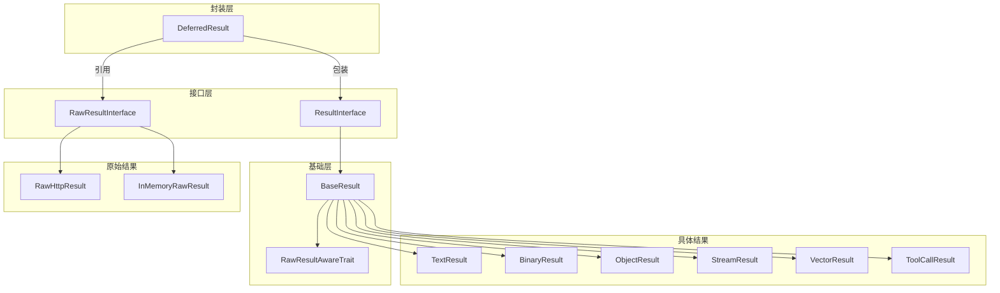

# Result 目录分析报告

## 目录职责

`Result/` 目录包含 Symfony AI Platform 的结果处理系统，定义了 AI 模型返回数据的各种类型和处理机制。这个目录提供了从原始 API 响应到应用层可用对象的完整转换链。

**目录路径**: `src/platform/src/Result/`

---

## 包含的文件清单

### 核心接口和基类

| 文件 | 说明 |
|------|------|
| `ResultInterface.php` | 结果接口，所有结果类型的基础 |
| `BaseResult.php` | 结果基类，提供通用实现 |
| `RawResultInterface.php` | 原始结果接口，定义 API 响应数据访问 |
| `RawResultAwareTrait.php` | 原始结果感知特征 |

### 具体结果类型

| 文件 | 说明 |
|------|------|
| `TextResult.php` | 文本结果 |
| `BinaryResult.php` | 二进制结果（图像、音频等） |
| `ObjectResult.php` | 结构化对象结果 |
| `StreamResult.php` | 流式结果 |
| `VectorResult.php` | 向量嵌入结果 |
| `RerankingResult.php` | 重排序结果 |
| `ToolCallResult.php` | 工具调用结果 |
| `ChoiceResult.php` | 选择结果（多个候选） |

### 辅助类

| 文件 | 说明 |
|------|------|
| `DeferredResult.php` | 延迟结果，封装懒加载逻辑 |
| `ToolCall.php` | 工具调用数据对象 |
| `ThinkingContent.php` | 思考内容块 |
| `RawHttpResult.php` | HTTP 响应的原始结果封装 |
| `InMemoryRawResult.php` | 内存中的原始结果（测试用） |

### 子目录

| 目录 | 说明 |
|------|------|
| `Stream/` | 流式结果相关的事件和监听器 |
| `Exception/` | 结果相关的异常类 |
| `Tests/` | 结果类的测试用例 |

---

## 内部协作关系



---

## 对外暴露的接口

### ResultInterface

```php
interface ResultInterface extends MetadataAwareInterface
{
    public function getContent(): string|iterable|object|null;
    public function getRawResult(): ?RawResultInterface;
    public function setRawResult(RawResultInterface $rawResult): void;
}
```

### DeferredResult 便捷方法

```php
class DeferredResult {
    public function asText(): string;
    public function asObject(): object;
    public function asBinary(): string;
    public function asFile(string $path): void;
    public function asDataUri(?string $mimeType = null): string;
    public function asVectors(): array;
    public function asReranking(): array;
    public function asStream(): Generator;
    public function asToolCalls(): array;
}
```

---

## 设计模式汇总

### 1. 策略模式 (Strategy Pattern)
不同的 ResultConverter 产生不同类型的结果。

### 2. 代理/延迟加载模式 (Proxy/Lazy Loading)
`DeferredResult` 延迟实际的结果转换直到需要时。

### 3. 工厂方法模式 (Factory Method)
`BinaryResult::fromBase64()` 等静态工厂方法。

### 4. 观察者模式 (Observer Pattern)
`StreamResult` 的监听器机制。

### 5. 模板方法模式 (Template Method)
`BaseResult` 提供基础实现，子类扩展。

---

## 扩展方式

### 1. 自定义结果类型

```php
class AudioTranscriptionResult extends BaseResult
{
    public function __construct(
        private readonly string $text,
        private readonly float $duration,
        private readonly array $segments = [],
    ) {}
    
    public function getContent(): string
    {
        return $this->text;
    }
    
    public function getDuration(): float
    {
        return $this->duration;
    }
    
    public function getSegments(): array
    {
        return $this->segments;
    }
}
```

### 2. 自定义流监听器

```php
class TokenCounterListener extends AbstractStreamListener
{
    private int $tokenCount = 0;
    
    public function onChunk(ChunkEvent $event): void
    {
        $chunk = $event->getChunk();
        if (is_string($chunk)) {
            // 简单的 Token 估算
            $this->tokenCount += count(explode(' ', $chunk));
        }
    }
    
    public function onComplete(CompleteEvent $event): void
    {
        $event->getMetadata()->add('estimated_tokens', $this->tokenCount);
    }
}
```

---

## 典型使用场景

### 场景1：获取文本响应

```php
$result = $platform->invoke('gpt-4', $messages);
$text = $result->asText();
echo $text;
```

### 场景2：获取结构化输出

```php
class Weather {
    public string $location;
    public float $temperature;
    public string $condition;
}

$result = $platform->invoke('gpt-4', $messages, [
    'response_format' => Weather::class
]);

$weather = $result->asObject();
echo "Temperature: {$weather->temperature}°C";
```

### 场景3：处理流式响应

```php
$result = $platform->invoke('gpt-4', $messages, ['stream' => true]);

$fullText = '';
foreach ($result->asStream() as $chunk) {
    if (is_string($chunk)) {
        echo $chunk;
        flush();
        $fullText .= $chunk;
    } elseif ($chunk instanceof ThinkingContent) {
        // 处理思考内容
        echo "[Thinking: {$chunk->thinking}]";
    } elseif ($chunk instanceof ToolCallResult) {
        // 处理工具调用
    }
}
```

### 场景4：保存生成的图像

```php
$result = $platform->invoke('dall-e-3', 'A cat in space');
$result->asFile('/path/to/image.png');

// 或获取 Data URI
$dataUri = $result->asDataUri('image/png');
```

### 场景5：向量嵌入

```php
$result = $platform->invoke('text-embedding-3-small', 'Hello world');
$vectors = $result->asVectors();

foreach ($vectors as $vector) {
    $dimensions = $vector->getDimensions();
    $data = $vector->getData();
}
```

### 场景6：处理工具调用

```php
$result = $platform->invoke('gpt-4', $messages, ['tools' => $tools]);

try {
    $toolCalls = $result->asToolCalls();
    foreach ($toolCalls as $toolCall) {
        $name = $toolCall->getName();
        $args = $toolCall->getArguments();
        // 执行工具
    }
} catch (UnexpectedResultTypeException $e) {
    // 不是工具调用，是普通文本响应
    $text = $result->asText();
}
```

### 场景7：访问 Token 使用信息

```php
$result = $platform->invoke('gpt-4', $messages);
$text = $result->asText();

$metadata = $result->getMetadata();
if ($tokenUsage = $metadata->get('token_usage')) {
    echo "Prompt tokens: {$tokenUsage->getPromptTokens()}";
    echo "Completion tokens: {$tokenUsage->getCompletionTokens()}";
    echo "Total tokens: {$tokenUsage->getTotalTokens()}";
}
```

---

## 最佳实践

1. **使用便捷方法**: 优先使用 `asText()`, `asObject()` 等方法
2. **处理类型错误**: 使用 try-catch 处理 `UnexpectedResultTypeException`
3. **完整消费流**: 始终完整迭代流式响应
4. **保存原始结果**: 需要调试时可以通过 `getRawResult()` 访问原始数据
5. **利用元数据**: 从 `getMetadata()` 获取 Token 使用等信息
