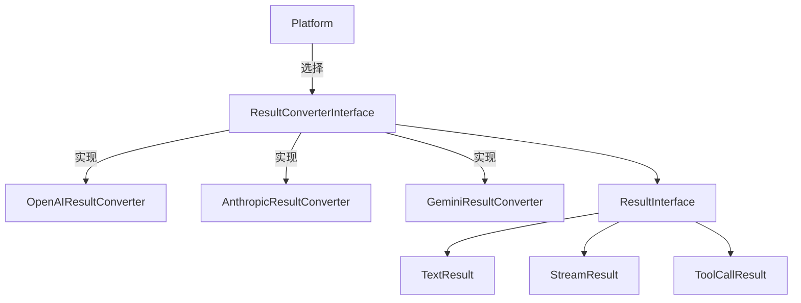
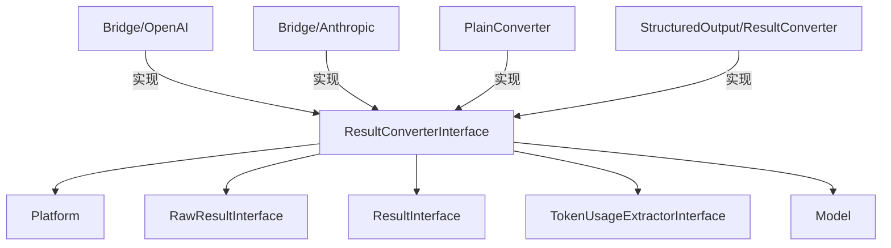

# ResultConverterInterface.php 文件分析报告

## 文件概述

`ResultConverterInterface.php` 定义了结果转换器的接口规范。结果转换器负责将 AI 服务返回的原始响应数据转换为标准化的 `ResultInterface` 对象。每个 AI 平台的 Bridge 都会实现这个接口来处理平台特定的响应格式。

**文件路径**: `src/platform/src/ResultConverterInterface.php`  
**命名空间**: `Symfony\AI\Platform`  
**作者**: Christopher Hertel

---

## 类/接口/枚举定义

### `interface ResultConverterInterface`

结果转换器接口，处理原始 API 响应到结构化结果对象的转换。

---

## 方法/函数分析

### `supports(Model $model): bool`

**检查转换器是否支持指定模型**

| 参数 | 类型 | 说明 |
|------|------|------|
| `$model` | `Model` | 要检查的模型对象 |

**返回值**: `bool` - 如果支持返回 `true`

---

### `convert(RawResultInterface $result, array $options = []): ResultInterface`

**转换原始结果为结构化对象**

| 参数 | 类型 | 约束 | 说明 |
|------|------|------|------|
| `$result` | `RawResultInterface` | 必需 | 原始响应结果 |
| `$options` | `array<string, mixed>` | 可选 | 转换选项 |

**返回值**: `ResultInterface` - 转换后的结果对象

**异常**: `ExceptionInterface` - 转换失败时抛出

---

### `getTokenUsageExtractor(): ?TokenUsageExtractorInterface`

**获取 Token 使用量提取器**

**返回值**: `?TokenUsageExtractorInterface` - 如果可用返回提取器，否则返回 `null`

**说明**: 允许从响应中提取 Token 使用统计信息。

---

## 设计模式

### 策略模式 (Strategy Pattern)

不同的 ResultConverter 实现处理不同平台的响应格式：



---

## 扩展点

### 实现自定义 ResultConverter

```php
class CustomResultConverter implements ResultConverterInterface
{
    public function supports(Model $model): bool
    {
        return str_starts_with($model->getName(), 'custom-');
    }
    
    public function convert(RawResultInterface $result, array $options = []): ResultInterface
    {
        $data = $result->getData();
        
        if (isset($options['stream']) && $options['stream']) {
            return new StreamResult($this->createStreamGenerator($result));
        }
        
        return new TextResult($data['content'] ?? '');
    }
    
    public function getTokenUsageExtractor(): ?TokenUsageExtractorInterface
    {
        return new CustomTokenUsageExtractor();
    }
}
```

---

## 与其他文件的关系



---

## 使用场景示例

### 场景：处理不同类型的响应

```php
class MyResultConverter implements ResultConverterInterface
{
    public function convert(RawResultInterface $result, array $options = []): ResultInterface
    {
        $data = $result->getData();
        
        // 检查是否有工具调用
        if (isset($data['tool_calls']) && !empty($data['tool_calls'])) {
            $toolCalls = array_map(
                fn($tc) => new ToolCall($tc['id'], $tc['function']['name'], 
                    json_decode($tc['function']['arguments'], true)),
                $data['tool_calls']
            );
            return new ToolCallResult(...$toolCalls);
        }
        
        // 检查是否是流式响应
        if (isset($options['stream']) && $options['stream']) {
            return new StreamResult($this->streamGenerator($result));
        }
        
        // 默认文本响应
        return new TextResult($data['choices'][0]['message']['content'] ?? '');
    }
}
```
