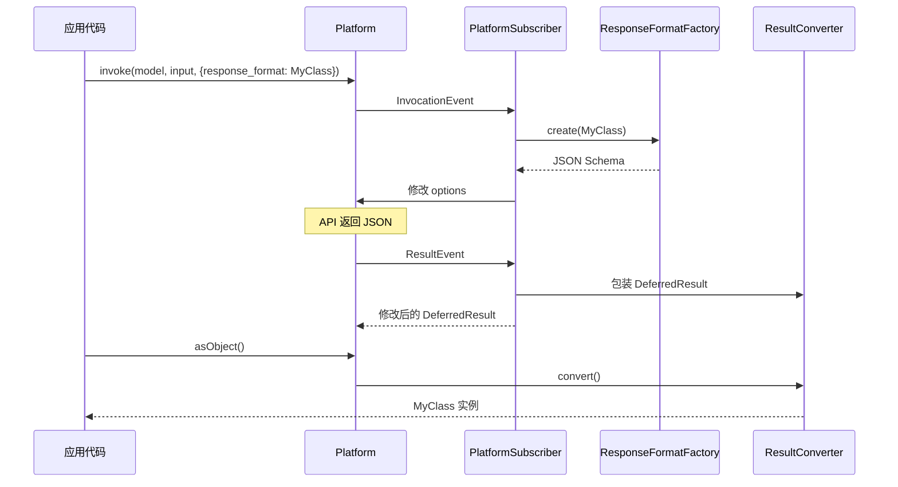

# StructuredOutput 目录分析报告

## 目录职责

`StructuredOutput/` 目录实现了结构化输出功能，允许 AI 模型的响应自动反序列化为 PHP 对象。这是一个强大的功能，使开发者可以直接获取类型安全的响应对象。

**目录路径**: `src/platform/src/StructuredOutput/`

---

## 包含的文件清单

| 文件 | 说明 |
|------|------|
| `PlatformSubscriber.php` | 平台事件订阅器，处理结构化输出请求 |
| `ResponseFormatFactory.php` | 响应格式工厂，生成 JSON Schema |
| `ResponseFormatFactoryInterface.php` | 响应格式工厂接口 |
| `ResultConverter.php` | 结果转换器，反序列化 JSON 到对象 |
| `Serializer.php` | 自定义序列化器 |

---

## 工作流程



---

## PlatformSubscriber

```php
class PlatformSubscriber implements EventSubscriberInterface
{
    public function processInput(InvocationEvent $event): void
    {
        // 检查 response_format 选项
        // 生成 JSON Schema
        // 验证模型支持 OUTPUT_STRUCTURED
    }
    
    public function processResult(ResultEvent $event): void
    {
        // 包装 ResultConverter 以处理反序列化
    }
}
```

---

## ResponseFormatFactory

```php
class ResponseFormatFactory implements ResponseFormatFactoryInterface
{
    public function create(string $responseClass): array
    {
        return [
            'type' => 'json_schema',
            'json_schema' => [
                'name' => $className,
                'schema' => $this->schemaFactory->buildProperties($responseClass),
                'strict' => true,
            ],
        ];
    }
}
```

---

## 典型使用场景

### 场景1：基础结构化输出

```php
class Weather
{
    public string $location;
    public float $temperature;
    public string $condition;
}

$result = $platform->invoke(
    'gpt-4',
    'What is the weather in Paris?',
    ['response_format' => Weather::class]
);

$weather = $result->asObject();
echo "Temperature: {$weather->temperature}°C";
echo "Condition: {$weather->condition}";
```

### 场景2：嵌套对象

```php
class Person
{
    public string $name;
    public int $age;
    public Address $address;
}

class Address
{
    public string $street;
    public string $city;
    public string $country;
}

$result = $platform->invoke(
    'gpt-4',
    'Generate a person profile',
    ['response_format' => Person::class]
);
```

### 场景3：带约束的输出

```php
use Symfony\AI\Platform\Contract\JsonSchema\Attribute\With;
use Symfony\Component\Validator\Constraints as Assert;

class ValidatedResponse
{
    #[With(description: 'User score')]
    #[Assert\Range(min: 0, max: 100)]
    public int $score;
    
    #[With(description: 'List of tags')]
    #[Assert\Count(min: 1, max: 5)]
    public array $tags;
}
```

### 场景4：填充现有对象

```php
$existingWeather = new Weather();
$existingWeather->location = 'Paris'; // 预设值

$result = $platform->invoke(
    'gpt-4',
    'What is the weather?',
    ['response_format' => $existingWeather] // 传入对象实例
);

$weather = $result->asObject();
// $weather 是更新后的 $existingWeather
```

---

## 注意事项

1. **不支持流式**: 结构化输出不能与 `stream: true` 一起使用
2. **模型支持**: 需要模型支持 `OUTPUT_STRUCTURED` 能力
3. **Schema 限制**: 某些平台对 JSON Schema 有特定限制
