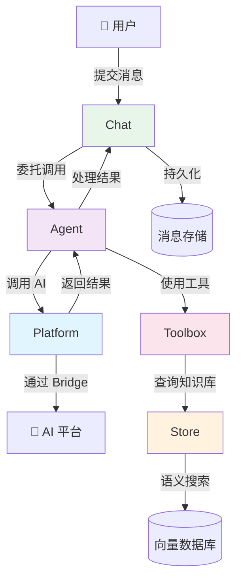

# Symfony AI：从 0 到精通深度指南

> 📖 **读者须知**：本文档面向对 Symfony AI 零认知的开发者。按照 7 层渐进结构组织，每一层都建立在前一层之上。建议按顺序阅读。

---

## 第一层：全景概览（What & Why）

> 🎯 读完本章你将获得：理解 Symfony AI 是什么、解决什么问题、以及它在技术栈中的定位。

### 一句话定义

**Symfony AI 是一套将 AI 能力集成到 PHP 应用的组件库。**

### 它解决了什么问题

没有 Symfony AI 时，PHP 开发者面临的痛点：

| 痛点 | 没有 Symfony AI | 有了 Symfony AI |
|------|-----------------|-----------------|
| **多平台对接** | 每个 AI 平台（OpenAI、Anthropic、Gemini…）都要写独立的 HTTP 客户端代码，接口格式各异 | 统一的 `PlatformInterface::invoke()` 一行代码切换 33+ 平台 |
| **工具调用** | 手动解析模型返回的 function call JSON，自行路由到对应函数，处理重试循环 | `Agent` + `Toolbox` 自动处理工具调用循环 |
| **对话持久化** | 自行管理 session/数据库中的对话历史，序列化/反序列化消息 | `Chat` 组件 + 9 种存储后端，开箱即用 |
| **向量搜索（RAG）** | 自行对接向量数据库 API，管理文档分块、向量化、检索 | `Store` 组件统一抽象 24 种向量数据库 |
| **Symfony 集成** | 手动注册服务、配置依赖注入 | `AiBundle` 自动装配所有组件 |

### 核心价值主张

与同类方案对比：

| 特性 | **Symfony AI** | LangChain (Python) | Vercel AI SDK (JS) |
|------|---------------|--------------------|--------------------|
| 语言 | PHP | Python | JavaScript/TypeScript |
| 框架集成 | Symfony 原生 Bundle | 框架无关 | Next.js/React |
| AI 平台数量 | 33+ Bridge | 50+ | 15+ |
| 向量数据库 | 24 种 | 30+ | 有限 |
| 类型安全 | PHP 8.2+ 类型系统 | 动态类型 | TypeScript |
| 设计哲学 | Symfony 组件化、可独立使用 | 链式调用 | Hook/Stream 优先 |

**Symfony AI 的差异化优势**：
1. **PHP 生态原生**：不需要维护 Python/Node 微服务，直接在 Symfony 应用中使用
2. **组件化设计**：Platform、Agent、Chat、Store 可独立安装使用，按需组合
3. **Bridge 模式**：每个第三方集成都是独立的 Composer 包，不引入多余依赖

### 适用场景 vs 不适用场景

✅ **适用场景**：
- PHP/Symfony 应用需要集成 AI 能力（聊天、RAG、工具调用）
- 需要在多个 AI 平台间灵活切换或做故障转移
- 企业应用需要结构化输出、对话持久化、向量检索

❌ **不适用场景**：
- 需要训练/微调模型（这是模型平台的工作）
- 纯前端 AI 应用（考虑 Vercel AI SDK）
- 高性能实时推理服务（考虑 Python + vLLM）

### 技术定位图

```
┌─────────────────────────────────────────────────────┐
│                   你的 Symfony 应用                    │
│                                                     │
│  ┌─────────┐  ┌─────────┐  ┌──────┐  ┌───────────┐ │
│  │   Chat   │  │  Agent  │  │ Store │  │ MCP Bundle│ │
│  │ (对话管理) │  │ (AI代理) │  │(向量库)│  │ (MCP协议) │ │
│  └────┬─────┘  └────┬────┘  └──┬───┘  └───────────┘ │
│       │             │          │                     │
│  ┌────┴─────────────┴──────────┴───┐                │
│  │         Platform (统一接口)        │                │
│  └────────────────┬────────────────┘                │
│                   │                                 │
│  ┌────────────────┴────────────────┐                │
│  │     33+ Bridge 适配层             │                │
│  │ OpenAI│Anthropic│Gemini│Ollama…  │                │
│  └────────────────┬────────────────┘                │
└───────────────────┼─────────────────────────────────┘
                    │ HTTP
        ┌───────────┴───────────┐
        │   AI 平台 API 服务      │
        │ (OpenAI/Anthropic/…)  │
        └───────────────────────┘
```

---

## 第二层：核心概念心智模型（Core Concepts）

> 🎯 读完本章你将获得：掌握 7 个核心概念及其关系，建立对整个系统的心智模型。

### 概念 1：Platform（平台）

- 📖 **定义**：与 AI 模型通信的统一接口，负责发送请求和接收响应
- 🎯 **目的**：屏蔽不同 AI 服务商的 API 差异，提供统一的 `invoke()` 方法
- 🔗 **关系**：被 Agent、Chat 依赖；通过 Bridge 连接具体 AI 服务
- 💡 **类比**：像数据库的 PDO——不管底层是 MySQL 还是 PostgreSQL，你都用同一套 API 操作

> 📍 源码：`src/platform/src/PlatformInterface.php:20-30`

### 概念 2：Model（模型）

- 📖 **定义**：表示一个具体的 AI 模型，包含名称、能力声明和默认选项
- 🎯 **目的**：让系统知道某个模型能做什么（生成文本？理解图片？调用工具？）
- 🔗 **关系**：由 ModelCatalog 管理；Platform 根据 Model 的 Capability 路由请求
- 💡 **类比**：像汽车的规格表——告诉你这辆车能不能越野（Capability）、默认油耗多少（Options）

> 📍 源码：`src/platform/src/Model.php:19-64`，`src/platform/src/Capability.php:19-64`

### 概念 3：MessageBag（消息包）

- 📖 **定义**：对话消息的有序集合，包含系统提示、用户消息、助手回复等
- 🎯 **目的**：将多轮对话组织成结构化数据，传递给 AI 模型
- 🔗 **关系**：由 Message 工厂类创建；传入 Platform.invoke() 或 Agent.call()
- 💡 **类比**：像微信聊天记录——按时间顺序排列的消息列表，有系统公告（System）、你说的话（User）、对方回复（Assistant）

> 📍 源码：`src/platform/src/Message/MessageBag.php:24-153`

### 概念 4：Agent（代理）

- 📖 **定义**：在 Platform 之上封装输入/输出处理管道的智能代理
- 🎯 **目的**：实现工具调用自动循环、系统提示注入、记忆管理等高级功能
- 🔗 **关系**：依赖 Platform 做 AI 调用；通过 InputProcessor/OutputProcessor 扩展行为
- 💡 **类比**：像一个能使用工具的员工——他不仅能回答问题（Platform），还能查日历、搜数据库、发邮件（Tools）

> 📍 源码：`src/agent/src/Agent.php:24-93`

### 概念 5：Toolbox（工具箱）

- 📖 **定义**：管理和执行 AI 可调用工具的容器
- 🎯 **目的**：让 AI 模型能够调用外部函数（搜索、查询数据库、获取天气等）
- 🔗 **关系**：注册到 AgentProcessor 中；通过 `#[AsTool]` 属性声明工具
- 💡 **类比**：像一个工具箱——里面有螺丝刀、扳手、锤子，工人（Agent）根据需要从中取用

> 📍 源码：`src/agent/src/Toolbox/Toolbox.php`，`src/agent/src/Toolbox/AgentProcessor.php:34-145`

### 概念 6：Store（存储）

- 📖 **定义**：向量数据库的统一抽象层，支持文档的索引、向量化和语义检索
- 🎯 **目的**：实现 RAG（Retrieval-Augmented Generation，检索增强生成）的数据层
- 🔗 **关系**：通过 Vectorizer 将文本转为向量；被 Agent 的 SimilaritySearch 工具使用
- 💡 **类比**：像一个智能图书馆——不是按书名查找，而是按"意思相近"来找书

> 📍 源码：`src/store/src/StoreInterface.php:21-47`

### 概念 7：Chat（对话）

- 📖 **定义**：管理有状态的多轮对话，自动持久化消息历史
- 🎯 **目的**：让开发者无需手动管理对话状态，专注于业务逻辑
- 🔗 **关系**：依赖 Agent 做 AI 调用；依赖 MessageStore 存储消息历史
- 💡 **类比**：像客服系统的会话窗口——自动记录之前说了什么，下次继续聊

> 📍 源码：`src/chat/src/Chat.php:24-55`

### 概念关系图



```
ASCII 版本：

  👤 用户
    │
    ▼
┌──────┐    ┌───────┐    ┌──────────┐    ┌─────────────┐
│ Chat │───▶│ Agent │───▶│ Platform │───▶│ AI 平台 API  │
│(对话) │    │ (代理) │    │  (平台)   │    │(OpenAI/...)  │
└──┬───┘    └───┬───┘    └──────────┘    └─────────────┘
   │            │
   │        ┌───┴────┐
   │        │Toolbox │
   │        │(工具箱) │
   │        └───┬────┘
   │            │
   ▼            ▼
┌──────┐    ┌───────┐
│Store │    │ Tools │
│(存储) │    │(工具集)│
└──────┘    └───────┘
```

---

## 第三层：5 分钟快速上手（Quick Start）

> 🎯 读完本章你将获得：在 5 分钟内运行第一个 Symfony AI 程序。

### 环境准备

- PHP >= 8.2
- Composer
- 一个 AI 平台的 API Key（推荐 OpenAI，也可用免费的 Ollama 本地部署）

### 安装步骤

```bash
# 创建一个新项目目录
mkdir my-ai-app && cd my-ai-app

# 初始化 Composer 项目
composer init --no-interaction

# 安装 Platform 核心 + OpenAI Bridge
composer require symfony/ai-platform symfony/ai-open-ai-platform

# 安装 HTTP 客户端（Platform 需要它来发送请求）
composer require symfony/http-client
```

### 最小可运行示例

创建文件 `chat.php`：

```php
<?php
// chat.php —— Symfony AI 最小示例：与 GPT 对话

require_once __DIR__.'/vendor/autoload.php';           // 1. 加载 Composer 自动加载
use Symfony\AI\Platform\Bridge\OpenAi\PlatformFactory; // 2. 引入 OpenAI 平台工厂
use Symfony\AI\Platform\Message\Message;                // 3. 引入消息工厂类
use Symfony\AI\Platform\Message\MessageBag;             // 4. 引入消息包

// 5. 用 API Key 创建 Platform 实例
$platform = PlatformFactory::create(
    'sk-your-openai-api-key',                           //    替换为你的真实 Key
    \Symfony\Component\HttpClient\HttpClient::create()  //    提供 HTTP 客户端
);

// 6. 构建对话消息
$messages = new MessageBag(
    Message::forSystem('你是一个友好的助手，用中文回答。'),  // 系统提示：设定 AI 行为
    Message::ofUser('PHP 的优势是什么？'),                 // 用户消息：你的问题
);

// 7. 调用模型并获取结果
$result = $platform->invoke('gpt-4o-mini', $messages);

// 8. 输出文本结果
echo $result->asText().PHP_EOL;
```

### 运行

```bash
php chat.php
```

### 预期输出

```
PHP 的优势包括：
1. 学习曲线平缓，语法简洁易懂
2. 丰富的生态系统和社区支持
3. 跨平台兼容性好
4. 与 Web 开发深度集成
...
```

### 结果解读

- `PlatformFactory::create()` 创建了一个配置好的 Platform 实例，内部已注册好 OpenAI 的 ModelClient 和 ResultConverter
- `MessageBag` 是消息的容器，`Message::forSystem()` 和 `Message::ofUser()` 是快捷工厂方法
- `invoke('gpt-4o-mini', ...)` 会在 ModelCatalog 中查找模型、创建请求载荷、发送 HTTP 请求
- `$result` 是 `DeferredResult`（延迟结果），调用 `asText()` 时才真正执行结果转换

> 📍 对比源码：`examples/openai/chat.php` 展示了完全相同的模式

---

## 第四层：业务场景驱动教学（Scenario-Based Tutorials）

> 🎯 读完本章你将获得：掌握 6 个最常见的 AI 集成场景的完整实现方法。

### 场景 1：流式输出——实时打字机效果

**业务背景**：AI 生成长文本时，用户不想等待完整响应，希望看到逐字输出的"打字机"效果。

**目标**：实现流式响应，逐 chunk 输出 AI 回复。

**前置知识**：第二层的 Platform、MessageBag 概念；第三层的快速上手。

**Step-by-Step 实现**：

- Step 1：创建 Platform 和消息（与基础示例相同）
- Step 2：在 `invoke()` 的 options 中设置 `'stream' => true`
- Step 3：用 `foreach` 遍历 `$result->asStream()` 逐块输出

**完整代码**：

```php
<?php
// stream.php —— 流式输出示例
require_once __DIR__.'/vendor/autoload.php';

use Symfony\AI\Platform\Bridge\OpenAi\PlatformFactory;
use Symfony\AI\Platform\Message\Message;
use Symfony\AI\Platform\Message\MessageBag;
use Symfony\Component\HttpClient\HttpClient;

$platform = PlatformFactory::create('sk-your-key', HttpClient::create());

$messages = new MessageBag(
    Message::forSystem('你是一个诗人。'),
    Message::ofUser('写一首关于编程的诗'),
);

// 关键：设置 stream => true
$result = $platform->invoke('gpt-4o-mini', $messages, [
    'stream' => true,
]);

// 逐 chunk 输出，实现打字机效果
foreach ($result->asStream() as $chunk) {
    echo $chunk;  // 每个 chunk 是一小段文本
    flush();      // 立即刷新输出缓冲区
}
echo PHP_EOL;
```

**运行结果**：文本会逐字逐句地出现在终端，而非一次性全部输出。

**举一反三**：在 Web 应用中，可用 Server-Sent Events (SSE) 将 chunk 推送到前端。

**常见陷阱**：
1. 流式模式不能与 `response_format`（结构化输出）同时使用
2. 忘记 `flush()` 会导致输出仍然是一次性的

> 📍 对比源码：`examples/openai/stream.php`

---

### 场景 2：工具调用——让 AI 使用外部能力

**业务背景**：AI 模型无法访问实时数据（天气、数据库、API），需要通过"工具调用"让 AI 自动调用你提供的函数。

**目标**：创建一个能查询当前时间的 AI 助手。

**前置知识**：第二层的 Agent、Toolbox 概念。

**Step-by-Step 实现**：

- Step 1：安装 Agent 组件

```bash
composer require symfony/ai-agent symfony/ai-clock-tool
```

- Step 2：创建 Toolbox，注册工具
- Step 3：创建 AgentProcessor 并注入 Toolbox
- Step 4：创建 Agent，将 AgentProcessor 同时设为输入和输出处理器
- Step 5：调用 Agent，它会自动处理工具调用循环

**完整代码**：

```php
<?php
// toolcall.php —— 工具调用示例
require_once __DIR__.'/vendor/autoload.php';

use Symfony\AI\Agent\Agent;
use Symfony\AI\Agent\Toolbox\AgentProcessor;
use Symfony\AI\Agent\Toolbox\Toolbox;
use Symfony\AI\Agent\Bridge\Clock\Clock;
use Symfony\AI\Platform\Bridge\OpenAi\PlatformFactory;
use Symfony\AI\Platform\Message\Message;
use Symfony\AI\Platform\Message\MessageBag;
use Symfony\Component\HttpClient\HttpClient;

$platform = PlatformFactory::create('sk-your-key', HttpClient::create());

// 1. 创建工具实例
$clock = new Clock(new \Symfony\Component\Clock\Clock());

// 2. 创建工具箱并注册工具
$toolbox = new Toolbox([$clock]);

// 3. 创建 AgentProcessor（同时处理输入和输出）
$processor = new AgentProcessor($toolbox);

// 4. 创建 Agent：Platform + 模型 + 处理器
$agent = new Agent($platform, 'gpt-4o-mini', [$processor], [$processor]);

// 5. 调用 Agent
$messages = new MessageBag(
    Message::ofUser('现在几点了？'),
);
$result = $agent->call($messages);

echo $result->getContent().PHP_EOL;
```

**运行结果**：
```
现在是 2026 年 3 月 24 日，北京时间下午 9 点 22 分。
```

**举一反三**：
- 用 `#[AsTool]` 属性声明自定义工具方法
- 注册多个工具，AI 会自动选择需要的

**常见陷阱**：
1. AgentProcessor 必须同时注册为 inputProcessor 和 outputProcessor
2. 工具调用可能形成循环（AI 反复调用工具），用 `maxToolCalls` 参数限制

> 📍 源码参考：`src/agent/src/Toolbox/AgentProcessor.php:49-56` 的 `maxToolCalls` 参数

---

### 场景 3：结构化输出——让 AI 返回 PHP 对象

**业务背景**：你希望 AI 返回结构化数据（如 JSON），并自动反序列化为 PHP 对象，而非自己解析文本。

**目标**：让 AI 分析一段文本并返回一个结构化的情感分析结果。

**前置知识**：第二层的 Platform 概念。

**Step-by-Step 实现**：

- Step 1：定义一个 PHP 类作为输出格式
- Step 2：注册 `PlatformSubscriber` 事件订阅者
- Step 3：在 `invoke()` 的 options 中设置 `response_format` 为类名

**完整代码**：

```php
<?php
// structured.php —— 结构化输出示例
require_once __DIR__.'/vendor/autoload.php';

use Symfony\AI\Platform\Bridge\OpenAi\PlatformFactory;
use Symfony\AI\Platform\Message\Message;
use Symfony\AI\Platform\Message\MessageBag;
use Symfony\AI\Platform\StructuredOutput\PlatformSubscriber;
use Symfony\Component\EventDispatcher\EventDispatcher;
use Symfony\Component\HttpClient\HttpClient;

// 定义输出结构
class SentimentResult
{
    public string $sentiment;    // positive, negative, neutral
    public float $confidence;    // 0.0 - 1.0
    public string $explanation;  // 分析理由
}

// 注册结构化输出事件订阅者
$dispatcher = new EventDispatcher();
$dispatcher->addSubscriber(new PlatformSubscriber());

$platform = PlatformFactory::create('sk-your-key', HttpClient::create(), eventDispatcher: $dispatcher);

$messages = new MessageBag(
    Message::forSystem('分析以下文本的情感倾向。'),
    Message::ofUser('这家餐厅的菜品非常美味，服务态度也很好，下次还会再来！'),
);

// 关键：指定 response_format 为 PHP 类名
$result = $platform->invoke('gpt-4o-mini', $messages, [
    'response_format' => SentimentResult::class,
]);

$sentiment = $result->asObject();
echo "情感: {$sentiment->sentiment}".PHP_EOL;
echo "置信度: {$sentiment->confidence}".PHP_EOL;
echo "理由: {$sentiment->explanation}".PHP_EOL;
```

**运行结果**：
```
情感: positive
置信度: 0.95
理由: 文本使用了"非常美味"、"很好"、"还会再来"等积极表达
```

**举一反三**：可以用嵌套对象、数组属性来定义更复杂的输出结构。

**常见陷阱**：
1. 结构化输出不能与流式模式 `stream => true` 同时使用
2. 必须注册 `PlatformSubscriber`，否则 `response_format` 选项不会生效

> 📍 源码参考：`src/platform/src/StructuredOutput/PlatformSubscriber.php`

---

### 场景 4：RAG 知识库——让 AI 基于你的数据回答

**业务背景**：AI 模型不了解你的企业内部文档。你需要把文档转为向量、存入向量数据库，让 AI 检索相关内容后再回答。

**目标**：构建一个基于本地文档的问答系统。

**前置知识**：第二层的 Store、Agent、Toolbox 概念。

**Step-by-Step 实现**：

- Step 1：安装 Store 组件

```bash
composer require symfony/ai-store symfony/ai-similarity-search-tool
```

- Step 2：准备文档并创建 VectorDocument
- Step 3：用 Vectorizer 将文档向量化
- Step 4：存入 Store
- Step 5：创建 SimilaritySearch 工具
- Step 6：构建 Agent，让 AI 用检索工具回答问题

**完整代码**：

```php
<?php
// rag.php —— RAG 知识库示例
require_once __DIR__.'/vendor/autoload.php';

use Symfony\AI\Agent\Agent;
use Symfony\AI\Agent\Bridge\SimilaritySearch\SimilaritySearch;
use Symfony\AI\Agent\Toolbox\AgentProcessor;
use Symfony\AI\Agent\Toolbox\Toolbox;
use Symfony\AI\Platform\Bridge\OpenAi\PlatformFactory;
use Symfony\AI\Platform\Message\Message;
use Symfony\AI\Platform\Message\MessageBag;
use Symfony\AI\Platform\Metadata\Metadata;
use Symfony\AI\Store\Document\VectorDocument;
use Symfony\AI\Store\Document\Vectorizer;
use Symfony\AI\Store\InMemory\InMemoryStore;
use Symfony\Component\HttpClient\HttpClient;
use Symfony\Component\Uid\Uuid;

$platform = PlatformFactory::create('sk-your-key', HttpClient::create());

// 1. 准备文档
$documents = [
    new VectorDocument(
        id: Uuid::v4(),
        content: 'Symfony 是一个 PHP Web 框架，首次发布于 2005 年。',
        metadata: new Metadata(['source' => 'wiki']),
    ),
    new VectorDocument(
        id: Uuid::v4(),
        content: 'Laravel 基于 Symfony 组件构建，是最流行的 PHP 框架之一。',
        metadata: new Metadata(['source' => 'wiki']),
    ),
];

// 2. 向量化并存入内存存储
$store = new InMemoryStore();
$vectorizer = new Vectorizer($platform, 'text-embedding-3-small');
foreach ($documents as $doc) {
    $store->add($vectorizer->vectorize($doc));
}

// 3. 创建检索工具
$searchTool = new SimilaritySearch($vectorizer, $store);
$toolbox = new Toolbox([$searchTool]);
$processor = new AgentProcessor($toolbox);

// 4. 构建 Agent 并提问
$agent = new Agent($platform, 'gpt-4o-mini', [$processor], [$processor]);
$messages = new MessageBag(
    Message::forSystem('请仅根据检索到的文档回答问题。'),
    Message::ofUser('Symfony 和 Laravel 有什么关系？'),
);

$result = $agent->call($messages);
echo $result->getContent().PHP_EOL;
```

**运行结果**：
```
根据文档记录，Laravel 是基于 Symfony 组件构建的。Symfony 是一个 PHP Web 框架，
首次发布于 2005 年，而 Laravel 使用了 Symfony 的核心组件来构建自己的功能。
```

**举一反三**：
- 替换 `InMemoryStore` 为 Pinecone、Qdrant 等生产级向量数据库
- 使用 `DocumentLoader` 和 `ChunkTransformer` 处理大型文档

**常见陷阱**：
1. 文档需要先向量化后才能存入 Store
2. `InMemoryStore` 仅适用于开发测试，生产环境请使用持久化存储

---

### 场景 5：多轮对话——持久化聊天历史

**业务背景**：构建客服系统，用户可以在多条消息间保持上下文连贯。

**目标**：实现带历史记忆的多轮对话。

**前置知识**：第二层的 Chat、Agent 概念。

**Step-by-Step 实现**：

- Step 1：安装 Chat 组件

```bash
composer require symfony/ai-chat
```

- Step 2：创建 Agent（可选配 Toolbox）
- Step 3：创建消息存储后端
- Step 4：用 Chat 管理对话

**完整代码**：

```php
<?php
// multi-turn.php —— 多轮对话示例
require_once __DIR__.'/vendor/autoload.php';

use Symfony\AI\Agent\Agent;
use Symfony\AI\Chat\Chat;
use Symfony\AI\Chat\InMemory\InMemoryStore;
use Symfony\AI\Platform\Bridge\OpenAi\PlatformFactory;
use Symfony\AI\Platform\Message\Message;
use Symfony\AI\Platform\Message\MessageBag;
use Symfony\Component\HttpClient\HttpClient;

$platform = PlatformFactory::create('sk-your-key', HttpClient::create());
$agent = new Agent($platform, 'gpt-4o-mini');

// 创建消息存储和 Chat 实例
$store = new InMemoryStore();
$chat = new Chat($agent, $store);

// 开始新对话：设定系统提示
$chat->initiate(new MessageBag(
    Message::forSystem('你是一个友好的中文助手。记住用户告诉你的所有信息。'),
));

// 第一轮对话
$response1 = $chat->submit(Message::ofUser('我叫小明，我喜欢编程。'));
echo "助手: {$response1->getContent()}".PHP_EOL;

// 第二轮对话——AI 应该记住你的名字
$response2 = $chat->submit(Message::ofUser('我叫什么名字？'));
echo "助手: {$response2->getContent()}".PHP_EOL;
```

**运行结果**：
```
助手: 你好小明！很高兴认识你。编程是一个很棒的爱好！你主要用什么语言编程呢？
助手: 你叫小明！你之前告诉我的，你喜欢编程。😊
```

**举一反三**：
- 替换 `InMemoryStore` 为 Redis、MongoDB 等持久化存储
- 在 Symfony 应用中使用 Session Store 绑定到用户会话

**常见陷阱**：
1. `Chat::initiate()` 会清空之前的对话历史
2. Chat 内部依赖 Agent，不是直接依赖 Platform

> 📍 源码参考：`src/chat/src/Chat.php:32-54` 的 `initiate()` 和 `submit()` 方法

---

### 场景 6：多 Agent 协作——路由到不同专家

**业务背景**：客服系统需要根据用户问题类型（技术问题、账单问题、投诉）自动路由到不同的 AI 专家。

**目标**：实现多 Agent 路由系统。

**前置知识**：第二层的 Agent 概念；场景 2 的工具调用。

**Step-by-Step 实现**：

- Step 1：创建多个专门的 Agent
- Step 2：定义 Handoff 规则
- Step 3：创建 MultiAgent 编排器

**完整代码**：

```php
<?php
// multi-agent.php —— 多 Agent 路由示例
require_once __DIR__.'/vendor/autoload.php';

use Symfony\AI\Agent\Agent;
use Symfony\AI\Agent\InputProcessor\SystemPromptInputProcessor;
use Symfony\AI\Agent\MultiAgent\Handoff;
use Symfony\AI\Agent\MultiAgent\MultiAgent;
use Symfony\AI\Platform\Bridge\OpenAi\PlatformFactory;
use Symfony\AI\Platform\Message\Message;
use Symfony\AI\Platform\Message\MessageBag;
use Symfony\Component\HttpClient\HttpClient;

$platform = PlatformFactory::create('sk-your-key', HttpClient::create());

// 1. 创建专门的 Agent
$techAgent = new Agent(
    $platform, 'gpt-4o-mini',
    [new SystemPromptInputProcessor('你是技术支持专家，擅长解决软件和硬件问题。')],
    [],
    name: 'tech-support',
);

$billingAgent = new Agent(
    $platform, 'gpt-4o-mini',
    [new SystemPromptInputProcessor('你是账单专家，擅长处理付款和退款问题。')],
    [],
    name: 'billing',
);

// 2. 创建编排 Agent（决定路由到哪个专家）
$orchestrator = new Agent($platform, 'gpt-4o-mini');

// 3. 定义路由规则
$handoffs = [
    new Handoff($orchestrator, $techAgent, ['技术', '软件', '硬件', 'bug']),
    new Handoff($orchestrator, $billingAgent, ['账单', '付款', '退款', '发票']),
];

// 4. 创建 MultiAgent
$multiAgent = new MultiAgent($orchestrator, $handoffs, fallback: $techAgent);

// 5. 调用
$messages = new MessageBag(Message::ofUser('我的软件打不开了，一直报错'));
$result = $multiAgent->call($messages);

echo $result->getContent().PHP_EOL;
```

**运行结果**：编排器识别出这是技术问题，路由到 `tech-support` Agent，返回技术支持的回答。

**举一反三**：
- 增加更多专家 Agent（投诉处理、销售咨询等）
- 用 `fallback` 参数指定无法路由时的默认 Agent

**常见陷阱**：
1. MultiAgent 至少需要一个 Handoff 规则
2. 路由决策依赖编排器 Agent 的判断能力，建议使用较强的模型

> 📍 源码参考：`src/agent/src/MultiAgent/MultiAgent.php`

---

## 第五层：架构与源码深度剖析（Internals Deep Dive）

> 🎯 读完本章你将获得：理解内部架构、数据流转、核心设计模式，具备阅读源码和扩展的能力。

### 项目目录结构

```
symfony/ai (monorepo)
├── src/
│   ├── platform/              # 🔵 核心：AI 平台统一接口
│   │   ├── src/
│   │   │   ├── Bridge/        #    33 个平台适配器（OpenAi, Anthropic, Gemini...）
│   │   │   ├── Message/       #    消息系统（MessageBag, Content, Template）
│   │   │   ├── Result/        #    结果系统（TextResult, StreamResult, DeferredResult）
│   │   │   ├── Contract/      #    序列化契约（Normalizer 集合）
│   │   │   ├── ModelCatalog/  #    模型注册表
│   │   │   ├── Tool/          #    工具定义
│   │   │   ├── StructuredOutput/ # 结构化输出
│   │   │   ├── TokenUsage/    #    Token 用量追踪
│   │   │   ├── Vector/        #    向量数据类型
│   │   │   ├── Event/         #    事件（InvocationEvent, ResultEvent）
│   │   │   ├── Metadata/      #    元数据系统
│   │   │   └── Exception/     #    异常体系
│   │   └── tests/
│   │
│   ├── agent/                 # 🟣 AI 代理框架
│   │   ├── src/
│   │   │   ├── Bridge/        #    13 个工具桥接（Brave, Wikipedia, Youtube...）
│   │   │   ├── Toolbox/       #    工具箱（执行、工厂、事件）
│   │   │   ├── MultiAgent/    #    多 Agent 编排
│   │   │   ├── Memory/        #    记忆系统
│   │   │   └── InputProcessor/ #   输入处理器
│   │   └── tests/
│   │
│   ├── chat/                  # 🟢 对话管理
│   │   ├── src/
│   │   │   └── Bridge/        #    9 个存储后端（Redis, MongoDB, Doctrine...）
│   │   └── tests/
│   │
│   ├── store/                 # 🟠 向量存储抽象
│   │   ├── src/
│   │   │   ├── Bridge/        #    24 个向量数据库（Pinecone, Qdrant, Weaviate...）
│   │   │   ├── Document/      #    文档、加载器、转换器
│   │   │   └── Query/         #    查询类型（Vector, Text, Hybrid）
│   │   └── tests/
│   │
│   ├── ai-bundle/             # 📦 Symfony Bundle 集成
│   ├── mcp-bundle/            # 📦 MCP 协议 Bundle
│   └── mate/                  # 🛠️ MCP 开发工具
│
├── examples/                  # 📚 独立示例（40+ 平台目录）
├── step-by-step/              # 📖 35 个渐进式教程
├── demo/                      # 🎮 完整 Symfony 演示应用
├── docs/                      # 📄 文档
└── fixtures/                  # 🧪 测试数据
```

### 核心架构图

```
┌─────────────────── Platform.invoke() 调用链 ───────────────────┐
│                                                                │
│  ① ModelCatalog          ② EventDispatcher       ③ Contract    │
│  ┌──────────────┐       ┌──────────────┐       ┌────────────┐ │
│  │ getModel()   │──────▶│InvocationEvent│──────▶│createPayload│ │
│  │ 解析模型名+选项│       │可修改input/opt│       │序列化为JSON │ │
│  └──────────────┘       └──────────────┘       └─────┬──────┘ │
│                                                      │        │
│  ④ ModelClient           ⑤ ResultConverter     ⑥ DeferredResult│
│  ┌──────────────┐       ┌──────────────┐       ┌────────────┐ │
│  │ request()    │──────▶│ convert()    │──────▶│ 延迟转换    │ │
│  │ 发送HTTP请求  │       │原始→类型结果  │       │asText()时转 │ │
│  └──────────────┘       └──────────────┘       └────────────┘ │
│                                                                │
└────────────────────────────────────────────────────────────────┘
```

### 请求生命周期：完整追踪

以 `$platform->invoke('gpt-4o-mini', $messages)` 为例：

```
用户代码调用 Platform::invoke()
  │
  ├─ 1. ModelCatalog::getModel('gpt-4o-mini')
  │     → 在 OpenAi\ModelCatalog 中查找，返回 Model 对象
  │     → Model 包含 capabilities: [INPUT_MESSAGES, OUTPUT_TEXT, TOOL_CALLING, ...]
  │     📍 src/platform/src/Platform.php:43
  │
  ├─ 2. EventDispatcher::dispatch(InvocationEvent)
  │     → 事件监听器可修改 input/model/options
  │     → StringToMessageBagListener：如果输入是 string，转为 MessageBag
  │     → TemplateRendererListener：渲染消息模板
  │     📍 src/platform/src/Platform.php:45-46
  │
  ├─ 3. Contract::createRequestPayload(Model, Input, Options)
  │     → 使用 Symfony Serializer + 自定义 Normalizer 序列化消息
  │     → MessageBagNormalizer → UserMessageNormalizer → TextNormalizer 等
  │     📍 src/platform/src/Platform.php:48
  │
  ├─ 4. ModelClient::request(Model, Payload, Options)
  │     → 遍历注册的 ModelClient，找到 supports(Model) 为 true 的
  │     → OpenAi\Gpt\ModelClient 发送 HTTP POST 到 api.openai.com
  │     → 返回 RawHttpResult（包装 Symfony HttpClient Response）
  │     📍 src/platform/src/Platform.php:74-78
  │
  ├─ 5. ResultConverter::convert(RawResult, Options)
  │     → 遍历注册的 ResultConverter，找到匹配的
  │     → 返回 DeferredResult（延迟转换，调用 asText() 时才执行）
  │     📍 src/platform/src/Platform.php:86-91
  │
  ├─ 6. EventDispatcher::dispatch(ResultEvent)
  │     → StructuredOutput\PlatformSubscriber 可在此包装结果
  │     📍 src/platform/src/Platform.php:57-58
  │
  └─ 7. 返回 DeferredResult
        → 用户调用 $result->asText() 时才触发真正的结果转换
        → 此时提取 token_usage 元数据
        📍 src/platform/src/Result/DeferredResult.php:46-76
```

### Agent 工具调用循环

```
Agent::call(MessageBag)
  │
  ├─ InputProcessors（预处理）
  │   ├─ SystemPromptInputProcessor：注入系统提示
  │   ├─ AgentProcessor::processInput()：注入 tools 元数据
  │   └─ MemoryInputProcessor：注入记忆到系统消息
  │
  ├─ Platform::invoke() → 得到 Result
  │
  └─ OutputProcessors（后处理）
      └─ AgentProcessor::processOutput()
          │
          ├─ 如果 Result 是 ToolCallResult：
          │   │
          │   ├─ 执行每个 ToolCall → Toolbox::execute()
          │   ├─ 将工具结果添加到 MessageBag
          │   ├─ 递归调用 Agent::call()（带更新的消息）
          │   └─ 重复直到返回非 ToolCallResult（或达到 maxToolCalls）
          │
          └─ 如果 Result 是 TextResult：返回最终结果
```

> 📍 源码：`src/agent/src/Toolbox/AgentProcessor.php:104-144`

### 核心设计模式

| 设计模式 | 在哪里使用 | 为什么选择 |
|---------|-----------|-----------|
| **Bridge（桥接）** | 每个 AI 平台/数据库的适配器 | 将抽象（PlatformInterface）与实现（OpenAI/Anthropic）分离 |
| **Deferred/Lazy（延迟加载）** | DeferredResult | 避免不必要的结果转换开销 |
| **Chain of Responsibility（责任链）** | ModelClient/ResultConverter 遍历 | 自动路由到合适的处理器 |
| **Pipeline（管道）** | InputProcessor → Platform → OutputProcessor | Agent 的可扩展处理管道 |
| **Factory Method（工厂方法）** | PlatformFactory, Message::forSystem() | 简化对象创建 |
| **Observer（观察者）** | EventDispatcher + InvocationEvent/ResultEvent | 无侵入式扩展平台行为 |
| **Composite（组合）** | CombinedStore, ChainFactory | 多个 Store/Factory 的组合使用 |
| **Strategy（策略）** | ToolFactory 的多种实现 | 不同的工具发现策略 |

### 关键设计决策与 Trade-off

1. **DeferredResult（延迟转换）vs 即时转换**
   - 选择延迟是因为 StreamResult 需要惰性处理，统一接口要求所有结果类型一致
   - 代价：调用 `asText()` 时可能抛出异常，而非 `invoke()` 时

2. **MessageBag 用 UUID v7 作为 ID**
   - 每个新的 MessageBag 实例都有唯一 ID（即使内容相同）
   - 好处：天然适合消息持久化和缓存 key
   - 代价：CachePlatform 无法基于消息内容做缓存命中

3. **Agent 的双向 Processor 模式**
   - AgentProcessor 同时实现 Input 和 Output Processor
   - 好处：工具注入和工具执行在同一个类中管理
   - 代价：初学者容易忘记同时注册到两个列表

### 扩展机制

**1. 自定义 Bridge（新增 AI 平台支持）**：
- 实现 `ModelClientInterface::supports()` 和 `request()`
- 实现 `ResultConverterInterface::supports()` 和 `convert()`
- 创建 `ModelCatalog` 定义支持的模型

**2. 自定义工具**：
- 使用 `#[AsTool]` 属性装饰 PHP 方法
- 实现 `ToolFactoryInterface` 自定义工具发现逻辑

**3. 事件监听**：
- 监听 `InvocationEvent` 修改请求（如添加日志、修改 options）
- 监听 `ResultEvent` 修改结果（如后处理、缓存）
- 监听 Toolbox 事件（`ToolCallRequested` 可拒绝工具执行）

**4. 自定义 InputProcessor/OutputProcessor**：
- 实现 `InputProcessorInterface` 在请求前修改消息
- 实现 `OutputProcessorInterface` 在响应后处理结果

---

## 第六层：API 全景速查（API Reference Cheat Sheet）

> �� 读完本章你将获得：快速查找常用 API 的能力，了解各 API 的用法和区别。

### ⭐ 最常用 Top 10 API

#### 1. ⭐ `PlatformInterface::invoke()` — 调用 AI 模型

```php
// 签名
public function invoke(string $model, array|string|object $input, array $options = []): DeferredResult;

// 示例
$result = $platform->invoke('gpt-4o-mini', $messages, ['max_output_tokens' => 500]);
```

> 📍 `src/platform/src/PlatformInterface.php:27`

#### 2. ⭐ `Message::forSystem()` — 创建系统消息

```php
// 签名
public static function forSystem(\Stringable|string|Template $content): SystemMessage;

// 示例
$system = Message::forSystem('你是一个有用的助手。');
```

> 📍 `src/platform/src/Message/Message.php:29`

#### 3. ⭐ `Message::ofUser()` — 创建用户消息

```php
// 签名
public static function ofUser(\Stringable|string|ContentInterface ...$content): UserMessage;

// 示例（纯文本）
$user = Message::ofUser('你好');
// 示例（多模态：文本+图片）
$user = Message::ofUser('描述这张图', Image::fromFile('/path/to/img.jpg'));
```

> 📍 `src/platform/src/Message/Message.php:46`

#### 4. ⭐ `new MessageBag()` — 创建消息包

```php
// 签名
public function __construct(MessageInterface ...$messages);

// 示例
$bag = new MessageBag(Message::forSystem('...'), Message::ofUser('...'));
```

> 📍 `src/platform/src/Message/MessageBag.php:35`

#### 5. ⭐ `DeferredResult::asText()` — 获取文本结果

```php
// 签名
public function asText(): string;

// 示例
echo $platform->invoke('gpt-4o-mini', $messages)->asText();
```

> 📍 `src/platform/src/Result/DeferredResult.php:92-94`

#### 6. ⭐ `DeferredResult::asStream()` — 获取流式结果

```php
// 签名
public function asStream(): \Generator;

// 示例
foreach ($platform->invoke('model', $msg, ['stream' => true])->asStream() as $chunk) {
    echo $chunk;
}
```

> 📍 `src/platform/src/Result/DeferredResult.php:159-162`

#### 7. ⭐ `Agent::call()` — 调用 Agent

```php
// 签名
public function call(MessageBag $messages, array $options = []): ResultInterface;

// 示例
$result = $agent->call(new MessageBag(Message::ofUser('总结这个视频')));
echo $result->getContent();
```

> 📍 `src/agent/src/Agent.php:57`

#### 8. ⭐ `Chat::submit()` — 提交对话消息

```php
// 签名
public function submit(UserMessage $message): AssistantMessage;

// 示例
$response = $chat->submit(Message::ofUser('下一个问题'));
echo $response->getContent();
```

> 📍 `src/chat/src/Chat.php:38`

#### 9. ⭐ `StoreInterface::query()` — 查询向量存储

```php
// 签名
public function query(QueryInterface $query, array $options = []): iterable;

// 示例
$results = $store->query(new VectorQuery($vector), ['limit' => 5]);
```

> 📍 `src/store/src/StoreInterface.php:41`

#### 10. ⭐ `DeferredResult::asObject()` — 获取结构化对象结果

```php
// 签名
public function asObject(): object;

// 示例（需配合 response_format 选项和 PlatformSubscriber）
$obj = $platform->invoke('model', $msg, ['response_format' => MyClass::class])->asObject();
```

> 📍 `src/platform/src/Result/DeferredResult.php:99-102`

### 按功能域分组

#### 消息创建

| API | 说明 | 返回类型 |
|-----|------|---------|
| `Message::forSystem($content)` | 创建系统提示消息 | `SystemMessage` |
| `Message::ofUser(...$content)` | 创建用户消息（支持多模态） | `UserMessage` |
| `Message::ofAssistant($content, $toolCalls)` | 创建助手消息 | `AssistantMessage` |
| `Message::ofToolCall($toolCall, $content)` | 创建工具调用消息 | `ToolCallMessage` |
| `new MessageBag(...$messages)` | 创建消息集合 | `MessageBag` |

#### 结果获取

| API | 说明 | 返回类型 |
|-----|------|---------|
| `$result->asText()` | 文本结果 | `string` |
| `$result->asStream()` | 流式生成器 | `\Generator` |
| `$result->asObject()` | 结构化对象 | `object` |
| `$result->asBinary()` | 二进制数据（图片/音频） | `string` |
| `$result->asVectors()` | 向量嵌入 | `Vector[]` |
| `$result->asToolCalls()` | 工具调用列表 | `ToolCall[]` |
| `$result->getResult()` | 获取底层 ResultInterface | `ResultInterface` |

#### MessageBag 操作

| API | 说明 | 是否修改原对象 |
|-----|------|-------------|
| `$bag->add($message)` | 追加消息 | ✅ 修改 |
| `$bag->with($message)` | 返回新实例 + 追加消息 | ❌ 不修改 |
| `$bag->merge($otherBag)` | 合并两个消息包 | ❌ 不修改 |
| `$bag->withSystemMessage($msg)` | 替换系统消息 | ❌ 不修改 |
| `$bag->withoutSystemMessage()` | 移除系统消息 | ❌ 不修改 |
| `$bag->getSystemMessage()` | 获取系统消息 | - |
| `$bag->getUserMessage()` | 获取第一条用户消息 | - |

### 易混淆 API 对比

| 对比项 | `Platform::invoke()` | `Agent::call()` |
|--------|---------------------|-----------------|
| 返回类型 | `DeferredResult` | `ResultInterface` |
| 工具调用 | 返回 ToolCallResult，需手动处理 | 自动循环处理 |
| 处理器 | 无 | InputProcessor + OutputProcessor |
| 适用场景 | 简单的一次性调用 | 需要工具、记忆、复杂流程 |

| 对比项 | `MessageBag::add()` | `MessageBag::with()` |
|--------|--------------------|--------------------|
| 可变性 | 修改原对象 | 返回新实例（不修改原对象） |
| 返回值 | `void` | `self`（新 MessageBag） |
| 适用场景 | 在循环中构建消息 | 函数式/不可变风格 |

| 对比项 | `Chat::initiate()` | `Chat::submit()` |
|--------|--------------------|--------------------|
| 作用 | 开始新对话（清空历史） | 在已有对话中追加消息 |
| 参数 | `MessageBag` | `UserMessage` |
| 返回值 | `void` | `AssistantMessage` |

---

## 第七层：实战进阶与问题排查（Advanced & Troubleshooting）

> 🎯 读完本章你将获得：性能优化技巧、调试方法、常见问题解决方案。

### 性能优化

**1. 使用 Cache Bridge 缓存重复请求**

```php
use Symfony\AI\Platform\Bridge\Cache\CachePlatform;
use Symfony\Component\Cache\Adapter\FilesystemAdapter;

$cache = new FilesystemAdapter();
$cachedPlatform = new CachePlatform($innerPlatform, $cache);
// 相同输入会命中缓存，避免重复 API 调用
```

> ⚠️ 注意：CachePlatform 使用 `MessageBag::getId()` 作为缓存 key，每个新 MessageBag 实例都有唯一 UUID，即使内容相同也不会命中缓存。需要设置 `prompt_cache_key` 选项。
> 📍 `src/platform/src/Bridge/Cache/CachePlatform.php:61-82`

**2. 使用 Failover Bridge 实现高可用**

```php
use Symfony\AI\Platform\Bridge\Failover\PlatformFactory;

// 当主平台出错时自动切换到备用平台
$platform = PlatformFactory::create([$primaryPlatform, $fallbackPlatform]);
```

**3. 批量向量化**

使用支持 `INPUT_MULTIPLE` 能力的模型一次向量化多个文档，减少 API 调用次数。Vectorizer 会自动检测并使用批量模式。

> 📍 `src/store/src/Document/Vectorizer.php`

**4. 流式输出**

对于长响应使用 `'stream' => true` 减少首字节等待时间。

### 调试技巧

**1. 启用详细日志**

```bash
# 运行示例时使用 -vvv 开启 debug 日志
php examples/openai/chat.php -vvv
```

**2. Symfony Profiler 集成**

安装 `symfony/ai-bundle` 后，Symfony Profiler 面板会显示：
- 所有 Platform 调用的详情
- Token 用量统计
- 请求/响应载荷

**3. 查看 Token 用量**

```php
$result = $platform->invoke('gpt-4o-mini', $messages);
$tokenUsage = $result->getMetadata()->get('token_usage');
if ($tokenUsage instanceof TokenUsageInterface) {
    echo "Prompt tokens: {$tokenUsage->getPromptTokens()}".PHP_EOL;
    echo "Completion tokens: {$tokenUsage->getCompletionTokens()}".PHP_EOL;
    echo "Total tokens: {$tokenUsage->getTotalTokens()}".PHP_EOL;
}
```

**4. 工具调用调试**

使用 Toolbox 事件监听工具执行过程：

```php
// ToolCallRequested - 工具被请求时触发，可拒绝执行
// ToolCallSucceeded - 工具执行成功后触发
// ToolCallFailed - 工具执行失败时触发
```

### 常见错误 FAQ

#### 1. `No ModelClient registered for model "xxx"`
**原因**：使用的模型名在当前 Platform 的 ModelCatalog 中找不到匹配的 ModelClient。
**解决**：确认模型名拼写正确，或使用 `FallbackModelCatalog` 接受任意模型名。

#### 2. `AuthenticationException`
**原因**：API Key 无效或未设置。
**解决**：检查 API Key 是否正确，环境变量是否已加载。

#### 3. `RateLimitExceededException`
**原因**：API 调用频率超过限制。
**解决**：使用 `$exception->getRetryAfter()` 获取等待时间，或使用 Failover Bridge 切换平台。

#### 4. `MissingModelSupportException: Model does not support tool calling`
**原因**：尝试对不支持工具调用的模型传递 tools 选项。
**解决**：选择支持 `TOOL_CALLING` Capability 的模型（如 `gpt-4o-mini`、`claude-3-5-sonnet`）。

#### 5. `UnexpectedResultTypeException`
**原因**：调用了不匹配的结果方法（如对非文本结果调用 `asText()`）。
**解决**：先用 `$result->getResult()` 检查实际结果类型。

#### 6. `MaxIterationsExceededException`
**原因**：Agent 的工具调用循环超过 `maxToolCalls` 限制。
**解决**：增大 `maxToolCalls` 参数，或检查工具实现是否导致 AI 反复调用。

> 📍 `src/agent/src/Exception/MaxIterationsExceededException.php`

#### 7. 结构化输出不生效
**原因**：忘记注册 `PlatformSubscriber` 事件订阅者。
**解决**：必须将 `PlatformSubscriber` 添加到 EventDispatcher。在 Symfony Bundle 中会自动注册。

#### 8. 流式输出一次性返回
**原因**：PHP 输出缓冲未刷新。
**解决**：在循环中调用 `flush()`，或配置 Web 服务器关闭输出缓冲。

#### 9. `Chat::submit()` 没有上下文记忆
**原因**：每次请求创建了新的 `InMemoryStore` 实例。
**解决**：使用持久化存储后端（Redis、Doctrine 等），或在应用生命周期内复用 Store 实例。

#### 10. 向量搜索结果不相关
**原因**：文档未正确向量化，或使用了不同的嵌入模型进行索引和查询。
**解决**：确保索引和查询使用同一个嵌入模型。

### 版本迁移指南

主要 Breaking Changes 记录在 `UPGRADE.md` 中。关键变更：

**0.6 → 0.7**：
- `AbstractToolFactory` 已移除，使用 `ToolFactoryInterface` 替代
- `ToolCallRequested` 事件新增 deny 功能

**0.3 → 0.4**：
- `Agent` 工具改名为 `Subagent`
- `AgentProcessor` 的 `keepToolMessages` 改为 `excludeToolMessages`（语义反转）

**0.2 → 0.3**：
- `StreamResult` 从 Agent 中移除
- `SourceMap` 改名为 `SourceCollection`

> 📍 完整迁移指南：`UPGRADE.md`

### 贡献指南入口

1. **开发环境搭建**：
   ```bash
   git clone https://github.com/symfony/ai.git
   cd ai
   composer install
   ```

2. **代码风格**：使用 PHP CS Fixer
   ```bash
   vendor/bin/php-cs-fixer fix
   ```

3. **运行测试**：
   ```bash
   cd src/platform && vendor/bin/phpunit
   cd src/agent && vendor/bin/phpunit
   ```

4. **详细指南**：参阅 `CONTRIBUTING.md`

---

> 📝 **文档版本**：基于 Symfony AI v0.7 源码编写。项目处于实验性阶段，API 可能在后续版本中发生变化。
